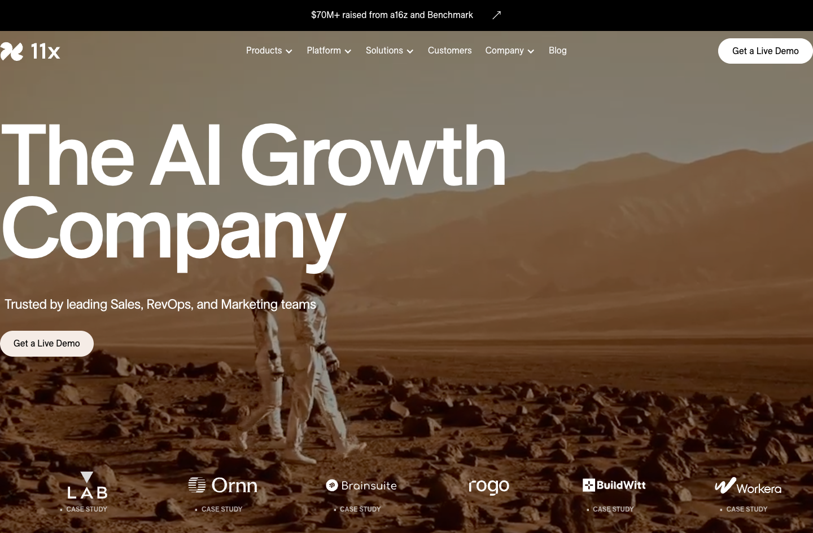
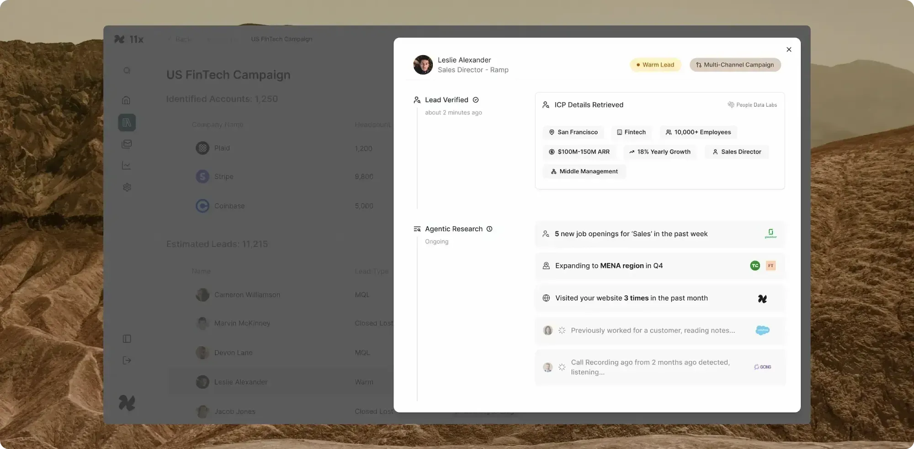
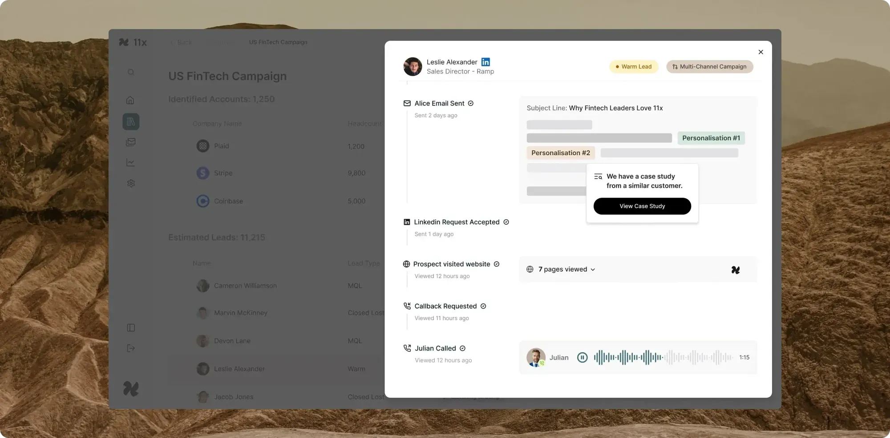
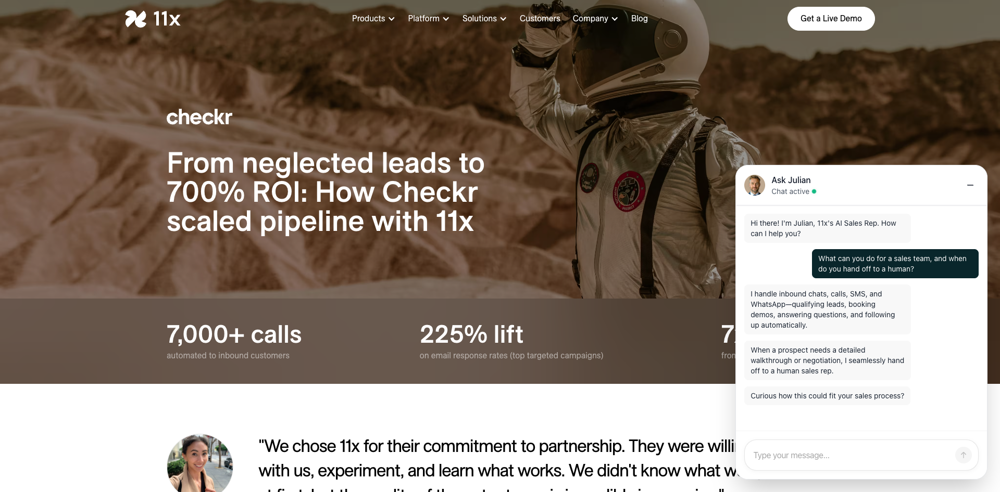
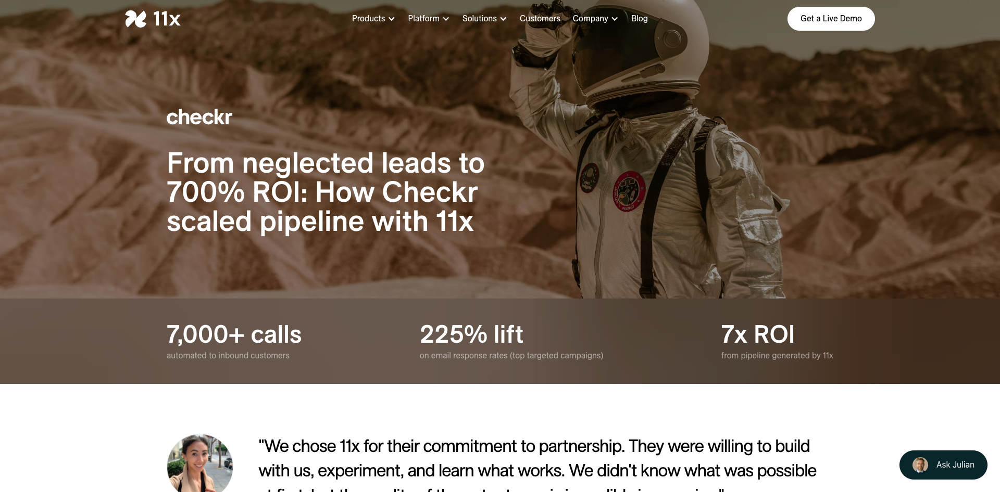
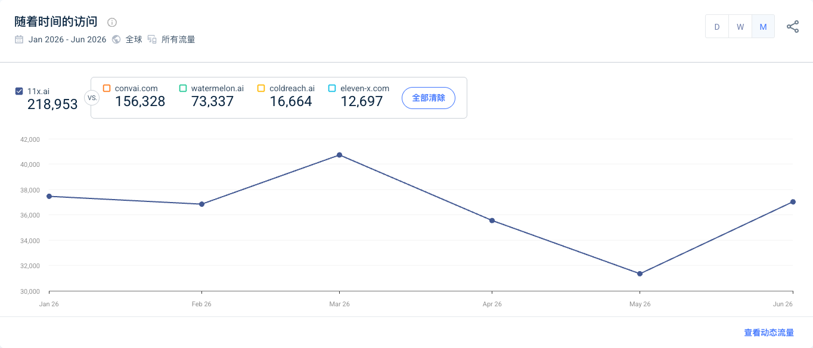

# 11x

> 调研时间：2026-07-15。本文把 11x 官方产品与客户案例、投资方公告、媒体调查、第三方采购/流量数据和社区个例分层呈现。官网数字存在多处自相矛盾，文中保留冲突，不替 11x 选择“最好看”的口径。

## TL;DR

**11x 已经不是一个只会发冷邮件的 AI SDR，而是一套垂直整合的 GTM 执行系统。** Alice 承接出站销售，Julian 承接入站电话、聊天、SMS 与 WhatsApp；底层把 50+ 数据源、研究与 enrichment、个性化、多渠道触达、资格判断、路由、跟进、CRM 和 deliverability 串成闭环。它更接近 [[concept.vertical-digital-worker-platform]]，不是通用 Agent Builder。[[source.11x.homepage]] [[source.11x.alice]] [[source.11x.julian]]

真正值得学习的是产品边界：11x 不只卖模型能力，而是接管一个业务角色的工作面，并用邮箱基础设施、数据、CRM 集成、客户成功、FDE 和人工交接保证结果。**所谓“数字员工”在这里实际是软件、数据、运营服务与人工控制的组合，不是零配置、无人值守的替人机器。**

规模信号已经存在：官网称累计融资超过 7000 万美元；公开轮次包括 200 万美元 pre-seed、2400 万美元 Series A 和约 5000 万美元 Series B。Ramp 的企业采购样本也显示真实采用。但这些不能覆盖它的可信度债务：2025 年 TechCrunch 调查指出客户 Logo、ARR 计算和流失口径争议；当前官网又在价格、Julian 转化指标和客户案例中留下互相冲突或模板残留的数字。[[source.techcrunch.11x-customer-claims-2025]] [[source.ramp.11x-vendor-2026]]

因此我们对 11x 的核心判断是：**它已经从“融资叙事很强的 AI SDR”进化成更完整的企业 GTM 产品，但公开证据仍不足以验证其长期 ROI、留存和低人工成本。** 现任 CEO [[person.prabhav-jain]]、新 CTO、[[company.opkit]] 语音团队与产品重建，说明公司在主动修复；是否修复成功，要继续看客户侧公开案例、续约、当前 cohort 留存和真实任务质量。

## 产品：两个角色，一套 GTM 执行面

### Alice：出站销售工作流

Alice 覆盖目标账户发现、信号筛选、研究/enrichment、个性化内容、多渠道 sequence、回复处理与预约。官网给出的平均指标包括 AE 会议数增加 30%、qualified opportunity 增加 80%、cost per lead 下降 50%，并称已为客户创造超过 1 亿美元收入；这些均是供应商自报，不能视为独立审计。[[source.11x.alice]]

它的产品价值不只是“AI 写邮件”。真正闭环的是：

1. 从公司、联系人、意图和招聘等信号中选目标；
2. 研究账户与个人，生成有依据的个性化内容；
3. 通过 email、LinkedIn、电话等渠道持续触达；
4. 读取回复和网站行为，决定下一步；
5. 把 qualified lead、会议和上下文写回 CRM；
6. 用 managed inbox、域名与 deliverability 维持发送基础设施。

这也是 11x 与单点 copywriting、lead database 或 sequencing 工具的差别：它试图把 GTM stack 中多个工具收束为一个运行系统。RevOps 页面甚至直接宣称可替代或整合 20+ 工具。[[source.11x.revops]]

### Julian：入站沟通与人工交接

Julian 处理 inbound phone、web chat、SMS 与 WhatsApp，负责回答问题、资格判断、预约、跟进和路由。当前产品名是 Julian；2024 年 Series A 文章曾称电话 Agent 为 Mike，TechCrunch 同年又写 Jordan。可以确认产品命名与包装经历过变化，但没有证据证明三者完全是同一套后端。[[source.11x.julian]] [[source.11x.series-a]]

本轮在 Checkr 案例页实际打开 “Ask Julian” 文本聊天，询问它能为销售团队做什么、何时交给人。它回答：可处理聊天、电话、SMS 与 WhatsApp，做资格判断、预约、问答和自动跟进；遇到详细产品 walkthrough 或 negotiation 时交给人类销售。[[source.11x.checkr-case]]

这证明公开文本 demo 可工作，并显示当前角色边界；它不能证明语音质量、复杂异议处理、系统写入正确率或无人值守 outbound。

### 产品不是“零服务”

公开定价和案例反复出现 onboarding、weekly check-in、dedicated CSM 与 FDE。Canibuild 案例称由 11x 团队通过每周会议协助建立流程；Enterprise 套餐也明确包含专属支持。[[source.11x.canibuild-case]] [[source.11x.pricing]]

这不是缺点，而是商业模型事实：企业销售流程包含脏数据、品牌规范、权限、CRM schema、地区差异、合规和边界案例。当前 11x 更像“managed digital labor platform”，其毛利和可复制性取决于这些服务能否逐步产品化。

## 定价：从早期 outcome 叙事回到 lead/合同计量

Alice 当前可见 Growth 方案为每月 3750 美元、按年签约，包含最多 5 个用户、每月 2000 个新 prospect、managed Gmail、deliverability、CRM sync 和 onboarding；Pro 与 Enterprise 询价。Enterprise 增加 SSO、定制 DPA/SLA、专属 CSM 与 FDE。页面明确称按 lead 而非 send 计价。[[source.11x.pricing]]

同一页面内部却出现三套起价：

- 可见 Growth 卡片：3750 美元/月；
- FAQ：每年 3.6 万美元，相当于 3000 美元/月；
- 页面 meta 摘要：方案从 2000 美元/月起。

因此当前不能给出一个无条件“最低价”。最稳妥的说法是：公开套餐已进入每年数万美元量级，主要按 prospect volume 与企业服务分层；具体报价需销售确认。

2024 年创始人访谈曾强调 task-based pricing，并称部分客户采用 outcome pricing。当前页面更接近 lead/volume/contract 模型，说明 11x 至少在公开包装上已从“按结果买数字员工”回到更可预测的 SaaS/managed-service 计量。[[source.weixin.11x-interview-2024]]

## 演化：从自用获客到企业 GTM 系统

| 时间 | 节点 | 含义 |
|---|---|---|
| 2022 Q3 | 创始人称开始构思 11x | 先探索自主工作者概念 |
| 2023 Q1 | 聚焦 SDR | 选择高频、可量化、软件栈成熟的垂直角色 |
| 2023-08-11 | 公开发布 Alice，宣布 200 万美元 pre-seed | 6 人团队；Project A 领投 |
| 2024-04 | 创始人访谈称已有 7–8 个月 design partner 共创 | Alice 用自身 outbound 获客，创始人亲自开会至约 70 万美元 ARR |
| 2024-09-16 | 2400 万美元 Series A | Benchmark 领投；开始强调 Alice + 电话 Agent 与平台化 |
| 2024-09/11 | 约 5000 万美元 Series B，a16z 领投 | TechCrunch 报道估值约 3.5 亿美元、接近 1000 万美元 ARR，均为当时 sources/founder 口径 |
| 2024-11 | 收购 [[company.opkit]] | 两位 YC S21 语音 AI 创始人加入，为语音方向补团队，但技术继承范围未公开 |
| 2025-03 | TechCrunch 发布客户/ARR/流失调查 | 公司移除不准确 Logo，并公开回应计算与 cohort 争议 |
| 2025-05 | [[person.hasan-sukkar]] 转任非执行董事长，[[person.prabhav-jain]] 接任 CEO | 领导层与技术组织进入重建阶段 |
| 2025–2026 | 官网转向 “AI Growth Company” | Alice + Julian 覆盖出站、入站和 RevOps，更强调端到端 GTM |

[[source.techcrunch.11x-preseed-2023]] [[source.11x.series-a]] [[source.a16z.11x-series-b-2024]] [[source.linkedin.opkit-11x-acquisition-2024]]

早期 GTM 很有代表性：产品自己监控“正在招聘 SDR 的公司”，Alice 对这些账户发起 outbound，创始人处理销售会议。它把 dogfooding、客户发现与获客合并成一条循环。[[source.weixin.11x-interview-2024]]

## 客户证据：从“有采用”到“有效”仍差一层

### 当前实名案例

- **Checkr**：11x 案例称 7000+ calls、225% email response lift、7x ROI，并在正文写约 50 万美元 pipeline、200+ 小时自动对话；页面还残留另一个 120 万美元 pipeline 文案。[[source.11x.checkr-case]]
- **Canibuild**：案例称 demo conversion 提升 40%、speed-to-lead 从 3 小时以上降至 2 分钟内、20% pipeline 来自 Alice；同时明确有 weekly check-in 与 guided setup。[[source.11x.canibuild-case]]
- **MMB Networks**：案例称 qualified meeting 5x、24 场会议、2.5x 行业平均 reply rate，但正文又写 meeting volume tripled；24 场中 3 场进入 pipeline，销售周期为 6–12 个月。[[source.11x.mmb-case]]

这些案例至少说明客户愿意实名出现在供应商页面，且产品覆盖真实流程。但本轮没有找到 Checkr、Canibuild 或 MMB 自己发布的详细复盘；指标定义、时间窗、基线、成本和续约也未公开。因此它们是“强于匿名 testimonial，弱于客户侧/独立审计”的证据。

### Ramp 提供了独立采购采用信号

Ramp Vendor Intelligence 在 2026 年 7 月把 11x 列为 AI-First GTM 类别总体第 6，样本 adoption 约 10%，同比下降 5 个百分点；enterprise adoption 约 33%，高于 mid-market 9% 和 SMB 10%，客户结构中 enterprise 占 60%。5 月页面曾显示 enterprise adoption 40%，11x 随后用该快照宣传类别第一。[[source.ramp.11x-vendor-2026]]

这支持“11x 已进入企业采购”而非纯 demo；它不能说明 seat 数、合同金额、任务成功率、ROI 或 cohort 留存。更重要的是，**排名营销必须绑定日期**：5 月的 40%/#1 不能继续代表 7 月的 33%/#6。

### IBM 是分发与集成，不是成效案例

IBM 官方新闻把 11x 列为 watsonx Orchestrate 的合作 Agent 之一。这个节点说明 11x 正在通过大型企业平台进入采购和编排网络；它不是 IBM 自己使用 11x 获得 ROI 的客户证明。[[source.ibm.11x-watsonx-partner-2025]]

## 可信度债务：历史争议与当前页面质量

2025 年 TechCrunch 基于近两打投资人、现任和前员工等来源报道：

- 11x 曾把 ZoomInfo、Airtable 等放在客户 Logo 中；两家公司称只是短期试用，未进入正式生产，也未授权长期使用 Logo；
- ZoomInfo 称一个月试用效果弱于 SDR，随后未续用并要求移除；
- 员工指称部分合同带 3 个月退出条款，但公司按完整年合同计算 CARR；
- 部分来源描述早期 cohort 高流失、会议质量不足、hallucination、可用性和人工修正问题；
- 11x 回应 Logo 是人为错误并已移除，投资人知道其报告的是 CARR；公司称当时 retention 为 79%，早期流失主要来自 2023 cohort，之后通过 ICP 与产品调整改善。

[[source.techcrunch.11x-customer-claims-2025]]

这些是有实名公司回应和多来源调查的强第三方证据，但仍应保留“媒体指称/公司回应”边界，不能把匿名指控写成司法认定。

当前官网又暴露了较低层级但持续的内容 QA 问题：

- Julian 页顶部显示 7200% speed-to-lead reduction、+0% conversion、+0.0% win rate，FAQ 却写 +61% conversion、+3.5% win rate；
- Pricing 同页三套起价；
- Checkr、Canibuild、MMB 案例出现 120 万美元 pipeline 模板残留；
- MMB “5x qualified meetings”与“meeting volume tripled”没有解释口径差异。

这些不证明产品无效，但对一家曾因客户 Logo 和 ARR 口径受质疑的公司，官网自洽性本身就是信任成本。[[source.11x.julian]] [[source.11x.pricing]]

## 团队：创始人退到董事长，技术团队接管

### Hasan Sukkar

[[person.hasan-sukkar]] 是 11x 创始人，2023 年公开发布产品并长期担任 CEO；2025 年 5 月转任非执行董事长。他仍是公司叙事和关系网络的重要节点，但不再负责日常经营。[[source.linkedin.hasan-11x-launch-2023]] [[source.linkedin.hasan-11x-ceo-transition-2025]]

### Prabhav Jain

[[person.prabhav-jain]] 2024 年加入 11x 任 CTO，2025 年 5 月接任 CEO。他曾在 Brex 负责 Financial Services Engineering，并创办 CommonLounge/Compose，后被 Brex 收购；MIT 学习经历与 Brex 构建金融系统的背景，使他更像工程与企业执行型 CEO，而非纯销售叙事型创始人。[[source.brex.prabhav-jain-background]] [[source.linkedin.prabhav-11x-ceo-transition-2025]]

此后 Jeson Patel 宣布加入任 CTO，并把 11x 描述为约 30 人的小团队；Prabhav 后续帖子称团队约 40 人。当前 LinkedIn 公司页区间为 51–200，employees 检索约 89 个关联 profile。三者时间和定义不同，不能合并成精确 headcount；较稳妥的判断是 11x 已从早期 6 人扩到数十人规模。[[source.linkedin.jeson-patel-11x-cto-2025]] [[source.linkedin.prabhav-11x-team-2025]] [[source.linkedin.11x-company-2026]]

### Opkit 收购

[[company.opkit]] 是 YC S21 的医疗语音 AI 公司。联合创始人 Justin Ko 公开确认 2024 年被 11x 收购，自己与 Sherwood Callaway 加入 11x。这个动作与 Julian/电话 Agent 方向高度相关，但没有公开材料说明 11x 当前语音栈有多少直接继承自 Opkit，因此只建立公司连续性，不编造技术血缘。[[source.linkedin.opkit-11x-acquisition-2024]]

## 融资：资本速度很快，估值口径已过时

已核实的主要轮次：

| 时间 | 轮次 | 金额 | 主要投资方 |
|---|---|---:|---|
| 2023-08 | Pre-seed | 200 万美元 | [[investor.project-a]] 领投，No Label Ventures、Tiny VC 参与 |
| 2024-09 | Series A | 2400 万美元 | [[investor.benchmark]] 领投；Project A、20VC、Lux、SV Angel、Quiet、Abstract、Operator、Visionaries、Activant、HubSpot Ventures 等参与 |
| 2024-11 | Series B | 约 5000 万美元 | [[investor.andreessen-horowitz]] 领投 |

[[source.project-a.11x-preseed]] [[source.11x.series-a]] [[source.a16z.11x-series-b-2024]]

TechCrunch 在 2024 年 Series B 报道中称估值约 3.5 亿美元、Series A 估值约 9000 万美元，并称公司接近 1000 万美元 ARR。这些是当时 sources/founder 口径，不是 2026 年当前估值。官网现在只说累计融资 7000 万美元以上，没有披露新估值；因此当前估值未知。[[source.techcrunch.11x-series-b-2024]]

## 增长与 GTM：早期 dogfooding，当前企业销售 + LinkedIn + paid search

### 没有 Product Hunt/HN 起量证据

本轮对 Product Hunt 和 Hacker News 做了精确检索，没有找到 11x 的 Product Hunt 产品首发或有影响力的 HN launch。HN 上与 11x 直接相关的争议报道线程也只有 6 points、1 comment。[[source.hn.11x-controversy-2025]]

这意味着 11x 的增长路径不同于 Superset/Lindy：它更依赖 founder-led sales、LinkedIn、投资网络、客户内容、合作伙伴与 paid acquisition，而不是开发者社区打榜。

### 早期是“产品销售产品”

2024 年中文访谈记录的早期动作很清晰：Alice 监控哪些公司正在招聘 SDR，把它们当成高意图账户并做 outbound；创始人自己承接会议，直到自报约 70 万美元 ARR 后才招聘 AE。该文还记录 7–8 个月 design partner 共创和每周 70–80 场会议等创始人口径。[[source.weixin.11x-interview-2024]]

这是垂直 Agent 很强的启动方式：用自身产品找到第一批客户，同时把失败样本变成产品数据。风险是早期创始人服务和人工修正可能被包装成产品自动化，需要在 scale 后重新核算。

### 当前网站获客高度依赖品牌、LinkedIn 与付费搜索

第三方月线 visits：

| 月份 | Visits |
|---|---:|
| 2026-01 | 37,462 |
| 2026-02 | 36,843 |
| 2026-03 | 40,728 |
| 2026-04 | 35,549 |
| 2026-05 | 31,347 |
| 2026-06 | 37,024 |

月线合计约 21.9 万，6 月较 1 月基本持平，中间没有持续向上的增长趋势。同一数据页顶卡又显示 53.6 万 total visits、月访问 3.65 万，口径与月线不一致，本文不合并。[[source.similarweb.11x-2026-h1]] [[traffic.similarweb.11x-2026-h1]]

渠道结构：Direct 39.92%、Organic Search 24.60%、Paid Search 19.00%、Referral 8.61%、Display 3.81%、Organic Social 1.67%、GenAI 1.18%。搜索约 80% branded、20% non-brand；付费关键词第一名是 “artisan ai”（约 30.1%），其后才是 ai sdr、aisdr、outbound sales ai。Social 约 99% 来自 LinkedIn。

这揭示了两层 GTM：

1. 品牌和销售直达已经形成，Direct + branded search 很高；
2. 11x 主动买竞品词截流，[[company.artisan]] 是经广告行为验证的直接对手，不只是研究者主观分类。[[source.11x.compare-artisan]]

网站访问不等于产品任务、收入或企业 seat。它只能说明公开站点的分发结构与量级。

## 社区与中文世界：公开用户证据仍薄

### Reddit

两条 SaaS 讨论里出现少量自报用户：有人称 11x 需要调优、能维持 pipeline activity，适合作为销售支持而不是完全替代；有人称使用四个月后只得到少量会议。另一条较长时间线反馈称 lead sourcing 尚可，但回复多数是 opt-out，点击停留只有数秒，后续因无结果、bug 与支持响应下降而考虑停用。[[source.reddit.11x-ai-sdr-reviews-2025]] [[source.reddit.11x-ai-sdr-experience-2024]]

这些线程混有大量竞品推广和供应商自荐，样本极小，不能估算整体 churn。它们支持的只是风险类型：数据质量、generic outreach、品牌声誉、调优成本、地区适配和支持质量。

### 中文平台

微信检索中，2024 年硅谷科技评论的创始人访谈是最有实质内容的一篇，提供了构思、design partner、dogfooding、创始人销售和历史定价的信息；但其中 ARR、会议数与客户比例均来自创始人口径。[[source.weixin.11x-interview-2024]]

小红书一条 2026 年笔记用“50–70% AI SDR 试用 3 个月就退”讨论 set-and-forget、脏数据、hallucination 和品牌风险，但没有给出数据源，互动也只有 1 个赞。它只能作为市场话术和 objection 样本，不能当 churn 事实。[[source.xiaohongshu.11x-ai-sdr-churn-2026]]

## 竞品：按业务闭环分层

| 层级 | 代表 | 关系 |
|---|---|---|
| 垂直 AI SDR / BDR | [[company.artisan]]、AiSDR、SalesCloser | 最直接；共享 prospecting、research、personalization、outreach 和 booking，11x 还主动投放 Artisan 关键词 |
| 销售 Agent / workflow | [[company.relevance-ai]]、Lindy、Gumloop | 可构建相似流程，但更偏横向平台；11x 胜在预置角色和 managed execution |
| GTM 数据与执行栈 | Clay、Apollo、Outreach、Salesloft | 11x 想整合/替代的现有工具；它们也可能是数据源或客户已有系统，不应全部叫 AI employee 竞品 |
| 企业 AI workforce | [[company.ema]]、[[company.helio]]、[[company.lindy]] | 竞争“数字员工/AI workforce”预算与治理叙事，但默认角色不同 |

算法相似站点给出的 convai.com、watermelon.ai、coldreach.ai、eleven-x.com 混合了相邻产品和噪声，不能直接当竞品榜单。[[source.similarweb.11x-2026-h1]]

## 关键判断与待验证

### 已有证据支持

- 11x 已从单点 AI SDR 扩成出站 + 入站 + RevOps 的 GTM 执行系统。
- 产品真实存在且公开聊天 demo 可交互，客户与企业采购采用信号也存在。
- 当前定位、人员和技术组织在 2025 年后经历明显重建。
- 增长不是 PH/HN 路径，而是 founder-led、投资网络、LinkedIn、enterprise sales、partner 和 paid search。

### 研究判断

- 11x 的真正 moat 候选不是“会写邮件”，而是角色数据、系统连接、deliverability、运行经验、客户配置和结果反馈闭环。
- 高接触 onboarding/FDE 说明现阶段 autonomy 仍需服务支撑；能否把服务经验固化为产品决定规模质量。
- 领导层与 Opkit 收购像一次可信度和产品工程重置，但公开材料不足以证明历史问题已经完全修复。

### 待验证

- 2025 年后新 cohort 的真实续约、retention、人工接管率和每个 qualified meeting 的全成本；
- Alice/Julian 在复杂异议、CRM 写入、权限、hallucination 与跨地区合规上的生产指标；
- 当前客户案例是否有客户侧独立复盘，官网矛盾数字何时清理；
- 2026 年当前 ARR、估值和企业合同结构；
- 收购 Opkit 对 Julian 技术栈的具体贡献。

## 证据边界

- **S1 官方**：产品、定价、案例、安全、融资公告、创始人/高管直接发布。
- **S2 第三方强证据**：TechCrunch 调查与融资报道、Project A/a16z、Ramp、IBM、Similarweb、Brex。
- **S3 社区弱证据**：Reddit、HN；仅用于发现 objection 和反例。
- **S4 待核验**：小红书无来源 churn 数字；不进入规模结论。

产品判断见 [[note.11x-product-takeaway-2026-07-15]]，本轮过程见 [[note.11x-research-run-2026-07-15]]。
