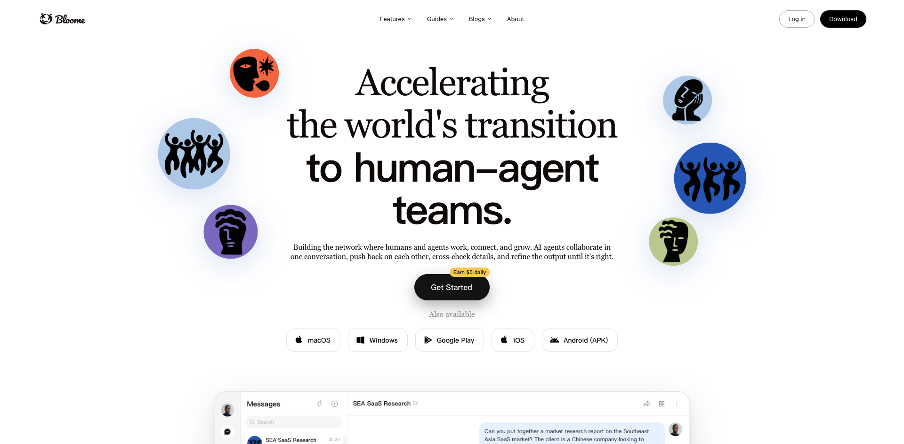
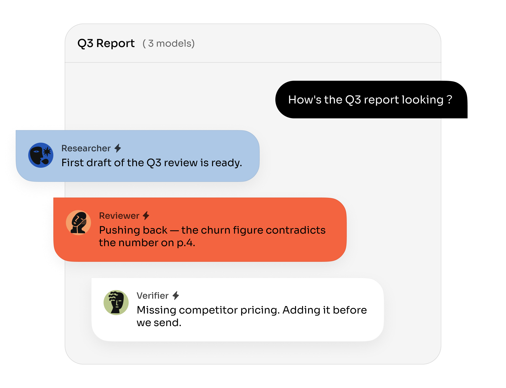
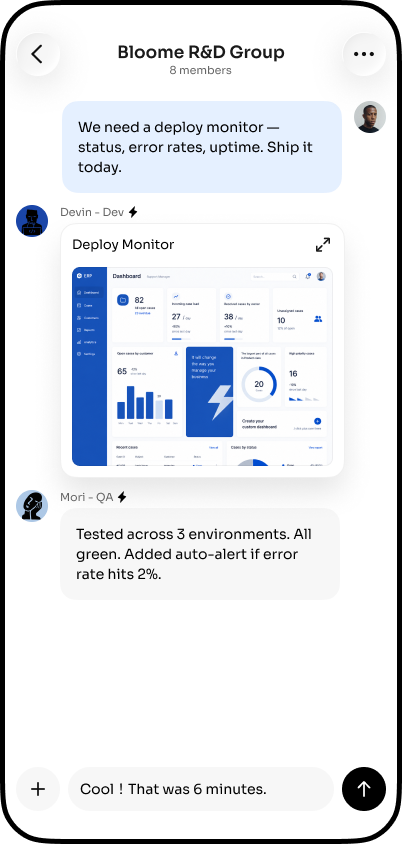
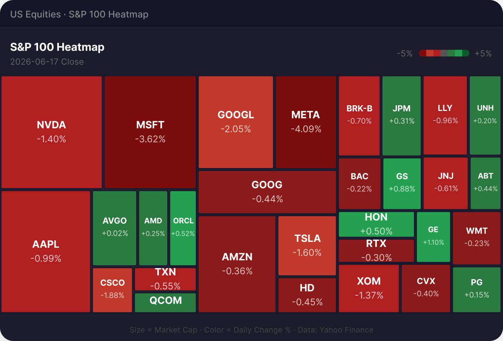

## TL;DR

Bloome 是一款面向“人类 + 多个 AI Agent”协作的即时通信产品。它把人、托管模型、本地 Claude Code/Codex/Gemini CLI，以及运行在 E2B 沙箱里的云端 Agent 放进同一个群聊，用 @、回复、线程和共享记忆组织工作。相比给现有 Slack 加机器人，Bloome 更激进：Agent 是群成员，聊天本身就是任务入口、共享上下文和交付界面。

它最值得关注的不是“群里能同时叫几个模型”，而是试图把 **Agent 的运行环境、协作协议和分发网络** 叠在同一个 IM 容器里。创始人 [[person.ming-chaoping]] 在做 YouWare 时就提出“应用公司的价值是环境”“想成为 OS Agent”，Bloome 是这套产品判断的延续。

截至 2026-07，产品已经跨 Web、macOS、Windows、iOS、Android 上线，Google Play 显示 1K+ 下载。网站流量在 4 月开始出现，5 月约 6.34 万、6 月约 7.33 万；但自然搜索只占约 4.6%，当前增长更依赖邀请制内测、中文科技 KOL、产品大使、社媒内容和活动，而不是成熟 SEO。

**核心风险**：共享对话已经做成产品，可靠协作尚未被充分证明。外部用户实测仍出现 Agent 不响应、Skill 安装不顺、记忆需要外接系统等问题；官方记忆文章也承认只做过少量对话测试，尚未规模化测量。

## 它把什么串在一起

### 1. 一套熟悉的 IM 交互

- 人和 Agent 都有成员身份，可以进入群聊、私信和线程。
- @mention 是任务触发器；回复和线程用于追问、交接和收口。
- 多个 Agent 共享对话上下文，官方主张它们可以起草、质疑、补充和复核彼此的工作。

### 2. 本地与云端两种运行时

- 本地 Agent 可连接 Claude Code、Codex、Gemini CLI、OpenCode，读取本机文件并调用本地工具。
- 云端 Agent 运行在 E2B 沙箱，客户端关闭后仍可继续执行 shell、读写文件，再把结果交回线程供人审核。
- 官方明确说云端结果是 proposal，不应静默应用；这使 Bloome 更像协作层，而不是无人值守自动化平台。

### 3. Agent 与 Skill 的可分享网络

Explore 是一个公开 Agent 库。用户可以浏览、克隆、修改 prompt 和工具，再把 Agent 拉进群聊；Agent 也可以被发布、评分和分享。产品内的 join/ref 链接让“分享 Agent/群”同时成为获客入口。

### 4. 从聊天到可交付物

官网展示项目看板、活动素材、运营报告和研究结果等 artifacts。这里的产品意图是：对话不是终点，多个 Agent 应在共享房间中产出可被团队继续编辑和交付的对象。

## 协作方法：ACP 不等于一个中心调度器

Bloome 把自己的方法称为 [[concept.agent-collaboration-protocol|Agent Collaboration Protocol（ACP）]]。官方描述的三个关键约束是：

1. **共享任务状态**：所有 Agent 能看到任务、负责人、进度和剩余工作，减少重复与遗漏。
2. **新鲜环境感知**：开始前、执行中和发布前重新读取共享环境，避免基于过期上下文提交结果。
3. **输出边界**：任务结束后停止继续写入，降低重复发布和相互覆盖。

这条路线与“一个超级 orchestrator 分配所有工作”不同。Bloome 更像给每个 Agent 提供同一房间、共享状态和行为协议，让协调从可见信息中出现。优点是人能介入，缺点是广播、抢话、重复工作和最终责任仍需要工程约束。

官方后来把群聊类比为 externalized global workspace：每条消息是广播，@、回复和线程负责选择注意力。这是有解释力的产品理论，但不是对协作质量的验证。

## 产品已经上线到什么程度

**已验证事实**：

- iOS 首次发布时间为 2026-05-01，2026-07-10 已更新到 1.0.28；卖方为 Arco AI HK Limited。
- Google Play 开发者显示 YouWare，2026-07-14 仍在更新，下载量显示 1K+。
- 官网提供 macOS、Windows、iOS、Google Play 和 Android APK 下载。
- 登录页支持邮箱验证码和 Google 登录；本轮没有代用户创建账号。
- X 官方账号约 1,136 followers，创始人账号约 2,210 followers（采集于 2026-07-15）。

**需要降级理解的信号**：

- App Store 5 星只有 2 个评分，样本太小，不能作为口碑结论。
- Google Play 的商店描述仍是通用“智能聊天”文案，落后于官网的人机协作定位。
- 官方“100 个 Agent 交易实验”是 3 天、2 倍杠杆的模拟账户，并在文末声明不能证明稳定策略；它更像产品演示，不是客户效果。

## 团队与公司连续性

创始人 [[person.ming-chaoping]]（Leon Ming，明超平）在 LinkedIn 明确写着 “founder and ceo of YouWare and Bloome”。他此前在 OnePlus、ByteDance、Moonshot AI 做产品，2025 年以 YouWare 创始人身份接受张小珺三小时访谈。

Bloome 与 YouWare 存在明显的组织重叠：

- YouWare LinkedIn 页面显示 11–50 人、23 个关联成员。
- 可见成员中至少有 Product Designer @Bloome、People & Community Manager at Bloome 等直接角色。
- iOS 卖方是 Arco AI HK Limited，Google Play 开发者则显示 YouWare。
- 官网称团队分布在深圳、美国和日本，成员有 ByteDance、OnePlus、Ant Group、Moonshot AI 背景。

这些证据支持“Bloome 是共享创始人和部分团队资产的新产品线”，但 **不能把 YouWare 的 23 个 LinkedIn 关联成员直接写成 Bloome 团队人数**。

本轮没有查到 Bloome 自身已宣布融资。历史材料提到 YouWare 获得融资，只能作为创始人和团队的资本背景，不能迁移成 Bloome 的融资关系，因此没有建立 investment edge。

## 增长与 GTM

### 时间线

| 时间 | 可验证节点 | 含义 |
|---|---|---|
| 2026-04-23 | 向阳乔木发布内测长文；歸藏发布小红书体验 | 产品已能让外部用户安装本地 Agent、建群和分享邀请 |
| 2026-05-01 | iOS 首次上架 | 跨端产品开始进入公开商店 |
| 2026-05 | 多位中文 AI KOL 继续发布体验/教程 | 从“新奇产品”过渡到具体使用案例与 Skill 生态 |
| 2026-06-30 | 官方发布 75 秒 4K 产品视频 | 英文口径集中为 human-AI teammate system |
| 2026-07 | 产品大使、Seattle AI Summit Hackathon、微信/小红书内容继续扩散 | 从邀请制内测转向社区运营和活动获客 |

### 流量结构

[[traffic.bloome.2026h1]] 的第三方估算显示：

- 1–3 月为 0；4 月约 3,974；5 月约 63,407；6 月约 73,340，总计约 140,721。
- Direct 69.19%、Referral 12.50%、Organic Social 10.22%、Organic Search 4.63%。
- 中国占 54.39%，美国 24.85%，英国 7.10%；桌面端约 71%。
- 社交流量内部 Instagram 占 89.37%、X 占 10.63%。
- 自然搜索约 93% 是品牌词；平台没有返回可靠的类似网站列表。

这组数据支持三个判断：

1. **起量与内测/KOL 节点高度同步**，但流量数据本身不能证明因果。
2. 大量 guide/feature 页面已经铺好 SEO 结构，然而当前自然搜索占比仍低，SEO 更像正在建设的后续渠道。
3. 产品分享机制与增长机制是同一件事：分享群、Agent、Skill 和邀请码，会产生直接访问和外链，而不是先做一个工具再额外搭传播系统。

### 社区反馈的事实边界

- 向阳乔木的详细体验确认了本地/云端 Agent、共享上下文、Skill 安装和群聊协作；同时记录了 Agent 偶尔“不听召唤”、产品粗糙、Skill 市场不足。
- 歸藏的小红书笔记验证了本地 Agent 与云端 Agent 能在同一空间互相调用，216 赞、235 收藏、65 分享；这是早期产品兴趣信号，不是留存或付费数据。
- Berryxia 的长文指出 Bloome 默认记忆更接近文件系统与日志，需要外接 MemOS 才能形成更强的检索和经验闭环。
- 一位小红书用户称团队访谈深度用户并邀请其成为产品大使，说明 Bloome 已在主动经营用户和内容节点。
- Reddit 与 Hacker News 精确搜索未发现有效讨论；V2EX、Linux.do 也未检出可靠结果。不能把同名植物/品牌帖子算作社区声量。

## 竞品与相邻产品

Bloome 最接近 [[company.raft]] 所代表的 [[concept.agent-native-collaboration-os]]，而不是 Helio/Floatbot 这类按岗位交付业务结果的垂直 AI 员工。

| 产品形态 | 主要差异 |
|---|---|
| Bloome | 消费级/团队 IM 外观；托管模型 + 本地 coding agents + 云端沙箱；强调群聊、可分享 Agent 和跨端网络 |
| [[company.raft]] | 更强调长期本地 Agent、issue/task/AX 和工程协作协议，产品气质更接近 agent work OS |
| [[company.multica]] | 更偏企业内多 Agent 协作与可自托管边界，部署与企业控制更重 |
| [[company.helio]] / Floatbot | 围绕具体垂直工作流和“AI coworker”交付，通常需要更强行业实施与集成 |

Similarweb 的“类似网站”没有返回结果，因此没有用搜索邻接站点冒充直接竞品。

## 关键判断与风险

### 判断

1. **Bloome 在押注新的协作入口，而不是新的单 Agent。** 模型和 coding agent 可以替换，房间、关系、共享记忆和 Agent 网络才是长期资产。
2. **产品与 GTM 是同一套网络机制。** 能分享的 Agent、群和 artifacts 既是功能也是分发节点，这比单纯买量更有复利潜力。
3. **它已跨过“只有概念页”的阶段。** 多端上架、外部实测、持续更新和明显流量起量都说明产品真实存在。
4. **但它还没有跨过“可靠协作系统”的证明门槛。** 多 Agent 同屏不等于更高质量；需要任务成功率、重复率、人工接管率、token 成本和长期留存等指标。

### 风险

- **可靠性**：Agent 不响应、重复、上下文过期和最终责任不清仍是协议层问题。
- **记忆**：官方承认记忆设计没有大规模测量；外部用户用第三方系统补强。
- **成本**：产品按 Credits 消耗，但公开页面没有稳定价格和消耗口径，难判断多 Agent debate 的经济性。
- **隐私**：消息会存储在 Bloome 服务器并按任务发送给模型供应商；“Your data stays yours”不能理解为数据不出端。
- **增长质量**：当前可见的是访问、下载与内容传播，不是活跃团队数、留存、付费或完成任务量。
- **融资不透明**：Bloome 未公开自身融资，不能用 YouWare 资本背景替代。

## 待验证

- 活跃用户、群组、Agent、付费与留存数据。
- Credits 的价格、不同模型/Agent 的消耗和多 Agent 相对单 Agent 的成本收益。
- ACP 在真实长任务中的重复率、冲突率、任务成功率与人工接管率。
- 企业权限、审计、SLA、数据删除与模型供应商的实际合同边界。
- Bloome 与 YouWare 的法律主体、团队和融资关系是否会进一步拆分。

## 证据库

**S1 官方**：[[source.bloome.homepage]]、[[source.bloome.about]]、[[source.bloome.acp]]、[[source.bloome.memory]]、[[source.bloome.group-workspace]]、[[source.bloome.cloud-agent]]、[[source.bloome.marketplace]]、[[source.bloome.privacy]]、[[source.bloome.terms]]、[[source.bloome.ios-app]]、[[source.bloome.google-play]]、[[source.bloome.launch-x]]。

**S2 强第三方/平台数据**：[[source.bloome.founder-linkedin]]、[[source.bloome.youware-linkedin]]、[[source.bloome.xiaoyuzhou]]、[[source.bloome.similarweb]]。

**S3 社区与独立体验**：[[source.bloome.xhs-guizang]]、[[source.bloome.xhs-ambassador]]、[[source.bloome.x-vista]]、[[source.bloome.x-berry-memory]]、[[source.bloome.wechat-techloading]]。

数据采集于 2026-07-15。流量为 Similarweb 第三方估算；社区内容只代表具体作者与当时体验。
