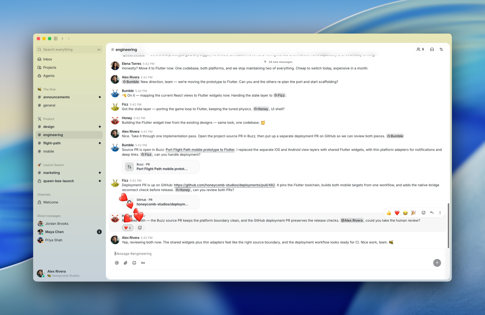

# Buzz

> **一句话**：Buzz 是 Block 打造的开源、自托管 human-agent collaboration workspace，把群聊、Agent、工作流、Git hosting、语音和审计放进同一套 Nostr 签名事件与长期身份体系。

## TL;DR

Buzz 不是一家独立创业公司，而是 **Block, Inc. 的产品与开源项目**；Block 也是 hosted Buzz Service 的法律运营主体。它在 2026-07-21 对外发布，但公开仓库从 2026-03 已持续开发，Block 官方称内部已经使用。[[source.buzz.homepage-2026-07-22]] [[source.buzz.terms-2026-07-17]] [[source.block-engineering.buzz-2026-07-21]]

Buzz 的竞争重心不是再做一个 Slack 皮肤，而是争夺 **人和 Agent 的长期组织上下文**：Agent 有独立 key 和 owner authorization；人、Agent、消息、代码、workflow、review 与 decision 在同一 channel/event history 中协作；ACP/MCP 接入 Claude Code、Codex、goose 等 harness；团队可用 Block-hosted beta，也可自托管 relay。[[source.block.buzz-launch-2026-07-21]] [[source.github.buzz-product-status-2026-07-22]]

它值得按高优先级结构性竞品跟踪：Block 有真实内部母场景、公开工程规模大、release 快、Jack 带来的 launch 分发极强。但它仍是 pre-1.0 early product，外部 adoption、retention、商业模式和 enterprise readiness 均未验证；approval、mobile、forge、rate limiting、E2E DM 等仍有明确缺口。[[note.buzz-product-takeaway-2026-07-22]]

## 产品结构

| 层 | 已公开能力 | 当前证据边界 |
| --- | --- | --- |
| Workspace | channels、threads、DMs、canvases、media、search、presence、voice huddles | desktop 主体已交付；mobile active development |
| Agent identity | 独立 Nostr keypair、owner-signed authorization、revocation、agent badges/roles | upstream Nostr extension 尚未获接受；channel membership 是主要 ACL |
| Agent runtime | ACP harness、MCP tools、buzz-cli、personas/teams；支持 Codex、Claude Code、goose、BYO | provider/model coverage 与 enterprise policy 深度待验证 |
| Workflow | YAML-as-code、message/reaction/schedule/webhook trigger、trace | approval DB/API/UI 存在，但 executor 尚不能 persist/resume |
| Git/forge | Git smart HTTP、NIP-34 manifests、repo browser、branch activity | merge coordinator、issues、project binding、web-of-trust 仍在设计 |
| Infra | Rust relay、Postgres/Redis/search/audit/media、multi-community isolation | pre-1.0；生产 rate limiter 与部分 workflow actions 不完整 |
| Sovereignty | Apache-2.0、自托管 relay、portable key/identity、standard Git/Nostr | 自托管运维、升级、备份、企业 SLA 成本未知 |
| Mesh | 社区成员共享 GPU/inference，peer-to-peer encrypted model traffic | trust、accounting、abuse 和大规模运营尚无独立实证 |

官方 VISION 中 10k humans + 50k agents、约 600k events/day、<50ms p99 是 **目标**，不是实际 load 或 adoption。[[source.github.buzz-product-status-2026-07-22]]

## 核心架构判断

Buzz 的强点是把 agent 从“人的工具调用”提升为“可审计、可授权、可撤销的团队成员”：

1. 每个 human/agent action 都是 signed event，身份与作者归属保留。
2. owner authorization 不抹掉 agent authorship；泄漏时可撤销 agent，而非轮换人的身份。
3. shared channel 保存讨论、失败路径、patch、review 和 final decision，减少从私人 agent session 手工搬运上下文。
4. Git 用 immutable content-addressed packfile + CAS manifest pointer 处理 machine-scale 并发写入。
5. ACP/MCP/Nostr/Git 采用开放边界，模型、harness、host 可替换。

这个结构与 [[concept.agent-native-shared-workspace]] 高度一致，也使 Buzz 与长期 Domain Agent / Agent Team 的组织层正面重叠。

## 实体、团队与内部使用

- Hosted Terms 的合同方与运营者是 Block, Inc.；self-hosted OSS 部分不属于 hosted Service。
- [[person.jack-dorsey]] 是公开 launch 发起人，不应写成 Buzz 独立公司 founder。
- [[person.bradley-axen]] 以 Block Head of AI Capabilities 身份解释产品和 identity 模型。
- [[person.tyler-longwell]] 是关键构建者和官方工程文章作者。
- [[person.wes-billman]] 是公开 main branch commit count 最高作者之一。

Block 官方称已在内部用 Buzz，Buzz 与官方文章都在 Buzz 中协作完成，并称其比以往 coordination tool/process 更容易、更快、更有效。它证明真实 dogfood，但没有公开覆盖人数、团队数、持续周期、对照组或 ROI。[[source.block-engineering.buzz-2026-07-21]]

The New Stack 采访还明确：Block **仍在使用 Slack**，Buzz 当前可并行，完整替代 Slack 要看后续。报道中的 BuilderBot 200k operations/day、1,500 PRs/week、约 15% production code change 属于 BuilderBot，不得移植成 Buzz 指标。[[source.thenewstack.buzz-2026-07-21]]

## 工程与发布势能

截至 2026-07-22：

- GitHub 页面约 2.1k stars、163 forks、14 watching、41 contributors。
- main branch 约 1,767 commits；2026-03 至 2026-07 月度 main commits 约 171、198、306、472、620。
- desktop 当前 v0.4.22，另有 mobile/chart/relay release 线，版本迭代密集。
- 公开 repo 横跨 Rust backend、Tauri/React desktop、Flutter mobile、web、CLI、ACP/MCP、workflow 与 Git interop。

raw Git history 含 bot、alias 和内部生成身份，不能据此宣布团队人数；stars 也在 launch 小时级快速变化，只能作为工程/注意力信号。[[source.github.buzz-repository-2026-07-22]]

## Launch 与外部反馈

- Jack launch 帖在 2026-07-22 读取时约 9,198 likes、1,051 reposts，adapter 返回 144 条 conversation items。[[source.x.jack-buzz-launch-2026-07-21]]
- HN 当前约 257 points、224 comments，讨论密集聚焦 privacy/ACL、Nostr、自托管、forge 成熟度和前端性能。[[source.hackernews.buzz-launch-2026-07-21]]
- TechCrunch 把它定位为 Slack/GitHub challenger，并将 Centaur 作为相邻 agent-in-workspace 方案。[[source.techcrunch.buzz-2026-07-21]]
- Product Hunt、Reddit、WeChat、小红书和 YouTube 的多组查询尚未找到可确认的独立采用案例；搜索噪声不写成 coverage。

Launch attention 很强，但当前证据不能回答注册、DAU/WAU、团队迁移、留存或付费。

## Hosted 模式、隐私与法务

Hosted early access 当前免费；Support 写出 5GB media、每账号最多 3 个 communities、invite-only。消息、DM 和 media 非 E2E encrypted，Block 可为运营、安全、moderation 和法律目的访问；prompt/output 可能发送给第三方 model provider。[[source.buzz.support-2026-07-22]] [[source.buzz.privacy-2026-07-17]]

存在一项直接政策冲突：Privacy 写 hosted messages/media/user content 默认最多保留 180 天，Support 写 hosted community content 保留 365 天。两者均为 2026-07-22 当前页面，暂不选一个覆盖另一个。

Terms 禁止使用 hosted Service 来构建、训练、优化、评估、benchmark 或部署竞争性服务。由于本任务明确把 Buzz 视为竞品，本轮没有注册或使用 hosted community 做 benchmark；公开页面、文档和 Apache-2.0 开源代码研究不受同一 hosted 操作授权影响。[[source.buzz.terms-2026-07-17]]

## 流量证据

[[traffic.similarweb.buzz-2026-h1]] 的 scope 是 Jan-Jun 2026 closed six months、Worldwide、All Traffic、root-only。结果为完整 **no-data/unavailable**：没有 target total/device/monthly series，ranks 为“-”，engagement 为 N/A，渠道/搜索/referral/social 等均无 target rows。

这不是 zero traffic。Provider 页面还残留 dan.com 域名售卖描述，属于 stale metadata conflict。

Semrush 当前有效观察 [[traffic.semrush.buzz-2026-07-21]] 的 page scope 是 root domain、Worldwide、desktop、report date 2026-07-21、USD。AI Visibility、Mentions 和 Cited pages 均显示 0；Authority Score=2 且标注“缺少自然流量”；Referring Domains=132、Backlinks=567；organic/paid traffic 与 keywords cards 为“不可用”。2Y/daily traffic chart 同时渲染 organic/paid/branded 三条全零线，覆盖 729 个日位置。卡片“不可用”与 chart numeric zero 是 provider 内部语义分裂，不能互相覆盖，也不能升级为采用或业务结论。[[source.semrush.buzz-domain-overview-2026-07-21]]

较早的 Semrush node/subscription STOP 仍作为 2026-07-22T03:12:39Z 的合法 point-in-time 事件保留；05:08 后同一授权入口正常加载 report，因此它不再代表当前 availability。[[source.semrush.buzz-access-stop-2026-07-22]]

综合两个 provider，当前数据仍不能支持“无人使用”“采用很低”或任何市场排名。

## 竞争边界

Buzz 同时压到五层：Slack/Teams/Discord 的沟通层、GitHub/GitLab 的 forge 层、Notion/Linear 的知识项目层、Slack/Atlassian/Centaur 的 agent-in-workspace 层，以及多 Agent mission control。

它的独特下注是：**workspace 本身就是 Agent Team 的身份、上下文、权限和轨迹系统**，不是把 agent 加到旧工具边栏。详见 [[note.buzz-competitor-map-2026-07-22]]。

## 风险与未知

1. 多人多 Agent 的 context leakage、least privilege 和跨 channel delegation 尚未证明。
2. Channel membership 作为主要 ACL 可能不足以覆盖 enterprise capability/secret policy。
3. Hosted 非 E2E、第三方模型数据流和 retention 冲突会阻挡高敏感团队。
4. Approval、rate limiting、merge/issues、mobile/push 和 enterprise workflow 仍不完整。
5. Hosted pricing、usage limit、SLA、support、DPA、data residency 未公开成型。
6. Open source 可降低锁定，也会提高商业变现和多部署兼容压力。
7. Block 的内部 dogfood 是强资产，但外部团队迁移和持续使用尚无独立证据。
8. Buzz Mesh 引入社区 peer trust、资源滥用、accounting 与 prompt privacy 新风险。

完整待验证清单与更新触发器：[[note.buzz-open-questions-2026-07-22]]。

## 初步判断

Buzz 是一个 **高威胁、低成熟度、低外部采用可见度** 的结构性竞品。

- 高威胁来自 Block 资源、真实内部场景、工程速度、开放协议和强分发。
- 低成熟度来自 pre-1.0 和关键 enterprise/workflow/forge 缺口。
- 低采用可见度来自 launch 时间极短、第三方 traffic no-data、缺少外部客户与 retention。

因此现在最合理的研究结论不是“Buzz 已经替代 Slack/GitHub”，也不是“它只是 PR”。它已经证明方向、工程和 dogfood，尚未证明 PMF 与外部迁移。研究过程见 [[note.buzz-research-run-2026-07-22]]。

**研究 cutoff：2026-07-22。**
