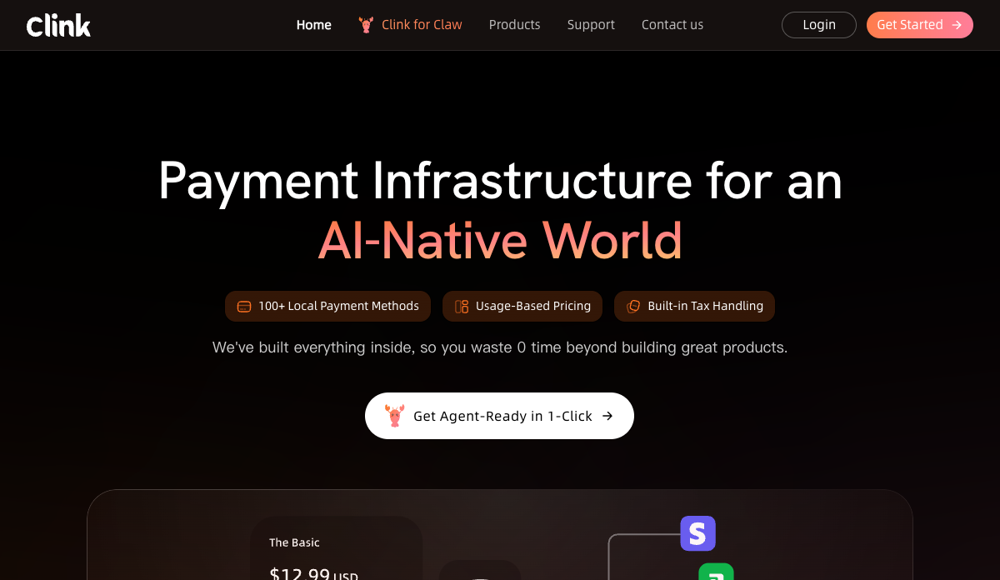
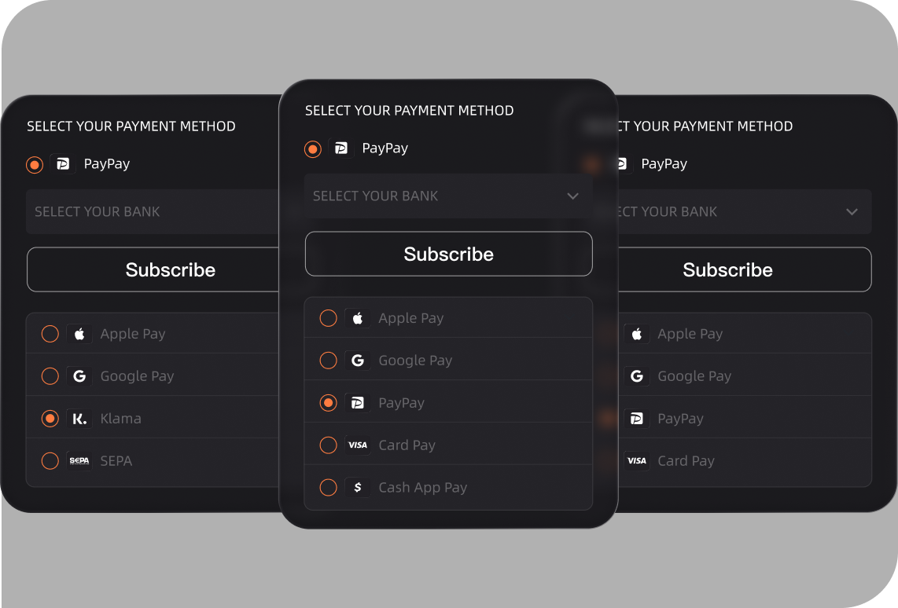
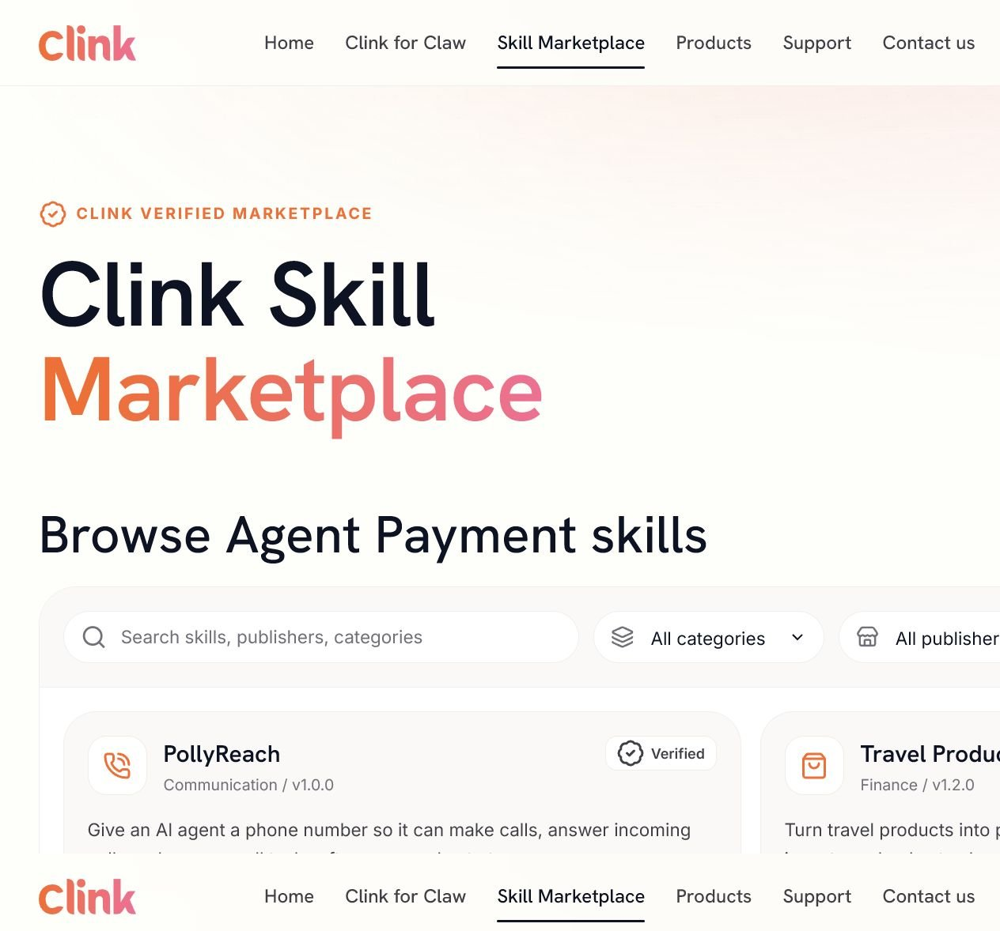
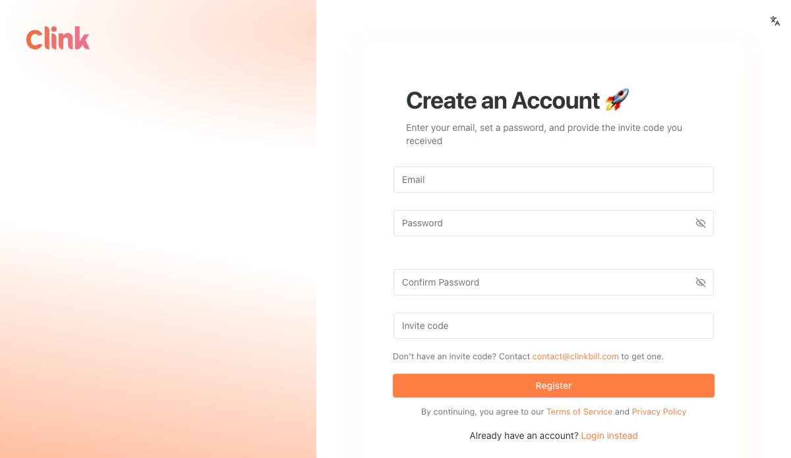

# Clink

## TL;DR

Clink 是一家面向 AI 产品与 Agent 的支付基础设施公司。它不是只给 Agent 发一张虚拟卡，而是把 **Merchant of Record（MoR）、全球收单、订阅与按量计费、多 PSP 路由、税务、Agent 付款和 Skill 分发** 放在同一层。其核心命题是：既让 AI 产品今天能向人收费，也让同一套产品明天能被获得授权的 Agent 发现、调用和付款。

最值得关注的不是“全球首个法币 Agent Payment Skill”这句发布话术，而是 Clink 已经做了支付公司最重的部分：合同中由 Clink Lab Limited 以 MoR 身份向买家转售产品，处理收款、发票和间接税；开发文档覆盖商品、价格、订阅、退款、争议、Webhook、外部 PSP 连接和 Agent Payment Session；官方 GitHub 还有可安装到 coding agent / OpenClaw 的 Skill 和离线 CLI。换言之，Agent Payment 目前更像叠加在一套真实商户支付栈上的新入口，而不是脱离传统支付体系的概念演示。

增长信号也比公开社媒热度更强。第三方估算显示，包含子域的 `clinkbill.com` 访问从 2026 年 1 月约 938 增至 6 月约 30,009，3 月公测、4 月正式发布、6 月开放访问与 SuperAI 之后持续抬升；78.36% 流量来自外链，主要来源包含多个 AI 工具站点。这更像商户结账或合作产品导流形成的产品网络，而不是 SEO 或大众品牌流量。

但它仍处在受控早期：官网“Get Started”进入 UAT 注册页并要求邀请码；公开费率未找到；收款账户文档目前只支持美国和香港；Skill Marketplace 有完整文档与界面截图，但本轮没有验证到可公开访问的实时市场；没有 GMV、交易笔数、活跃商户、收入等规模数据。融资只确认到创始人口径的“数百万美元”，上一轮由 Celtic House Ventures 与 BV 百度风投联合领投，精确金额、轮次和日期均未公开。

## 它到底在做什么

Clink 同时有三层产品，不能只按“Agent 钱包”理解。

### 1. AI 产品的支付与计费底座

面向商户的一层包括：

- 135+ 币种和 100+ 本地支付方式；
- hosted checkout、商品与价格、一次性付款、订阅、优惠券、发票、客户门户；
- 按 seat、token、task、call 或 result 计费；
- 动态路由、失败重试、多个 PSP 与同一 PSP 的多个账户；
- 自带 MoR 模式，处理买家发票与间接税；
- 也支持连接商户已有的 Stripe、Adyen、Airwallex 等处理账户，作为编排层运行。

这部分直接竞争的不是 Agent 钱包，而是 Paddle、Lemon Squeezy、Dodo Payments 一类 MoR，以及 Primer、Spreedly 和 Stripe Billing/Payments 一类支付编排与计费产品。

### 2. Agent Payment 与 Harness

用户绑定现有卡或本地支付方式后，敏感凭证被 tokenization 并与 Agent 上下文隔离。用户为 Agent 配置单笔或周期预算、频次和风险规则；当 Agent 调用一个支持 Clink 的商户 Skill、余额不足或收到 `402 Payment Required` 时，可以创建 Agent Payment Session 并在授权范围内充值或付款。

创始人把它称为 **Harness Payment**：Agent 有执行能力，但支付权限由基础设施约束，不把“不要乱花钱”寄托在 prompt 上。官方 API 当前暴露的 Agent Payment Session 入参很简洁，核心是 `customerEmail`、`amount` 与 `currency`；更完整的钱包绑定、支付方式、退款、风险规则、3DS/Passkey 和异步事件流程在官方 Agent Payment Skills 与 CLI 中实现。

这使 Clink 与 [[company.skyfire]]、[[company.sapiom]] 有交集，但重心不同：Skyfire 更强调 Agent 身份、访问与支付 token；Sapiom 更接近 Agent 采购资源的控制平面；Clink 的优势在商户侧 MoR、法币收款、订阅计费和多 PSP 运维。

### 3. 让 coding agent 完成支付接入

`clink-integ-skills` 允许 Cursor、Claude Code 等 coding agent 扫描商户项目中的商品、价格和订阅方案，生成确定性的 catalog，创建 checkout / subscription 路由，配置 Webhook、签名验证、幂等与重试，并运行 sandbox smoke test。

本轮下载了官方仓库并执行测试，结果为：99 项 CLI bundle、453 项结构、121 项行为、40 项决策、13 项 docs gate、233 项 runtime、11 项 contract 检查全部通过。仓库创建于 2026-04-09，截至 2026-07-14 有 5 stars、3 forks；数字很小，但工程产物并非空壳。

## Skill Marketplace：支付层也想成为分发层

官方文档描述了一个有审核流程的 Skill Marketplace：商户上传包含 `SKILL.md` 的 ZIP，经历 Uploaded → Polishing → Ready → Published，Clink 从包内容生成安装命令和 prompt；公开列表可显示发布者、版本、能力、Users、验证徽章和 Tips。付费 Skill 在余额不足时，通过签名 Webhook 为商户账户创建或充值 credits。

这里有潜在的双边网络：商户为了 Agent demand 接入 Clink，Agent 为了可付费供给安装 Clink Payment Skill，Marketplace 再把供给聚合起来。相比单纯抽交易费，**发现、安装、计费和结算闭环**更有机会形成网络效应。

但目前只能确认文档、截图和官方仓库已存在。官网当前导航没有可访问的 Marketplace 入口，尝试公开路径会回到通用页面；本轮没有验证公开 Skill 数量、Users 指标或真实交易。因此 Marketplace 应标为“产品已建、公开采用待核验”，不能写成成熟市场。

## 商业与责任边界

Clink 2026-07-01 的 Merchant Terms 是本轮最重要的一手证据。合同写明 Clink Lab Limited 在交易中以自己的名义作为 MoR 和 reseller，负责收款、买家发票、间接税和反欺诈行政服务。商户仍负责产品质量、交付、合法性、客户支持、退款决策和消费者权利。

关键商业条款包括：

- 服务费是交易额百分比加固定费用，但公开 Fee Schedule 未找到；
- FX markup：USD/EUR/GBP 为 2%，CZK/DKK/NOK/THB 为 2.5%，其他币种为 3%；
- 月度结算，次月 15 日前付款，最低结算门槛 500 美元；
- 可设置滚动或固定 Reserve；终止后可保留到最后交易后 180 天或最后一笔订阅到期，两者取更晚；
- 30 天滚动窗口内拒付率超过 1% 且至少 10 笔时，可追加验证、提高 Reserve、暂停或终止；
- 商户承担退款、拒付与相关成本，固定罚金最高 20 GBP/USD/EUR 或 40 AUD/CAD；
- 香港法管辖，HKIAC 仲裁。

这既是 Clink 的壁垒，也是运营负担。MoR 把税务、收款与合规复杂度从 AI builder 身上拿走，但并没有把商品责任和拒付经济风险全部拿走。对早期开发者而言，Clink 的价值取决于“全球支付和 Agent 新收入”能否覆盖未公开费率、结算周期与 Reserve 成本。

## 产品与公司时间线

- **2025 年初**：团队开始做全球支付、Billing 和路由。创始人称最初并不是 Agent 产品。
- **2025 年中**：公司称完成 PCI 认证；本轮未拿到公开 AoC 独立核验。
- **2025 年 9-10 月**：首个商业客户是一家游戏公司，使用 Billing 处理全球收单路由和订阅；客户名未披露。
- **2025-11-17**：香港公司注册处记录 Clink Lab Limited 成立，商业登记号 79179191。[[source.clink.hk-registry-2025-11-17]]
- **2026-03-30**：Clink 中文官方文章宣布 Agentic Payment Skill 面向全球 AI 开发者公测。[[source.clink.wechat-beta-2026-03-30]]
- **2026-04-30**：通过 GlobeNewswire 正式发布 Fiat Agentic Payment Skill，称 ModelMax 与 PollyReach 已上线。[[source.clink.globenewswire-launch-2026-04-30]]
- **2026-05-26**：进入小红书，以独立开发者、全球收单、订阅/按量计费和 Agent 支付为内容主轴。[[source.clink.xhs-official-2026-05-26]]
- **2026-06-03**：宣布开放 public access，并把 coding-agent integration、MoR、计费和 Agent 支付合并成 AI builder payment stack；列 AutoCoder 与 PollyReach 为 early partners。[[source.clink.globenewswire-public-access-2026-06-03]]
- **2026-06-09 至 11**：与 Linkloud、Stripe 等在新加坡做 Happy Hour，并在 SuperAI 展示产品。
- **2026-07-01**：新版 MoR Merchant Terms 生效。

这里有一个未解决的时间冲突：团队称 2025 年初开始、年中完成 PCI、9-10 月已有商业交易，但 Clink Lab Limited 到 11 月才成立。可能存在前置主体、合作处理方或后续资产迁移，但公开材料没有说明，不能自行补齐。

## 增长与 GTM

### 流量增长与节点高度相关

[[traffic.similarweb.clink-2026-h1]] 的第三方估算显示，包含子域后的月访问量为：

| 月份 | 估算访问量 | 公开节点 |
| --- | ---: | --- |
| 2026-01 | 938 | 公开声量很低 |
| 2026-02 | 768 | 公开声量很低 |
| 2026-03 | 4,179 | 3 月 30 日中文公测 |
| 2026-04 | 10,894 | 4 月 30 日 Agent Payment Skill 发布 |
| 2026-05 | 17,829 | 小红书与生态传播启动 |
| 2026-06 | 30,009 | Public access、Stripe/Linkloud 活动、SuperAI |

上半年合计约 64,617，月均 10,769，月独立访客约 5,834，平均访问 1 分 17 秒、1.76 页，跳出率 54%。美国占 50.39%，爱尔兰 22.81%，其后是哥伦比亚、日本和印度。

### 不是 SEO，也不是社媒驱动

- Referrals 78.36%
- Direct 17.51%
- Organic Search 1.78%
- Organic Social 0.73%
- Generative AI 0.65%
- Email 0.82%

主要外链来源包含 `ezremove.ai`、`familypro.io`、`magiceraser.org`、`videotranscriber.ai`；出站又包含这些站点与 `g.alipayplus.com`。这种双向关系更像结账、回跳和合作产品流，而不是媒体文章带来的短时阅读。它是 Clink 已进入真实产品路径的强信号，但不能直接换算成客户数、交易量或 GMV。

公开传播则明显是 **PR wire + founder interview + 合作伙伴网络 + 线下大会**：

- 4 月创始人中文专访完成品类教育与融资背书；
- 4 月与 6 月两次 GlobeNewswire 发布被 Yahoo、Business Insider 等转载，但这些仍是公司新闻稿，不算独立媒体验证；
- Linkloud 带来中国出海创业者、Stripe 与新加坡生态的连接；
- SuperAI 带来最大一轮 LinkedIn 互动；
- X 官方账号只有 7 followers、0 posts；LinkedIn 公司页约 316 followers；小红书约 67 followers、4 篇内容。公开社区还没有形成自然讨论。

## 团队与融资

[[person.patrick-wu-clink]] 是创始人兼 CEO。公开访谈中他称长期从事支付，时间约“一颗木星绕太阳一圈”，并强调从出海 AI 创业者的收款、争议、订阅稳定性和本地支付痛点出发；LinkedIn 显示 Georgia Tech 背景、位于西雅图地区，但此前任职经历本轮没有独立核实。

[[person.julie-wang-clink]] 的公开头衔是 CMO，主要负责 launch、SuperAI 和 AI builder 社区。LinkedIn 公司页给出 11-50 人区间，创始人访谈称“十几个人，外加几十个 Agent”。官方 GitHub 的主要提交者包括 Dylan Liu 与 `zht/HaotianZhangClink`；这只能证明工程贡献，不能替代完整团队名单。

融资的可靠边界：

- 创始人称公司已获得“数百万美元”；
- 上一轮由 [[investor.celtic-house-ventures]] 与 [[investor.baidu-ventures]] 联合领投；
- 6 月公司 PR 再次写明 backed by Celtic House Ventures and Baidu Ventures；
- 精确金额、轮次、交割时间及其他投资人均未公开。

因此只建立了 medium confidence 的两条 investment 关系：[[investment.celtic-house-clink]]、[[investment.baidu-ventures-clink]]，不写估值。

## 社区反馈与外部验证

[[source.clink.community-scan-2026-07-14]] 覆盖 Reddit、HN、X、Product Hunt、V2EX、Linux.do、即刻、微信与小红书：

- Reddit 与 HN 未找到聚焦 Clink 的有效讨论；
- Product Hunt 未找到 launch；
- V2EX、Linux.do、即刻未找到可核验用户反馈；
- X 搜索被同名 crypto 项目污染，官方账号没有发布内容；
- 中文内容主要是 Clink、Linkloud、BV 或合作生态发出的公测、专访和活动内容；
- 小红书有官方运营，但互动仍小；
- GitHub 三个官方仓库合计 stars 很少，尚不能用开源采用证明产品规模。

所以当前只能说 **产品与合作流量跑在公开口碑前面**。没有公开抱怨不等于满意度高，更可能是用户数与讨论样本仍不足。

## 竞争位置

| 层 | 代表产品 | 与 Clink 的关系 |
| --- | --- | --- |
| MoR / 全球计费 | Paddle、Lemon Squeezy、Dodo Payments | Clink 的基础业务直接竞争；Clink 用 AI builder、Agent 付款和多 PSP 路由做差异化 |
| 支付编排 | Primer、Spreedly、Stripe | Clink 支持已有 PSP 并提供路由；也依赖这些支付网络，既竞争又合作 |
| Agent 支付 / 信任 | [[company.skyfire]]、[[company.sapiom]] | Clink 强在法币、MoR、商户接入；Skyfire 强身份与 access，Sapiom 强 Agent 采购控制面 |
| 卡组织 Agent Commerce | Visa Intelligent Commerce、Mastercard Agent Pay | 它们拥有网络与 credential 标准；Clink 更接近上层商户聚合、计费和产品化入口 |
| Skill 分发 | ClawHub 与各 Agent Skill 市场 | Clink 想把 verified Skill、安装、充值和支付合在一起，但公开市场采用尚未验证 |

Clink 最现实的机会不是替代 Stripe 或 Visa，而是成为 AI-native 小团队的 **merchant readiness layer**：在不迁移现有 PSP 的前提下，把全球收款、计费、Agent 调用和受控支付一次接好。[[concept.merchant-agent-readiness]]

## 关键判断

### 1. Agent 支付是叙事入口，MoR 与 Billing 才是近期现金流底座

第一位商业客户在 Agent Payment 发布前半年就使用 Billing；官网和 Terms 也以全球支付、订阅和 MoR 为核心。Clink 可以先服务人类客户带来的收入，再等待 Agent demand 增长，避免纯 Agent payment 的双边冷启动。

### 2. 真正的产品创新是同时改造两端

消费侧给 Agent 钱包、预算和风险规则；供给侧把商户产品变成 Skill、usage-based service 和可充值账户；coding agent 又降低商户接入成本。只做其中一端都很难形成闭环。

### 3. Referral-led 增长比 PR 数量更有价值

公开 PR 多数是公司稿件，无法证明采用。相反，子域流量增长、AI 工具站点导入和支付目的地回跳更接近真实产品使用信号。后续监控应优先盯 referral domain、checkout subdomain、商户新增和月度曲线，而不是只数报道。

### 4. “Public access”仍是受控销售，不是完全自助

注册入口位于 UAT dashboard 并要求 invite code，LinkedIn 发布也要求用户评论后通过 DM 获取邀请码。它更像从 design partner 扩到邀请制商户，而不是完全开放。这与早期支付产品的合规审核一致，但对增长速度和开发者试用构成摩擦。

### 5. MoR 是更深的护城河，也是更大的尾部风险

Agent Payment 的 API 可以复制，Merchant of Record、PCI、税务、PSP 合同、路由、争议和 Reserve 运营更难复制。反过来，这些也是资金、合规和声誉风险最集中的部分；规模增长不能只看开发者 adoption，还要看拒付、赔付、结算资金和监管承载能力。

## 风险与待验证

- **规模**：没有 GMV、交易笔数、活跃商户、活跃 Agent、收入或留存数据。
- **产品可用性**：注册需邀请码；未完成真实账号、绑卡、3DS、支付、退款和结算实测。
- **Marketplace**：文档与代码存在，但公开实时列表、Skills 数量与 Users 未验证。
- **定价**：Fee Schedule 未公开；只从 Terms 得到 FX、结算、Reserve 和拒付成本。
- **全球覆盖**：支持很多支付币种与方式，不等于商户可在全球收款；当前 payout 文档只列美国和香港银行账户。
- **认证与伙伴**：PCI DSS Level 1 和 Visa Intelligent Commerce partner 目前主要来自公司口径；未找到公开 AoC 或 Visa 官方点名 Clink 的页面。
- **公司时间线**：经营、PCI 与首笔交易早于香港主体成立，前置法律主体未解释。
- **文档一致性**：部分页面说 embedded publishable key 仍在开发，另一些 quickstart/SDK 已展示 Elements 流程，需要真实账号确认当前生产状态。
- **社区**：公开用户反馈样本太少，不能判断稳定性、支持质量、拒付体验或真实开发摩擦。

## 证据边界

- **S1 官方/一手**：官网、Terms、Docs、GitHub、公司新闻稿、Clink 中文公测、香港公司注册处。
- **S2 第三方强信号**：Similarweb 估算、LinkedIn 页面、创始人直接访谈。
- **S3 社区弱信号**：X、小红书、Reddit、HN 与中文社区扫描；当前主要结论是样本薄。
- **S4 待核验**：精确融资、估值、PCI AoC、Visa 官方伙伴关系、真实 GMV/客户数、公开 Marketplace adoption。

## 证据库

- 官网：<https://www.clinkbill.com/>
- Agent 页面：<https://www.clinkbill.com/clink-for-claw>
- Terms：<https://www.clinkbill.com/terms>
- Docs index：<https://docs.clinkbill.com/llms.txt>
- Agent Payment Session：<https://docs.clinkbill.com/api-reference/endpoint/create-agent-payment-session.md>
- Skill Marketplace：<https://docs.clinkbill.com/guides/agent/skill_marketplace.md>
- GitHub organization：<https://github.com/clinkbillcom>
- 创始人专访：<https://news.qq.com/rain/a/20260402A05JNI00>
- 2026-04-30 发布：<https://www.globenewswire.com/news-release/2026/04/30/3284590/0/en/clink-launches-the-world-s-first-fiat-agentic-payment-skill-letting-any-merchant-get-paid-by-ai-agents.html>
- 2026-06-03 public access：<https://www.globenewswire.com/news-release/2026/06/03/3306323/0/en/clink-opens-public-access-to-agentic-payment-infrastructure-for-ai-builders.html>
- 香港公司注册处：<https://www.cr.gov.hk/docs/wrpt/RNC063/RNC063L_20251117.csv>
- LinkedIn：<https://www.linkedin.com/company/clinkbill>
- X：<https://x.com/clinkglobal>

关联判断：[[note.clink-product-takeaway-2026-07-14]]；过程记录：[[note.clink-research-run-2026-07-14]]。
