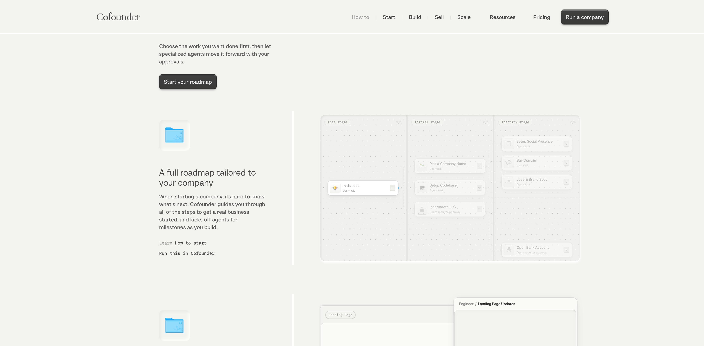
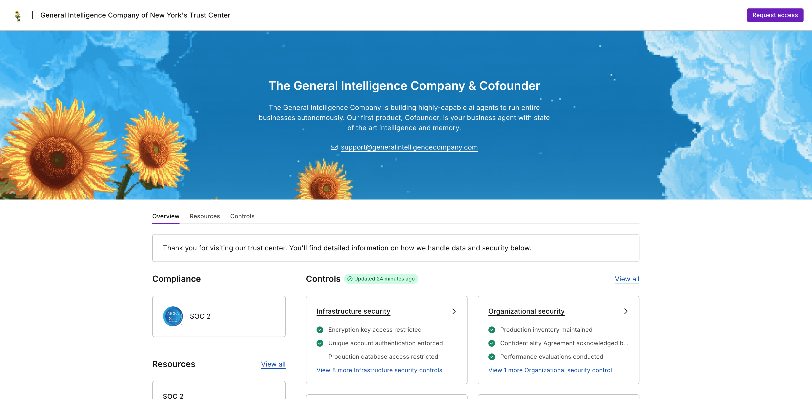

Cofounder 是 The General Intelligence Company of New York 旗下的 AI 公司操作系统。它不是单个“数字员工”，而是把一家早期软件公司的路线图、部门、任务、上下文、Agent、外部工具与审批集中到同一控制面，目标用户是独立创始人和小团队。

## TL;DR

- **产品已经从 AI 助手重构为公司控制面。** Cofounder 1 在 2025 年 9 月上线；团队于 2026 年 4 月停止新注册，5 月发布 Cofounder 2，把产品重心改为工程、销售、营销、设计、财务与运营 Agent 的编排系统。
- **增长高度依赖重新发布，而不是平滑自然爬升。** 第三方估算显示根域名 2026 年 4 月约 1.73 万访问，5 月随 Cofounder 2 发布升至约 18.83 万，6 月回落至约 8.94 万。发布视频在 X 获得约 7,775 likes、414 reposts，是这一轮最强分发节点。
- **“已有公司数”不能直接当活跃或付费规模。** 官网当前称超过 10,650 家公司运行在 Cofounder；Resources 页面仍显示 6,959 家公司、95,000 个 Agent。两组都是供应商计数，时间与定义未公开，不能推出 retained、paying 或 successful company。
- **案例有明显样本选择偏差。** ActiveGraph 创始人 Yohei Nakajima 同时也是 Agent Fund 投资人；Veery 来自向创始人提供 1,000 美元与每日 credits 的 Fellowship cohort。两者证明产品能被使用，不构成独立、自然获客或长期留存证据。
- **治理是核心产品问题。** 官网强调危险动作需要审批、没有批准不会上线；服务条款同时允许用户授权自动合并、部署、修改基础设施、发送消息和处理付款，并明确风险由用户承担。真实边界不是“全自动”或“始终审批”，而是授权范围、动作等级、回滚和审计能否被配置与验证。

## 它实际在做什么

Cofounder 把公司抽象成几类对象：

1. **Company / Canvas**：保存公司目标、客户、产品与共享上下文。
2. **Roadmap / Tasks**：把从想法、命名、代码库、注册公司、域名、品牌、银行账户到上线增长拆成里程碑。
3. **Departments**：工程、销售、营销、设计、财务、运营和支持等部门拥有经理与专业 Agent。
4. **Agents**：每个 Agent 可以配置提示词、模型、skills、integrations、department 与 schedule。
5. **Library / Integrations**：连接 GitHub、Supabase、Vercel、Postmark、Stripe、域名、数据购买、邮件、图像与视频服务，也支持 MCP、自定义 API、skills 和代码库。

官方文档显示，它并非只生成一个网站。工程 Agent 可以在 sandbox 中规划、修改代码、运行浏览器测试、提交 PR，并推向 staging/production；营销部门可以选择渠道、安排 recurring missions；销售流程可以定义 ICP、暖箱、生成外联内容；公司创建流程还包括注册主体、银行与财务基础设施。

这使 Cofounder 更接近 [[concept.agent-company-control-plane]] 和 [[concept.autonomous-company-factory]] 的交集：既要提供执行能力，也要管理 Agent 之间的共享状态、依赖和权限。

## 产品边界

### 它更适合新公司，不是现有企业的通用自动化层

当前定价 FAQ 明确把 early-stage software company、solo founder、small team 作为最佳用户。虽然可以连接已有代码库，但官方称“最干净的体验”仍是由 Cofounder 从头建立和管理的项目。它暂不支持用户带入自己的 API key、Codex 或 Claude Code 订阅。

这意味着它当前更像 **company creation + managed services bundle**，而不是面向复杂存量组织的开放 Agent runtime。

### 托管与可迁移并存

Pro/Team 用户可以把 GitHub、Supabase、Vercel 等项目“graduate”到自己名下；但一旦迁出，Cofounder 不再管理配置。这个设计降低了完全锁定风险，也说明其价值不仅来自代码生成，而来自持续托管外部系统和配置。

### Ramp 当前只打通注册，不等于完整财务 Agent

2026 年 7 月 7 日，Cofounder 宣布通过 Ramp 提供 incorporation。文档把身份证明、SSN 等敏感输入留在 Ramp 托管流程，最终确认和声明仍由创始人完成。银行、费用、发票、卡和预算被描述为后续方向，不能写成已经全部上线。

## 定价与成本结构

截至 2026 年 7 月 15 日：

- Free Trial：7 天 Pro，包含 10 美元 usage；
- Cofounder Pro：页面显示 Starting at 20 美元/月，并包含 20 美元 usage；
- Team：Coming soon，页面显示 50 美元/月 usage included；
- 超额 usage 覆盖 Agent、模型、compute、database、customer support、ad spend 与 data purchasing。

这里不能把“20 美元/月”理解成总成本上限。产品把模型、计算、数据、广告与支持放进同一个 usage 账本，实际成本取决于 Agent 数、任务量和外部服务。条款还规定订阅预付、usage overage 后付、自动续费和原则上不退款。

## 从 Cofounder 1 到 Cofounder 2

| 时间 | 节点 | 证据边界 |
| --- | --- | --- |
| 2025-01 | 公司成立 | Forbes 称成立于 2025 年 1 月 |
| 2025-04-17 | GIC 正式介绍并披露 200 万美元 pre-seed | 官方文章，Compound 与 Acrew Capital 参与 |
| 2025-09 | Cofounder 第一版上线 | Forbes 与 Andrew 个人网站只给出月份，未找到精确日期 |
| 2025-12-08 | 870 万美元 seed | USV 领投，Acrew、Compound、Untapped VC、Agent Fund、The House Fund 参与 |
| 2026-03/04 | Fellowship 测试 Cofounder 2 | 提供 1,000 美元与每日 100 美元 credits；4 月 7 日启动 25 人 cohort |
| 2026-04-29 | Cofounder 1 停止新注册 | 官方称保留导出并重构架构 |
| 2026-05-03/04 | Cofounder 2 发布并开放 beta | 官网文章日期为 5 月 3 日；Andrew 称 5 月 4 日 open beta |
| 2026-07-07 | Ramp incorporation 上线 | 只确认注册流程，不扩写为完整财务闭环 |

这条时间线说明，5 月流量不是普通版本更新带来的增量，而是一次 **产品重构 + 重新发布 + 视频传播** 的集中激活。

## 增长与 GTM

### 重新发布制造了主要流量峰值

第三方估算的根域名月访问：

| 月份 | 访问量 |
| --- | ---: |
| 2026-01 | 23,051 |
| 2026-02 | 22,516 |
| 2026-03 | 50,661 |
| 2026-04 | 17,280 |
| 2026-05 | 188,303 |
| 2026-06 | 89,423 |

5 月相对 4 月约增长 9.9 倍，6 月又较 5 月下降约 52.5%。时间与 Cofounder 2 发布高度一致，但第三方估算只能支持“发布与峰值同窗”，不能证明所有访问均由发布视频带来。

Andrew 的发布视频是最清晰的传播资产：约 106 秒，用“一个人经营整家公司”而不是功能清单来做 elevator pitch，并获得约 7,775 likes、414 reposts。同期 HN 只有 1 point、0 comments，未发现 Product Hunt 产品页；这轮放大器主要是创始人 X 网络和二次媒体账号，而不是 PH/HN 社区。

### 流量仍以品牌和社交驱动为主

包含子域名的第三方估算口径为半年约 65.1 万访问；月访问约 6.52 万、月独立访客约 3.46 万、平均停留 2 分 30 秒、1.90 页/访问、跳出率 58.22%。渠道约为：Direct 49.17%、Organic Social 19.71%、Organic Search 15.17%、Referral 13.90%。搜索流量约 91% 为品牌词。

这更像 **发布驱动的品牌访问**，尚不是成熟的非品牌 SEO 飞轮。社交流量中 X 约 59.48%、YouTube 约 27.99%，进一步支持视频和社交传播的重要性。

### Typeform 外跳是一个待解释信号

第三方估算显示外跳中 Typeform 约占 68.12%，`app.cofounder.co` 约占 24.92%。公司 2026 年曾运行 Fellowship 申请计划，历史上存在申请型漏斗；但当前官网已不再链接 Fellowship，且我们没有拿到 Typeform destination 与 campaign 的直接映射。因此不能把 68.12% 写成 Fellowship 转化，也不能把所有站点访问视为 app signup。

## 规模与采用

官网当前称超过 10,650 家公司运行在 Cofounder；Resources 页面仍显示“95,000 agents powering 6,959 companies”。这至少说明产品持续在生成公司与 Agent，但以下分母全部缺失：

- 创建后真正完成 launch 的公司数；
- 30/60/90 天活跃公司数；
- 付费公司数与净收入留存；
- Agent 完成、被接受和产生经营结果的任务数；
- 迁出平台后仍持续经营的公司数。

因此这些数字属于供应商 activity counter，而非商业成功证明。

### 两个案例都不是独立自然样本

- **ActiveGraph**：Yohei Nakajima 使用 Cofounder 建站、newsletter、blog 和发布内容；但 Yohei 同时通过 Agent Fund 参与了 seed，案例具有投资人/战略用户偏差。
- **Veery**：Daria 用 Cofounder 管理牙医筛选、日志和 follow-up，人工仍验证 provider；她来自 3,000+ 申请者中选出的 General Intelligence Fellowship。该计划提供现金与 credits，并要求允许公司撰写 case study。

这两例能说明 workflow 与产品可用性，不能证明独立购买、可复制获客、长期留存或 ROI。

## 团队

公司由 [[person.andrew-pignanelli]] 与 [[person.abhishyant-khare]] 创办，两人在 South Park Commons 相识。

- Andrew 任 CEO。其个人网站称 18 岁从 University of Utah 退学，2019 年创办 Velvet，为 200+ VC funds 提供 AI OS；2021 年创办/经营 broker-dealer Decheque Securities，参与超过 7,000 万美元 secondary transactions。前两项有其个人网站和 Forbes 交叉支持，具体“最年轻 broker-dealer owner”仍主要来自本人/媒体叙事。
- Abhishyant 任 CTO。PyAI 简介显示他此前任 Gantry Engineering Lead，负责 RAG 评估平台与 support agent；更早在 Samsara 做合规和基于遥测的 stop-sign prediction。

LinkedIn 公司页给出的规模区间为 2-10 人。人员搜索可见创始人、工程、设计、GTM 与 chief of staff 等角色，但结果混入投资人与非员工，不能把候选条目数当精确 headcount。

## 融资与资本网络

| 轮次 | 日期 | 金额 | 投资方 |
| --- | --- | ---: | --- |
| Pre-seed | 2025-04-17 | 200 万美元 | [[investor.compound]]、[[investor.acrew-capital]] |
| Seed | 2025-12-08 | 870 万美元 | [[investor.union-square-ventures]] 领投；Acrew、Compound、[[investor.untapped-vc]]、[[investor.agent-fund]]、[[investor.the-house-fund]] 参与 |

已知两轮合计 1,070 万美元。Forbes 写作“more than $10 million”，与两轮算术一致。所有 investment 对象中的金额都是整轮总额，不分配给单家机构。

资本关系也解释了产品案例与传播：Agent Fund 的 Yohei 同时是案例用户；USV 的 Rebecca Kaden 为融资报道提供背书。研究时必须把投资关系、客户采用和独立评价分开。

## 治理、安全与责任

公司在 LinkedIn 宣布“经过审计并获得 SOC 2 认证”。其公开 Vanta Trust Center 列出 SOC 2 Type I Report、SOC 2 Type 2 Attestation、SOC 3 Report 和 SOC 2 Type 2 Report，并展示基础设施、组织、产品和数据隐私控制；报告本身需要申请访问，研究未下载审计文件。

需要保留一个产品口径冲突：定价页把 SOC 2 列在仍为 Coming soon 的 Team Plan 功能里，而官网 footer 又写“SOC 2 compliant security”。更稳妥的表述是：**运营公司公开 Trust Center 已展示 SOC 2 相关材料；不同套餐具体覆盖范围仍需销售/合同确认。**

### “nothing ships without approval” 不是无条件事实

官网写“You stay in control, nothing ships without your approval”。Terms 则明确：

- 用户可以授权 Agent 部署代码、修改基础设施、发送消息、处理付款等动作；
- 连接的代码仓库可能发生自动合并、部署和基础设施变更，未必逐次人工 review；
- 用户即使审查或批准输出，也仍承担使用、运营和法律责任；
- 用户是其终端业务的 merchant of record，负责税、退款、chargeback 与客户责任。

这不是简单的文案错误。它说明产品治理需要区分默认审批、用户授予的持续权限、动作风险等级与最终责任。Cofounder 的竞争力与风险会同时集中在这套 operating contract 上。

## 社区与中文世界

- HN：找到一个 2026-05-04 的“Running a Company with Agents”，1 point、0 comments。
- Reddit：精确产品检索没有独立用户讨论；只找到两条同一作者的新闻式转帖，均为 0 comments。
- Product Hunt：精确检索未发现匹配的产品页。
- 小红书：`cofounder.co` 检索被“找联合创始人”语义污染，未找到产品使用反馈。
- LinuxDo / V2EX：精确域名检索无结果。
- 微信：2026-07-11 出现一篇 Paperclip/Cofounder/Polsia 横评，说明中文认知开始形成；但文章是二次整理，部分规模/竞品描述未溯源，不能作为独立采用证据。

当前社区结构是 **高传播、低独立验证**：X 发布声量很强，但开发者论坛、长期用户复盘和中文实测都很薄。

## 竞品位置

| 对象 | 更接近什么 | 与 Cofounder 的关键差异 |
| --- | --- | --- |
| [[company.paperclip]] | 开源 Agent 组织与治理控制面 | 强在自托管、预算、层级与审计；不负责完整公司执行闭环 |
| [[company.polsia]] | 高自治公司生成与运营 | 更激进地自动投放和经营，并采用分成；Cofounder 更强调部门编排与审批 |
| [[company.nanocorp]] | 从一句话创建自治公司 | 公开经营看板与 revenue-share 更突出；Cofounder 的 managed infra 与部门系统更完整 |
| [[company.lindy]] | 通用 AI 员工/助手平台 | 从任务和个人工作流进入；Cofounder 从公司生命周期和部门进入 |

Similarweb 的 similar sites 主要混入 cofounder matching、创业者网络与同名站点，不能直接作为竞品清单。竞品判断必须以目标用户、执行闭环、治理层与商业模式人工分类。

## 关键判断

1. **Cofounder 2 的核心创新不是更多 Agent，而是把公司生命周期变成可执行路线图。** 它把 incorporation、代码、域名、营销、销售、支付和支持放进同一依赖图，这比“一个员工做一件事”更接近公司控制面。
2. **重新发布证明了 narrative 的力量，尚未证明留存。** 一段高质量视频和“一人十亿美元公司”的叙事制造了明显注意力峰值；6 月回落、品牌词占比和公开活跃分母缺失，使长期增长仍待验证。
3. **Fellowship 是产品测试、案例生产和分发的一体化 GTM。** 它能快速得到 25 个高动机创始人、真实任务和案例素材，但补贴 cohort 不能与自然用户混写。
4. **治理不是附属安全页，而是产品本体。** 当 Agent 能改代码、投放、发信和付款时，approval、standing authorization、merchant responsibility、audit 与 rollback 决定产品能进入多深。
5. **Managed services 既是闭环优势，也是成本和锁定来源。** Cofounder 代管 GitHub、Supabase、Vercel、域名、邮件和数据服务，使执行更连贯；同时 usage 账单与迁出后的配置失管会提高用户切换成本。

## 风险与待验证

- 10,650 companies、6,959 companies、95,000 agents 的定义、时间与去重方式；
- 付费、活跃、留存和成功公司的真实分母；
- 5 月发布流量中 Fellowship、视频传播、媒体与自然 app signup 的贡献；
- Team Plan 与当前 Pro 的 SOC 2 覆盖差异；
- approval 默认策略、standing permission、付款/广告限额、回滚和审计日志的实际 UI；
- usage-based 账单在高频工程、数据购买和广告场景的成本上界；
- ActiveGraph、Veery 之外的独立付费客户与长期结果；
- current product 对复杂已有代码库和多人组织的真实适用程度。

## 证据入口

### 官方与产品

- [[source.cofounder.homepage-2026-07-15]]
- [[source.cofounder.docs-full-2026-07-15]]
- [[source.cofounder.pricing-2026-07-15]]
- [[source.cofounder.terms-2026-07-15]]
- [[source.cofounder.v1-sunset-2026-04-29]]
- [[source.cofounder.v2-launch-2026-05-03]]
- [[source.cofounder.ramp-incorporation-2026-07-07]]
- [[source.cofounder.activegraph-case-2026-07-15]]
- [[source.cofounder.veery-case-2026-07-15]]

### 融资、团队与安全

- [[source.gic.introduction-2025-04-17]]
- [[source.cofounder.seed-announcement-2025-12-08]]
- [[source.forbes.cofounder-seed-2025-12-08]]
- [[source.linkedin.cofounder-company-2026-07-15]]
- [[source.linkedin.cofounder-employees-2026-07-15]]
- [[source.linkedin.cofounder-soc2-post-2025]]
- [[source.vanta.cofounder-trust-center-2026-07-15]]

### 增长与社区

- [[source.x.cofounder-v2-launch-2026-05-04]]
- [[source.linkedin.cofounder-fellowship-2026]]
- [[source.x.cofounder-fellowship-kickoff-2026-04-07]]
- [[source.similarweb.cofounder-2026-07-15]]
- [[source.hn.cofounder-launch-2026-05-04]]
- [[source.reddit.cofounder-search-2026-07-15]]
- [[source.producthunt.cofounder-search-2026-07-15]]
- [[source.wechat.cofounder-comparison-2026-07-11]]
- [[source.xhs.cofounder-search-2026-07-15]]
- [[source.google.cofounder-linuxdo-v2ex-search-2026-07-15]]

最后更新：2026-07-15。第三方流量均为方向性估算；公司计数、案例与内部效率均保留供应商自报边界。
