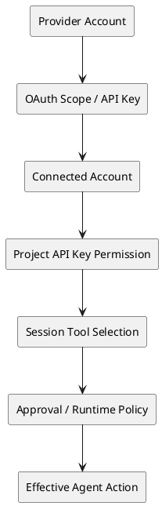

# Composio

> 调研截止：2026-07-29（Asia/Shanghai）
>
> 状态：research-complete。本文件是研究母本，不代表 public-ready 或发布决定。

## TL;DR

Composio 是由 **Sampark Inc.** 运营的 Agent 集成与执行平台，2023 年由
**Soham Ganatra** 和 **Karan Vaidya** 创立。它不只是一个 MCP 目录，而是把
工具目录、认证、用户连接、工具发现与执行、触发器、日志、Session 和企业治理
组合成一套托管控制层。

它目前有两条相关但不同的产品线：

1. **FOR YOU**：个人把 GitHub、Notion、Slack 等应用连接一次，再通过托管 MCP
   供 Claude、Codex、Cursor、Hermes 等客户端使用。
2. **Developer Platform**：开发团队通过 SDK、原生工具或 MCP，把多用户授权和
   工具执行嵌入自己的 Agent 产品。

它真正节省的不是几行 MCP 配置，而是 OAuth 应用申请、token 存储与刷新、API
schema 维护、用户身份映射、工具发现、重试、日志和集成漂移处理。代价也同样
明确：Composio 会成为集中的凭据与执行控制面。2026 年 5 月安全事件、4 月
API/Trigger 故障和 2 月 X 授权中断说明，这种集中会带来安全、可靠性、撤销和
供应商依赖风险。

## 1. 公司实体与身份

- 产品/公司名称：**Composio**。
- 当前 Terms 中的法律运营主体：**Sampark Inc.，doing business as Composio**。
- 成立时间：**2023 年**，由 Lightspeed portfolio 页面确认。
- 创始人：[[person.soham-ganatra]]、[[person.karan-vaidya]]。
- 官方域名：<https://composio.dev/>。
- GitHub：<https://github.com/ComposioHQ/composio>。
- 公司融资稿和公开资料出现 San Francisco；团队同时具有印度背景。本调研不把
  这些信号合并成唯一、排他的运营地点结论。

消歧：Composio 不是写作补全产品 **Compose.ai**，也不是 AI 质量监控产品
**Composo**。目前没有可靠证据证明 Composio 是 Y Combinator 公司。

## 2. 产品定义

更具体的定义是：

> Composio 是一套托管控制层，让 AI Agent 能以可认证、可发现、可限制、可观测
> 的方式调用外部应用中的动作与事件。

它覆盖六个开发者通常需要自行建设的层次：

| 层 | 产品对象 | 替开发者承担的工作 |
|---|---|---|
| 能力目录 | Toolkit、Tool、Trigger | 维护大量 API schema 和动作定义 |
| 认证 | Auth Config、Connected Account | OAuth 应用、token 存储、刷新和失效 |
| 身份 | Organization、Project、User | 把每个产品用户映射到正确的外部账户 |
| 运行时 | Session、原生工具、MCP、sandbox/workbench | 工具加载、选择和执行 |
| 治理 | scope、tool allowlist、API-key permission、approval | 最小权限和高风险动作控制 |
| 运营 | log、webhook event、usage、billing | 可观测性、计量和生命周期管理 |

完整对象定义和 PlantUML 模型见
[[note.composio-concept-model-2026-07-29]]。

### 它不是什么

- 不是一个通用 Agent 模型。
- 不是 Zapier/n8n 式的可视化工作流产品，尽管它的工具可以被工作流调用。
- 不是“一份 OAuth token 无条件给所有 Agent 共用”。真实模型区分 provider
  authorization、Connected Account、User、Project、Session 和客户端凭据。
- 不能因为目录里列出 1,000+ Toolkit，就推定所有 Toolkit 的深度、正确性和
  生产质量一致。

## 3. 两条产品线

### 3.1 FOR YOU

FOR YOU 面向个人使用。用户在 Composio 工作区连接 GitHub、Notion、Slack 等
应用，选择 AI 客户端，再安装集成或提供 MCP endpoint。界面隐藏了大多数开发者
平台对象，强调从“连接应用”到“让 Agent 做事”的短路径。

本次授权实测连接了 GitHub、Notion 和 Slack，安装了 Composio CLI/Codex 集成，
并成功执行一项有界的只读 GitHub 任务。清理 Developer Platform 的测试 Session、
连接、Auth Config 和临时 Key 后，FOR YOU 的连接仍然存在。这证明两条产品线在
控制面和生命周期上至少存在明显隔离。

### 3.2 Developer Platform

Developer Platform 面向把 Composio 嵌入自有产品的团队。团队创建
Organization、Project 和 API Key，用 User 表示每个下游客户，通过 Auth Config
与 Connected Account 建立授权，再通过原生或 MCP Session 暴露选定能力。平台
还提供日志、Trigger、Webhook、用量、账单、成员角色、安全设置和企业选项。

本次实测创建了受限 Project Key、托管 GitHub 连接、原生 Session 和 MCP
Session：

- 没有 Connected Account 删除权限的 Key 得到 `403`；
- 被撤销的 Key 得到 `401`；
- 原生 Session 和 MCP Session 即使复用同一个 User 和 Connected Account，也有
  不同的 ID 和活动日志。

完整逐屏记录和 54 张截图见
[[note.composio-ux-walkthrough-2026-07-29]]。

## 4. 认证与权限模型

Agent 的有效权限是多层条件的交集，不是一枚 token：

- **Managed Auth**：在支持的 Toolkit 上使用 Composio 提供的 provider OAuth
  application。
- **Custom Auth Config**：开发者提供自己的 OAuth client、scope、品牌、quota 或
  自定义实例配置，主要属于 Developer Platform。
- **Connected Account**：某个下游 User 对具体外部账户完成授权后的连接。
- 当前文档把 Auth Config 定义为可复用的认证蓝图，同时为每个下游 User 创建隔离
  Connected Account；同一个 User 也可以连接同一 Toolkit 的多个账户。
- Project API Key 权限控制的是 Composio API 操作，并不等于 provider OAuth
  scope，也不等于 Session 的 tool allowlist。
- 删除 Composio 中的连接不一定等于撤销上游 provider token。2026 年 5 月事件
  公告明确说明，部分凭据仍需在 provider 侧撤销或轮换。

## 5. 能力与运行时

公开仓库和产品界面显示，Composio 提供 TypeScript/Python SDK、CLI、
provider/framework adapter、原生工具接口和 MCP 交付。仓库采用 MIT license。
截至 2026-07-29，GitHub 页面显示约 29.4k stars 和 4.7k forks；这些数字只能
说明开发者关注度，不能证明活跃部署或付费采用。

它的架构价值不止 MCP：

- Tool discovery 避免把几千个 schema 一次性塞进模型上下文。
- Managed Auth 和 Connected Account 生命周期不属于 MCP 基础调用协议本身。
- 执行、Trigger、重试、日志、Session 和治理即使使用 MCP 也仍需产品实现。
- Native 和 MCP 是重叠能力之上的不同交付接口，不是“转发第三方 MCP”的充分
  证据。

## 6. 商业模式与定价

Composio 采用免费层、用量计费平台方案、个人入口、startup credit 和 enterprise
sales 组合的开发者增长路径。

截至 2026-07-29，仍可见的当前方案为：

- Free：每月 20k tool calls。
- $29/月：200k tool calls，超量 $0.299/1k。
- $229/月：2M tool calls，超量 $0.249/1k。
- Enterprise：自定义容量、SLA/SOC 2、VPC/on-premise 和销售联系。

已宣布自 2026-08-15 生效的新定价发生明显变化：

- Free 仍含 20k calls/triggers。
- Pro 为 $29，含 50k calls/triggers。
- Business 为 $599，公开包含量相同，但增加治理、安全和支持能力。
- 超量为普通 tool call $4/1k、Session call $3/1k，并分别计量 Trigger、LLM、
  sandbox 和 storage。
- 官方称现有客户旧方案保留到 2026-12-31。

这说明定价正从低价调用包转向对 Agent runtime/control plane 收费。详细计算见
[[note.composio-pricing-model-2026-07-29]]。

## 7. 团队与融资

Lightspeed 将 Soham Ganatra 和 Karan Vaidya 列为联合创始人，并记录了 2025 年
Series A。Karan 个人网站将其身份写为联合创始人兼 CTO；公司材料把 Soham 写为
联合创始人兼 CEO。

公司于 2025-07-22 宣布完成 **$25M Series A**，由 Lightspeed 领投。公司发布稿
列出的其他参与方包括：

- Elevation Capital、Together Fund；
- SV Angel、Blitzscaling Ventures、Operator Partners、Agent Fund；
- Guillermo Rauch、Dharmesh Shah、Gokul Rajaram、Soham Mazumdar。

同一公告称累计融资达到 **$29M**。由此只能推知此前融资合计约 $4M；已检查来源
没有给出完整轮次和分配，因此 Vault 不虚构早期轮次，也不把 $25M 分配给某位
投资人。

发布稿还声称有 100,000+ developers、200+ startup/enterprise customers、
每日数百万请求和七位数收入。这些是公司口径，未经独立审计。其他页面又使用
50k+ users、1M AI-native teams 等不同说法；时间、定义和总体不同，不能合并成
一个 canonical adoption 数字。

## 8. 客户与用户证据

### 8.1 厂商案例

Composio case studies 声称客户可以在数小时或数周内完成集成并节省工程时间。
案例包括：

- 11x：声称带来 $4.2M enterprise deals、节省 380 工程小时；
- Opennote：声称 retention 提升 50%+；
- Fabrile：声称 30 分钟完成 Gmail/Drive 集成。

这些材料支持“降低集成和认证工程成本”这一 job-to-be-done，但不能独立证明
收入归因、留存因果关系或普遍产品质量。

### 8.2 Review 平台

G2 在截止日显示 **4.9/5、7 条评论**。汇总中的正面主题是集成容易、节省时间和
支持较好；负面主题包括初始复杂度、学习成本、文档缺口和功能缺失。7 条评论不足
以代表整体客户。

Product Hunt 显示 4 条 review、6 次 launch 和 317 followers。公开评价中有
builder 表示它帮助快速接入常见 MCP 或大量集成，但样本很小，也接近推广场景。

### 8.3 Reddit 与 X

独立反馈呈现混合状态：

- 有用户肯定“连接一次，由 Agent 使用”的体验，以及 Tool Router 对上下文膨胀
  的缓解。
- 一位 Reddit founder 称早期 onboarding 支持很好，但后续遇到高额账单以及离开
  时的支持问题。这是无法独立验证的单一陈述，但暴露出支持、锁定和退出成本。
- 有开发者认为 Arcade 在多终端用户管理和工具质量上更好；另有帖子报告 Google
  集成文档过时、调用失败。
- 一位 X 开发者认为 aggregator 适合 demo，但 breadth 可能牺牲工具深度，过大
  输出还会损害模型上下文，因此严肃付费产品可能更适合 direct API。
- 也有 X 用户肯定统一授权减少 API key 和集成工作，同时明确每个外部应用仍需
  单独、可撤销的授权；最小权限仍依赖明确 scope 和 action 配置。

这些社交样本不具统计代表性。它们更适合提炼评估维度：接入速度、工具深度、
文档新鲜度、支持、上下文效率、最小权限、多用户管理和退出成本。

## 9. Traffic 证据

在 2026-07-29 cutoff 下，最新可复用 Similarweb observation 的 scope 是
`composio.dev`、2026 年 1-6 月、Worldwide、All Traffic、root domain only。
页面显示 monthly visits 为 **496,433**；原始月线从 1 月约 **165,573** 上升至
6 月约 **898,269**。

但 provider 内部存在明显冲突：

- displayed total 为 5.932M，六个月 chart sum 约为 2.979M；
- displayed change 为 +10.92%，chart-derived latest MoM 约为 +21.17%；
- monthly card 只是在显示精度上与六点平均值吻合，provider 未公开定义。

因此这些字段保持为不同 provenance 的 observation，不用于证明客户、付费采用、
收入、市场份额或产品质量。Semrush 当时没有可控的授权 report page，无法确认
object、module 和 scope，因此没有消费任何 Semrush 数值，并按合法 STOP 记录。

## 10. 可靠性与安全证据

### 10.1 2026 年 5 月安全事件

Composio 披露内部系统遭到未授权访问。其持续更新的公告称：

- 少量用户的 GitHub token 被泄露；
- 另有少量用户受特定 API Key 影响；
- 攻击者通过大量 exploit 组合在内部 agentic monitoring tool 获得立足点；
- 客户被建议撤销 Connected Account token 并轮换 API Key；
- Composio 在 provider API 允许时执行撤销，但仍有部分连接不能由平台集中撤销。

下游客户 Hyperagent 随后禁用了全部 Composio integration、通知客户、核验撤销，
并把常见 Google/GitHub/Notion 能力迁移到 first-party integration/custom MCP。
这是凭据集中会扩大下游 blast radius 和迁移成本的外部证据。

### 10.2 2026 年 4 月平台与 Trigger 故障

Composio 报告 core API 累计约 53 分钟 degraded，Slack、Outlook、Notion、
HubSpot webhook trigger 约 36 小时不可用，影响约 700 名 active-trigger 客户。
ingestion 停止期间的事件无法恢复。根因是 cleaner job 静默失败后
trigger-processing table 无上限增长。

### 10.3 2026 年 2 月 X 集成中断

X API policy/enforcement 变化导致 managed Twitter auth 在 2 月 9-12 日中断。
Composio 后续要求用户改用自己的 X Developer credentials。这说明 managed
integration 仍继承上游 provider 的定价、政策、执法和撤销风险。

## 11. 竞争框架

| 替代方案 | 用户需要自行承担什么 | Composio 的差异 |
|---|---|---|
| Direct API integration | 每个 API 的 auth 和 adapter | 目录广度、托管生命周期、统一 runtime |
| Raw MCP server | 自建认证、用户映射和运维 | 跨工具认证、发现、日志和治理 |
| Nango/Merge 类 integration infra | 通用集成或统一 API | Agent-native schema、Session、Tool Router、MCP |
| Arcade | Agent tools 与 auth | 目录和定价不同；质量需按 Toolkit 实测 |
| Pipedream/Zapier/n8n | 集成与工作流自动化 | Composio 更偏嵌入式 Agent 基础设施 |
| 自托管 connector stack | 自行维护但拥有控制权 | Composio 降低维护、同时集中信任与成本 |

这只是类别地图，不是胜负排名。真实采购比较必须围绕目标 Toolkit、认证方式、
用户规模、action schema、context cost、撤销行为和支持要求逐项实测。

## 12. 初步研究判断

### 证据支持的部分

1. 外部 SaaS 认证、工具 schema、用户映射和运行运维是 Agent 产品的真实重复问题。
2. 实测平台包含有意义的身份、权限、执行、日志和生命周期对象，不是薄 MCP wrapper。
3. 开源仓库和多框架接口带来较强的开发者认知与集成杠杆。
4. 客户需要连接的应用、下游用户和 Agent runtime 越多，平台价值越明显。

### 主要风险

1. **凭据集中**：一次安全事件可能影响多个 Toolkit 和下游客户。
2. **集成质量不均**：目录广度不代表每个 Tool 的深度与正确性。
3. **可靠性耦合**：中心 API 和 Trigger 故障会同时影响多条工作流。
4. **供应商与退出成本**：Auth Config、User mapping、Session、Tool 和 Log 会进入
   客户运行架构。
5. **价格不确定性**：2026 年 8 月定价迁移显著提高边际调用成本并增加计量维度。
6. **权限复杂度**：平台提供多层控制，但安全的 least-privilege 部署仍需主动设计。

### 最适用场景假设

Composio 更适合需要很多外部集成、多用户 delegated auth 和快速上市，但不愿拥有
完整集成运维栈的团队。对于少量高价值 API，尤其安全、schema 质量、延迟或
provider-specific 行为很关键时，直接集成仍可能更简单。

这是有界的 product-fit 假设，不是 PMF、市场份额、收入或投资结论。

## 13. 未知与证据不支持的说法

当前证据不能证明：

- 经审计的收入、留存、毛利、客户集中度或活跃用户数；
- “shared learning”或自改进工具在不同客户生产环境中稳定成立；
- 1,000+ Toolkit 的质量一致；
- 当前 SOC 2 的精确 scope、企业 SLA 表现或 VPC/on-premise 采用；
- $29M total funding 背后的完整早期融资轮次；
- GitHub stars、Traffic、G2 rating 或社交帖子等于付费采用；
- 删除所有 Composio connection 都能撤销上游凭据；
- 2026 年 5 月事件没有超出公开范围的其他影响；
- 有代表性的 Hacker News、YouTube 或 podcast 用户样本。截止日公开搜索过于稀疏，
  没有保留为独立证据。

## 14. 更新触发器

仅在真实下游问题需要时更新，主要触发器包括：

1. 2026-08-15 新定价正式生效或迁移规则变化；
2. Composio 发布 2026 年 5 月安全事件最终 postmortem 或扩大事件范围；
3. 出现新的可核验安全/合规材料；
4. 采购决策需要 Toolkit-level 的质量、延迟和撤销测试；
5. 融资、管理层、法律主体或所有权变化；
6. Traffic 推进到新的已闭合且对问题有意义的窗口；
7. 开源 license、仓库结构或 self-hosting 边界发生实质变化。

## 证据与专项笔记

### 产品与一手来源

- [[source.website.composio-home-2026-07-21]]
- [[source.docs.composio-authentication-2026-07-29]]
- [[source.website.composio-protection-2026-07-29]]
- [[source.website.composio-terms-2026-07-29]]
- [[source.github.composio-repository-2026-07-29]]
- [[source.website.composio-case-studies-2026-07-29]]
- [[source.website.composio-security-incident-2026-05]]
- [[source.website.composio-platform-incident-2026-04]]
- [[source.website.composio-x-integration-incident-2026-02]]

### 公司与融资

- [[source.lightspeed.composio-portfolio]]
- [[source.website.karan-vaidya-profile-2026-07-29]]
- [[source.website.composio-series-a-2025-07-22]]
- [[source.prnewswire.composio-series-a-2025-07-22]]

### 独立/客户信号

- [[source.hyperagent.composio-security-response-2026-05]]
- [[source.g2.composio-reviews-2026-07-29]]
- [[source.producthunt.composio-2026-07-29]]
- [[source.reddit.composio-one-stop-mcp-2026]]
- [[source.reddit.composio-agent-readable-html-2026]]
- [[source.x.composio-oauth-positive-2026-07-23]]
- [[source.x.composio-integration-quality-critique-2026-07-20]]

### Traffic

- [[source.similarweb.composio-2026-07-22]]

### 专项研究

- [[note.composio-concept-model-2026-07-29]]
- [[note.composio-ux-walkthrough-2026-07-29]]
- [[note.composio-pricing-model-2026-07-29]]
- [[note.composio-competitive-product-teardown-plan-2026-07-29]]
