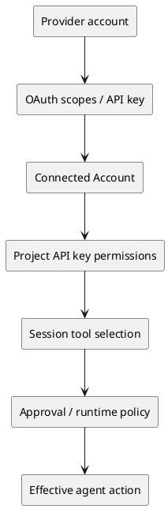

# Composio

> Research cutoff: 2026-07-29 (Asia/Shanghai)
>
> Status: research-complete. This is a research dossier, not a public-ready
> publication decision.

## TL;DR

Composio is an agent integration and execution platform operated by
**Sampark Inc.**, founded in 2023 by **Soham Ganatra** and **Karan Vaidya**.
Its core product is not merely an MCP directory: it combines a large toolkit
catalog, managed or custom authentication, end-user connected accounts,
tool discovery, execution, triggers, logs, sessions, and enterprise controls.

It serves two related but distinct modes:

1. **FOR YOU** lets an individual connect personal apps once and expose them
   to Claude, Codex, Cursor, Hermes, or another client through a managed MCP
   surface.
2. **Developer Platform** lets a software team embed tool access and delegated
   authentication into its own multi-user agent product through SDKs, native
   tools, MCP, sessions, users, projects, and organization controls.

The practical value is time saved on OAuth apps, token refresh, API schemas,
retries, integration drift, per-user identity mapping, logs, and tool
discovery. The tradeoff is equally concrete: Composio becomes a concentrated
credential and execution control plane. Its May 2026 security incident and
April 2026 trigger/API outage show that this concentration creates
security, reliability, revocation, and vendor-dependency risks that cannot be
treated as implementation details.

## 1. Entity and identity

- Product/company name: **Composio**.
- Legal operator in the current Terms: **Sampark Inc., doing business as
  Composio**.
- Founded: **2023**, confirmed by Lightspeed's portfolio record.
- Founders: [[person.soham-ganatra]] and [[person.karan-vaidya]].
- Headquarters signal: San Francisco appears in the company's funding release
  and public company profile; the team also has roots in India. This dossier
  does not assert a single exclusive operating location.
- Official domain: <https://composio.dev/>.
- GitHub organization/repository: <https://github.com/ComposioHQ/composio>.

Disambiguation: Composio is not **Compose.ai** (writing autocomplete) and not
**Composo** (AI quality monitoring). Searches for those names were excluded.
No reliable evidence was found that Composio itself is a Y Combinator company.

## 2. Product definition

The most concrete definition is:

> Composio is a managed control plane that gives an AI agent authenticated,
> discoverable, and observable access to actions and events across external
> applications.

The platform owns or normalizes six difficult layers:

| Layer | Product object | What it removes from the developer |
|---|---|---|
| Capability catalog | Toolkit, Tool, Trigger | Hand-maintaining many API schemas |
| Authentication | Auth Config, Connected Account | OAuth app setup, token storage and refresh |
| Identity | Organization, Project, User | Mapping each product user to the correct external account |
| Runtime | Session, native tools, MCP, sandbox/workbench | Loading and executing tools safely and efficiently |
| Governance | scopes, tool allowlists, API-key permissions, approvals | Rebuilding basic least-privilege controls |
| Operations | logs, webhook events, usage, billing | Building observability and lifecycle tooling |

Detailed object definitions, PlantUML models, and the distinction between
Toolkit and MCP are in [[note.composio-concept-model-2026-07-29]].

### What it is not

- It is not a standalone general-purpose agent model.
- It is not a workflow builder equivalent to Zapier or n8n, although its tools
  can be used inside workflows.
- It is not simply "one OAuth token shared by every agent." The actual model
  separates provider authorization, connected account, user, project,
  session, and client credentials. Multiple agents may reuse a governed
  connection, but the authorization and action boundary still depends on
  those objects.
- It is not proven that every listed toolkit has equal depth, correctness, or
  production quality.

## 3. Two product lines

### FOR YOU

FOR YOU is the personal-use line. The user connects applications such as
GitHub, Notion, or Slack in a Composio workspace, chooses an AI client, and
installs or supplies an MCP endpoint. It hides most developer-platform
objects and emphasizes a short path from "connect app" to "ask my agent to do
work."

Our authorized walkthrough connected GitHub, Notion, and Slack, installed the
Composio CLI/Codex integration, and successfully performed a bounded read-only
GitHub task. FOR YOU connections survived the deletion of temporary Developer
Platform artifacts, which is strong evidence that the two product lines have
separate control and lifecycle boundaries.

### Developer Platform

The Developer Platform is for teams embedding Composio in their own product.
The team creates organizations/projects and API keys, represents each
downstream customer as a User, establishes Auth Configs and Connected
Accounts, and creates native or MCP Sessions to expose selected capabilities.
It adds logs, triggers, webhooks, usage, billing, member roles, security
settings, and enterprise options.

Our test created scoped project credentials, a managed GitHub connection, and
both native and MCP sessions. A key without connected-account deletion scope
received `403`; a revoked key received `401`. Native and MCP sessions had
separate IDs and activity logs even when they referenced the same Platform
User and Connected Account.

The full screen-by-screen record and screenshots are in
[[note.composio-ux-walkthrough-2026-07-29]].

## 4. Authentication and permission model

Effective authority is an intersection, not a single token:

- **Managed Auth** uses Composio's provider application where available.
- **Custom Auth Config** lets a developer supply its own provider credentials,
  scopes, and branding. It is primarily a Developer Platform feature.
- **Connected Account** is the resulting authorization for a specific
  downstream user/account.
- Project API-key permissions govern Composio API operations; they are not the
  same as provider OAuth scopes or a Session's tool allowlist.
- Current documentation models one Auth Config as a reusable authentication
  blueprint and creates separate Connected Accounts per downstream user; one
  user can hold multiple accounts for the same toolkit.
- Deleting a Composio connection is not always equivalent to revoking the
  upstream provider token. The May 2026 incident bulletin explicitly says
  some credentials must be revoked or rotated at the provider.

## 5. Capability and runtime model

The public repository and product surfaces show Python and TypeScript SDKs,
CLI support, provider adapters, native tool interfaces, and MCP delivery.
The repository is public under MIT and integrates with multiple model and
agent frameworks. As observed on 2026-07-29, the repository displayed roughly
29.4k GitHub stars and 4.7k forks; these are developer-interest signals, not
proof of active production deployments.

The architectural advantage is not the MCP protocol alone:

- Tool discovery prevents thousands of schemas from being loaded into every
  model context.
- Managed auth and connected-account lifecycle sit outside MCP's basic tool
  invocation contract.
- Tool execution, triggers, retries, observability, sessions, and governance
  remain product work even when the client speaks MCP.
- Native and MCP delivery are alternate interfaces over overlapping
  capabilities, not evidence that Composio merely republishes third-party MCP
  servers.

## 6. Business model and pricing

Composio uses a product-led developer funnel with a free tier, usage-based
platform plans, a separate personal entry point, startup credits, and
enterprise sales.

As of 2026-07-29, the visible current plan still advertised:

- Free: 20k tool calls/month.
- $29/month: 200k tool calls, then $0.299/1k.
- $229/month: 2M tool calls, then $0.249/1k.
- Enterprise: custom volume, SLA/SOC 2, VPC/on-premise and sales contact.

The announced pricing effective 2026-08-15 materially changes the model:

- Free remains 20k calls/triggers.
- Pro is $29 for 50k calls/triggers.
- Business is $599 with the same public included volume but more governance,
  security, and support.
- Overage becomes $4/1k tool calls or $3/1k through Sessions, with separate
  trigger, LLM, sandbox, and storage metering.
- Existing customers are stated to keep the old plans through 2026-12-31.

This is a shift from inexpensive call bundles toward monetizing an agent
runtime/control plane. Detailed unit economics and examples are in
[[note.composio-pricing-model-2026-07-29]].

## 7. Company, team, and financing

Lightspeed lists Soham Ganatra and Karan Vaidya as co-founders and records a
2025 Series A investment. Karan's personal site identifies him as co-founder
and CTO; company materials identify Soham as co-founder and CEO.

The company announced a **$25M Series A** on 2025-07-22 led by Lightspeed.
Its own distributed release listed participation from:

- Elevation Capital and Together Fund;
- SV Angel, Blitzscaling Ventures, Operator Partners, and Agent Fund;
- Guillermo Rauch, Dharmesh Shah, Gokul Rajaram, and Soham Mazumdar.

The same announcement says total funding reached **$29M**. The remaining
$4M is implied as earlier funding, but the examined sources do not provide a
complete round-by-round allocation, so this dossier does not invent an
earlier round object or assign that amount to investors.

The release also claims more than 100,000 developers, more than 200 startup
and enterprise customers, millions of daily requests, and seven-figure
revenue. These are company-supplied traction claims, not independently audited
metrics. Other current Composio surfaces use different marketing counts such
as 50k+ users or 1M AI-native teams; the terms, dates, and populations are not
consistent enough to merge into a single canonical adoption number.

## 8. Customer and user evidence

### First-party customer evidence

Composio's case-study index says customers used it to ship integrations in
hours or weeks, save engineering time, and improve outcomes. Examples include
11x's claimed $4.2M in enterprise deals and 380 engineering hours saved,
Opennote's claimed 50%+ retention improvement, and a 30-minute Gmail/Drive
integration for Fabrile.

These examples support the claimed job-to-be-done: reduce integration and
authentication engineering. They do not independently prove causality,
retention, revenue attribution, or general product quality.

### Review platforms

G2 displayed **4.9/5 from seven reviews** at cutoff. Its aggregate summary
emphasized easy integrations, time savings, and support, while noting initial
complexity, learning curve, documentation gaps, and missing features. Seven
reviews are too few to treat the rating as representative.

Product Hunt displayed four reviews and six launches. Its customer page
contains builders saying Composio helped them add common MCPs or hundreds of
integrations without maintaining them. These are named ecosystem testimonials
but remain a very small, promotion-adjacent sample.

### Reddit and X

Independent feedback is mixed:

- Users praise the "connect once, use from the agent" experience and Tool
  Router/context management.
- A Reddit founder reported strong onboarding help followed by billing and
  support difficulties when trying to leave; this is one unverified account,
  but it identifies vendor-lock-in and support-exit risk.
- A developer comparing Arcade and Composio said Arcade worked better for
  multi-end-user management and tool quality; another thread reported outdated
  guides and a failing Google integration.
- One X developer argued integration aggregators are effective for demos but
  can expose thin tools and outputs large enough to damage model context,
  preferring direct APIs for a serious paid product.
- Other X users reported that one authorization path substantially reduced
  API-key and integration work, while clarifying that each external app still
  requires its own revocable authorization and that least privilege requires
  explicit scope/tool configuration.

The social sample is not statistically representative. It is useful for
identifying recurring evaluation dimensions: setup speed, tool depth,
documentation freshness, support, context efficiency, least privilege,
multi-user management, and exit cost.

## 9. Traffic evidence

The latest reusable Similarweb observation at the 2026-07-29 cutoff covered
`composio.dev`, January-June 2026, Worldwide, All Traffic, root domain only.
The displayed monthly-visits card was **496,433**, while the raw monthly
series rose from about **165,573** in January to **898,269** in June.

This evidence has material provider-internal conflicts:

- displayed total visits were 5.932M, versus a six-point chart sum of about
  2.979M;
- displayed change was +10.92%, versus a chart-derived latest monthly change
  of about +21.17%;
- the monthly card matches the chart average only at displayed rounding,
  without a documented provider definition.

These values remain separate provider observations. They do not establish
customers, paid adoption, revenue, market share, or product quality. Semrush
had no current controllable authorized report page, so no Semrush metric was
consumed and the absence is recorded as a legal STOP rather than no-data.

## 10. Reliability and security evidence

### May 2026 security incident

Composio disclosed unauthorized access to internal systems. Its bulletin says
a small percentage of users' GitHub tokens were compromised, a small number
of users were affected through specific API keys, and customers were advised
to revoke connected-account tokens and rotate API keys. Composio revoked
tokens where provider APIs allowed it, rotated platform keys, redacted token
returns, added IP restrictions and other mitigations, and stated that some
connections could not be revoked centrally.

Hyperagent, a downstream customer, disabled all Composio-powered integrations,
notified affected customers, verified revocations, and replaced common
integrations with first-party implementations/custom MCP support. This is
strong external evidence that credential concentration can create downstream
blast radius and migration cost.

### April 2026 platform and trigger outage

Composio reported about 53 cumulative minutes of core API degradation and
roughly 36 hours of unavailable Slack, Outlook, Notion, and HubSpot webhook
triggers, affecting about 700 customers with active triggers. Events received
while ingestion was disabled were not recoverable. The root cause was an
unbounded trigger-processing table after a cleaner job had silently failed.
The company isolated the trigger database, added monitoring, and began moving
to a purpose-built queue.

### February 2026 X integration disruption

An X API policy/enforcement change broke managed Twitter authentication from
February 9-12. Composio changed the integration to require users' own X
Developer credentials. This shows that managed integrations inherit upstream
provider pricing, policy, enforcement, and revocation risk.

## 11. Competitive frame

Composio sits between several categories:

| Alternative | What it replaces | Where Composio is differentiated |
|---|---|---|
| Direct API integration | Build each auth flow and API adapter | Breadth, managed lifecycle, common runtime |
| Raw MCP servers | Expose tools through a protocol | Cross-tool auth, user mapping, discovery, logs, governance |
| Nango/Merge-style integration infra | Unified or managed integrations | Agent-native schemas, sessions, tool routing and MCP |
| Arcade | Agent tools and auth | Larger stated catalog and different pricing; quality/governance comparison remains task-specific |
| Pipedream/Zapier/n8n | Integration/workflow automation | Composio is embedded agent infrastructure, not primarily a visual workflow product |
| Self-hosted/open connector stack | Control and lower vendor dependency | Composio reduces maintenance but centralizes trust and cost |

This is a category map, not a winner ranking. A valid purchasing comparison
must test the exact target toolkits, auth model, user volume, action schemas,
context cost, revocation behavior, and support requirements.

## 12. Initial research judgment

### What is well supported

1. Composio solves a real, repeated engineering problem: external SaaS auth,
   tool schemas, user/account mapping, and runtime operations for agents.
2. The product has progressed beyond a thin MCP wrapper: the tested Platform
   exposes meaningful identity, permission, execution, logging, and lifecycle
   objects.
3. The public repository and broad framework surface create substantial
   developer awareness and integration leverage.
4. The value increases with the number of apps, downstream users, and agent
   runtimes a customer must support.

### Main risks

1. **Credential concentration:** a breach can affect many downstream tools and
   customers; upstream revocation may require user action.
2. **Integration quality variance:** catalog breadth does not prove depth or
   correctness for each tool.
3. **Reliability coupling:** central API and trigger incidents can affect many
   workflows at once.
4. **Vendor and exit cost:** auth configuration, user mapping, sessions,
   tooling, and logs become part of the customer's runtime architecture.
5. **Pricing uncertainty:** the August 2026 price transition materially raises
   marginal tool-call cost and introduces more metering dimensions.
6. **Permission complexity:** the platform supports layered controls, but safe
   least-privilege deployment still requires deliberate configuration.

### Best-fit hypothesis

Composio is most compelling for a team that needs many external integrations,
multi-user delegated auth, and fast time-to-market, but does not want to own
the full integration operations stack. Direct integrations can remain simpler
for a small number of high-value APIs, especially where security, schema
quality, latency, or provider-specific behavior is critical.

This is a bounded product-fit hypothesis, not a PMF, market-share, revenue, or
investment conclusion.

## 13. Unknowns and unsupported claims

The current evidence does not establish:

- audited revenue, retention, gross margin, customer concentration, or current
  active-user counts;
- that "shared learning" or self-improving tools work consistently in
  production across customers;
- uniform quality across 1,000+ listed toolkits;
- exact current SOC 2 scope, enterprise SLA performance, or VPC/on-premise
  adoption;
- complete seed-round history behind the $29M total;
- that GitHub stars, traffic, G2 ratings, or social posts equal paid adoption;
- that deleting every Composio connection revokes the upstream credential;
- that the May 2026 incident caused no additional compromise beyond the
  published scope;
- a representative Hacker News or long-form YouTube/podcast user sample.
  Public search at cutoff was too sparse to retain as independent evidence.

## 14. Update triggers

Refresh this dossier when:

1. the 2026-08-15 pricing takes effect or the transition terms change;
2. Composio publishes a final May 2026 security postmortem or materially
   updates incident scope;
3. new audited security/compliance material becomes publicly accessible;
4. a real purchasing decision requires toolkit-level quality and latency
   testing;
5. financing, leadership, legal entity, or ownership changes;
6. traffic evidence advances to a newly closed material window;
7. the open-source license, repository structure, or self-hosting boundary
   materially changes.

## Evidence and supporting notes

### Product and first-party

- [[source.website.composio-home-2026-07-21]]
- [[source.docs.composio-authentication-2026-07-29]]
- [[source.website.composio-protection-2026-07-29]]
- [[source.website.composio-terms-2026-07-29]]
- [[source.github.composio-repository-2026-07-29]]
- [[source.website.composio-case-studies-2026-07-29]]
- [[source.website.composio-security-incident-2026-05]]
- [[source.website.composio-platform-incident-2026-04]]
- [[source.website.composio-x-integration-incident-2026-02]]

### Company and financing

- [[source.lightspeed.composio-portfolio]]
- [[source.website.karan-vaidya-profile-2026-07-29]]
- [[source.website.composio-series-a-2025-07-22]]
- [[source.prnewswire.composio-series-a-2025-07-22]]

### Independent/customer signals

- [[source.hyperagent.composio-security-response-2026-05]]
- [[source.g2.composio-reviews-2026-07-29]]
- [[source.producthunt.composio-2026-07-29]]
- [[source.reddit.composio-one-stop-mcp-2026]]
- [[source.reddit.composio-agent-readable-html-2026]]
- [[source.x.composio-oauth-positive-2026-07-23]]
- [[source.x.composio-integration-quality-critique-2026-07-20]]

### Traffic

- [[source.similarweb.composio-2026-07-22]]

### Detailed research

- [[note.composio-concept-model-2026-07-29]]
- [[note.composio-ux-walkthrough-2026-07-29]]
- [[note.composio-pricing-model-2026-07-29]]
- [[note.composio-competitive-product-teardown-plan-2026-07-29]]
