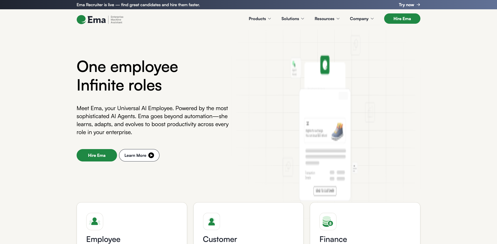
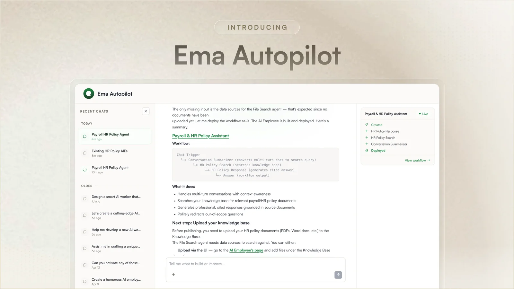
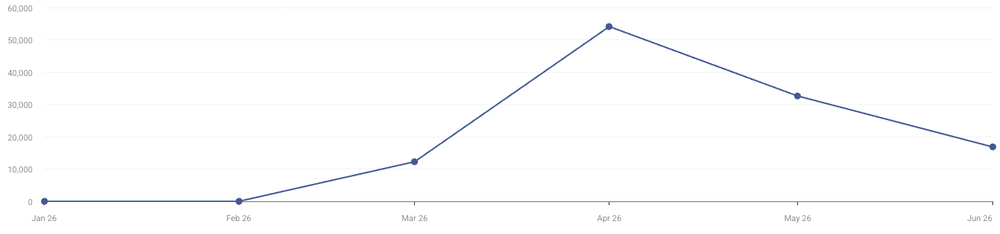

> 调研时间：2026-07-15。本文把官网/文档、客户侧公开表述、媒体报道、平台数据和研究判断分开。Ema 的大部分部署与 ROI 数字来自供应商案例，只有 Artico Search 的公开表述属于客户侧确认；网站流量也不等于企业产品使用量。

## TL;DR

**Ema 不是一个固定角色的“数字员工”，而是一套让大型企业构建、部署和持续运营多 Agent 工作流的横向平台。** “One employee, infinite roles”是品牌表达，产品事实更接近：用 Generative Workflow Engine（GWE）定义流程和多 Agent 协作，用 EmaFusion 在多模型间路由，用企业连接器、MCP 和浏览器执行跨系统动作，再用 Context Graph、审计、反馈与 Autopilot 管理上线后的变化。[[source.ema.homepage]] [[source.ema.ai-employees-docs]]

这使 Ema 同时落在两个概念上：它具备 [[concept.ai-employee-operating-system]] 的组织、权限、任务、记忆和交付原语；2026 年的 Autopilot 又把产品推向 [[concept.agent-lifecycle-control-plane]]，覆盖 Discover、Build、Debug、Test、Maintain、Evolve。**它卖的不是“多几个聊天机器人”，而是企业把一批 Agent 变成可运行劳动力所需的 workflow + action + context + day-2 operations。** [[source.ema.autopilot-2026-04-29]]

规模信号比本赛道多数早期公司成熟：2024 年 3 月结束隐身时已披露 Envoy Global、TrueLayer、Moneyview；2025–2026 年有 Hitachi、AMS、Artico、Wipro 等公开案例或客户信号。Ema 官方称 Hitachi 首阶段覆盖 40,000+ 员工、上线少于 8 周，并称最近数月经 Autopilot 上线 500+ AI Employees；这些仍是供应商自报。Artico Search CEO 则从客户侧确认，双方合作两年多，已经从 sandbox 进入企业级生产。[[source.techcrunch.ema-launch-2024-03-05]] [[source.ema.hitachi-case-2025-07-07]] [[source.linkedin.artico-ema-customer-2026]]

资本与团队同样强：两位创始人分别来自 Coinbase/Google 产品体系和 Okta/Google 工程与安全体系；2024 年 Series A 扩大到 5,000 万美元、累计资本超过 6,100 万美元，Accel 与 Section 32 领投，KPMG 后续做少数股权战略投资。**这组资本、咨询伙伴和客户网络是 enterprise GTM 资产，但不能替代收入、续约和独立 ROI 证据。** [[source.ema.funding-2024-07]] [[source.kpmg.ema-investment-2024-10-24]]

## “Universal AI Employee”实际是什么

官方文档把一个 AI Employee 定义为 **agentic AI mesh**，不是单一 Agent。其生命周期是：

1. **Create**：从 HR、CX、Sales、Healthcare、BFSI 等模板开始，或创建自定义 AI Employee；
2. **Configure**：在 Workflow Builder 中定义 Agent、数据流、分支、共享配置、输出与集成；
3. **Deploy**：发布到 Web、Slack/Teams/Google Chat、Voice、Dashboard、Document Editor、业务系统或 API；
4. **Monitor**：跟踪 audit logs、usage、accuracy、latency、feedback 和 version history。

[[source.ema.ai-employees-docs]]

这比“预置角色商店”更接近企业应用平台。Ema 既提供 Recruiter、Support Agent、Proposal Writer、Claims Assessment 等角色，也允许企业把自己的目标、资源、审批规则和系统连接编成专属工作流。界面只是入口，同一底层 workflow 才是核心资产。

### 两条执行轨道：API/MCP 与 Browser Use

Ema 的动作层并不只靠一种技术：

| 轨道 | 公开能力 | 适合什么 | 主要边界 |
|---|---|---|---|
| Intelligent Actions | 200+ connectors、自定义工具、任意 MCP server、OAuth scopes、HITL | 有 API、结构化读写、可明确授权的系统 | 连接器深度、目标系统 scope 与异常处理仍需逐项验证 |
| App Navigator | 登录网页、点击、输入、选择、滚动、跨页、提交表单、读取页面 | legacy portal、合作方网站、没有 API 的长流程 | 没有公开成功率、重试/恢复、验证码、页面漂移和凭据隔离测试 |

[[source.ema.intelligent-actions]] [[source.ema.app-navigator]]

App Navigator 很关键。AI Employee 若只能调用理想化 API，就无法覆盖 SAP 页面、政府/保险门户和大量内部系统。Ema 声称它不是固定坐标脚本，而是基于 application-level map 与 live page reasoning；这把浏览器执行纳入 enterprise workflow，但也把可靠性、观测、恢复和安全问题一并带进来。

### 连接器数量不是简单的“自己全做了”

官网不同页面出现 200+ 与 250+ 两种口径；Merge 的供应商案例进一步说明，Ema 曾通过 unified API 在数周内扩展 200+ integrations。[[source.ema.integrations]] [[source.merge.ema-integrations-2025]]

这揭示一个可复用的产品策略：**横向 Agent 平台不必独自维护所有 SaaS connector，可以借统一集成层快速补广度，把自研集中在 Agent orchestration、context、governance 和高价值动作。** 但 connector count 不能代表每个系统都支持完整读写、细粒度权限和复杂异常流程。

## EmaFusion、GWE 与 Context Graph

Ema 的技术叙事由三层组成：

- **GWE**：把目标拆成子任务，生成工作流与 orchestration code，并组合 planning、tool use、reflection、structured output 和 multi-agent collaboration；
- **EmaFusion**：按任务在公共、私有或客户自托管模型之间路由，优化准确率、成本和延迟；
- **Enterprise Context Graph**：持续映射组织结构、术语、政策、流程和运行反馈，让构建、排错和变更基于企业真实环境。

[[source.ema.funding-2024-07]] [[source.ema.autopilot-2026-04-29]]

模型数量要按时间读：2024 年 3 月 TechCrunch 报道 30+ LLM；2024 年 7 月官方写 100+ public/private models；当前 Builder Docs 写 40+ models / 9+ providers；首页的“2T+ parameter EmaFusion”又是另一种营销维度。**这些数字更像产品演进与口径变化，不能合并成一个稳定 benchmark，也不足以构成长期 moat。** [[source.techcrunch.ema-launch-2024-03-05]] [[source.ema.ai-employees-docs]]

真正可能形成复利的是 Context Graph 与运行数据：哪些流程经常失败、什么审批链有效、各系统如何映射、哪些例外需要人类、模型和 connector 在什么场景表现稳定。模型路由会逐渐商品化，企业上下文与 day-2 operations 更难快速复制。

## Autopilot：从 Builder 走向 Agent 运维层

2026 年 4 月发布的 Autopilot 是本轮最值得关注的产品变化。Ema 自己总结：构建只占 10%，剩余 90% 是上线后的 broken approval chain、规则变化、组织重组、测试、漂移和维护。Autopilot 因此承担：

- 发现可自动化流程并生成 AI Employee；
- 基于 HR、Finance、Customer Support 领域知识选择 connector、审批与合规控制；
- 自动生成测试集并在上线前跑 edge cases；
- 追踪 Agent、connector、data flow 的故障根因；
- 监控性能与 drift，给出修复方案；
- 当组织或规则变化时，映射受影响 workflow，并经人类批准更新；
- 在工作流之上生成 dashboard、queue、metric widget 与 approval UI。

[[source.ema.autopilot-2026-04-29]]

这使 Ema 不再只是 no-code Agent builder。**如果 Autopilot 真能稳定做变更影响分析和自动维护，它更像 Agent 时代的 control plane / operations layer。** 但目前“六分钟生成生产应用”“500 deployments”等仍来自官方，缺少失败率、维护成本、回滚、测试覆盖与长期稳定性数据。

## 客户落地：规模证据存在，但实施并不轻

### Hitachi：供应商披露的最大规模样本

Ema 称 Hitachi Digital 第一阶段覆盖五家业务和共享 HR 服务，支持 40,000+ 员工；内部 Agent “Skye”覆盖 hire-to-retire 20+ use cases，连接 ServiceNow、SAP、Workday、ADP，在 Azure、GCP 上运行，并通过 Teams、Google Chat 触达员工。官方结果是：

- 少于 8 周上线；
- HR ticket volume 按月下降 30%；
- resolution time 从几天降到几分钟；
- 90%+ accuracy；
- 标题称 HR efficiency 提升 70%，正文没有给计算方法。

[[source.ema.hitachi-case-2025-07-07]]

这是强规模信号，但仍是 Ema 自己发布的客户案例。应把“40,000+ employees using Ema”写成供应商声明，而不是已独立审计的 MAU。

### AMS：反而更能看见实施现实

AMS 的 contingent workforce 案例涉及 SAP Fieldglass、Beeline、TalentLink、ServiceNow、Outlook、Workday，还需要 PwC 参与、定制前端、SLA tracking、task allocation、approval 与 HITL。[[source.ema.ams-case-2026-06-17]]

它没有漂亮的硬 ROI，却提供了更重要的反证：**大型企业 Agent 落地不是“自然语言说一句，几分钟自动上线”。** 真正工作包括 process mapping、系统权限、异常路径、变更管理、责任人和实施伙伴。Ema 的产品价值若成立，部分来自把这套复杂工作平台化，而不是消灭实施。

### Artico：目前最强的客户侧确认

Artico Search CEO Mercedes Chatfield-Taylor 公开称双方合作超过两年，已从 sandbox experimentation 走向 full enterprise-wide production，并提到生产力、扩展、系统整合和成本下降。她没有披露数字，但这条证据由客户高管本人发布，可信度高于供应商案例。[[source.linkedin.artico-ema-customer-2026]]

因此当前最稳妥的采用判断是：**Ema 已有真实大型企业生产部署，但公开数据仍不足以估算 ARR、净留存、平均合同、活跃 Agent 或实际任务成功率。**

## 安全、部署与治理

官方文档列出 SOC 2 Type II、ISO 27001、ISO 42001、CSA STAR Level 1、HIPAA-aligned、GDPR 及多项 NIST 框架；支持默认多租户与可选单租户，后者可用独立 VPC、数据库、KMS/CMEK。传输 TLS 1.2+、静态 AES-256；默认备份 365 天，RTO 4 小时、RPO 30 分钟。[[source.ema.security-docs]]

2024 年公司已宣布 Azure/GCP on-prem，当前又写 on-premises 与 air-gapped deployment available。[[source.ema.funding-2024-07]]

这些能力说明 Ema 面向受监管大型企业，而不是轻量 SMB 自助工具。边界也要保留：公开文档能证明供应商披露和控制设计，不能替代 Trust Center 中的审计报告、证书 scope、pentest 结果和客户实际部署审查。

## 团队：enterprise product、identity/security 与印度研发密度

| 创始人 | 角色与履历 | 对产品的作用 |
|---|---|---|
| [[person.surojit-chatterjee]] | 联合创始人兼 CEO；前 Coinbase CPO，参与 2021 IPO；前 Google VP，负责 Mobile Ads 与 Shopping；40 项美国专利 | 大型产品、商业化、模型路由与跨业务平台经验；也是主要对外叙事节点 |
| [[person.souvik-sen-ema]] | 联合创始人兼 CTO；前 Okta VP Engineering；前 Google TrustGraph/反欺诈 ML；Duke CS PhD；37 项美国专利 | 身份、安全、数据、ML 与企业级工程能力 |

[[source.ema.about]] [[source.linkedin.surojit-chatterjee]] [[source.linkedin.souvik-sen-ema]]

创立时间存在两个相容口径：Surojit 在 X 上说 2022 年末开始构建，官方历史页写 2023 年 2 月在 California founded。产品于 2024 年 3 月 5 日正式结束隐身。官网历史页称 2024 年 5 月约 50 人、之后达到约 150 人并开设 London/Canada office；LinkedIn 当前公司区间为 51–200，employees search total=252。**这些值说明团队快速扩张，但不是精确 headcount。** [[source.ema.about]] [[source.linkedin.ema-company]]

LinkedIn 可见员工样本大量位于 Bengaluru、Delhi、Gurugram、Mumbai、Chennai，同时保留 Bay Area 与 Vancouver 工程。流量地区中 India 占比高，也与团队、创始人网络和印度科技媒体传播一致；不能把它直接解释成付费客户主要在印度。

## 融资网络：资本、客户与实施渠道重叠

Ema 的公开融资口径需要拆开：

- 2024-03-05 结束隐身时，TechCrunch 披露累计 2,500 万美元；Moneycontrol 称这笔资本横跨 seed 与 Series A；
- 2024-07-31，Ema 宣布额外融资 3,600 万美元，将 Series A 扩大到 5,000 万美元，累计资本超过 6,100 万美元；
- 2024-10-24，KPMG 宣布少数股权战略投资，金额未披露，并称属于 2024 Series A。

[[source.techcrunch.ema-launch-2024-03-05]] [[source.moneycontrol.ema-funding-2024-03]] [[source.ema.funding-2024-07]] [[source.kpmg.ema-investment-2024-10-24]]

机构网络包括 [[investor.accel]]、[[investor.section-32]]、[[investor.prosus-ventures]]、[[investor.wipro-ventures]]、[[investor.venture-highway]]、[[investor.ame-cloud-ventures]]、[[investor.frontier-ventures]]、[[investor.maum-group]]、[[investor.firebolt-ventures]]、[[investor.hitachi-ventures]]、[[investor.sozo-ventures]]、[[investor.scb-10x]]、[[investor.colle-capital]] 与 [[investor.kpmg]]。本库为每家建立投资边，但不把 2,500 万或 5,000 万美元分摊给单家。

这张网的价值不只是钱：

- Wipro、KPMG 是大型企业实施与咨询渠道；
- Hitachi Ventures 与 Hitachi 客户案例形成战略投资 + 使用场景闭环；
- Accel 与 Section 32 提供企业软件和高管网络；
- SCB 10X、Sozo、Prosus 为亚洲市场与大型集团连接提供入口；
- Sheryl Sandberg、Dustin Moskovitz、Jerry Yang、David Baszucki 等天使提供声誉与高管触达。

因此 Ema 的 GTM 更像 **founder network + strategic capital + implementation partners + lighthouse customers**，不是靠公共社区自助转化。

## Launch、传播与 GTM

时间线：

| 时间 | 节点 | 作用 |
|---|---|---|
| 2022 年末 / 2023-02 | 开始构建 / 公司成立 | 约一年隐身开发与客户验证 |
| 2024-03-05 | 结束隐身，披露 2,500 万美元与三家早期客户 | 媒体、融资、客户与类别叙事同步发布 |
| 2024-03-13 | Product Hunt 首发 | 112 points、日榜 #29，未形成显著社区放大 |
| 2024-07-31 | 扩大 Series A；发布 Builder、on-prem 与合规能力 | 从产品故事升级到 enterprise platform |
| 2024-10-24 | KPMG 战略投资 | 咨询渠道和大型企业市场背书 |
| 2025 | Hitachi、Bigblue、Artico 等案例 | 用 lighthouse customer 建立可信度 |
| 2026-04-29 | Autopilot | 从 build 叙事升级到全生命周期运营 |

[[source.producthunt.ema-launch-2024-03-13]] [[source.hn.ema-launch-2024-03-05]]

Product Hunt 只有日榜 #29，HN 两条相关链接分别只有 3 分和 1 分、无评论。它们不是 Ema 增长引擎。Ema 公司 LinkedIn 约 13.4 万关注者，Surojit LinkedIn 约 6 万、X 约 2.5 万；相比之下公司 X 只有约 483 followers。**其内容分发和 enterprise credibility 明显集中在 LinkedIn、创始人、高管圆桌、媒体/分析机构、投资人与合作伙伴。** [[source.linkedin.ema-company]] [[source.x.ema-company-profile]] [[source.x.surojit-profile]]

## 网站流量：4 月冲高，不能等同产品规模

第三方估算的 2026 年 1–6 月月线为：

| 月份 | 估算 visits |
|---|---:|
| 1 月 | 0（更可能缺测） |
| 2 月 | 0（更可能缺测） |
| 3 月 | 12,271 |
| 4 月 | 54,124 |
| 5 月 | 32,618 |
| 6 月 | 16,875 |

页面另一处同时显示 monthly visits 28,972、unique visitors 13,497、平均停留 3:32、1.87 pages/visit、bounce 61%。渠道为 Direct 46.32%、Organic Search 39.22%、Referral 6.66%、Organic Social 5.25%、GenAI 2.54%；地区为 India 67.73%、US 17.08%。[[source.similarweb.ema-2026-h1]] [[traffic.similarweb.ema-2026-h1]]

关键边界：月线总和与页面显示的 total visits 214,611 不一致，Jan/Feb 又为 0，因此不能计算可靠半年增长率。4 月峰值与 Autopilot 发布月重合，但仅凭时间不能证明因果。Ema 是 demo-led enterprise SaaS，公开网站访问也不能代表合同用户和内部员工使用量。

## 社区与中文世界：类别传播强，用户口碑弱

Reddit 精确检索被 Emma、EMA 和随机字符串严重污染，本轮没有找到可归因于 ema.ai 的高质量独立使用复盘。[[source.reddit.ema-community-search-2026-07-15]]

微信搜索约 265 条结果，高相关内容主要集中在 2024 年 3 月融资/launch，内容形态是 AI 日报、融资周报和产品拆解。深思SenseAI 的长文信息密度较高，但大部分来自 TechCrunch 与官方材料，并把 Swati Trehan 写成联合创始人、把上线写成 2023，与当前官方口径不一致。[[source.weixin.ema-search-2026-07-15]] [[source.weixin.senseai-ema-2024-03-14]]

小红书也能搜到产品介绍和融资解读，但典型相关样本只有个位数到二十余个赞，且同名噪声较多。[[source.xiaohongshu.ema-search-2026-07-15]]

因此当前社区结论不是“没有客户”，而是：**Ema 的公共证据结构是 enterprise case study 和高管传播强，普通用户可体验、独立评测、开发者讨论弱。**

## 竞品与相邻产品

第三方 similar sites 给出 Sintra、Lyzr、Teammates.ai、Johnni.ai，但它们不是同一层：

| 类型 | 代表 | 与 Ema 的关系 |
|---|---|---|
| SMB AI workforce / helpers | Sintra、Teammates.ai、[[company.artisan]] | “AI 员工”语言直接重叠，但价格、用户、部署复杂度和销售模式不同 |
| 企业 Agent builder / workforce platform | Relevance AI、Lindy、Lyzr | 在 workflow、connector、multi-agent、deployment 上更直接重叠；Ema 更强调大型企业、context graph 和 full lifecycle |
| 企业自动化与 Agent incumbent | [[company.uipath]]、ServiceNow、Microsoft Copilot Studio、Salesforce Agentforce | 拥有存量客户、系统权限与渠道，是更危险的长期竞争者 |
| 企业 AI workspace | [[company.dust]]、[[company.viktor]] | 偏员工协作、知识和 operator workspace；与 Ema 部分重叠但不一定拥有同等端到端流程野心 |
| AI workforce management / org OS | [[company.helio]]、[[company.raft]]、[[company.paperclip]]、[[company.floatbot]]、[[company.multica]] | 管理 Agent 的组织、任务、预算与协作，可能成为上层竞品或互补控制面 |

最重要的分类不是谁都叫 AI employee，而是谁拥有以下控制点：企业连接器、浏览器执行、context graph、workflow runtime、身份与审批、day-2 operations、用户入口和实施渠道。

## 关键判断与风险

### 1. Ema 已越过“概念公司”，但公开规模仍不足以估值业务质量

命名客户、客户侧 Artico 确认、Hitachi 规模案例和持续两年多合作都说明产品进入真实生产。仍缺 ARR、续约、活跃 Agent、任务量、成功率、人工接管率和 unit economics，不能由 40,000 employees 或 500 deployments 推导收入。

### 2. 最大优势可能是 enterprise implementation learning，不是 EmaFusion

多模型路由会被云厂商与开源框架快速复制；而跨 Workday、SAP、ServiceNow、ADP、Fieldglass 等系统的流程映射、权限、审批、异常恢复和组织变更经验更有复利。Autopilot 是否能把这些经验产品化，是后续核心验证点。

### 3. “Universal”扩大市场，也扩大交付风险

HR、Finance、CX、Sales、Healthcare、Insurance 的流程、合规和 buyer 完全不同。横向平台可复用底层，但每个领域仍需要专业模板、数据模型、集成与 partner。Ema 可能成为平台，也可能被高额定制与服务拖慢。

### 4. 浏览器执行补齐 API wall，同时引入最难的可靠性问题

App Navigator 让 Ema 能进入 legacy portal，这是端到端闭环的重要一步。公开材料还没回答：长流程成功率、验证码/MFA、页面漂移、session 隔离、凭据轮换、恢复点、证据截图、人工接管和成本。

### 5. 战略投资人既是渠道，也是独立性风险

KPMG、Wipro、Hitachi 的资本和业务关系能带来大客户与实施能力；同时供应商案例、投资方背书和合作伙伴宣传容易互相放大。研究时必须继续寻找客户自己发布的结果和可复核数据。

### 6. Autopilot 的 day-2 叙事很强，但需要长期运行证据

“自动发现受影响 workflow、生成测试、定位故障、修复 drift”比 build demo 难得多。下一阶段应追踪真实故障案例、回滚、变更审批、测试覆盖率与多月稳定性，而不是再收集更多角色列表。

## 持续监控

优先观察：

1. 500+ AI Employees 的定义、客户数、活跃率和上线后存活率；
2. Hitachi、Wipro、AMS、Artico 等客户侧独立复盘；
3. Autopilot 的 debug/test/maintain 真实案例和失败指标；
4. App Navigator 的 benchmark、恢复机制和安全模型；
5. 连接器的读写深度、OAuth scope、MCP 与 browser fallback；
6. 定价、合同规模、实施周期、服务收入和 partner 依赖；
7. 团队从约 150/252 人继续扩张还是收敛；
8. 4 月流量峰值之后是否恢复，地区与渠道结构是否变化；
9. Relevance AI、Lindy、Lyzr、Moveworks、UiPath、ServiceNow 与云平台的产品合流。

## 证据库

### S1：官方与主体自述

- [Ema 官网](https://www.ema.ai/) · [[source.ema.homepage]]
- [AI Employees Docs](https://builder.ema.ai/core-concepts/ai-employees) · [[source.ema.ai-employees-docs]]
- [App Navigator](https://www.ema.ai/app-navigator) · [[source.ema.app-navigator]]
- [Intelligent Actions](https://www.ema.ai/intelligent-actions) · [[source.ema.intelligent-actions]]
- [Integrations](https://www.ema.ai/integrations) · [[source.ema.integrations]]
- [Security & Compliance Docs](https://builder.ema.ai/administration/security-compliance) · [[source.ema.security-docs]]
- [About Us](https://www.ema.ai/about-us) · [[source.ema.about]]
- [2024 年 7 月融资、Builder 与 on-prem 公告](https://www.ema.ai/blog/agentic-ai/ema-revolutionizes-enterprise-ai-new-funding-ai-employee-builder-and-on-prem-deployment) · [[source.ema.funding-2024-07]]
- [Ema Autopilot](https://www.ema.ai/blog/product-launch/ema-autopilot-the-ai-employee-that-builds-and-manages-all-your-ai-employees) · [[source.ema.autopilot-2026-04-29]]
- [Hitachi 客户案例](https://www.ema.ai/blog/customer-stories/hitachi-uses-ema-and-increases-hr-operational-efficiency) · [[source.ema.hitachi-case-2025-07-07]]
- [AMS 客户案例](https://www.ema.ai/blog/customer-stories/how-ams-embedded-agentic-ai-into-contingent-workforce-management) · [[source.ema.ams-case-2026-06-17]]
- [KPMG 少数股权投资公告](https://kpmg.com/us/en/media/news/kpmg-investment-agentic-ai-startup-ema.html) · [[source.kpmg.ema-investment-2024-10-24]]
- [Frontier Ventures 投资文章](https://frontier.ventures/why-we-invested-in-ema/) · [[source.frontier-ventures.ema-investment-2024-03-05]]
- [Wipro Ventures portfolio 页面](https://www.wipro.com/ventures/advancing-healthcare-through-technology-innovation-at-every-touchpoint/) · [[source.wipro.ema-portfolio]]
- [Ema LinkedIn](https://www.linkedin.com/company/ema-unlimited/) · [[source.linkedin.ema-company]]
- [Surojit LinkedIn](https://www.linkedin.com/in/surojitchatterjee/) · [[source.linkedin.surojit-chatterjee]]
- [Souvik LinkedIn](https://www.linkedin.com/in/sen-souvik/) · [[source.linkedin.souvik-sen-ema]]
- [Ema X](https://x.com/Ema_Unlimited) · [[source.x.ema-company-profile]]
- [Surojit X](https://x.com/surojit) · [[source.x.surojit-profile]]

### S2：第三方强证据与平台估算

- [TechCrunch：结束隐身与 2,500 万美元融资](https://techcrunch.com/2024/03/05/ema-a-universal-ai-employee-emerges-from-stealth-with-25m/) · [[source.techcrunch.ema-launch-2024-03-05]]
- [Moneycontrol：seed 与 Series A 口径](https://www.moneycontrol.com/news/technology/why-top-silicon-valley-executives-are-investing-in-new-ai-startup-ema-12422891.html) · [[source.moneycontrol.ema-funding-2024-03]]
- [Artico Search CEO 客户侧确认](https://www.linkedin.com/posts/mchatfieldtaylor_building-with-an-innovative-partner-you-trust-activity-7471545455311568897-TOBL) · [[source.linkedin.artico-ema-customer-2026]]
- [Merge 集成案例](https://www.merge.dev/blog/ema) · [[source.merge.ema-integrations-2025]]
- [网站流量观察](https://www.similarweb.com/website/ema.ai/) · [[source.similarweb.ema-2026-h1]]
- [Product Hunt launch](https://www.producthunt.com/products/ema/launches/ema) · [[source.producthunt.ema-launch-2024-03-13]]

### S3：社区与中文传播

- [HN launch](https://news.ycombinator.com/item?id=39610271) · [[source.hn.ema-launch-2024-03-05]]
- [深思SenseAI 中文产品分析](https://mp.weixin.qq.com/s?src=11&timestamp=1784061512&ver=6842&signature=xUha3O0JVf2hj0Zvc8nJHMfcZW*E2qYq9Sp7HjzGRWBwQos96Ii65YcICzfHvrgGftRUjSFd0hSBi2SorQn1WRWDmP8BbGiK7pmuvUc7rptGxCTzuLlI0aT62owwr3W6&new=1) · [[source.weixin.senseai-ema-2024-03-14]]
- [微信检索快照](https://weixin.sogou.com/weixin?type=2&query=%22Ema%22%20AI%20%E5%91%98%E5%B7%A5&page=1) · [[source.weixin.ema-search-2026-07-15]]
- [小红书检索快照](https://www.xiaohongshu.com/search_result/?keyword=Ema%20AI%20%E5%91%98%E5%B7%A5&type=51) · [[source.xiaohongshu.ema-search-2026-07-15]]

### S4：检索边界

- [[source.reddit.ema-community-search-2026-07-15]]：本轮未找到可归因于 ema.ai 的高质量 Reddit 独立使用复盘；同名噪声严重，不能把空结果写成不存在客户。
