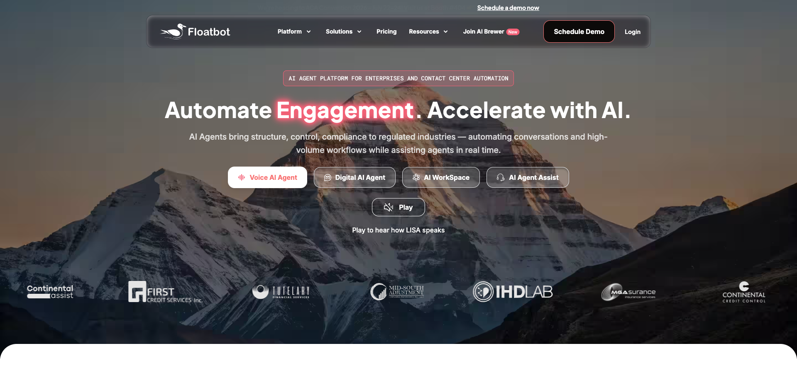
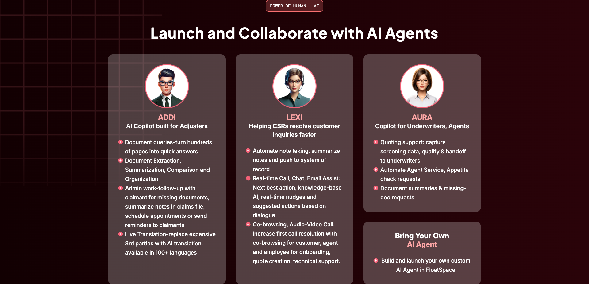
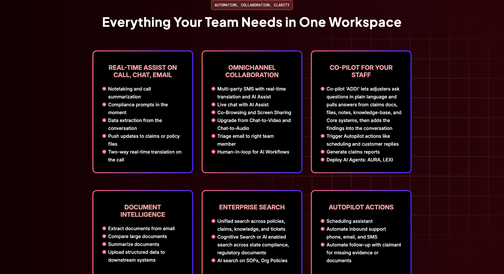
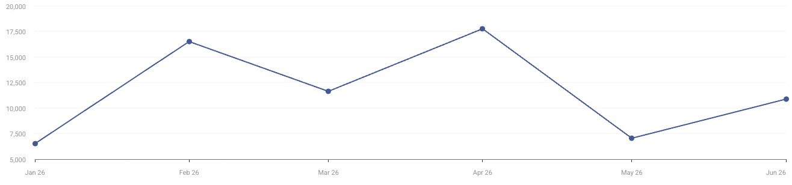

# Floatbot

> **一句话**：一家 2017 年起步的企业对话自动化公司，正在把多年积累的语音、客服、系统集成与合规交付能力，重组为面向保险等受监管行业的岗位化 AI 同事和 AI 工作空间。

## TL;DR

Floatbot 不是 2025 年才出现的“AI employee”创业公司。它先后经历了对话式 AI、无代码语音/聊天平台、生成式 AI 多 Agent 编排，再到 FloatSpace 垂直工作空间的演进。这个路径的重要性在于：它不是从拟人化头像或通用工作台出发，而是先进入银行、催收、保险等高约束工作流，积累系统集成、行业规则、语音能力和实施经验，再把这些能力包装成 ADDI、LEXI、AURA、LISA 等岗位化 AI 同事。[[source.floatbot.about]] [[source.floatbot.floatspace]]

最值得关注的并非官网宣称的自动化百分比，而是交付证据。Mountain Peak 的语音与聊天方案用了 16 周上线，官方案例直接写出开发、UAT 和上线后出现多次幻觉及大量流程/文案调整；Capital Recovery 也明确称 Floatbot 更像 build partner，客户自己必须投入工作。Floatbot 因而更接近“垂直平台 + FDE/实施服务”，而不是自助开通即产生完整劳动力替代。[[source.floatbot.case-mountain-peak]] [[source.floatbot.case-capital-recovery]]

增长侧则是另一条与 Moxt、Superset 不同的路径：依靠保险核心系统和理赔平台合作、行业会议、长期垂直 SEO 与企业销售，而不是 HN、Product Hunt 或开发者社区起量。2026 年上半年主域访问估算合计约 7.04 万，搜索占 50.6%、直接访问占 43.5%，印度占 87%；网站流量不大，但这不能直接否定其企业业务规模。[[traffic.similarweb.floatbot-2026-h1]]

## 它实际在做什么

Floatbot 当前并非单一产品，而是一组从外部交互延伸到内部执行的能力栈：

1. **客户侧 AI Agent**：电话、Chat、SMS、Email 的自动接待、身份核验、查询、支付、FNOL、催收与人工转接。
2. **Agent M**：2023 年推出的 Master Agent 框架，用于协调多个 LLM Agent、保持跨渠道上下文并调用 API。[[source.floatbot.x-agent-m-ph]]
3. **FloatSpace**：面向保险内部团队的 AI 工作空间，覆盖实时辅助、协作、文档处理、企业搜索与自动动作。
4. **FloatAgent / 工作流层**：把 AI Agent 与 human-in-the-loop 组合，连接理赔、保单和客户系统。该名称主要来自 Floatbot 与 Snapsheet 的联合叙述。[[source.floatbot.snapsheet-partnership]]

### 岗位化 AI 同事

- **LISA**：对外的语音/多渠道 Agent，常用于理赔报案、客服与催收。
- **ADDI**：服务理赔员，处理文档问答、抽取、对比、缺件追踪、预约和翻译。
- **LEXI**：服务 CSR，在电话、聊天、邮件中提供实时建议、笔记、下一步动作和协作。
- **AURA**：服务核保与代理人，支持询价筛选、承保偏好检查、资料摘要和缺件请求。

这套命名不是简单拟人化。每个 Agent 都对应岗位、信息源、系统动作和人工边界，说明 Floatbot 在把行业流程拆成可销售的数字岗位。[[source.floatbot.floatspace]]

### 工作空间能力

FloatSpace 把实时辅助、多人短信/聊天、屏幕共享、音视频、文档智能、企业搜索和自动跟进放在一起。其核心不是再做一个聊天框，而是把“员工与客户协作的界面”和“AI 执行动作的入口”合并。与 Helio、Raft、Moxt 的通用工作空间相比，它明显更垂直：对象是索赔文件、保单、合规规则、缺失材料和理赔/核保系统。[[concept.vertical-conversational-ai-to-agent-workspace]]

## 演进时间线

| 时间 | 节点 | 证据边界 |
|---|---|---|
| 2017–2019 | 从企业对话式 AI 起步，在印度/APAC 的银行、政府和 BFSI 场景积累 | 官方 About 与 NASSCOM 早期访谈 |
| 2020 | 发布统一无代码平台 Floatbot UNO | 官方路线图 |
| 2021 | 进入北美；报道时仍为自筹资金且盈利 | Times of India |
| 2022 | 建立美国总部；推出 Agent Assist、NEO、RAG Search；与 Socotra 打通保单系统 | 官方路线图、Socotra |
| 2023 | 推出 Agent M、VoiceGPT；进入 Guidewire/InsurTech NY 生态 | 官方路线图、InsurTech NY |
| 2025-05 | X 上公开介绍 FloatSpace；Snapsheet 宣布集成合作 | 官方 X、Snapsheet |
| 2025-10/11 | ITC Vegas 预览并于 11 月 10 日宣布 FloatSpace 全球可用 | 官方 X、发布稿 |

FloatSpace 存在“分阶段 launch”：5 月已有介绍，10 月展会预览，11 月才由官方新闻稿宣布正式面向全球保险机构可用。报告不把任何单一日期写成唯一诞生日。[[source.floatbot.x-floatspace-intro]] [[source.floatbot.floatspace-launch]]

## 团队与融资

[[person.jimmy-padia]] 是创始人兼 CEO。官方资料与 2021 年报道显示，他毕业于 VJTI，曾在 GE 从事企业 IT 项目，2010 年开始经营 IT 服务业务，2017 年创办 Floatbot。这个背景与产品路径高度一致：Floatbot 的强项更像复杂企业系统交付，而不是纯消费级产品增长。[[source.floatbot.linkedin-jimmy-padia]] [[source.floatbot.toi-2021-funding]]

团队规模存在口径冲突：LinkedIn 公司页显示 **11–50 人**，员工搜索约有 61 个自报关联结果；二者都不是精确在职人数，因此这里只记录“数十人规模”，不写成 61 人。[[source.floatbot.linkedin-company]]

融资方面，2021 年 Times of India 明确写 Floatbot 当时“自筹资金且盈利”，同时正在洽谈 500 万美元 A 轮。公开数据库把 InsurTech NY、NASSCOM DeepTech Club、AI Venture Labs、Venture Dock 等列为投资者，但目前能核验到的主要是孵化、加速器、展示或名录身份，尚未找到可靠的融资完成公告。因此：

- **没有建立投资边**；
- “计划融资 500 万美元”不等于已经融资；
- 在出现公司、投资方或可靠媒体确认前，融资状态保持未验证。[[source.floatbot.toi-2021-funding]] [[source.floatbot.insurtechny-accelerator]] [[source.floatbot.nasscom-profile]]

## GTM：生态集成、垂直 SEO 与实施销售

Floatbot 的 GTM 不是流量先行，而是“进入行业系统 + 交付结果 + 再扩展工作流”。

- **生态集成**：2022 年与 Socotra 打通保单数据读写；2025 年与 Snapsheet 通过 API 接入理赔与保单数据。[[source.floatbot.socotra-partnership]] [[source.floatbot.snapsheet-partnership]]
- **行业活动与加速器**：InsurTech NY、Guidewire Vanguard、ITC Vegas 等提供客户、合作方和可信度入口。
- **案例驱动销售**：官网围绕催收金额、电话量、理赔自动化和员工节省时间来表达 ROI。
- **垂直 SEO**：自然搜索流量占 50.6%，且约 89% 为非品牌词；主要词围绕 payment recovery calling agent、voice bot、insurance intake 等具体任务。
- **实施型交付**：客户案例暴露了 15–16 周部署、系统集成、规则配置、UAT、幻觉修复和持续迭代。

公开价格页仍主要描述 Voice/Chat 平台套餐：Lite 99/119 美元、Essential 1,999/2,499 美元、Growth 4,999/6,199 美元、Enterprise 询价；FloatSpace 和 Named/Concurrent Agent 则多为 Contact Sales。该页面混合了旧平台与新 Agent 产品，不能把旧套餐直接当成 FloatSpace 当前报价。[[source.floatbot.pricing]]

## 网站流量与增长信号

| 月份 | 主域访问估算 |
|---|---:|
| 2026-01 | 6,521 |
| 2026-02 | 16,518 |
| 2026-03 | 11,644 |
| 2026-04 | 17,770 |
| 2026-05 | 7,050 |
| 2026-06 | 10,882 |

六个月主域合计约 **70,386**。同一面板的“含子域汇总”卡显示 144,291，二者口径不同，不能混用。渠道结构为 Direct 43.50%、Organic Search 50.60%、Referral 2.86%、Organic Social 2.19%、GenAI 0.86%；印度占 87.00%，美国占 11.31%。Referral 中 Upwork 占比很高，可能混入招聘/外包访问。[[source.floatbot.similarweb-2026-h1]]

这组数据只能说明官网获客结构和地域信号，不能说明产品内使用量、ARR 或客户数。Floatbot 官网和 LinkedIn 分别出现“300+ 客户”和“200+ 玩家”的不同自述，也没有独立审计；报告不据此估算收入。

## 客户证据：结果与实施成本要一起看

### Mountain Peak

官方案例称方案在 16 周内部署，连接 JST 后端和 Payment IVR，2.5 个月处理 31 万美元以上支付、解决 300 多个查询。更关键的是，它列出“多次幻觉”和开发、UAT、上线后的流程/文案变更。这是一个比结果数字更有用的实施证据。[[source.floatbot.case-mountain-peak]]

### Capital Recovery

官方案例称两套语音 Agent 在 90 天内收取约 100 万美元、月度回款提升 2.6 倍且无需新增员工。客户证言同时强调：方案涉及 TCN、ACE、HIPAA、right-party contact、双资产组合规则和升级逻辑；Floatbot 与客户一起试错，客户也必须做好投入。这说明产品价值依赖行业配置与合作实施。[[source.floatbot.case-capital-recovery]]

### 合作方指标

Snapsheet 联合稿称可自动化至多 80% FNOL、降低 40% 成本、每月为理赔员节省 40+ 小时。Socotra 合作稿也给出销售、续保、成本和 CSAT 百分比。这些数字证明双方的联合销售叙事，但未见独立审计，应标记为合作营销口径而非已证实行业基准。[[source.floatbot.snapsheet-partnership]] [[source.floatbot.socotra-partnership]]

## 社区反馈与公开讨论

Floatbot 在 Reddit、HN、V2EX、LinuxDo、微信和小红书几乎没有可用的真实用户讨论：

- HN 只有 2017 年一次 1 分、0 评论的提交；
- 中文搜索大量命中 Floatboat、Nanobot 等近名噪声；
- Reddit 主要是自发宣传或聚合内容；唯一负面信号是一位用户声称漏洞报告两个月未获回应，未发现 Floatbot 回应。该投诉是单方 S4 证据，不能据此称公司或漏洞计划“诈骗”。[[source.floatbot.reddit-bugbounty]]

相比之下，官网案例、合作伙伴和 G2 搜索元数据更积极，但大多仍是供应商或平台选择后的样本。社区缺席意味着我们对产品的独立可用性、持续留存和部署失败率掌握不足。[[source.floatbot.community-scan-2026-07-15]]

## 关键判断

1. **Floatbot 是旧能力上移，而不是新概念横空出世。** 语音、对话、RAG、系统集成和垂直模板是底座，AI employee 是新的销售与产品组织方式。
2. **真正的壁垒候选是垂直交付闭环。** 保险/催收规则、系统读写、合规脚本、UAT 和客户共同迭代比 Agent 名字更难复制。
3. **它更像“产品化的 FDE”而非纯 SaaS。** 15–16 周实施与案例中的调参、幻觉修复说明人力交付仍然重要。
4. **网站流量低不等于业务小。** 企业销售与渠道合作可以在低官网访问下成立；流量只显示获客结构，不是营收替代指标。
5. **证据最薄弱的是融资、独立客户评价和新产品定价。** 这三项应作为后续更新触发器，而不是补猜。

## 风险与待验证

- FloatSpace 的独立付费客户数、活跃席位、留存率与当前价格未公开。
- 官网自动化、节省成本与回款数字大多来自供应商案例或联合营销，缺少审计。
- 合规声明需要证书或 trust center 进一步核验，不能只凭价格页一行文字确认。
- 公开融资状态仍不清楚；不得把 accelerator/incubator 直接建模为 investor。
- LinkedIn 人数口径冲突，不能作为精确团队规模。

## 证据索引

### S1 官方

- [官网](https://floatbot.ai/) · [[source.floatbot.homepage]]
- [About 与路线图](https://floatbot.ai/about-us) · [[source.floatbot.about]]
- [FloatSpace](https://floatbot.ai/floatspace) · [[source.floatbot.floatspace]]
- [FloatSpace 正式发布](https://floatbot.ai/news/floatbot-launches-floatspace) · [[source.floatbot.floatspace-launch]]
- [公开定价](https://floatbot.ai/pricing) · [[source.floatbot.pricing]]
- [Mountain Peak 案例](https://floatbot.ai/case-studies/mountain-peak-case-study) · [[source.floatbot.case-mountain-peak]]
- [Capital Recovery 案例](https://floatbot.ai/case-studies/capital-recovery-collections-case-study) · [[source.floatbot.case-capital-recovery]]
- [X：FloatSpace 介绍](https://x.com/floatbot/status/1919371126209188257) · [[source.floatbot.x-floatspace-intro]]
- [X：Agent M 上线 Product Hunt](https://x.com/floatbot/status/1733090637711388988) · [[source.floatbot.x-agent-m-ph]]

### S2 第三方强证据

- [Times of India：计划融资与自筹状态](https://timesofindia.indiatimes.com/city/ahmedabad/ai-based-chatbot-maker-to-raise-5m/articleshow/83088223.cms) · [[source.floatbot.toi-2021-funding]]
- [NASSCOM 早期访谈](https://community.nasscom.in/index.php/communities/emerging-tech/ai/in-the-spotlight-when-business-comes-to-life-how-floatbot-is-emerging-as-one-of-indias-big-players-in-conversational-ai.html) · [[source.floatbot.nasscom-profile]]
- [Snapsheet 合作公告](https://www.snapsheetclaims.com/post/snapsheet-and-floatbot-ai-partner-to-transform-claims-with-conversational-ai-agents) · [[source.floatbot.snapsheet-partnership]]
- [Socotra 合作公告](https://www.socotra.com/floatbot-partner-announcement/) · [[source.floatbot.socotra-partnership]]
- [InsurTech NY 2023 cohort](https://www.insurtechny.com/insurtech-ny-news-accelerator-cohort-pnp-partner-event/) · [[source.floatbot.insurtechny-accelerator]]
- [[source.floatbot.linkedin-company]] · [[source.floatbot.linkedin-jimmy-padia]]
- [[source.floatbot.similarweb-2026-h1]]

### S3/S4 弱证据与缺口

- [[source.floatbot.community-scan-2026-07-15]]
- [[source.floatbot.reddit-bugbounty]]

*最后更新：2026-07-15*
