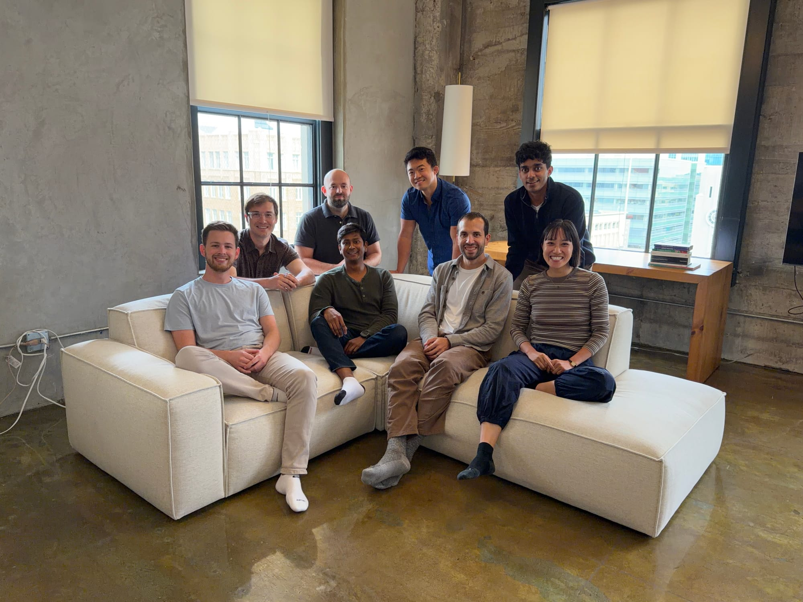
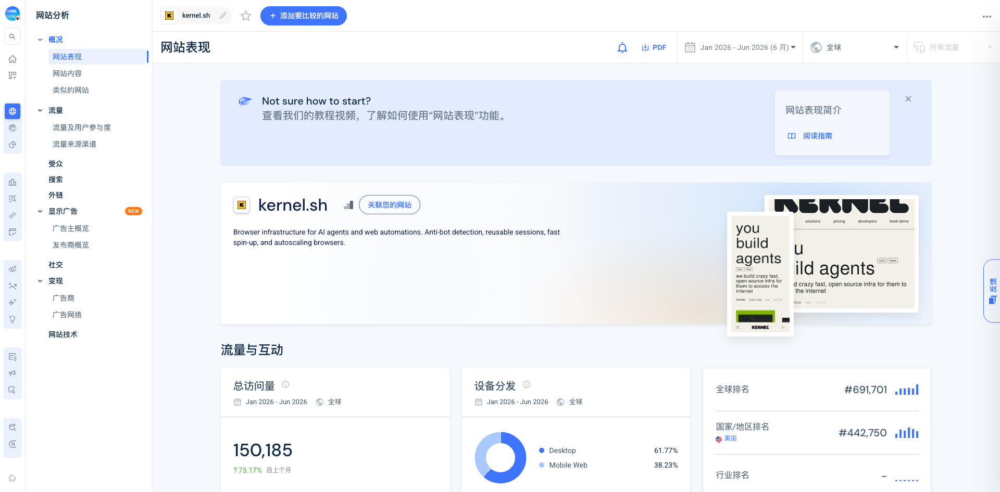

Kernel 是为 AI agents 提供云浏览器、认证会话、可观察性和计算机操作运行时的基础设施公司。它从“几十毫秒启动一个隔离浏览器”切入，正在向更难替代的层扩张：持久会话、Managed Auth、原生 computer controls、GPU、browser pools，以及让网站识别合法 agent 的身份与委托协议。

## TL;DR

Kernel 值得关注的不是单一的“20ms 浏览器冷启动”，而是它把浏览器执行、登录态、安全、反检测、模型评测和 agent 身份串成了一条产品演化路径。

- **切入口锋利**：2025 年 4 月先以开源的 Chromium-on-unikernel 技术项目在 Hacker News 试水，拿到 132 points / 46 comments；同年 8 月再由 YC 用视频做正式产品发布。
- **团队与问题高度匹配**：[[person.rafael-garcia]] 做过教育身份与安全基础设施；[[person.catherine-jue]] 在 Cash App 做过 Forward Deployed Engineering，也亲历过跨商户网站 QA 和文档平台问题。
- **采用信号强于官网流量**：官方称 3,000+ teams、2026 年已启动数千万浏览器、每天有数十万 agents 依赖其基础设施；Benny 单一案例披露约 88 万 sessions/月。相比之下，网站半年约 15 万 visits，说明 marketing-site traffic 不能代替 API 使用规模。
- **GTM 是开发者网络驱动**：YC、GitHub、技术文章、Luma 活动、投资人和合作伙伴贡献主要外部流量，没有明显 paid acquisition。它没有找到匹配的官方 Product Hunt launch。
- **战略上在争夺“可信 agent web”**：Kernel 与 Cloudflare/Vercel 推 Web Bot Auth，把竞争从“谁更会隐藏 bot”推向“网站能否识别用户授权的 agent”。这条线见 [[concept.sanctioned-agent-identity]]。
- **仍有边界**：融资仅披露 Seed + Series A 合计 $22M，没有收入或估值；大量规模和效果数字来自公司自述；本轮没有 API key，无法对真实成功率、延迟和稳定性做独立产品测试。

## 产品到底是什么

Kernel 不是一个替用户完成任务的终端 agent，而是给 agent 提供“能上网、能登录、能持续工作”的执行层。

### 1. Browser runtime

- 启动隔离的 Chromium 浏览器，并暴露 CDP、WebDriver 和 live view。
- 支持 Playwright、Puppeteer、Browser Use 等客户端。
- 文档称浏览器在 30ms 内启动；早期开源实现声称 unikernel 冷启动约 10-20ms。
- 空闲 5 秒后可进入 standby，保留状态但停止 usage billing；需要时恢复。

### 2. Stateful execution

- browser profiles、pause/resume、snapshot 和 pools 让长任务不必每次从零登录。
- 可以把 agent 代码与浏览器放进同一 unikernel，减少外部往返并保存完整运行状态。
- live view、replay 和 observability 让开发者能看见 agent 为什么失败，而不是只得到超时错误。

### 3. Managed Auth

- 管理凭据、SSO/OAuth、TOTP、短信/邮件/push OTP 和会话状态。
- 官方称凭据加密保存，不发送给 LLM。
- 这层解决的不是“找到登录页”这么简单，而是把 agent 能否长期代表用户行动变成一个独立基础设施能力。

### 4. Computer Use 与反检测

- 默认 headful 浏览器、stealth、代理、profiles、Patchright、GPU 和 native computer controls。
- 原生鼠标操作使用 Bezier 曲线，目标是降低 Playwright 式机械交互的指纹。
- 对 VLM/CUA 来说，Kernel 既能做生产运行时，也能成为大规模 benchmark 和训练环境。[[source.blog.kernel-anthropic-2026-02-17]] 披露 Anthropic 用它在 254 个站点上测试 Sonnet 4.6 找登录页的能力，命中率为 79.1%。

### 5. Agent identity

2026 年，Kernel 与 Cloudflare 推进 IETF Web Bot Auth：agent 用 HTTP message signatures 表明身份，网站可以识别、审核或预先允许合法 agent。它与 Managed Auth 是两件事：前者解决网站识别 agent，后者解决 agent 代表用户登录。

如果这套方向成立，Kernel 的产品边界会从“云浏览器供应商”上移为 agent 与网站之间的身份、权限和执行基础设施。

## 价格与经济性

截至 2026-07-13，官方 pricing 文档显示：

| 资源 | 秒计费 | 约合每小时 |
|---|---:|---:|
| Headless | $0.0000166667 | $0.06 |
| Headful | $0.0001333336 | $0.48 |
| Headful + GPU | $0.0008000016 | $2.88 |

套餐为 Developer（免费并含 $5 credits / 5 concurrent）、Hobbyist（$30/月 / 10 concurrent）、Startup（$200/月 / 150 concurrent）和 Enterprise。Managed Auth 在付费计划不额外收 connection fee；官方举例称 100 个 auth connections 的典型 usage 少于 $5/月。

这里真正有差异的不是单价，而是 standby、按秒计费、会话复用与托管认证能否减少重试、代理和自建基础设施成本。Benny 官方案例称迁移后错误减少 4.3 倍，并合计节省超过 $72K/年，但它仍是供应商发布的客户故事，需要作为 S1 官方口径而非独立评测理解。

## 发展时间线

| 时间 | 节点 | 说明 |
|---|---|---|
| 2025-02 | 两位创始人开始创业 | Catherine 公开写到 2025 年 2 月离开 Cash App。 |
| 2025-04-16 | Show HN: Chromium on a Unikernel | 132 points、46 comments；先卖技术问题和开源 artifact，而不是泛泛产品介绍。 |
| 2025-05-29 | Founder introduction | 解释 unikernel、private beta 和 browser infrastructure thesis。 |
| 2025-08-13 | YC 正式 launch | YC X 账号发布约 154 秒视频，287 likes、25 reposts。 |
| 2025-10-09 | 融资公开 | Seed + Series A 合计 $22M，Accel 领投。 |
| 2026-02 | Anthropic benchmark | 用 254 个真实站点评测 Sonnet 4.6 computer use。 |
| 2026-03 | Benny 客户案例 | 约 880K sessions/月、4.3x fewer errors、$72K+ savings，均为官方案例口径。 |
| 2026-04 | Cloudflare Web Bot Auth | 从反检测扩展到受认可 agent 身份。 |
| 2026-06 | ISO 27001 | 官方称零不符合项，并支持 HIPAA / BAA。 |
| 2026-07 | 战略愿景更新 | 16 个月从 2 人增至 20 人；官方称 2026 年已启动数千万浏览器。 |

第一次 HN 的成功值得特别记录。同一个产品在 2025 年 7 月还有一条泛化的“Kernel Browser Infrastructure”提交，仅 1 point、0 comments。技术 artifact 的具体问题、数据和开源代码，比抽象的产品宣传更能在开发者社区形成讨论。

## 团队

融资稿图片标注的早期 8 人团队从左至右为 Mason、Danny、Sayan、Steven、Hiro、Raf、Phani、Catherine。2026-07-10 官方文章称团队已从 2 人增长到 20 人，因此 YC 页面“6 employees”和 LinkedIn“2-10 employees”都已过时。

### 创始人

- [[person.catherine-jue]]：联合创始人兼 CEO。曾创办 Sway Finance（YC S16），后在 Cash App 负责 Forward Deployed Engineering 与文档平台。她看到的原始问题是 QA 和自动化要跨越大量第三方商户网站，而这些界面没有稳定 API。
- [[person.rafael-garcia]]：联合创始人兼 CTO。曾创办 Clever（YC S12），该公司在 2021 年以约 $500M 退出。其身份、安全与大规模基础设施背景，直接对应 Kernel 的 Managed Auth 和 agent identity 方向。

公开资料还能确认 Danny Prevoznik（DevRel）、Anna X. Wang（Product & Partnerships）、Erin Nielsen（Chief of Staff）、Aaron Lee（Customer Engineering）、Mason Williams、Fumihiro Tamada 与 Phani Bharadwaj Jarugumilli 等成员。早期就配置 DevRel、partnerships 和 customer engineering，说明 GTM 与产品发现是同一条工作流，而不是等产品成熟后再补销售。

## 融资与资源网络

2025-10-09，Kernel 宣布 Seed 与 Series A 合计融资 **$22M**，由 [[investor.accel]] 领投；[[investor.y-combinator]]、[[investor.cintrifuse-capital]]、[[investor.vercel-ventures]]、[[investor.refinery-ventures]]、[[investor.sv-angel]] 参与。

天使投资人包括 [[investor.paul-graham]]、[[investor.david-cramer]]（Sentry）、[[investor.solomon-hykes]]（Docker）、[[investor.zach-sims]]（Codecademy）和 [[investor.charlie-marsh]]（Astral）。这不是普通的名字列表：YC、Vercel、Cloudflare、Anthropic、Docker/Sentry/Astral 等关系共同覆盖了 agent infra 的分发、开发者信任和技术标准网络。

公开材料没有披露 Seed 与 Series A 的分别金额，也没有披露收入、最新估值或轮后股权结构。本卷宗不做推算。

## 规模：网站流量与真实使用要拆开

[[traffic.similarweb.kernel-2026-01-2026-06]] 的第三方估算显示：

- 2026 年 1-6 月约 **150,185 visits**；页面显示月访问约 **16,659**、月独立访客约 **7,709**。
- 访问时长 1:56、2.66 pages/visit、bounce 56.78%。
- 美国占 78.71%，印度 9.70%，英国 4.17%。
- 渠道：Direct 56.32%、Organic Social 19.47%、Organic Search 15.73%、Referral 7.49%、GenAI 0.47%，没有可见的 paid search/social。
- Referral 主要来自 YC 59.83%、Luma 24.23%、GitHub 5.18%、Accel 3.96%。这与开发者网络、活动和投资人放大的 GTM 判断一致。
- 同一比较视图中，Kernel 约 99,951，Browserbase 约 969,238，Browserless 约 609,568。该区间数据是第三方估算，适合看量级，不适合当财务或使用量。

网站流量看起来只在 Browserbase 的约 1/6.5、Browserless 的约 1/4，但官方采用指标明显更强：3,000+ teams、每天数十万 agents、2026 年数千万 browsers，以及 Benny 单客户 88 万 sessions/月。合理解释是 Kernel 的客户主要通过 API/dashboard 使用，官网 visits 只覆盖获客与品牌接触；不能用官网流量直接否定后端规模。

## GitHub 与开发者信号

截至 2026-07-13，Kernel GitHub 组织有约 70 个 public repos。主仓库 `kernel-images` 有 981 stars、71 forks、46 open issues，Apache-2.0，且仍在活跃更新。其他公开项目包括 `hypeman`、MCP server、CLI、SDK 和 templates。

公开 issues 比星数更有产品信息：用户在讨论 live view clipboard/autofill/audio、多语言字体、WebRTC 断连、MCP 安装和 auth issuer。这说明产品已进入真实集成阶段，但也显示浏览器媒体、远程交互和认证边缘情况仍是持续成本。

本轮没有拿到可靠的历史 star curve，只能确认 HN 后创始人称获得“hundreds of stars”，以及当前 981 stars；不补画虚假的增长曲线。

## 社区与传播

- Hacker News 有一个高质量技术讨论，但泛产品提交反响很弱。
- X 上 YC launch 和融资 thread 有明显传播；公司账号截至采集时约 3,074 followers，两位创始人各约 2,000 followers。
- 没有找到匹配 Kernel 官方产品的 Product Hunt listing，搜索结果主要是同名无关产品。只能写“本轮未找到”，不能推断它从未发布过。
- Reddit 原生搜索修复后复跑成功：`onkernel browser` 为 0 条，其余 Kernel 相关查询返回的都是 Linux/kernel 或泛 AI 基础设施同名噪声，没有取得可引用的产品讨论。它只能说明本轮未命中，不能证明 Reddit 绝对无人讨论。
- 微信、V2EX、Linux.do、即刻和小红书的聚焦搜索没有形成可引用的 Kernel 用户反馈；中文内容更多是在 browser-agent 工具清单中顺带提及。当前中文品牌心智偏弱，但这不是产品使用量证据。

## 竞品地图

| 类型 | 公司/产品 | 与 Kernel 的关系 |
|---|---|---|
| 直接竞品 | [[company.browserbase]] | 云浏览器、sessions、observability、identity、Functions/Fetch/Director；开发者心智和公开流量更强。 |
| 直接/相邻 | [[company.hyperbrowser]] | 云浏览器 + web data + agent runtime + sandbox，覆盖面更宽。 |
| 直接竞品 | [[company.browserless]] | 成熟 browser automation / scraping infra，支持 self-hosting，历史更长。 |
| 直接竞品 | Steel、Anchor Browser | 都提供 browser API、profiles/session 等能力，本轮未做同等深度验证。 |
| 上游框架/agent 层 | Browser Use、Magnitude、Skyvern | 会调用浏览器基础设施，但并不等同于云浏览器执行层。 |

Kernel 的差异化组合是：底层启动/暂停架构 + Managed Auth + native controls/GPU + browser pools + sanctioned-agent identity。单独的快速启动很容易被追平，组合是否能形成复利，取决于认证网络、站点合作和高价值客户流程是否持续沉淀。

## 关键判断

1. **Kernel 正从资源供应商升级为 agent-web 协议层。** 浏览器实例是切入口，身份、委托、认证和网站合作才可能成为长期控制点。
2. **开源技术 artifact 是最有效的首次传播。** 它让开发者先讨论真实约束，再接受产品；泛化产品帖没有同样效果。
3. **客户场景集中在“没有 API、必须登录、长期变化”的高价值流程。** 政府福利商户、医疗 EHR、保险监管与遗留系统，比普通网页抓取更能承受 headful/GPU/Auth 的成本。
4. **团队经历解释了路线。** Cash App 的 FDE/商户网站经验提供场景，Clever 的身份基础设施经验提供解法。
5. **规模评估必须双轨。** 网站 traffic 衡量外部注意力；API sessions、客户案例、并发、团队增长和 GitHub issues 才能补足产品使用。

## 风险与待验证

- 客户数、agents/day、browser launches 和节省金额大多来自公司材料，缺独立审计。
- 没有公开收入、留存、毛利率、估值和每客户用量分布。
- headful/GPU/代理与 8GB 活跃镜像带来成本压力；定价优势要结合 workload 验证。
- “反检测”与“受认可身份”同时存在张力：前者适合当前网站，后者依赖标准和站点采用。
- 快速启动、profiles、replay 等能力会快速同质化；Managed Auth 与身份网络能否成为真正壁垒仍待观察。
- 本轮未获得 `KERNEL_API_KEY`，不能独立验证延迟、成功率、session resume、bot detection 或 auth UX。

## 证据索引

### S1 官方/一手

- [Kernel 官网](https://www.kernel.sh/) · [[source.website.kernel-home-2026-07-13]]
- [YC company profile](https://www.ycombinator.com/companies/kernel) · [[source.yc.kernel]]
- [Introducing Kernel](https://www.catherinejue.com/kernel) · [[source.blog.kernel-founder-intro-2025-05-29]]
- [融资公告](https://www.kernel.sh/blog/series-a-announcement) · [[source.blog.kernel-series-a-2025-10-09]]
- [Pricing](https://www.kernel.sh/docs/info/pricing) · [[source.docs.kernel-pricing-2026-07-13]]
- [Anthropic benchmark](https://www.kernel.sh/blog/anthropic) · [[source.blog.kernel-anthropic-2026-02-17]]
- [Benny case](https://www.kernel.sh/customers/benny) · [[source.customer.kernel-benny-2026-03-05]]
- [Felicity case](https://www.kernel.sh/customers/felicity) · [[source.customer.kernel-felicity-2026]]
- [Effective AI case](https://www.kernel.sh/customers/effective) · [[source.customer.kernel-effective-2026]]
- [Cloudflare Web Bot Auth](https://www.kernel.sh/blog/cloudflare) · [[source.blog.kernel-cloudflare-2026-04-21]]
- [ISO 27001](https://www.kernel.sh/blog/iso-27001) · [[source.blog.kernel-iso-2026-06-25]]
- [2026 vision](https://www.kernel.sh/blog/trillionth-user-vision) · [[source.blog.kernel-vision-2026-07-10]]

### S2 第三方强证据/平台数据

- [Accel investment note](https://www.accel.com/news/our-investment-in-kernel-the-best-browser-infrastructure-for-agents) · [[source.accel.kernel-investment-2025-10-09]]
- [GitHub kernel-images](https://github.com/kernel/kernel-images) · [[source.github.kernel-images-2026-07-13]]
- [LinkedIn company](https://www.linkedin.com/company/trykernel/) · [[source.linkedin.kernel-company-2026-07-13]]
- [Similarweb domain page](https://www.similarweb.com/website/kernel.sh/) · [[source.similarweb.kernel-2026-01-2026-06]]

### S3/S4 社区与待核验

- [Show HN](https://news.ycombinator.com/item?id=43705144) · [[source.hn.kernel-chromium-unikernel-2025-04-16]]
- [YC X launch](https://x.com/ycombinator/status/1955660623821390089) · [[source.x.kernel-yc-launch-2025-08-13]]
- [[source.community.kernel-search-2026-07-13]]

研究判断单独见 [[note.kernel-product-takeaway-2026-07-13]]，本轮过程与工具问题见 [[note.kernel-research-run-2026-07-13]]。
