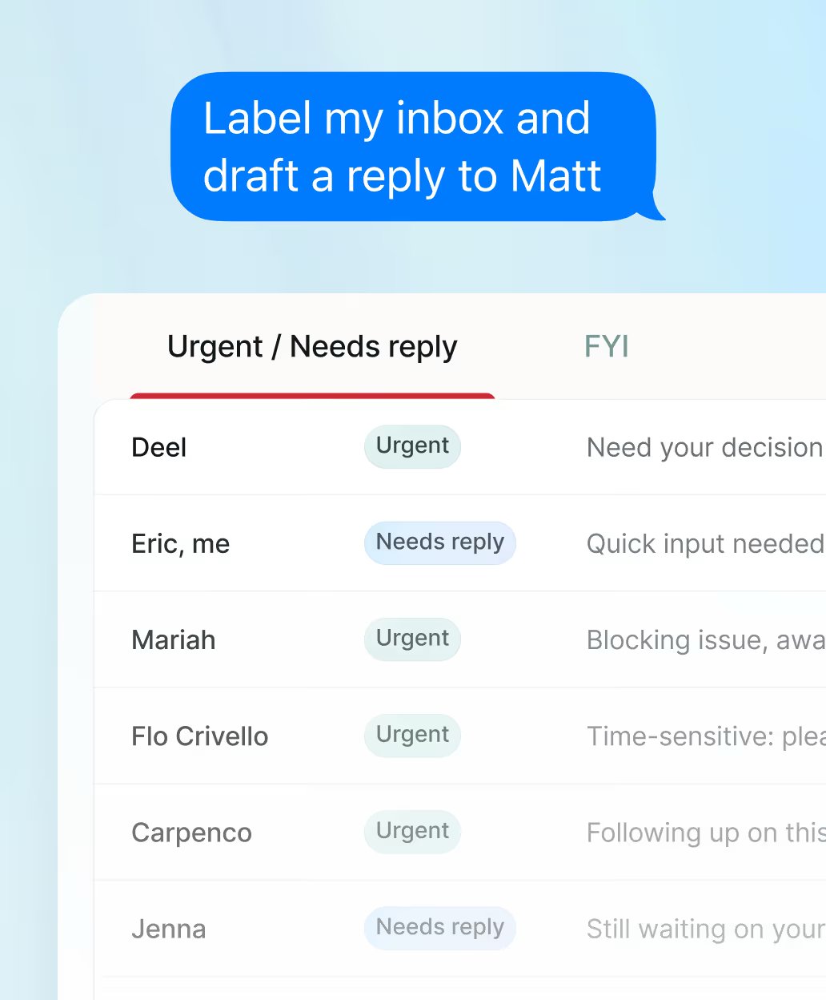
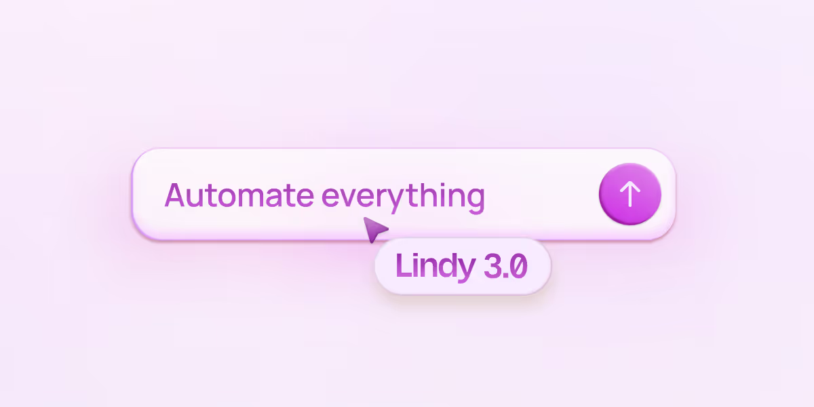
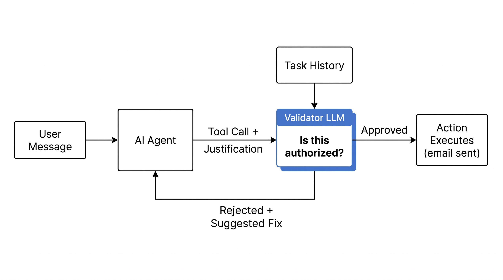
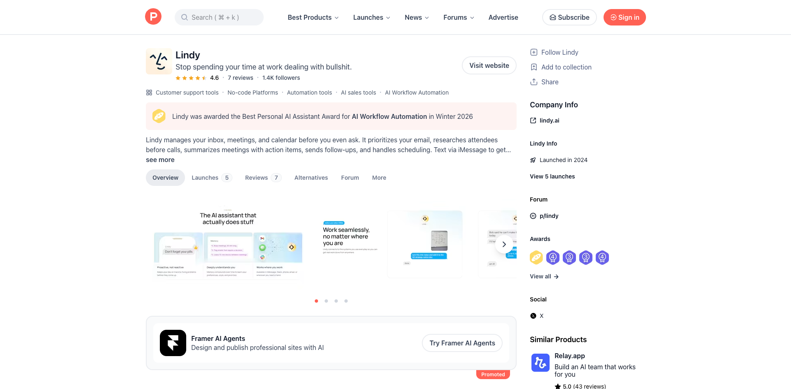
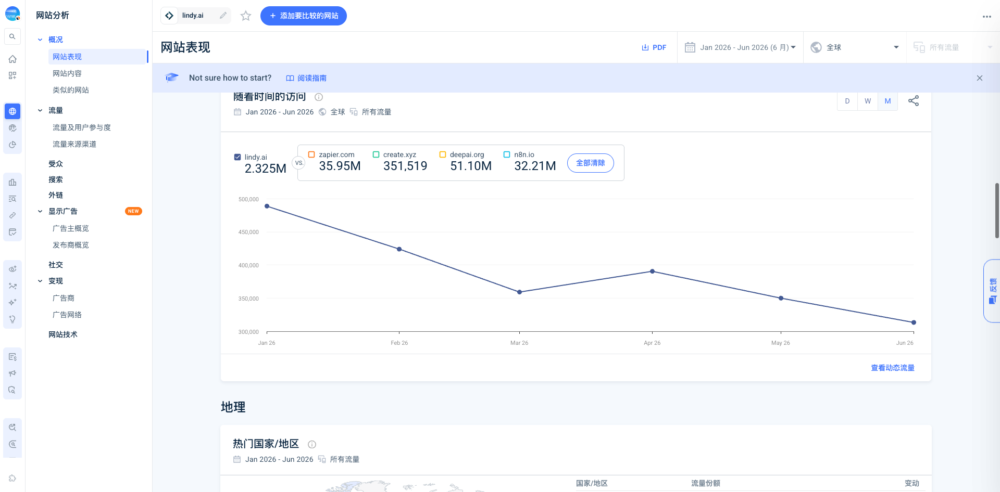

# Lindy

> 调研时间：2026-07-15。本文把官方产品资料、Teamflow 资本史、供应商案例、第三方流量与社区小样本分开。Lindy Web App 需要登录，本轮未创建账号，因此没有把官网演示当作真实产品体验。

## TL;DR

**Lindy 不是从 Agent Builder“退回”日历助手，而是把个人执行助理做成横向 Agent 平台的默认发行版。** 当前前台产品通过 inbox、会议、日历、iMessage/SMS 承接高频委托；底层仍保留自定义 Agent、触发器、数千项集成、Computer Use、记忆、Evals、HITL、Observability、版本历史和团队治理。[[source.lindy.homepage]] [[source.lindy.docs-agent-builder]]

它的产品演化不是直线：2023 年先发布个人 AI Assistant，随后转向“创建 AI Employees”；2025 年 Lindy 3.0 强化 Builder、Autopilot 和 Team Accounts，年底补企业能力；2026 年又以 Lindy Assistant 重新包装默认体验。**这更像 platform-first 到 assistant-first 的获客与激活调整，而不是放弃平台。** [[source.lindy.launch-2023-assistant]] [[source.lindy.launch-2023-ai-employees]] [[source.lindy.launch-2025-3-0]] [[source.lindy.assistant-launch-2026]]

公司资本史必须单独校正：Lindy 是 [[company.teamflow]] 在 2023 年 1 月启动的完整转向。公开的 5000 万美元累计融资主要来自 Teamflow 在 2021 年完成的 Seed、Series A 和 Series B，不能写成 Lindy 产品发布后新融了 5000 万美元。[[source.teamflow.series-a]] [[source.teamflow.series-b]]

最值得学习的不是“能接很多工具”，而是它已经碰到长期 Agent 的真实工程问题：外部副作用授权、记忆污染、运行观测、离线评测、模型迁移和成本控制。Lindy 为发邮件、建会议等动作增加独立 Validator，并用任务历史和用户授权判断是否放行，形成 [[concept.agent-side-effect-validator]]。[[source.lindy.validator-2026]]

## 当前产品：助手入口，平台底座

### 默认体验是成品执行助理

当前官网首页定位为 “The Ultimate AI Executive Assistant”。它重点处理：

- inbox 分类、提醒和邮件草稿；
- 会前研究、会议记录、行动项和跟进；
- 日程安排、冲突处理和 recurring task；
- 通过 iMessage/SMS 接收临时委托；
- 在用户授权后调用常用办公系统。

[[source.lindy.homepage]] [[source.lindy.docs-imessage]]

这与空白工作流画布不同。用户不需要先理解 trigger、action 和 connector，而是先把“整理邮箱”“准备会议”“安排时间”交出去。消息入口还降低了上下文切换：用户在会议间隙也能继续委托，Lindy 则通过邮箱、日历、会议和长期记忆积累个人上下文。

这构成 [[concept.packaged-assistant-on-agent-platform]]：先卖一个有明确日常工作面的助理，再让复杂需求落到底层平台。

### Builder 并没有消失

官方文档仍完整描述 Custom Agents / Workflows：Trigger 唤醒流程，Agent Step 做判断和工具使用，Action 执行确定性操作，Condition 分支，Loop 批量处理，Knowledge Base 和 Memory 提供上下文。[[source.lindy.docs-agent-builder]]

这意味着 Lindy 实际有两种产品表面：

| 表面 | 用户入口 | 价值 | 主要摩擦 |
|---|---|---|---|
| Lindy Assistant | inbox、calendar、meeting、iMessage | 快速获得一个能工作的成品助理 | 需要授权高价值个人数据；产品必须持续可信 |
| Custom Agents | Builder、trigger、connector、Computer Use | 编排更复杂、跨系统、可复用的业务流程 | 边界条件、调试、credit、connector 深度和维护成本 |

双层结构扩大市场，也带来定位复杂度：用户看到的是“个人助理”，企业买家还需要理解平台、团队、权限和运行治理。

### Computer Use 补 API 缺口

Computer Use 可以在持久或无痕浏览器中访问网站、填写表单、保存 session/cache/file，并可配置专属 Computer。官方同时提醒：网站可能检测自动化；循环执行时应降低并发；持久 session 在最后一次动作后保存 30 天。[[source.lindy.docs-computer-use]]

因此它不是万能 connector。它让 Agent 穿过没有 API 的页面，但也把验证码、页面漂移、凭据隔离、session 生命周期、重试和证据留存变成产品责任。

## 演化时间线：从 Teamflow 到助手发行版

| 时间 | 节点 | 产品含义 |
|---|---|---|
| 2020–2021 | Teamflow 虚拟办公室获得 Seed、A、B 轮融资 | 建立团队与资本基础，但需求受远程办公周期影响 |
| 2023-01 | Flo 决定完整转向 Lindy | 不是新公司从零启动，而是旧团队/资本重新下注 |
| 2023-03-22 | 发布个人 AI Assistant | 邮件、日历、旅行、总结等个人工作入口 |
| 2023-11-05 | 宣布创建 AI Employees | 从单助理扩到团队与触发式 Agent |
| 2024-02-15/16 | Show HN 与 Product Hunt 首发 | 对外强化 no-code AI employee / connector 平台叙事 |
| 2025-08-04 | Lindy 3.0 | Agent Builder、Autopilot cloud computer、Team Accounts |
| 2025-11-20 | Enterprise | SSO、SCIM、audit logs、app permission、集中管理 |
| 2026-02-10/12 | Lindy Assistant 发布并登 Product Hunt | 重新用 inbox/calendar/iMessage 定义默认入口 |
| 2026-04-28 | Validator 公开 | 开始把授权和副作用安全做成运行层机制 |
| 2026-06-24 | 大部分 managed traffic 迁移 DeepSeek | 用评测与灰度控制模型成本，而不是锁死单一模型 |

[[source.indiehackers.lindy-pivot-2025]] [[source.lindy.enterprise-2025]] [[source.lindy.deepseek-migration-2026]]

这条时间线说明 Lindy 一直在找横向平台的最佳“第一屏”。AI employee 是宏大类别语言，Builder 是能力面，Executive Assistant 才是当前具体购买和使用入口。

## 可靠性：长期 Agent 的真正分水岭

### 外部副作用不能只靠主 Agent prompt

Lindy 在内部测试中曾让 Agent 向真实外部联系人发出约 12 个非预期日历邀请。团队的结论是：只加 prompt 不够；每次动作都人工确认又会破坏体验。于是他们给外部副作用动作增加独立 Validator：

1. 主 Agent 提交 tool call，并说明为什么动作得到授权；
2. Validator 读取真实 task history 和 user memory；
3. 外部来信者不能替用户授权；
4. 未授权动作被拒绝，并返回修正建议；
5. 用户直接回复或 SMS 等特定路径有豁免。

官方用 60 个测试样本、3 种 prompt、3 种模型规模，每次变更共跑 540 次；危险动作要求零容忍 false positive，一般类别以 75% accuracy、最多 25% false positive 为门槛。[[source.lindy.validator-2026]]

这是非常具体的产品学习，但不能扩大成“Agent 安全已经解决”。Validator 本身仍是 LLM，豁免路径、个性化授权、长期行为漂移和新型攻击仍需继续验证。

### Evals、Memory、Observability 和 HITL 已形成最小闭环

- **Evals**：当前用户文档只支持 offline eval，可用 LLM-as-judge 和模拟输入测试改动；运行会消耗 credits。[[source.lindy.docs-evals]]
- **Memory**：任务内上下文与持久 memory 分离，可自动积累，也可增删改；官方明确提醒累积记忆可能让行为退化，需要定期清理冲突和过期内容。[[source.lindy.docs-memory]]
- **Observability**：Agent Task Change 监听运行状态，Get Task Details 返回 block-level input/output、耗时和错误。[[source.lindy.docs-observability]]
- **HITL**：副作用动作确认、条件告警和 draft mode 让人类在高风险节点介入。[[source.lindy.docs-hitl]]
- **Version History**：恢复旧版本不会覆盖历史，而是保存成新的版本。

这些能力让 Lindy 同时接近 [[concept.ai-employee-operating-system]] 与 [[concept.agent-lifecycle-control-plane]]。不过公开资料仍缺线上成功率、人工接管率、恢复时间、误操作率和长期 memory quality。

### 模型迁移体现了运行层，而非模型品牌

2026 年 6 月，Lindy 称已把大部分 managed-agent 流量从 Claude 迁到 Atlas Cloud 上的 DeepSeek v4 Flash，部分路径仍保留 Sonnet；公司称迁移部分推理成本下降约 90%。团队先做 offline eval，再小流量 live rollout，并观察多周 retention。Kimi K2.6 虽通过离线评测，却在小流量实测中失败。[[source.lindy.deepseek-migration-2026]]

这里有一个重要边界：客户产品文档目前只写 offline eval；博客中的 online eval / retention 属于 Lindy 内部 managed-assistant 质量体系，不能直接写成客户可用功能。

## 定价与商业模型

当前公开月付价格：

| 方案 | 价格 | 主要差异 |
|---|---:|---|
| Plus | $49.99/月 | 标准 usage、2 个 inbox、iMessage/SMS、邮件草稿、会议、100+ integrations |
| Pro | $99.99/月 | 3 倍 usage、3 个 inbox、Computer Use、模型选择、live onboarding |
| Max | $199.99/月 | 7 倍 usage、5 个 inbox |
| Enterprise | 定制 | shared usage、支持与 onboarding、HIPAA/BAA、SSO/SCIM、company context、audit logs |

[[source.lindy.pricing]]

定价页提供 7 天试用，并宣称 60 秒完成设置。首页曾出现与定价页不同的 Pro 价格，这可能是页面或实验口径差异，本文以专门 pricing page 为当前口径。

旧的 Custom Workflows 仍使用 credits：基本模型任务约 1–3 credits，大模型约 10 credits，credits 不结转，耗尽后 workflow 暂停。团队账户集中结算，但成员仍各自使用 Plus/Pro/Max。**这说明个人助理和 legacy workflow 的计量模型尚未完全统一。**

模型成本快速下降有利于固定价套餐，但 Computer Use、长上下文、重试和高级模型仍可能扩大成本波动。DeepSeek 迁移正是在修这一层 unit economics。

## 客户采用：有生产信号，独立证据仍弱

Lindy 官网称被 400K+ professionals 使用，但没有公开 active、paid、team 或 task volume 的定义。当前较具体的案例均由 Lindy 自己发布：

- **Rhumbix**：供应商案例称月省 2.5 万美元、每用户约 5 分钟设置、数天覆盖销售团队，并称 80% GTM 工作由 AI 驱动；
- **Ankor**：首周建 10 个 Agent、活跃 20–30 个，标题称 5x ROI；
- **Truemed**：称自动化 36% support volume、单 ticket 成本从 1 美元降到 0.33 美元；
- **Interlaced**：称每周节省 5+ 小时，销售团队自己完成构建，但有 Lindy onboarding。

[[source.lindy.case-rhumbix]] [[source.lindy.case-ankor]] [[source.lindy.case-truemed]]

这些数字能证明供应商愿意实名公开客户故事，不能等同独立审计。当前没有找到客户自己发布的详细 ROI、续约、长期失败率或任务量。最稳妥的判断是：Lindy 已进入真实团队工作流，但公开材料不足以估算 ARR、留存和净收益。

## 团队与资本：转向能力比“新融资”更重要

### Flo Crivello

[[person.flo-crivello]] 是目前唯一核实的创始人兼 CEO。个人资料显示，他此前创办 Teamflow，更早在 Uber 从事产品工作。当前 X 约 4.9 万 followers，LinkedIn 约 2.2 万 followers，是公司的主要外部叙事节点。[[source.linkedin.flo-crivello]] [[source.x.flo-crivello-profile-2026]]

LinkedIn 公司页给出的公司规模区间为 11–50 人；employees 搜索当前约 56 个关联 profile。两种口径不能合并成精确 headcount，只能判断团队仍属几十人规模。[[source.linkedin.lindy-company]]

### 融资属于同一公司延续

Teamflow 的公开资本节点为：

- 390 万美元 Seed，Menlo Ventures 领投；
- 1100 万美元 Series A，Battery Ventures 领投，Menlo、SV Angel 等参与；
- 3500 万美元 Series B，Coatue 领投，Menlo 与 Battery 参与；
- 2021 年累计融资 5000 万美元。

[[source.teamflow.series-a]] [[source.teamflow.series-b]]

Menlo 与 Battery 的当前 portfolio 都用 Lindy 名称展示投资，同时分别标注 2020/2021 的合作或投资时间，这正是品牌和产品转向后公司连续性的证据。[[source.menlo.lindy-portfolio]] [[source.battery.lindy-portfolio]]

因此本文把投资边建在 [[company.teamflow]]，由 Lindy 正文链接历史主体；没有虚构 Lindy 在 2023 年后完成新轮次，也没有给未披露的当前估值。

## 增长与 GTM

### Product Hunt 是反复使用的发布放大器

Lindy 在 Product Hunt 上不是一次性首发，而是连续发布五个包装：

| 时间 | Launch | 结果 |
|---|---|---|
| 2024-02-16 | Lindy | 日榜 #4，当前约 409 points |
| 2024-12-10 | Lindy Phone Calls | 约 27–28 points |
| 2025-08-30 | Lindy Build | 日榜 #3，约 280–281 points |
| 2025-10-27 | AI CMO | 日榜 #3，约 325 points |
| 2026-02-12 | Lindy Assistant | 日榜 #4，约 308 points |

产品页当前为 4.6/5、7 条 review、约 1.4K followers。[[source.producthunt.lindy]]

这是一种“能力节点重新包装并再 launch”的 GTM：Phone Calls、Build、AI CMO、Assistant 各自拥有更具体的 Elevator Pitch。它持续拿到 #3/#4，但没有 #1；PH 是放大器，不足以证明持续留存。

### HN 没有形成增长

2023 年个人助理帖只有 5 points / 2 comments；2024 年 Show HN 只有 3 points / 1 comment。[[source.hn.lindy-2023]] [[source.hn.lindy-2024-show]]

这与开发者工具的典型 HN 起量路径不同。Lindy 的产品需要看到操作过程，视频和可视 demo 比纯文字更重要；第三方 social traffic 中 YouTube 也占主要份额。

### SEO、竞品词与 Assistant 定位相互印证

2026 年 6 月估算流量中 Organic Search 占 55.95%，且搜索流量约 54% 是 non-brand。自然非品牌词偏 “best ai / ai tools / ai platforms”；付费非品牌词则集中在 “superhuman / superhuman email / fyxer / fyxer ai”。[[source.similarweb.lindy-2026-h1]]

这比官网口号更能说明当前获客对象：Lindy 正在争夺 inbox / executive assistant 用户，而不是只和 n8n、Zapier 比 workflow builder。博客大量 comparison、tools、review 内容也符合 SEO 驱动。

集成广度则部分来自供应链。Pipedream 称 Lindy 两年投入超过 100 万美元自建约 250 个 integrations，之后通过 Pipedream Connect 快速获得 2500 integrations / 7000+ actions。[[source.pipedream.lindy-integrations-2025]]

不同年份和页面又出现 100+、数百、1600+、2500、3000+、6000+，这些很可能混合了 app、action、connector 和供应商口径。不能把最大数字当稳定能力；应继续核每个关键系统的 read/write depth、OAuth scope 和失败处理。

## 网站流量：Assistant 发布后尚未看到反转

第三方估算月度 visits：

| 月份 | Visits |
|---|---:|
| 2026-01 | 488,816 |
| 2026-02 | 423,878 |
| 2026-03 | 359,152 |
| 2026-04 | 390,488 |
| 2026-05 | 350,019 |
| 2026-06 | 313,362 |

月线合计约 232.6 万，月均 38.8 万；同一页面顶卡又显示 388.8 万 total visits，口径冲突未强行解释。6 月相对 1 月下降约 35.9%，2 月 Assistant/PH launch 后只有 4 月短暂回升，没有立即扭转公开网站流量趋势。[[source.similarweb.lindy-2026-h1]] [[traffic.similarweb.lindy-2026-h1]]

6 月渠道：Direct 24.06%、Organic Search 55.95%、Paid Search 7.55%、Referral 5.45%、Organic Social 2.25%、GenAI 2.43%。地区以美国 28.49%、印度 9.38%、英国 7.21% 为主。Social 中 YouTube 65.83%、LinkedIn 13.68%、X 10.14%、Reddit 6.09%。

边界：网站访问不等于 app usage、付费 seats 或企业任务量。当前只能说 Assistant 发布尚未在官网访问曲线上形成可见持续反转，不能据此判断收入下滑。

## 社区与中文世界

### Product Hunt：喜欢真实动作，也暴露复杂流程摩擦

7 条 review 是很小样本。正面反馈集中在日程、提醒、内容、WooCommerce 和跨工具动作；负面/改进反馈包括：

- workflow 自动生成和修复有时遗漏，用户会先得到重复构建；
- 复杂 multistep workflow 的准确性仍缺清晰边界；
- HTTP skill/token 配置对非技术用户不顺；
- 即使工具有效，用户也可能因为忘记登录、没有时间迁移工作而不形成习惯。

[[source.producthunt.lindy-reviews-2026]]

最后一点很重要：成品助理不仅要“能做”，还要缩短首次价值和持续召回。iMessage 正是在减少“想起要打开另一个 app”的摩擦。

### Reddit：边界需求仍可能回到代码

一条 2025 年讨论中，有用户各试 Lindy/Gumloop 约一小时未完成原型，最后在 Cursor 中更快实现；另有用户投诉退款和支持，Flo 本人回复可退款，并承认历史上支持曾延迟 3–4 天。[[source.reddit.lindy-review-2025]]

另一条小样本讨论认为自然语言抽象在普通流程上方便，但复杂边界条件最终仍会暴露 workflow 细节。[[source.reddit.lindy-alternatives-2026]]

这些是 S3 小样本，不能代表整体 churn；它们说明 no-code 产品最危险的区间是“比模板复杂、又接近写代码”的工作流。

### 中文传播以介绍和教程为主

微信检索约 451 条结果，高相关内容从 2023 年 AI Agent 产品盘点延续到 2026 年工作流教程；多数是媒体整理、工具列表和 SEO 内容，不是生产用户复盘。[[source.weixin.lindy-search-2026]]

小红书较高互动样本发表于 2025 年 1 月，作者基于 Latent.Space 访谈介绍产品，获得 61 likes、73 collects、36 shares；它属于研究/教程传播，而非客户成效证明。[[source.xiaohongshu.lindy-overview-2025]]

因此中文世界对 Lindy 的认识仍主要停留在“AI-native no-code workflow / AI Agent”，当前 2026 Assistant-first 定位尚未形成强用户讨论。

## 竞品地图：按产品层分，不列一张混合榜单

| 产品层 | 代表 | 与 Lindy 的关系 |
|---|---|---|
| 个人/高管助理与邮箱 | Fyxer、Superhuman、Motion、Reclaim | 当前最直接的入口竞争；付费搜索已经验证 Lindy 主动争夺 Superhuman/Fyxer 需求 |
| No-code Agent / Workflow | [[company.relevance-ai]]、Gumloop、Relay.app、n8n、Zapier | Builder、connector、trigger 与 workflow 层直接重叠；代码/低代码产品在边界流程更灵活 |
| 企业 AI workforce | [[company.ema]]、Relevance AI、[[company.helio]] | 团队 Agent、权限、治理、运行生命周期重叠；Lindy 更强调个人助理入口 |
| 企业 AI workspace | [[company.dust]]、[[company.viktor]] | 知识、协作和 operator workspace 相邻，但不一定以个人 inbox/calendar 为默认入口 |
| Browser / Computer Use | [[company.tasklet]]、[[company.browser-use]]、OpenAI agent | 在网页执行、session、恢复和成本层形成能力竞争或供应关系 |

第三方自动列出的 Zapier、create.xyz、DeepAI、n8n 只是相似访问或比较对象，不能自动认定为直接竞品。

## 关键判断与风险

### 1. Assistant-first 解决激活，不自动解决留存

从空白 Builder 变成具体助理，用户更容易理解价值；但 inbox/calendar 权限高、错误代价大。长期留存取决于低误操作、持续召回、个性化质量和可解释控制，不只是 onboarding 快。

### 2. 两种产品身份可能互相增益，也可能互相稀释

Assistant 获得上下文和日常入口，Builder 承接长尾流程，这是理想飞轮；反面是个人用户不想学工作流，企业买家又可能觉得产品过于个人化。后续要看套餐、导航、销售和文档是否进一步统一。

### 3. Validator 是正确方向，但不是安全终点

独立授权闸门优于“再写一句 prompt”，也优于每次确认；但它仍需处理 model error、记忆污染、授权过期、外部 prompt injection、豁免路径和审计。最应追踪的是生产 block rate、误拦截和真实 incident，而不是测试集准确率。

### 4. 关键 ROI 仍由供应商讲述

Rhumbix、Ankor、Truemed 等案例有实名和数字，但都托管在 Lindy 官网。缺客户侧复盘、续约、任务量和长期失败数据；400K+ professionals 也没有活跃/付费定义。

### 5. 集成数量大，但供应链和质量不透明

Pipedream 极大扩充了广度，也引入第三方依赖。连接器数量不能替代 action coverage、scope、速率限制、异常恢复和 ownership。

### 6. 公开流量下行与重复 launch 值得持续观察

五次 PH launch 证明团队会持续重包装产品，但 2026 H1 官网访问下行。需要区分：SEO 质量变化、品牌迁移、app 内使用、企业销售和真正的 demand，而不是把流量直接等同业务。

### 7. 当前估值、ARR 和新融资都没有可靠公开口径

2025 年 Indie Hackers 的创始人访谈称 Lindy 超过 10 万美元月 MRR，属于创始人自述且已过时；本轮没有找到当前 ARR、估值或 2023 年后独立新融资。不能从 Teamflow 的 5000 万美元资本倒推 Lindy 当前估值。[[source.indiehackers.lindy-pivot-2025]]

## 持续监控

1. Assistant 的付费转化、留存、使用频率和 inbox/calendar 错误事件；
2. Validator 的生产 block rate、false positive、授权策略和 incident；
3. online eval 是否成为客户功能，以及 day-2 monitoring / rollback；
4. 个人助理与 Custom Agents 的套餐、usage/credit 和团队账户是否统一；
5. Pipedream connector 的关键系统读写深度与故障恢复；
6. 客户侧独立 ROI、续约和长期使用复盘；
7. 当前融资、估值、ARR 和团队规模；
8. SEO/paid search 是否继续围绕 Superhuman、Fyxer，网站流量能否恢复；
9. Product Hunt、YouTube、X、LinkedIn 的后续发行节点；
10. DeepSeek 迁移后的质量、成本和模型组合。

## 证据索引

### S1：官方产品与公司材料

- [[source.lindy.homepage]]、[[source.lindy.pricing]]、[[source.lindy.security]]
- [[source.lindy.docs-imessage]]、[[source.lindy.docs-agent-builder]]、[[source.lindy.docs-computer-use]]
- [[source.lindy.docs-evals]]、[[source.lindy.docs-memory]]、[[source.lindy.docs-hitl]]、[[source.lindy.docs-observability]]
- [[source.lindy.launch-2023-assistant]]、[[source.lindy.launch-2023-ai-employees]]、[[source.lindy.launch-2025-3-0]]
- [[source.lindy.enterprise-2025]]、[[source.lindy.assistant-launch-2026]]
- [[source.lindy.validator-2026]]、[[source.lindy.deepseek-migration-2026]]
- [[source.lindy.case-rhumbix]]、[[source.lindy.case-ankor]]、[[source.lindy.case-truemed]]
- [[source.teamflow.series-a]]、[[source.teamflow.series-b]]

### S2：平台、投资人与第三方强来源

- [[source.pipedream.lindy-integrations-2025]]、[[source.indiehackers.lindy-pivot-2025]]
- [[source.linkedin.lindy-company]]、[[source.linkedin.flo-crivello]]
- [[source.menlo.lindy-portfolio]]、[[source.battery.lindy-portfolio]]、[[source.foundersforum.lindy-2023]]
- [[source.notable.lindy-podcast-2026]]、[[source.producthunt.lindy]]
- [[source.similarweb.lindy-2026-h1]]、[[source.x.lindy-profile-2026]]、[[source.x.flo-crivello-profile-2026]]

### S3/S4：社区、中文世界与验证边界

- [[source.hn.lindy-2023]]、[[source.hn.lindy-2024-show]]
- [[source.producthunt.lindy-reviews-2026]]
- [[source.reddit.lindy-review-2025]]、[[source.reddit.lindy-alternatives-2026]]
- [[source.xiaohongshu.lindy-overview-2025]]、[[source.weixin.lindy-search-2026]]
- [[source.lindy.app-smoke-2026]]
