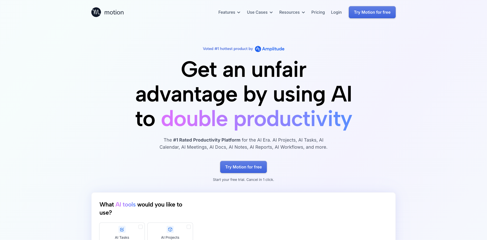
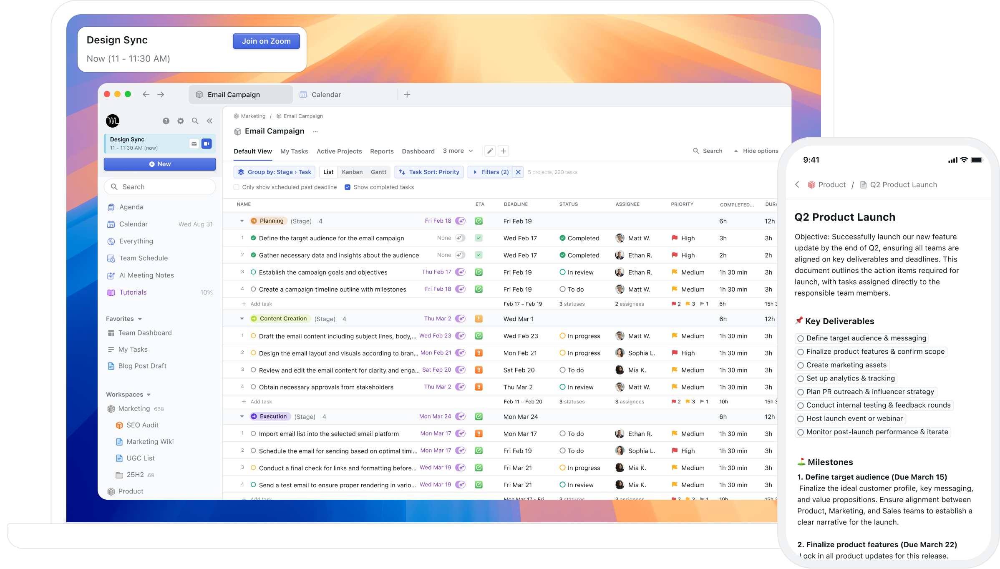
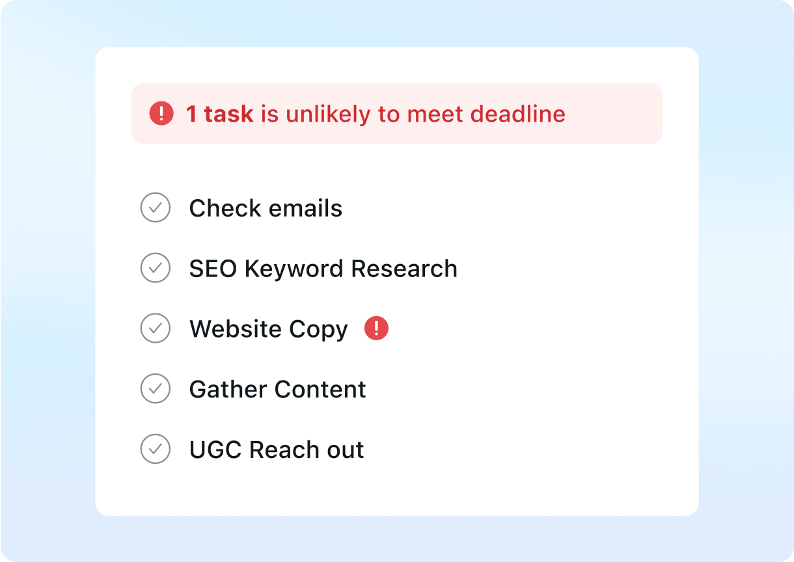
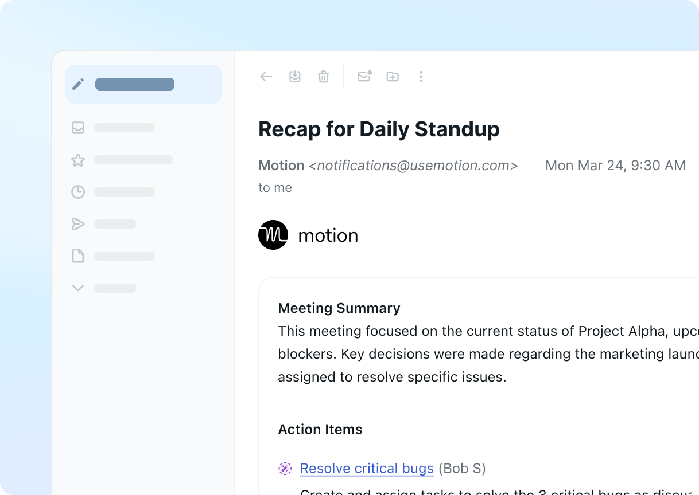
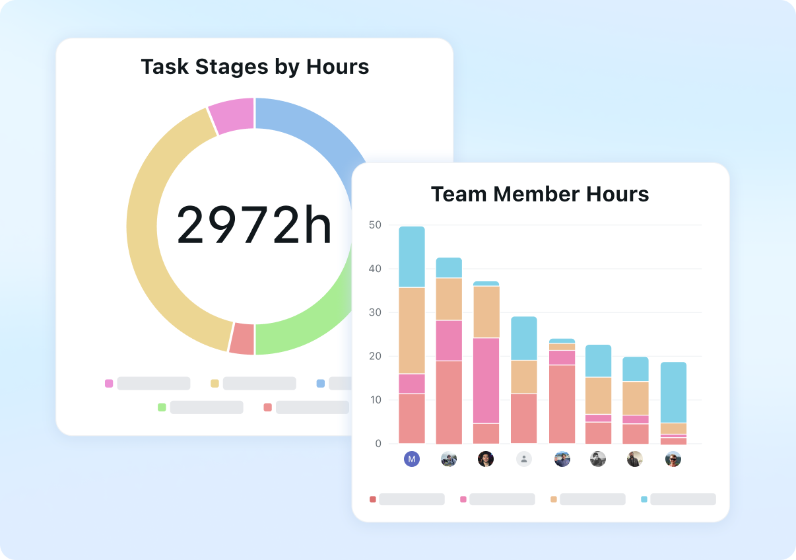
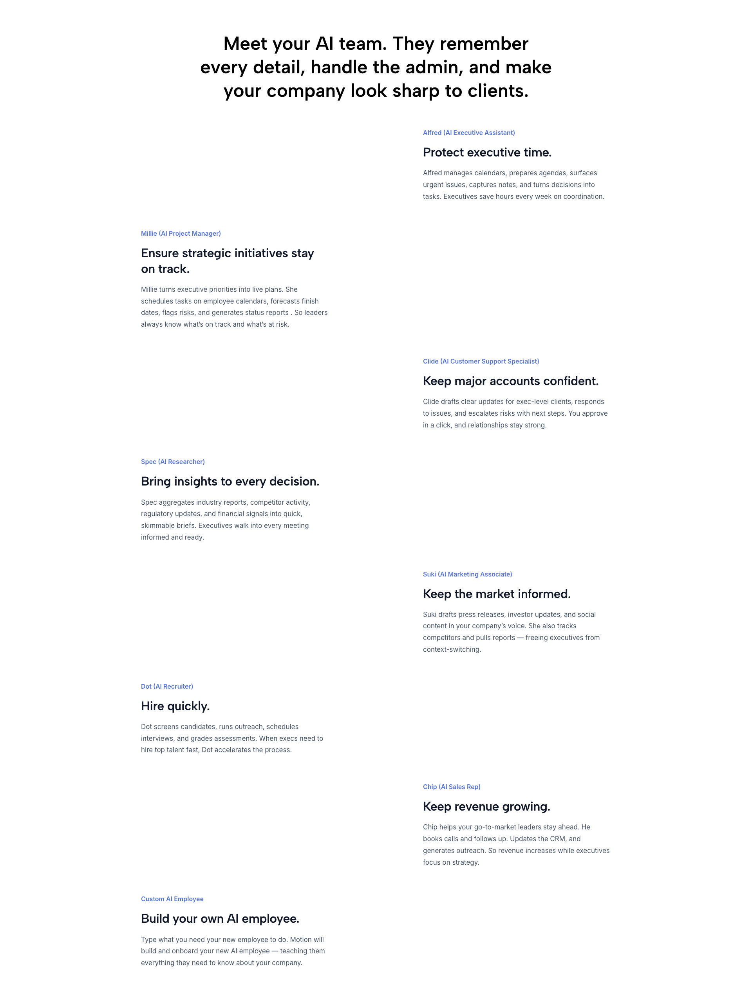
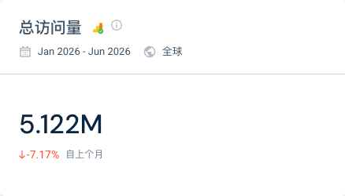

> 调研时间：2026-07-15。本文把当前官网/定价/安全、2020 HN 与 Product Hunt 产品历史、YC 与融资公告、第三方流量估算、LinkedIn/X 触点和 Reddit 用户反馈分层呈现。ARR、客户数和效率指标均为公司或创始人自报，未经独立审计。

## TL;DR

**Motion 是一家经历了多次交付单位变化、但始终围绕“替知识工作者减少认知与协调负担”的 YC W20 公司。** 2020 年它从防分心 Chrome 扩展起步；2022 年成为自动排程的项目与任务管理器；2025 年以命名 AI Employees 进攻 SMB；到 2026 年，主首页和公开定价又回到 AI Tasks、Projects、Calendar、Meetings、Docs、Workflows 与 Reports 组成的 SuperApp。[[source.hn.motion-launch-2020]] [[source.producthunt.motion-launches-2020-2022]] [[source.motion.homepage-2026-07-15]]

这不是简单的“AI Employees 成功或失败”二选一。官方称该业务三个月做到八位数 ARR、拥有 10,000+ B2B customers；同期社区却反复出现功能拿不到、skills 不稳定、credits 很快耗尽和支持滞后。当前命名员工仍存在于 use-case 页面，但不再是主定价页的购买单位。**更准确的判断是：命名角色完成了一次强势获客与价值叙事测试，产品随后把可复用能力重新吸收进通用 work suite。** [[source.motion.funding-2025]] [[source.reddit.motion-ai-employees-rollout-2025]] [[source.reddit.motion-transition-2025]]

更重要的是，团队已经把下一轮产品扩张放到 [[company.wonderly]]：同一法律主体 Nexusbird, Inc、共享创始人与员工，但 Wonderly 不再卖通用办公室角色，而是为 remodeling/hardscaping SMB 直接闭环广告、获客、电话、CRM、报价、支付和交付，并引入 revenue share。**Motion 仍是规模化现金流与分发资产，Wonderly 是垂直结果产品；两者应作为独立产品主体、同一产品谱系研究，而不是误写为收购。** [[source.motion.terms-2026-07-15]] [[source.wonderly.terms-2026-07-15]]

## 当前产品：主站是 AI SuperApp，垂直页仍卖 AI Employees

当前主首页的能力组合是：

- AI Projects & Tasks：项目、任务、优先级、依赖与自动排程；
- AI Calendar & Meetings：日历、预约、会议记录与 action items；
- AI Docs、Wiki、Notes：文档、知识与任务互通；
- AI Workflows：把文档、项目和任务编排为流程；
- Reports 与 Business Intelligence：容量、进度、Gantt 与 dashboard；
- Chat 与 Writer：在 workspace 上下文中生成与修改内容。

[[source.motion.homepage-2026-07-15]]

Executive Teams 页面仍列出八种员工：Alfred（行政）、Millie（项目）、Clide（支持）、Spec（研究）、Suki（市场）、Dot（招聘）、Chip（销售）和 Custom AI Employee。页面说这些角色读取项目、任务、文档、会议和目标，并在平台内部完成多步工作。[[source.motion.ai-employees-executive-2026-07-15]]

因此当前产品存在一个明确的 **claim delta**：

| 表面 | 当前口径 | 能说明什么 |
|---|---|---|
| 主首页 | AI Powered SuperApp for Work | 新用户首先购买一体化生产力套件 |
| 定价 | seat + monthly credits | 计费单位是席位与 credits，不是员工人数 |
| 行业/use-case 页 | AI employee work platform | 命名角色仍是垂直销售与价值解释方式 |
| LinkedIn | Hire AI employees that work 24/7 | 公司品牌叙事尚未完全切换 |
| 登录 App | 仅登录入口 | 本轮不能确认新账户实际获得哪些 employee skills |

**研究结论：** 不能说 AI Employees 已彻底下线，也不能按 2025 融资稿把全部命名员工当作 2026 默认可用产品。[[source.motion.app-smoke-2026-07-15]]

## 定价：从员工套餐回到 seat + credits

2026-07-15 实际切换当前定价页后，Teams 口径如下：

| 方案 | 年付折合 | 月付 | Credits |
|---|---:|---:|---:|
| Pro AI | $19/seat/月 | $24/seat/月 | 7,500/seat/月 |
| Business AI | $29/seat/月 | $39/seat/月 | 15,000/seat/月 |

Business AI 增加 capacity planning、advanced reports、Gantt、time tracking、permissions、central billing 与 priority support。[[source.motion.pricing-2026-07-15]]

2025 TechCrunch 报道里的套餐曾从每月 29 美元、1,000 credits 到 600 美元、25 seats/250,000 credits，并以 AI Employees 为中心。当前价格和额度已经改变，说明团队仍在重新定义价值单位。**历史价格能解释 rollout friction，不能当今天报价。** [[source.techcrunch.motion-series-c-2025]]

## 产品谱系：不是一次 pivot，而是持续重写交付单位

| 时间 | 产品节点 | 交付单位 |
|---|---|---|
| 2019 | 公司成立，进入 YC W20 | 创业团队与生产力问题 |
| 2020-02 | Launch HN 防分心扩展 | 对注意力的实时干预 |
| 2020-09 | Tab Management beta | 浏览器工作环境 |
| 2022-09 | Project & Task Manager + $13M Series A | 自动排程后的执行计划 |
| 2025-05 | SMB AI agent bundle / AI Employees | 命名岗位完成多步工作 |
| 2025-09 | $38M Series C，$550M post-money | Agent-native work suite |
| 2026 | 主站回到 AI SuperApp；Wonderly 公开出现 | 通用套件 + 垂直收入闭环 |

[[source.hn.motion-launch-2020]] [[source.producthunt.motion-launches-2020-2022]] [[source.motion.series-a-2022]] [[source.techcrunch.motion-series-c-2025]]

2020 HN 帖里，团队说在 Motion 之前试过六个 MVP；2025 Harry 又说首次做到 100 万美元 ARR 前经历约 20 次 pivot。两个数字覆盖的阶段不同：前者解释最初 idea discovery，后者描述更长的商业化历程。[[source.linkedin.harry-qi-pivot-2025]]

真正连续的不是 UI，而是一个问题：**怎样把“下一步该做什么”的认知负担从人转给系统。** 防分心扩展告诉用户离开哪个网站；自动排程告诉用户何时做哪个任务；AI Employees 尝试直接做任务；Wonderly 再把任务压到收入结果。

## 2025 AI Employees：增长数字强，但产品闭环并不干净

官方融资公告自报：

- 公司达到 mid-8-figure ARR；
- 10,000+ B2B customers；
- AI Employees 上线三个月从 0 到 eight-figure ARR；
- Series B/C/C2 合计融资 6,000 万美元，累计 7,500 万美元，估值 5.5 亿美元。

[[source.motion.funding-2025]]

TechCrunch 的相邻口径是：2025 年 5 月 launch，四个月后达到 10,000+ B2B customers 与 1,000 万美元 ARR。时间窗和 ARR 表达略有不同，但都来自 Harry Qi/公司，不能互相当独立验证。[[source.techcrunch.motion-series-c-2025]]

用户侧给出了产品真相的另一半：

- 有用户因广告升级，却数月拿不到功能；
- 有用户一周消耗约 1,100/12,000 credits，担心全年额度不够；
- 多人报告 skills 缺失、输出不稳定与支持慢；
- 一名重度用户认为关键任务不可靠、成本不划算，但其 lead-generation machine 确实产生大量质量 leads。

[[source.reddit.motion-ai-employees-rollout-2025]] [[source.reddit.motion-transition-2025]]

**判断：** 这更像一个 revenue-positive、execution-uneven 的产品实验。增长说明购买意愿真实；社区说明 rollout、能力发现、可靠性和单位成本没有同时闭环。当前套件化可能是在保留有效能力的同时，降低“八名员工全部可自主完成”的过度承诺。

## Wonderly：把通用 Agent 问题改写成一个行业的收入系统

[[company.wonderly]] 与 Motion 的关系有三层强证据：

1. 两份 Terms 都把服务提供方写成 Nexusbird, Inc；
2. Wonderly LinkedIn 多名员工写 `Motion & Wonderly`，Motion 员工搜索也出现 Wonderly 岗位；
3. 招聘页把 Wonderly 描述为 formerly Motion，社区最迟在 2026-04 已发现新站。

[[source.motion.terms-2026-07-15]] [[source.wonderly.terms-2026-07-15]] [[source.linkedin.wonderly-company-2026-07-15]] [[source.reddit.wonderly-discovery-2026]]

但当前证据更适合写成 **同一法人/团队下的产品谱系与品牌演进**。没有证据表明发生了收购；也没有足够证据确认 Motion 品牌会被完全废弃。`business.motion.com` 本轮不可用，准确迁移时间仍未知。

这形成 [[concept.legacy-saas-agent-distribution]]：旧 SaaS 提供现金流、用户、上下文、工程与广告能力；新产品获得更大的 outcome space。代价是旧用户会质疑注意力被转移、功能承诺变化和是否被当作 beta。

## 团队：三位 YC active founders + 一位后加入联合创始人

### Harry Qi

[[person.harry-qi]] 是 CEO，Dartmouth 数学与计算机背景，创业前从事量化交易。其公开叙事是放弃约百万美元年收入进入 YC；2025 年又公开复盘在约 1,500 万美元 ARR 时被 Michael Seibel 质疑市场上限，推动团队离开局部最优。[[source.linkedin.harry-qi-pivot-2025]]

### Omid Rooholfada

[[person.omid-rooholfada]] 是 Harry 的高中好友，Yale 数学与计算机背景，曾在 Facebook 与 Optimizely 工程实习/工作；当前 LinkedIn 仍为 Co-Founder @ Motion。[[source.yc.motion-2026-07-15]] [[source.linkedin.motion-company-2026-07-15]]

### Ethan Yu

[[person.ethan-yu]] 是 Harry 的大学好友，Dartmouth CS，创业前有量化交易和 WhatsApp/Facebook 软件工程经历。[[source.yc.motion-2026-07-15]]

### Chander Ramesh

[[person.chander-ramesh]] 是早期员工与工程负责人，2025 TechCrunch 把他列为第四位联合创始人。YC 当前 active founders 仍只列 Harry、Omid、Ethan，因此图谱保留四人 founder 关系，正文区分加入时间。[[source.techcrunch.motion-series-c-2025]]

团队规模也有多口径：YC 写 65；2025 官方融资文写 50+；LinkedIn 员工搜索 total=99。它们分别是 YC 字段、公司当时自报和平台关联人数，不能选一个当精确当前 headcount。

## 融资：总额清楚，单轮与单家分配必须克制

| 节点 | 已验证关系 | 金额边界 |
|---|---|---|
| YC W20 | [[investor.y-combinator]] accelerator | 未披露本轮金额 |
| 2022 Series A | [[investor.signalfire]] lead、[[investor.468-capital]] participant | $13M 是整轮总额 |
| 2025 Series C | [[investor.scale-venture-partners]] lead | $38M 是整轮总额 |
| 2025 B/C/C2 聚合 | HOF、468、SignalFire、YC、Valor、Fellows、Leonis 等 | $60M 是三轮合计，具体轮次/单家金额多未披露 |

[[source.motion.series-a-2022]] [[source.motion.funding-2025]]

TechCrunch 还列出 [[investor.apollo-projects]]；本库把它建立为媒体强证据投资关系，但不分配金额或具体 round。[[source.techcrunch.motion-series-c-2025]]

## 流量与规模：成熟获客资产，且明显依赖付费分发

2026 H1 第三方 Worldwide / All Traffic 估算：每月访问量 446,487，月独立访客 239,729，访问时长 1:24，1.85 pages/visit，bounce 65.41%。美国约 25.97%、英国 16.69%、印度 6.95%、加拿大 4.92%、澳大利亚 4.63%。[[source.similarweb.motion-2026-h1]] [[traffic.similarweb.motion-2026-h1]]

渠道结构更有解释力：Organic Search 42.72%，Paid Search 18.78%，Display 10.01%，Paid Social 6.72%，Organic Social 2.21%，Direct 13.39%。六月搜索约 82% branded。**Motion 已经不是只靠口碑和 launch 的产品，它有一台成熟的搜索、展示广告和社媒买量机器。**

数据页月线合计为 2.678M，顶卡显示 5.122M，可能是域/子域范围差异。本文不选一个更大数字包装规模，也不把网站 visits 直接等同付费客户。

## GTM：四种分发机制叠加

### 1. HN 用于找到产品真相

2020 Launch HN 不只是 210 points。创始人公开了六个失败 MVP、隐私权限与早期留存，评论直接讨论“柔性提醒 vs 强制阻断”。它让团队在产品极早期得到高密度反馈。[[source.hn.motion-launch-2020]]

### 2. Product Hunt 用于阶段性重写叙事

2020 防分心、2020 tab manager、2022 project manager 三次发布，把同一品牌逐步移到更大工作面。第三次 305 upvotes/105 comments，说明公开 relaunch 可以反复使用，不必把第一次 launch 当终局。[[source.producthunt.motion-launches-2020-2022]]

### 3. 工程内容成为技术品牌渠道

Motion 工程博客的 Postgres 迁移和 250 万行 TypeScript 迁移曾进入 HN 高讨论区。这些内容不直接证明产品质量，却能持续吸引工程人才并强化“系统规模已真实存在”的招聘叙事。

### 4. 付费搜索与广告承担规模化获客

流量结构里 Paid Search、Display 与 Paid Social 合计超过三分之一，官方首页又高度优化免费试用 CTA。当前增长不是单一社区 launch，而是社区、品牌搜索、内容与付费投放共同作用。

## 安全与企业边界

Motion 公开称完成 SOC 2 Type II，GCP 美国区域存储，静态/传输加密，年度渗透测试；AI 功能使用 OpenAI、Anthropic、Google 等第三方模型，不用客户数据训练，但可能短期保存输入输出用于性能和调试。[[source.motion.security-2026-07-15]]

这能支持基本 enterprise readiness，仍缺：实际 SOC 2 报告、DPA、subprocessor 完整清单、数据驻留选项、各 AI Employee 的工具权限与审批模型。尤其当产品声称 Agent 读取完整业务上下文时，“谁可读、谁可写、如何审批和撤销”比角色数量更重要。

## 中文世界：认知仍停留在 AI 日历

微信与小红书的可用结果大多把 Motion 介绍成“AI 项目经理兼日历管家”或“会自动排工作的日历”。`Motion AI 员工` 查询被同名产品污染，未形成可用讨论。[[source.weixin.motion-ai-calendar-2026]] [[source.xiaohongshu.motion-ai-calendar-2026]]

这说明中文传播仍停留在 Motion 最稳定、最容易理解的旧价值：自动排程。它不证明国内用户不用 AI Employees，只说明 2025 的融资叙事和 2026 的 Wonderly 转向尚未形成中文认知。

## 竞品：按当前购买任务分层，不把相似站都叫竞品

| 层级 | 代表 | 与 Motion 的关系 |
|---|---|---|
| 自动排程/个人生产力 | Reclaim.ai、Sunsama、Akiflow | 争夺日历、任务和每日计划，是当前最直接的功能对手 |
| 通用 work management | Asana、Monday、ClickUp、Notion | 争夺团队项目、文档和协作，但自动排程深度不同 |
| 横向 Agent builder/workforce | [[company.lindy]]、[[company.relevance-ai]]、[[company.ema]] | 争夺 Agent 执行与企业工作流，但配置方式、客户规模和治理要求不同 |
| 命名 SMB AI employees | [[company.sintra]]、[[company.marblism]]、[[company.11x]] | 共享“买岗位而非建 workflow”语言，Motion 的工作上下文底座更深 |
| 垂直结果系统 | [[company.wonderly]] | 同一团队把能力下沉到 service SMB，不是外部竞品，而是产品谱系下一步 |

第三方 similar sites 只提供候选。Todoist 的流量远大、Sunsama/Reclaim/Akiflow 更接近，但还需按购买者与任务面逐一验证。

## 关键判断与风险

### 证据较强的事实

- Motion 从 2020 防分心扩展演化为自动排程、AI Employees 与当前 AI SuperApp；
- 2025 官方披露累计融资 7,500 万美元、估值 5.5 亿美元，Series C 3,800 万美元；
- 当前官网、定价和行业页存在并行口径：套件获客、credits 计费、角色销售；
- Motion 与 Wonderly 共享 Nexusbird, Inc、创始人与多名员工；
- `usemotion.com` 仍有数十万级月访问估算，且付费获客占比高。

### 研究判断

1. **Motion 的护城河不是某个命名员工，而是工作上下文与分发。** 角色可变、首页可变，但项目、日历、文档、任务和客户关系让 Agent 有执行位置。
2. **2025 AI Employees 是一次高收入、低一致性的过渡产品。** 它证明用户愿意为“员工”付费，也暴露 rollout、credits 和可靠性问题；当前套件化是在降低承诺粒度。
3. **旧 SaaS 同时是资产与约束。** 它给 Wonderly 现金流、人才和 acquisition 能力，也让旧用户对资源转移、功能弃用和沟通承担成本。
4. **Wonderly 比“更多 AI employees”更接近商业闭环。** 它直接控制 lead、电话、报价、支付与交付，并用 revenue share 把厂商收入绑定到客户结果，但也引入归因、合规和 lead ownership 风险。

### 未知与待验证

- Motion 2026 当前 ARR、活跃付费账户、留存与 AI credits 消耗；
- 2025 AI Employees 中多少能力已被吸收、限制或仅对存量账户开放；
- Wonderly 的官方 launch 日期、独立客户数、GMV/revenue share、留存与交付人力；
- 两个品牌未来是并行、合并还是阶段性迁移；
- Agent 的权限、审批、失败恢复与 accepted output 指标。

## 证据导航

- 当前产品：[[source.motion.homepage-2026-07-15]]、[[source.motion.ai-employees-executive-2026-07-15]]、[[source.motion.pricing-2026-07-15]]、[[source.motion.security-2026-07-15]]
- 产品谱系：[[source.hn.motion-launch-2020]]、[[source.producthunt.motion-launches-2020-2022]]、[[source.motion.series-a-2022]]
- 融资与战略：[[source.motion.funding-2025]]、[[source.techcrunch.motion-series-c-2025]]、[[source.linkedin.harry-qi-pivot-2025]]
- 用户与增长：[[source.reddit.motion-ai-employees-rollout-2025]]、[[source.reddit.motion-transition-2025]]、[[source.similarweb.motion-2026-h1]]
- Motion/Wonderly 关系：[[source.motion.terms-2026-07-15]]、[[source.wonderly.terms-2026-07-15]]、[[source.linkedin.wonderly-company-2026-07-15]]
- 本轮判断与过程：[[note.motion-product-takeaway-2026-07-15]]、[[note.motion-wonderly-research-run-2026-07-15]]
