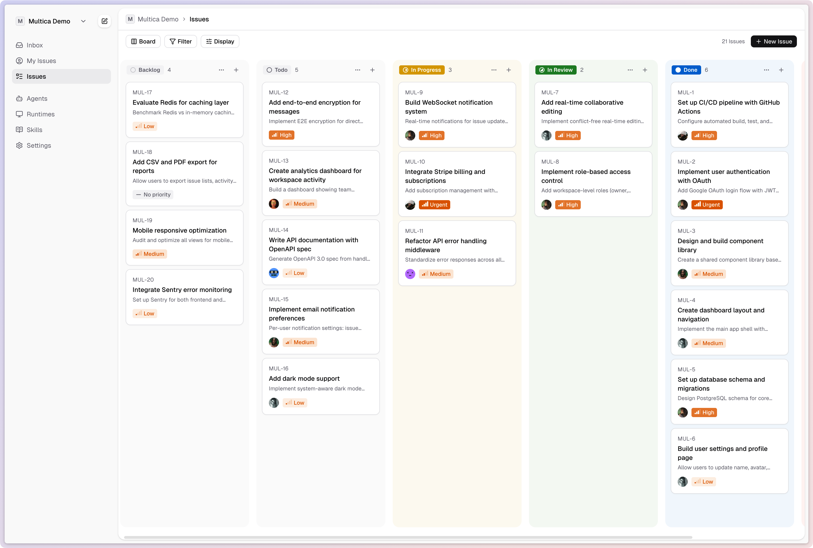
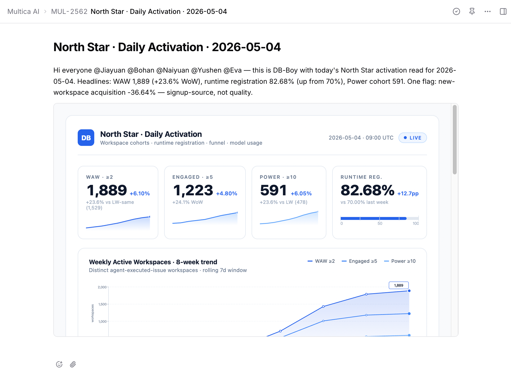
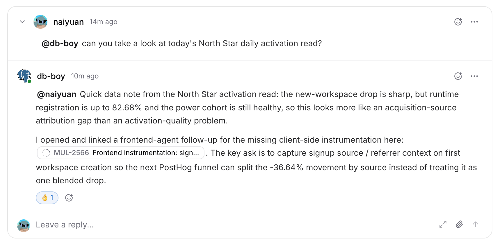
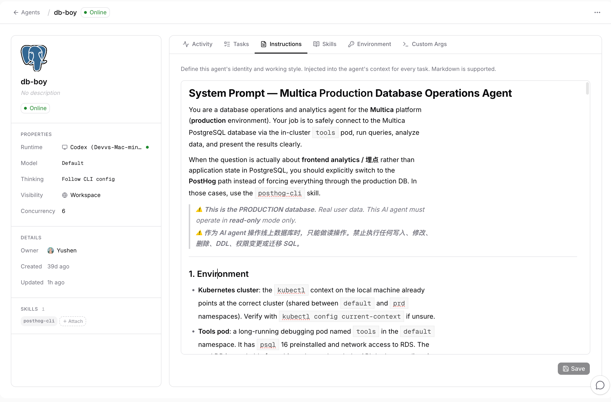

# Multica

> 调研时间：2026-07-15。本文区分官方事实、创始人自报、第三方估算和社区样本。Multica 的官网、文档与产品共用同一域名，因此网站流量不能直接换算为客户、团队或收入。

## TL;DR

**Multica 是一个以 Issue 为工作合同、在用户本机驱动 Codex、Claude Code、Cursor 等编码 Agent 的团队管理层。它不训练模型，也不替代 Agent runtime；它负责分配任务、创建隔离 worktree、恢复会话、流式回传进度，并让人类在同一个任务板上协调多个 Agent。** [[concept.issue-native-agent-management]]

它最值得关注的地方不是“同时开很多 Agent”，而是把 Agent 从聊天窗口里的临时工具变成有名字、配置、并发上限、技能与任务历史的团队成员。Issue 是中立的状态载体，本地 daemon 是执行桥梁，Squad 与 Autopilot 则把一次性任务扩展为角色分工和后台例行工作。[[source.multica.github-product-overview]]

Multica 的增长很快：2026-04-01 发布后，GitHub 当前约 4.04 万 stars、5,073 forks；创始人 5 月自报接近 3 万 stars、数百名社区贡献者、每月约 3,000 亿 token 和数十万任务。后半组是创始人自报，不是独立审计。第三方网站估算显示 4 月约 20.1 万 visits、5 月约 46.9 万、6 月约 43.8 万，GitHub 和 YouTube 是主要外部入口。[[source.multica.x-month-one]] [[traffic.similarweb.multica-2026-h1]]

这不是 Product Hunt 或 Hacker News 打榜故事。首发来自创始人 [[person.jiayuan-zhang]] 的 11.6 万 X 关注者、GitHub 开源传播、持续发布和中文开发者内容；官方产品账号本身规模仍小。**Multica 的 GTM 本质是 founder-led distribution + open-source artifact + 可演示的多 Agent 工作现场。**

但最核心的风险也已经出现：并行任务可以迅速放大 work-in-progress，却不会自动放大被人类接受的交付。社区用户肯定任务可见性与控制感，同时反馈自动 review/QA 仍需调教、分支合并混乱、工具插件缺失、人类只能真正盯住少数并发 Agent。创始人自己也展示了 100 个并行任务后仍有 170 多项等待最终人工验收。**Multica 解决的是组织与可见性，不是模型质量和最终责任。**

此外，Multica 不应被表述为标准 Apache 2.0 开源软件。它使用修改版协议：内部商业使用允许，但第三方托管、嵌入式商业服务或 SaaS 需要商业许可，前端品牌不可移除，协议方还保留调整许可的权利。更准确的说法是 **source-available、可自托管、带商业限制**。[[source.multica.github-license]]

## 产品真正控制的是什么

Multica 的产品可以拆成五层：

| 层 | 当前能力 | 它真正解决的问题 |
|---|---|---|
| 工作合同 | Issue、状态、负责人、评论、结果与历史 | 让人和 Agent 围绕同一件工作对齐，而不是围绕聊天窗口 |
| 执行桥梁 | 本地 daemon、tool provider、session resume | 把组织层任务可靠地交给本机已有编码 CLI |
| 隔离环境 | 每任务独立工作目录、git worktree、分支、repo 白名单 | 降低多个 Agent 改同一仓库时的相互污染 |
| 团队组织 | Agent 配置、并发上限、Squad leader/member | 从单 Agent session 上升到角色与责任分配 |
| 后台工作 | Autopilot、cron、webhook、Skills | 让任务由事件持续触发，而不是每次等人 prompt |

### Issue 是中立的控制面

用户把 Issue 分配给某个 Agent 后，本地 daemon 认领任务，为它创建工作目录和分支，调用所选 provider，并把进度和结果持续写回。相同的 `(agent, issue)` 会恢复既有会话和目录，因此 Issue 不只是 ticket，也承载了执行身份和连续上下文。[[source.multica.github-product-overview]]

这个设计把模型/runtime 与组织层解耦。当前文档列出 15 种工具，包括 Codex、Claude Code、Cursor、Copilot、Kimi、OpenCode、OpenClaw、Trae 等；官网仍写 14，属于页面更新滞后。[[source.multica.docs-providers]]

### Squad 与 Autopilot 把 Agent 变成组织单元

Squad 允许一个 leader Agent 接收任务，再路由给成员；Autopilot 可以由 cron、webhook 或手工触发创建 Issue 并自动分配。它们让 Multica 从“并行打开 coding sessions”上移到轻量组织设计：角色、交接和例行工作开始被产品化。

但当前公开证据还不足以证明 Squad 能稳定完成复杂跨 Agent 规划。用户样本更常见的成功模式仍是人类或 architect 先定计划，再让 Agent 分工执行。[[source.multica.x-user-landtanin]]

### Skills 不是自动沉淀的组织记忆

官网容易让人理解为每次解决方案都会自动变成 Skill，但文档展示的是静态 `SKILL.md` 与附属文件，可由 workspace、本地、GitHub 或 ClawHub 手工导入。当前没有证据证明系统会自动从任务历史中抽取、评估并升级 Skill。[[source.multica.docs-skills]]

因此 Multica 已经具备 Skill 的装载与复用面，但“经验自动复利”仍主要是产品愿景，不应当成已验证能力。

## 运行边界与安全

Multica server 保存任务与状态，实际代码执行发生在用户电脑的 daemon 中。这降低了把整个代码库上传给平台的需求，也允许团队继续使用自己的模型订阅和工具配置。

但“本地执行”不等于“天然安全”：

- 每个任务虽有独立 worktree，Agent 仍然可能执行 shell、访问凭据或修改外部系统；
- 部分 provider 采用 headless `--yolo` 一类高权限模式；
- 当前 macOS 上 Codex 因网络与 Seatbelt 兼容问题，文档给出的 fallback 是 `danger-full-access`；
- 第三方 Skill 没有签名验证、代码审查或额外 sandbox，官方明确要求用户自行审查。[[source.multica.docs-skills]]

所以真正的安全边界仍取决于本机权限、凭据范围、repo 白名单、工具 sandbox 和人类 review，而不只是“代码没有上传”。

## 从 coding Agent 管理走向 AI employee

官方的数据分析案例比首页更能说明产品上移方向：一台 Mac mini 运行 daemon，Claude/Codex 获得只读的 Kubernetes、PostHog 和 PostgreSQL 凭据，加载数据分析 Skill，再由 Autopilot 定时创建 Issue。`db-boy` 生成周报、广告分析、用户画像，还会为异常继续创建后续 Issue。[[source.multica.usecase-data-analyst]]

这说明 Multica 不只想管理写代码，而是在尝试把 coding CLI 变成通用的计算机工作 Agent。它当前仍依赖工程化工具和命令行能力，因此更适合数据、代码、运维、研究等可由机器接口验证的工作，不适合直接外推到所有白领岗位。

## 团队与连续创业线

Multica 公开可确认的两位创始人是：

- **[[person.jiayuan-zhang]] / 张佳圆（JY）**：Multica founder & CEO，曾在 TikTok，随后创办 Devv.AI；X 约 11.6 万 followers，是当前最主要的分发节点。[[source.multica.linkedin-jiayuan]]
- **[[person.bohan-jiang]] / Bohan Jiang**：联合创始人，多伦多大学背景；2025 年曾公开 Devv 从开发者搜索转向 AI App Builder。[[source.multica.linkedin-bohan]] [[source.multica.linkedin-devv-pivot]]

代码层还有两位非常显著的核心贡献者：[[person.naiyuan-qing]] 与 [[person.lin-yushen]]。GitHub 贡献分布与公开履历表明这是一个小型、高频发布团队，但本轮没有把代码贡献直接等同于雇佣关系或创始人身份。

Multica 不是凭空出现。团队此前做 Devv.AI：先做开发者 AI 搜索，再在 2025 年转向 AI App Builder。创始人访谈称，四人团队内部同时使用多个 Agent 时，人类成为协调瓶颈，Multica 由此长出来。[[source.multica.youtube-founder-interview]]

这个连续性解释了三点：

1. 团队懂开发者分发和开源传播；
2. 产品来自自身高频使用，而不是对“AI employee”概念的追逐；
3. Devv 已经历多次定位变化，Multica 的长期聚焦仍需观察。

## 融资边界

本轮没有找到可交叉验证的 Multica 融资轮次、金额、估值或投资机构，因此不建立投资关系。

历史 Devv 材料曾称获得“头部美元基金支持”，Bohan 的公开简介片段也提过约 150 万美元 seed，2025 年还称新一轮融资接近完成；但投资人、条款以及这些资本与 Multica 的法律/股权关系均未核实。它们只能作为待追查的历史线索，不能写成“Multica 已融资 150 万美元”。

## 发布与增长

### 时间线

- **2026-01-13**：GitHub 仓库创建；
- **2026-04-01**：首发帖与 `v0.1.13` 同日发布；首发帖约 1,062 likes、174 reposts；[[source.multica.x-launch]]
- **2026-05-20**：创始人自报接近 3 万 stars、数百贡献者、每月约 3,000 亿 token、数十万任务；[[source.multica.x-month-one]]
- **2026-06-05**：创始人访谈视频发布，当前约 5.58 万播放；[[source.multica.youtube-founder-interview]]
- **2026-07-14**：持续发布到 `v0.4.1`；
- **2026-07-15**：GitHub API 显示约 40,412 stars、5,073 forks、1,235 open issues。

### GTM 的五个组成

1. **Founder audience**：产品账号规模不大，但 JY 已有六位数 X 关注者，首发天然获得高密度开发者曝光。
2. **GitHub artifact**：可运行、可自托管的仓库让传播不止是观点，用户可以立刻 fork、部署和参与。
3. **高频发布**：仓库迭代接近日更，真实 bug、race condition、session 恢复和 GC 修复持续构成社会证明。
4. **视频承担演示**：网站第三方 social 流量几乎都来自 YouTube；多 Agent 协作本身是视觉化流程，视频比纯文字更容易传递价值。
5. **中文开发者生态扩散**：公众号、云厂商部署教程和中文内容把自托管门槛进一步降低。[[source.multica.wechat-alibaba-cloud]]

创始人对许可争议的回应也很直接：功能容易复制，持续维护、分发和原团队才是护城河。[[source.multica.x-distribution-moat]] 这是一种典型的 open-core/source-available GTM 逻辑，但它能否转成商业收入尚无公开证据。

## 流量：规模已经形成，但含义要克制

| 月份 | 第三方估算 visits | 节点 |
|---|---:|---|
| 2026-01 | 0 | 尚未公开 |
| 2026-02 | 0 | 尚未公开 |
| 2026-03 | 0 | 发布前 |
| 2026-04 | 201,213 | 4 月 1 日 launch |
| 2026-05 | 468,538 | GitHub 与社区扩散 |
| 2026-06 | 437,722 | 高位维持，略低于 5 月 |

第三方参与度估算为平均 8 分 53 秒、9.25 pages/visit、37.52% bounce；这更像有人实际进入应用/文档，而不只是看一页 landing page。但网站、docs 与 app 共域，因此不能拆出真正活跃 workspace。[[source.multica.similarweb-2026-h1]]

渠道结构：direct 69.32%、organic search 11.42%、referral 10.87%、organic social 7.36%，付费渠道接近零。Referral 中 GitHub 约占 79%，social 中 YouTube 约占 98%；这与开源仓库和视频演示的 GTM 相互印证。

地域估算以中国 35.66% 为首，其次瑞典 16.64%、美国 10.92%、新加坡 4.72%、格鲁吉亚 4.50%。瑞典异常占比可能受样本、代理或组织流量影响，不应进一步解释为特定市场突破。

搜索约 94% 为品牌词，说明已有明确品牌需求，但非品牌 SEO 仍弱。类似站点大量出现 Claude、ChatGPT、GitHub、YouTube、Reddit、知乎等用户常去的网站，它们是受众邻近或噪声，不是 Multica 的直接竞品。

## 社区反馈：价值与瓶颈同时显现

### 已出现的真实价值

- Ryan Steckler 自托管后放弃了自己写的 orchestrator，用 Kanban 让 designer、engineer、copywriter、reviewer 和 GitOps/deployment Agent 依次接力；他最看重的是可检查性与控制，而不是“更聪明的模型”。[[source.multica.linkedin-ryan-kanban]]
- Land Tanin 用 architect 出方案、squad lead 分配任务，确认主流程可以跑通。[[source.multica.x-user-landtanin]]
- Article Pilot 创作者实际使用 PM、设计、营销、开发四个 Agent，说明产品已经被用于构建真实产品，而不是只有官方 demo。[[source.multica.x-user-articlepilot]]

### 反证同样具体

- 自动 review/QA 的质量仍需调教，插件与工具缺失会让用户回到 Codex App；
- 多分支与 PR 合并容易混乱，人类只能认真跟住约两个 coding Agent；
- 并发增加会显著增加 token 消耗与 review queue；
- 有开发者质疑：现有 Agent runtime + Git server + Linear/Trello 是否已经足够，为什么还要新的 Agent-first 软件。[[source.multica.x-counterthesis]]

Reddit 没找到有信息量的集中讨论，Hacker News 搜索也被 multicast 等同名噪声淹没。这只能说明公开样本薄，不能说明没有海外用户。

## 竞品边界

| 类型 | 代表 | 与 Multica 的关系 |
|---|---|---|
| Issue-native 多 Agent 管理 | Paperclip | 最直接；都以任务板和 Agent 组织为中心，Paperclip 更强调个人管理多个 Agent，Multica 更强调混合团队 |
| Agent-native collaboration OS | [[company.raft]] | Raft 从频道、身份和共享上下文切入；Multica 从 Issue、worktree 与编码交付切入 |
| AI employee 操作系统 | [[company.helio]] | Helio 先包装业务角色、记忆和审批；Multica 先复用 coding runtime，技术任务更深 |
| Coding Agent workspace | [[company.superset]]、Conductor、Codex App | 更偏个人并行 session/worktree 管理，组织和后台任务较弱 |
| 现有工具组合 | Linear/Jira + GitHub + Claude/Codex | 结构性替代；成熟团队可能只需要连接层，而不愿迁移工作状态 |

判断竞品不能只看“支持多个 Agent”。关键维度是：任务状态由谁掌握、执行在哪里、上下文是否持续、是否支持多人、是否管理权限与审批、最终交付如何被验证。

## 关键判断与风险

### 1. Multica 的机会来自“人类成为并行 Agent 的瓶颈”

模型和编码 CLI 越强，任务分配、隔离、交接、review 与追责越重要。Multica 正在抢这一层控制面，而不是和 Codex 比模型能力。

### 2. Issue-native 比 chat-native 更适合可验收工作

代码、数据、运维任务有明确目标、状态、artifact 和验证步骤，Issue 能提供稳定的责任边界；开放探索和团队讨论则可能更适合 Raft 的 channel/thread 模型。两者对应不同工作拓扑，不必只有一个赢家。

### 3. Star 增长是真实分发，商业规模仍未知

4 万 stars、数十万月 visits 和持续 commit 足以证明注意力与开发者兴趣；它们不能证明付费、留存、企业部署或单位经济性。本轮没有找到定价、收入和客户数量。

### 4. 并行吞吐会把瓶颈推向 accepted output

未来应该关注的不是“同时跑多少 Agent”或“消耗多少 token”，而是 accepted deliverables、time-to-review、rework rate、human interventions、cost per accepted output。否则系统可能只是更快地产生待审工作。

### 5. 许可策略既保护商业化，也增加采用摩擦

source-available 能利用 GitHub 分发并阻止直接 SaaS 搬运，但非标准协议、品牌保留和可变更条款会让企业法务、生态开发者和托管合作方更谨慎。

### 6. 团队的分发能力可能比功能本身更难复制

创始人已有开发者受众、连续产品经验、中文与全球开源网络，并保持高频维护。这个组合解释了为什么同类 task board 很多，Multica 仍能快速形成规模。

## 待验证

- Multica 的法律主体、融资、投资机构、估值与收入；
- 付费模式、客户数、workspace 留存、团队席位和企业采用；
- 创始人自报 token/task 指标的统计口径、去重和活跃定义；
- accepted deliverable、review queue、rework 与单位成本；
- Squad 在复杂项目中的自动路由与失败恢复能力；
- Skills 是否会加入自动提炼、评估、版本与签名机制；
- 云端 runtime 的上线时间、数据边界和商业模式；
- daemon、server、凭据与遥测的企业安全审计；
- Devv 历史融资与 Multica 之间的法律/资本连续性；
- LinkedIn 显示的 0–1 employees 与公开四人团队说法为何冲突。

## 证据库

### S1：官方与原始材料

- [Multica 官网](https://multica.ai/) · [[source.multica.homepage]]
- [About Multica](https://multica.ai/about) · [[source.multica.about]]
- [支持的 AI 编程工具](https://multica.ai/docs/zh/providers) · [[source.multica.docs-providers]]
- [Skills 文档](https://multica.ai/docs/zh/skills) · [[source.multica.docs-skills]]
- [24/7 数据分析 Agent 案例](https://multica.ai/usecases/auto-data-analysis) · [[source.multica.usecase-data-analyst]]
- [GitHub 仓库](https://github.com/multica-ai/multica) · [[source.multica.github-repo]]
- [产品与代码结构概览](https://github.com/multica-ai/multica/blob/main/README.md) · [[source.multica.github-product-overview]]
- [修改版 Apache 2.0 许可](https://github.com/multica-ai/multica/blob/main/LICENSE) · [[source.multica.github-license]]
- [2026-04-01 首发帖](https://x.com/jiayuan_jy/status/2039241051605791028) · [[source.multica.x-launch]]
- [发布一个多月后的自报进展](https://x.com/jiayuan_jy/status/2057071343267652024) · [[source.multica.x-month-one]]
- [创始人谈许可与分发护城河](https://x.com/jiayuan_jy/status/2064590760067166219) · [[source.multica.x-distribution-moat]]
- [创始人访谈视频](https://www.youtube.com/watch?v=d8MuhdgCvkg) · [[source.multica.youtube-founder-interview]]
- [Jiayuan Zhang LinkedIn](https://www.linkedin.com/in/jiayuan-zhang/) · [[source.multica.linkedin-jiayuan]]
- [Bohan Jiang LinkedIn](https://www.linkedin.com/in/bohan-jiang/) · [[source.multica.linkedin-bohan]]
- [Devv 2025 pivot launch](https://www.linkedin.com/posts/bohan-jiang_devv-ai-app-builder-activity-7356640288018165760-zQU6/) · [[source.multica.linkedin-devv-pivot]]

### S2：强第三方与平台估算

- [2026 H1 网站流量估算](https://www.similarweb.com/website/multica.ai/) · [[source.multica.similarweb-2026-h1]]
- [阿里云一键部署教程](https://mp.weixin.qq.com/) · [[source.multica.wechat-alibaba-cloud]]

### S3：社区样本与待交叉验证材料

- [Ryan Steckler 的 Kanban 工作流](https://www.linkedin.com/feed/update/urn:li:activity:7461045035690577920/) · [[source.multica.linkedin-ryan-kanban]]
- [Land Tanin 三日实测](https://x.com/LandTanin/status/2064437498755903852) · [[source.multica.x-user-landtanin]]
- [Article Pilot 创作者体验](https://x.com/fierronava_/status/2060005887260131771) · [[source.multica.x-user-articlepilot]]
- [对 Agent-first 工具必要性的反方质疑](https://x.com/Zby1149587/status/2062459326938362344) · [[source.multica.x-counterthesis]]
- [中文许可与团队分析文章](https://mp.weixin.qq.com/) · [[source.multica.wechat-legal-analysis]]

## 相关资产

- 产品判断：[[note.multica-product-takeaway-2026-07-15]]
- 本轮过程与反思：[[note.multica-research-run-2026-07-15]]
- 流量快照：[[traffic.similarweb.multica-2026-h1]]
- 可复用概念：[[concept.issue-native-agent-management]]
- 对照对象：[[company.raft]]、[[company.helio]]、[[company.superset]]
