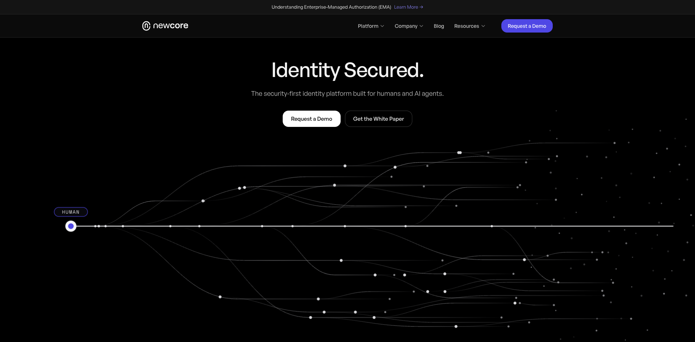
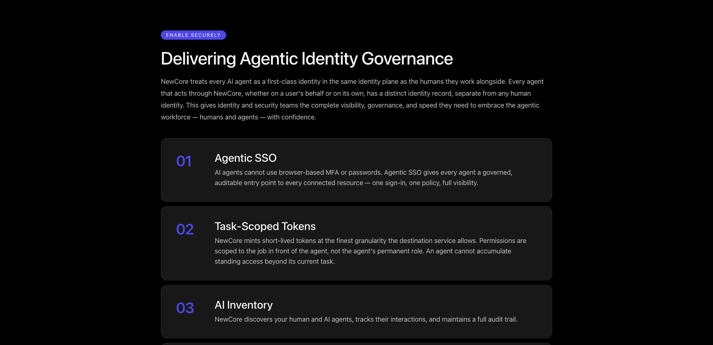

> 调研时间：2026-07-15。本文把官网能力、第三方报道、平台数据与研究判断分开。NewCore 于 2026-06-15 刚结束隐身模式；公开客户、部署量、收入、文档和独立使用反馈均未找到，因此不能把融资规模或产品叙事直接写成市场验证。

## TL;DR

**NewCore 是一家试图重做企业核心身份层的安全公司，不是 AI 员工应用，也不只是给 Agent 发账号。** 它把人类、机器和 AI Agent 放进同一身份平面，通过身份发现、认证安全和 Agent 治理三层能力，控制“谁在行动、代表谁、当前任务能拿到什么 token、每次工具调用是否被允许、事后能否撤销与审计”。[[concept.agentic-identity-control-plane]] [[source.newcore.homepage]]

对 AI 员工赛道而言，NewCore 补的是底层缺口。[[company.paperclip]]、[[company.helio]]、[[company.raft]] 这类产品负责组织、任务和协作；NewCore 要解决的是这些 Agent 进入 CRM、代码库、云和内部系统时，如何获得独立且可追责的生产身份。它公开的四个 Agent 能力是 Agentic SSO、task-scoped tokens、AI inventory 和 machine-speed security。[[source.newcore.agentic-governance]]

公司成立于 2025 年，2026-06-15 带着累计 6600 万美元融资结束隐身。三位创始人分别来自连续网络安全创业、Unit 8200/攻防研究和大型企业 CIO 岗位；投资方为 [[investor.cyberstarts]]、[[investor.index-ventures]] 与 [[investor.evolution-equity-partners]]。官方称团队已超过 50 人，Globes 报道估值约 3 亿美元。**这是强团队和强资本信号，不是强采用证据。** [[source.newcore.launch-66m]] [[source.globes.newcore-funding]]

本轮最重要的判断是：**NewCore 的 Agent 身份叙事抓住了真实问题，但它当前更像一套雄心完整、公开验证尚少的 enterprise IAM 新架构。** 没有客户名、case study、公开 docs/API、可体验产品或可报告的网站流量；task-scoped token 的最细权限仍受目标服务原生 scope 限制。是否真正能“inline on every access request”，取决于连接器覆盖、委托链建模、token broker、目标系统能力和 policy enforcement，而不只是创建一个 agent identity 字段。[[source.newcore.customer-community-search-2026-07-15]] [[traffic.similarweb.newcore-2026-h1]]

## 产品不是一条 Agent 功能，而是三层身份平台

NewCore 官网把平台拆成三层：

| 层 | 公开能力 | 想控制的对象 | 当前证据边界 |
|---|---|---|---|
| Identity Discovery | 从目录、IdP、HR、IGA、PAM、云和 AI 平台发现并关联身份 | 人、服务账号、凭据、Agent、shadow identity | 官网列出 Okta、Entra、Google Workspace、AWS IAM、Claude、ChatGPT、Bedrock、Copilot Studio 等连接对象；无公开连接器清单与覆盖深度 |
| Identity Security | Secure Split Key、VisualMFA、设备绑定认证、恢复机制 | 登录、签名密钥、会话与认证恢复 | 官方设计说明充分；未看到公开安全白皮书细节、第三方测试或事件数据 |
| Human + AI Agent Governance | Agentic SSO、任务级 token、Agent inventory、实时策略 | Agent 身份、委托、权限、工具调用与审计 | 有完整产品叙事；没有公开 docs、演示环境、客户案例或独立实测 |

[[source.newcore.identity-discovery]] [[source.newcore.security]] [[source.newcore.agentic-governance]]

这说明 Agent governance 是 NewCore 的重要差异化，但不是全部业务。创始人 Zohar Alon 在采访中明确说，公司还想拥有 directory、login、SSO、MFA 与 federation 等核心身份服务，直接挑战传统 IAM 厂商。换句话说，AI Agent 是需求加速器和新架构理由；最终商业战场仍是企业身份基础设施。[[source.bankinfosecurity.newcore-interview]]

## Agent 身份控制面如何工作

NewCore 公开模型可以还原成一条控制链：

1. **发现主体**：识别组织里的人类、现有非人身份、AI Agent 与 shadow Agent。
2. **建立独立身份**：Agent 不直接伪装成人，也不只复用静态 service account；每个 Agent 有独立 identity record、生命周期与撤销路径。
3. **记录委托关系**：区分 Agent 自主行动和代表某个用户行动。
4. **按任务铸造 token**：权限只覆盖当前任务，token 短期有效，并收窄到目标服务能表达的最细粒度。
5. **在线执行策略**：认证、token mint 和工具调用实时经过身份层判断。
6. **持续观察与撤销**：维护 inventory、interaction 与 audit trail，出现风险时撤销访问。

[[source.newcore.agentic-governance]]

这条链比“Agent 有自己的账号”严肃得多。真正的对象是 **principal + delegation + scope + policy + enforcement + evidence**。其中任何一段缺失，所谓 AI 身份都可能退化成另一个长期凭据。

### Task-scoped token 是关键能力，也是边界最清楚的一项

NewCore 的表述很谨慎：token 被收窄到“the finest granularity the destination service allows”。这意味着平台可以缩短有效期、按任务选择 scope、集中审计，但不能凭空创造 Salesforce、GitHub 或某个内部 API 原本不支持的资源级权限。

因此评估 task-scoped token 不能只问“有没有 JIT token”，还要问：

- 目标服务能表达什么 scope 与 resource boundary；
- Agent 的任务如何被确定性地翻译为权限；
- 委托用户、Agent app 和 sub-agent 的身份如何绑定；
- retry、工具切换和长任务是否会扩张权限；
- token 离开 broker 后，外部调用是否仍可被中止或撤销。

公开页面没有回答这些实现细节。它证明产品方向，不足以证明跨 SaaS、云和内部系统的 enforcement 已闭合。

### EMA 是 NewCore 押注的标准入口

CTO Amihai Neiderman 将 MCP 的 Enterprise-Managed Authorization（EMA）视为关键变化：企业通过 IdP 集中配置 MCP server 访问，用户不再逐个完成 OAuth consent，身份策略与审计回到组织控制面。NewCore 宣称支持 EMA，并继续向 Agentic SSO、task-scoped token 与实时控制扩展。[[source.newcore.ema]]

EMA 解决的是企业统一授权入口，但仍不自动解决每次动作是否合理。身份正确、用户有权限，不代表 Agent 的这次工具调用符合任务意图。NewCore 若要覆盖后者，就必须把身份层与 tool-call/runtime telemetry 接起来。

## 市场分层：不是所有“Agent 身份”都在做同一件事

NewCore 所在市场至少有四层，不能把所有公司都列成直接竞品：

| 路线 | 代表 | 核心对象 | 与 NewCore 的关系 |
|---|---|---|---|
| 核心 IAM / IdP | Microsoft Entra、Okta、Palo Alto Networks + CyberArk | 人类与企业身份基础设施 | NewCore 直接挑战的 incumbent 层；迁移成本与渠道最强 |
| NHI discovery / security | Astrix、Oasis、Token Security、Aembit、Entro | service account、API key、OAuth app、workload 与 Agent 身份 | 在 inventory、least privilege、risk 与 remediation 上直接重叠 |
| Agent runtime authorization | Arcade | Agent app、委托用户、每次 tool call | 与 NewCore 有重叠，也存在架构分歧 |
| AI workforce / workspace control plane | Paperclip、Helio、Raft、Multica | 组织、任务、协作、预算、工作状态 | 更多是上层客户或互补方；需要身份层才能安全进入生产系统 |

### 一等 Agent 身份 vs “Agent 只是应用”

NewCore 主张每个 Agent 都应成为与人并列的一等身份，即使它代表用户行动也拥有独立记录。Arcade 的公开观点相反：多数多用户 Agent 应被当作应用，通过“应用身份 × 委托用户权限”的交集，在每次工具调用后置授权，而不是给 Agent 创建长期 NHI。[[source.arcade.agents-as-apps-auth]]

两者并非完全互斥。一个生产系统可能同时需要：

- app identity：哪个 Agent 应用发起；
- agent instance identity：哪个运行实例或 sub-agent 执行；
- user delegation：代表哪个用户及其权限边界；
- task/session identity：本次任务与会话；
- resource/action scope：对哪个对象执行什么动作。

真正的竞争点不是哲学命名，而是谁能在企业现有 IdP、OAuth/MCP、SaaS scope 和 runtime 中稳定绑定这几层，并给安全团队一个可执行的 policy surface。

### Oasis 与 Astrix说明品类已在快速合流

Oasis 已公开 Agentic Access Management：分析意图、为每个 session 创建短期身份、执行 policy，并把 prompt、intent、policy、session、action 串成审计链。Astrix 强在跨云、SaaS、CI/CD、vault 与 AI 平台发现 Agent、MCP server、NHI 和 secret，再用 identity graph 映射 owner、权限与资源。[[source.oasis.agentic-access-management]] [[source.astrix.agent-discovery]]

因此 NewCore 不能只靠“为 Agent 建身份”形成长期差异。它需要证明核心 IAM 重构、split-key 安全、迁移速度和 Agent runtime enforcement 能形成一体化优势。

## 团队：强 founder-market fit，也带来强资源启动

| 创始人 | 角色 | 可验证履历 | 对产品的作用 |
|---|---|---|---|
| [[person.zohar-alon]] | 联合创始人兼 CEO | 连续网络安全创业者；Dome9 创始人，后被 Check Point 收购；早期在 Check Point 建 Provider-1 | 熟悉核心安全平台、企业销售和身份厂商的结构性弱点 |
| [[person.amihai-neiderman]] | 联合创始人兼 CTO | Nym Health 创始人；前 Unit 8200 研究负责人；攻防安全研究背景 | 负责 security-first 架构与 Agent 授权研究 |
| [[person.erez-yarkoni]] | 联合创始人兼 CCO | 曾任 T-Mobile USA 与 Telstra CIO | 带来大型企业采购、迁移和运营视角 |

[[source.newcore.about]] [[source.newcore.launch-66m]]

官方称团队在特拉维夫和美国已超过 50 人；LinkedIn 公司页显示“11–50 位员工、约 2000 关注者”。这可能是平台区间滞后，也可能是官方把更广的用工口径计入。报告保留冲突，不把 LinkedIn 区间当精确 headcount。[[source.linkedin.newcore-company]]

招聘结构比人数更能说明阶段：官网同时招聘美国销售开发、Account Executive、Tech Alliances、Sales Engineer、Product Marketing、Field Marketing，以及特拉维夫的 IAM Product Manager、Tech Lead、Security Researcher 和 Backend Developer。**这是一家产品与 enterprise GTM 同时扩张的公司，不是仍在纯研发探索。** [[source.newcore.careers]]

## 融资：6600 万美元确认，轮次命名有冲突

NewCore 官方只确认累计融资 6600 万美元，投资方为 Cyberstarts、Index Ventures 和 Evolution Equity Partners。Index 官方称它在“company's first round”就与团队合作，并披露其与 Zohar 相识超过十年。[[source.newcore.launch-66m]] [[source.index.newcore-investment]]

Globes 援引知情人士称资金由 1600 万美元 seed 和 5000 万美元 Series A 构成、估值 3 亿美元，并列出 Wiz CEO Assaf Rappaport、Talon 前创始人 Ofer Ben Noon、EON 创始人 Ofir Ehrlich、Cyera 联合创始人 Yotam Segev 等个人投资者。其他媒体把前两轮称为 pre-seed 与 expanded seed。**因此本库建立三家机构的高置信投资关系，但不把轮次和单家金额写死到边上。** [[source.globes.newcore-funding]]

这组资本结构本身就是 GTM 资产：

- Cyberstarts 提供以色列网络安全创业网络；
- Index 对创始人有十年以上关系积累；
- Evolution 提供成长阶段与企业软件资本；
- Wiz、Talon、Cyera、EON 创始人构成安全行业的招聘、客户与声誉网络。

## Launch 与 GTM：资本、媒体和行业会议先行

可验证时间线：

| 时间 | 事件 | 含义 |
|---|---|---|
| 2025-01 | 据 BankInfoSecurity，NewCore 成立 | 隐身研发开始 |
| 2026-06-15 | 官网宣布结束隐身并披露累计 6600 万美元 | 公司、产品、融资与类别叙事同日释放 |
| 2026-06-15 至 06-18 | 在 Identiverse Las Vegas 演示 | 直接面向身份安全买家，而不是开发者 launch 平台 |
| 2026-06-24 | CTO 解读 MCP EMA stable | 把行业标准变化绑定到 NewCore 的 Agent 身份叙事 |
| 2026-07 | 美国 sales/marketing 与以色列 R&D 同时招聘 | 从 launch PR 进入 enterprise pipeline 建设 |

[[source.newcore.launch-66m]] [[source.newcore.ema]] [[source.newcore.careers]]

NewCore 没有走 Product Hunt、Hacker News 或 GitHub 开源起量。官网主 CTA 是 Request a Demo，发布渠道是 PR、投资机构文章、身份安全媒体、Identiverse 和 LinkedIn。官方 X 账号在本轮抓取时只有极少关注和内容，说明 X 不是主要增长入口。[[source.x.newcore-profile]]

## 规模与外部反馈：目前只能看到 launch 声量

### 流量

本轮查看 `newcore.com` 的 2026 年 1–6 月第三方流量页面，没有出现可可靠记录的 visits、渠道、地区或关键词数值。公司在 6 月 15 日才公开发布，覆盖不足不等于零访问，也不能由此推断产品没有企业使用。[[source.similarweb.newcore-2026-h1]] [[traffic.similarweb.newcore-2026-h1]]

### 客户与使用证据

官方写“available to enterprise customers today”，但没有披露：

- 客户名称或匿名 case study；
- 已管理身份、Agent、token 或 tool-call 数；
- 产品截图之外的完整 demo；
- docs、API reference、SDK 或公开 integration matrix；
- 定价、合同规模、留存或迁移周期。

Google、Reddit、LinuxDo、V2EX 与官网定向检索均未找到可验证用户报告。这个结论只能写成“本轮未找到”，不能写成“不存在客户”。[[source.newcore.customer-community-search-2026-07-15]]

### 社区讨论

X 上的少量讨论基本由 TechCrunch、融资新闻和身份安全从业者驱动，关注点是“Agent 进入企业后必须回答委托、scope、policy 与 audit”这一命题，不是产品使用体验。中文微信与小红书也以融资转述和赛道科普为主；一条完整小红书样本有 11 个赞、12 个收藏、7 次分享，没有用户评论。[[source.x.newcore-discussion-search]] [[source.weixin.newcore-search-2026-07-15]] [[source.xiaohongshu.newcore-vibehood]]

这说明 **类别叙事已经传播，产品口碑尚未形成**。

## 关键判断与风险

### 1. 真实问题成立，但“Agent 身份”未必是单一新类别

Agent 在生产系统中需要独立归因、委托链、短期权限、撤销和审计，这个问题真实存在；但实现可能落在 IdP、NHI security、PAM、OAuth/MCP runtime 或 Agent control plane 多个层。NewCore 必须证明一体化核心身份平台优于在现有 IAM 上增加 Agent runtime authorization。

### 2. “inline on every access request”是最强 claim，也是最大验证缺口

它意味着 NewCore 要控制认证入口或 token mint，并覆盖所有关键工具调用。任何未接入的 legacy app、直接 API key、local MCP、browser session 或 sub-agent 都可能绕过控制面。公开材料没有说明覆盖率、降级模式和 bypass detection。

### 3. 任务意图到权限的翻译仍是开放问题

“更新三条 CRM 记录”如何确定性地变成可审计 scope？模型提出的 action plan 是否可信？policy 在 retry、tool switch 和 prompt injection 下如何保持？Oasis 已把 intent analysis 明确做成产品，因此 NewCore 会面对相近的技术与销售比较。

### 4. 新架构仍要跨越 IAM 的迁移与信任门槛

身份层一旦故障或被攻破，影响面极大。NewCore 用 Secure Split Key 回答单点签名风险，并声称可 side-by-side 部署、无需 rip-and-replace；但企业最终是否让它拥有 directory、login、SSO 与 token mint，取决于可用性、兼容性、审计报告和迁移证据，而不只是架构优雅。

### 5. 融资和 founder network 可能让公司提前获得大客户，但会掩盖采用真空

6600 万美元、Dome9 履历和安全行业顶级关系足以带来媒体、招聘和 CISO 对话。研究时必须继续等客户证据、产品文档、迁移数据和独立反馈，避免把 access 误写成 product-market fit。

## 持续监控

优先观察：

1. 首批命名客户与 case study；
2. 公开 docs、API、Agentic Skill 与 integration matrix；
3. EMA、MCP、Claude Code、Codex、Cursor 的真实认证流程；
4. Agent 与 sub-agent identity、user delegation、task/session lineage 的数据模型；
5. task-scoped token 在 GitHub、Salesforce、AWS 等目标服务上的实际粒度；
6. Secure Split Key 的技术白皮书、第三方审计与故障模式；
7. 产品从 coexistence 到核心 IdP 替换的迁移案例；
8. 招聘与团队规模变化；
9. 网站流量与社区讨论是否从融资声量转为产品使用。

## 证据库

### S1：官方与主体自述

- [NewCore 官网](https://newcore.com/) · [[source.newcore.homepage]]
- [Human + AI Agent Governance](https://newcore.com/platform/agentic-governance) · [[source.newcore.agentic-governance]]
- [Identity Discovery](https://newcore.com/platform/identity-discovery) · [[source.newcore.identity-discovery]]
- [Identity Security](https://newcore.com/platform/security) · [[source.newcore.security]]
- [Understanding Enterprise-Managed Authorization](https://newcore.com/blog/enterprise-managed-authorization-ema) · [[source.newcore.ema]]
- [NewCore 结束隐身并宣布累计融资 6600 万美元](https://newcore.com/newsroom/newcore-emerges-from-stealth-66m) · [[source.newcore.launch-66m]]
- [NewCore About](https://newcore.com/about) · [[source.newcore.about]]
- [NewCore Careers](https://newcore.com/careers) · [[source.newcore.careers]]
- [NewCore Trust Center](https://trust.newcore.com/) · [[source.newcore.trust-center]]
- [Index Ventures 投资文章](https://www.indexventures.com/perspectives/rebuilding-identity-for-the-agentic-era-our-investment-in-newcore/) · [[source.index.newcore-investment]]
- [NewCore LinkedIn](https://www.linkedin.com/company/newcore-id/) · [[source.linkedin.newcore-company]]
- [Zohar Alon LinkedIn](https://www.linkedin.com/in/zoharalon/) · [[source.linkedin.zohar-alon]]
- [Amihai Neiderman LinkedIn](https://www.linkedin.com/in/amihai-neiderman/) · [[source.linkedin.amihai-neiderman]]

### S2：强第三方与平台估算

- [Globes：融资结构与估值](https://en.globes.co.il/en/article-israeli-workforce-identity-co-newcore-raises-66m-1001545972) · [[source.globes.newcore-funding]]
- [BankInfoSecurity：Zohar Alon 深度采访](https://www.bankinfosecurity.com/newcore-launches-66m-to-rebuild-identity-for-ai-agents-a-31974) · [[source.bankinfosecurity.newcore-interview]]
- [Jerusalem Post：发布与估值报道](https://www.jpost.com/business-and-innovation/article-899492) · [[source.jpost.newcore-launch]]
- [网站流量观察](https://www.similarweb.com/website/newcore.com/) · [[source.similarweb.newcore-2026-h1]]

### S3：社区与竞品公开观点

- [X 讨论检索](https://x.com/search?q=NewCore%20identity%20AI%20agents&src=typed_query) · [[source.x.newcore-discussion-search]]
- [小红书完整样本](https://www.xiaohongshu.com/explore/6a32496d000000001102fe68) · [[source.xiaohongshu.newcore-vibehood]]
- [微信搜索快照](https://weixin.sogou.com/weixin?type=2&query=NewCore%20AI%20%E8%BA%AB%E4%BB%BD&page=1) · [[source.weixin.newcore-search-2026-07-15]]
- [Arcade：Agent 不需要长期 NHI 的架构观点](https://www.arcade.dev/blog/why-agents-dont-need-non-human-identity/) · [[source.arcade.agents-as-apps-auth]]
- [Oasis Agentic Access Management](https://www.oasis.security/agentic-access-management) · [[source.oasis.agentic-access-management]]
- [Astrix Agent Discovery](https://astrix.security/product/ai-agent-discovery/) · [[source.astrix.agent-discovery]]

### S4：待验证边界

- [[source.newcore.customer-community-search-2026-07-15]]：本轮未找到客户、公开 docs/API、独立评测或生产使用反馈；这是检索结果，不是不存在证明。
