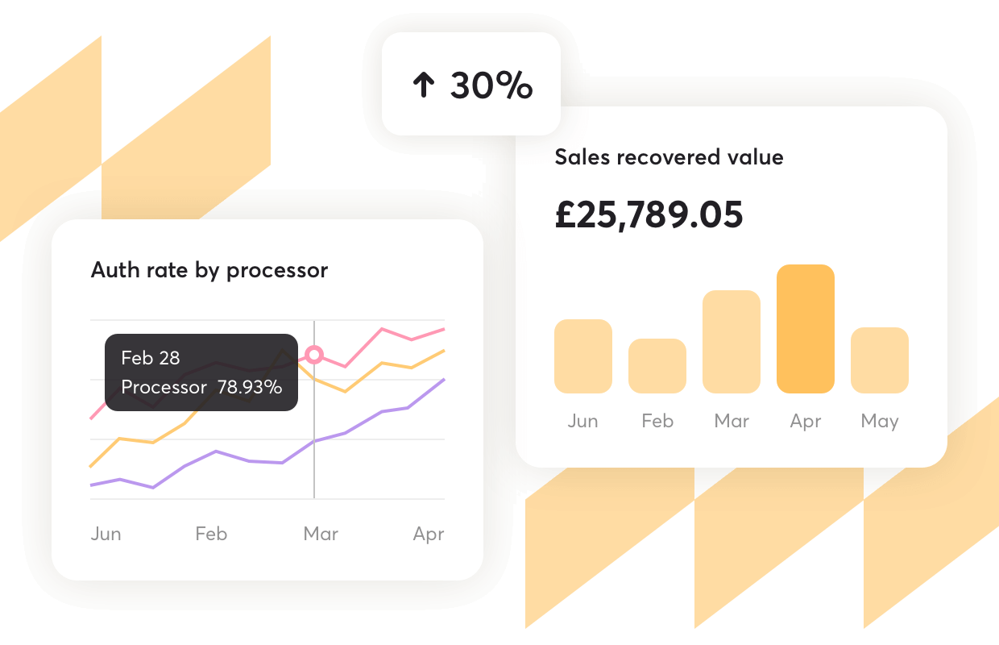
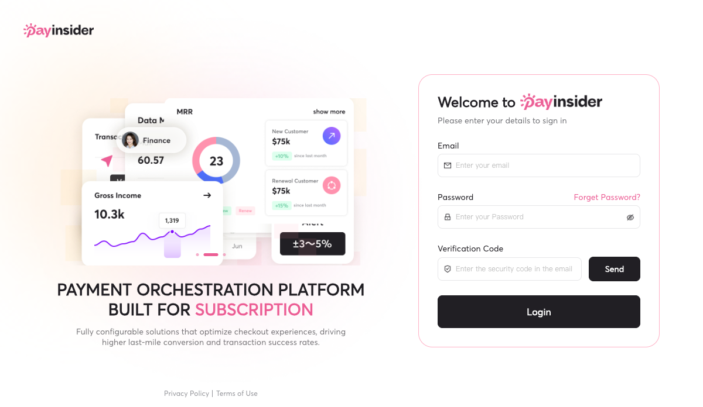
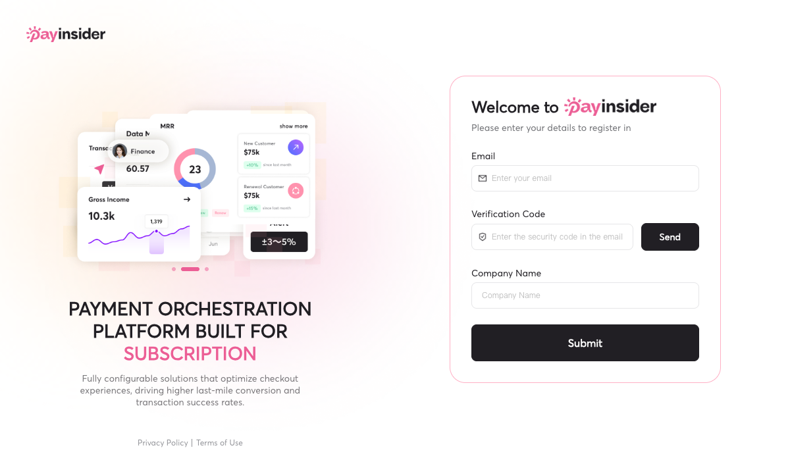

# PayInsider

## TL;DR

PayInsider 是一家从中国出发、面向跨境订阅业务的支付编排与收入运营平台。它接在商户和 Stripe、Adyen、Checkout.com、Worldpay、dLocal、Xendit 等支付服务商之间，用统一接口处理 Checkout、订阅、支付路由、失败重试、客户门户、对账和支付数据分析。它不是已经验证的 Merchant of Record，也没有证据表明自己持有客户资金；更准确的理解是：**商户保留自己的支付服务商账户，PayInsider 负责把多家 PSP 编排成一套持续运行的订阅支付系统。**

这家公司公开声量很低，却不是空壳。公开 v2.0 API 文档覆盖 Checkout、订阅、商品与价格、客户、优惠券、订单、退款和 Webhook；商户后台与沙盒注册可以真实打开；公开前端包中能看到路由、对账、拒付、邮件、订阅、产品和开发者模块。产品域 `pay-insider.com` 在 2026 年上半年获得约 27,650 次第三方估算访问，87.32% 来自移动 Web。这里可能混入面向消费者的结账流量，所以不能把访问量换算成商户数、GMV 或收入，但它至少说明产品域并非无人访问。

PayInsider 真正的产品切口不是泛泛的“AI 智能路由”，而是 **订阅支付连续性**：一次扣款失败会延伸出凭证可用性、PSP 切换、重试时机、dunning、客户更新支付方式、退款、拒付、税务和对账等一串状态。官网把这些能力放在同一产品里，符合真实支付运营的结构。它与 Primer、IXOPAY、Gr4vy、Spreedly 争夺支付编排，也与 Stripe Billing、Chargebee、Recurly、Paddle 争夺订阅收入管理。

商业上更像高客单价、销售驱动的企业软件。创始人说首个客户来自她手工分析客户的地域、支付和漏斗数据，再拿收入改善模型反向销售；后续中国客户主要靠大客户转介绍。公开站残留的已撤下套餐页曾写 `$2,500 / $5,500 / $10,000` 月费，但页面现在会跳到 404，只能作为历史定价信号，不能视为当前报价。

截至 2026-07-14，没有找到公开融资、估值、客户名单、GMV、交易笔数或独立用户案例。创始人访谈称公司由两位女性创始人自筹资金、未接受外部融资。产品真实性强于公开采用证据，**第一家可公开核验的美国商户、真实成功率基线和客户案例**是下一阶段最重要的验证点。

## 它解决的不是“一次支付”，而是一条长期状态链

普通 Checkout 产品容易把问题缩成“把卡扣成功”。订阅业务的真实问题更长：

1. 用户第一次订阅时，收集并安全保存支付凭证；
2. 后续周期扣款时，处理卡过期、余额、风控、3DS 和网络拒绝；
3. 一个 PSP 失败后，决定是否、何时以及通过谁重试；
4. 价格、套餐、折扣、试用、按量计费和 prorations 改变应收金额；
5. 用户需要自助更新付款方式、取消或恢复订阅；
6. 商户要把订单、退款、拒付、手续费和银行入账对齐；
7. 运营团队需要看到 MRR、ARR、churn、授权率和挽回收入。

PayInsider 把这些环节收进一个产品，是它比“聚合多个支付接口”更有意义的地方。[[concept.subscription-payment-continuity]]

## 产品面

### 支付编排与路由

官网称可连接 100+ 支付网关、风控服务与其他服务，通过统一接口管理多 PSP，并按地理位置、币种、成本、成功率、失败原因和风险进行路由或重试。公司宣称智能路由可提高 7%-10% 支付成功率，但没有公开客户基线、样本量和实验方法，这些数字只能作为官方主张。[[source.payinsider.homepage-2026-07-14]]

### 订阅与收入恢复

产品支持月付、年付、按量和混合计费、试用、折扣、proration、dunning、发票和客户门户。官网称智能重试可挽回 50% 的失败支付；这同样没有独立案例。比数字更可信的是产品结构：重试、客户通知、支付方式更新、订阅状态和对账出现在同一后台中。

### Checkout、商品和客户

公开 API 文档展示了 Full Checkout Element v2.0：服务端通过 `POST /router/checkout/accessToken` 获取访问凭证，前端载入 PayInsider SDK，嵌入商品、优惠券、账单地址、物流地址和支付组件。左侧文档还包括 Embedded Payment Element、Direct Card Payment、Customer Portal、Subscription、Products & Pricing、Customer、Marketing Tools、Order、Refund 和 Webhooks。[[source.payinsider.docs-api-2026-07-14]]

### 对账、分析和支付运营

官网和商户后台公开前端包显示，产品还有智能对账、手续费与现金流核对、交易与退款、风险和拒付、支付洞察报告、邮件模板、优惠券、PSP/收单行/终端配置、税务国家配置和开发者推送记录。这是“支付运营系统”而非单个 API 的证据；但前端模块存在不等于每个模块都已被客户采用。[[source.payinsider.merchant-app-2026-07-14]]

## 产品是否真实存在

本轮没有完成真实付款，但完成了四层产品面核验。

### 1. 商户入口

`merchant.pay-insider.com` 会进入真实登录界面，要求邮箱、密码和验证码。

### 2. 沙盒注册

官网免费试用按钮会请求官方注册接口，并返回可打开的沙盒注册页。表单要求验证邮箱和公司名称。采集时生成的临时 token 未保存、未写入本库。

### 3. API 文档与版本记录

公开文档有具体 endpoint、SDK、请求流程和对象模型。版本记录显示：

| 日期 | 公开版本记录 |
| --- | --- |
| 2023-10-13 | v1.2.0，Order push |
| 2024-06-04 | v1.5.0，交易推送字段 |
| 2024-09-01 | v1.7.0，state 字段 |
| 2024-09-24 | v1.8.0，Checkout |
| 2024-11-03 | v2.0.0，Card SDK、订阅事件、商品/用户/优惠券 API |
| 2024-11-24 | v2.2.0，自定义交易字段 |
| 2025-03-25 | v2.6.0，Coupon API |

这条时间线比香港主体成立更早。可能是前置团队或技术、后补版本记录，或业务由其他主体承接；公开材料没有解释，不能自行补齐。[[source.payinsider.changelog-2026-07-14]]

### 4. 公开前端能力面

商户后台 JavaScript 包中能核实到 Dashboard、Transactions、Refunds、Insight Reports、Risk/Chargeback、Merchant Sites、Routing、Reconciliation、Coupons、Email、Products、Subscriptions、Customers、Customer Portal、Payment Links、Checkout、PSP/Acquirer 配置和开发者集成模块。它能证明工程面广度，不证明生产稳定性、付费客户数量或模块采用率。

## 商业模式与 GTM

### 先诊断损失，再卖系统

Lin Wang 在 2026 年创始人访谈中描述了第一单：她先手工分析潜在客户的地域、支付方式和转化漏斗，估算路由与支付优化可能带来的收入改善，再以诊断结果推动合作。首个大客户随后带来转介绍，中国客户业务由此增长。[[source.payinsider.founder-interview-2026-05-26]]

这是一条典型的 service-led software 路径：

1. 用支付数据诊断建立信任；
2. 以明确的收入损失或授权率问题切入；
3. 连接客户现有 PSP，而不是要求完全替换；
4. 把一次咨询转成持续的软件和支付运营关系；
5. 依赖客户转介绍扩张。

官网仍提供“过去三个月支付数据免费诊断”，说明这不是早期偶然动作，而是当前获客入口。

### 历史定价透露企业软件形态

Sitemap 暴露了一个已撤下的套餐页。服务器返回的页面内容曾列出：

| 套餐 | 历史页面月费 | API Calls | 支付服务商 |
| --- | ---: | ---: | ---: |
| Basic | $2,500 | 18,000 | 3 |
| Pro | $5,500 | 80,000 | 5 |
| Enterprise | $10,000 | 200,000 | 不限 |

页面还按层级列出订阅管理、监控、PCI 卡信息保存、风控名单、Checkout、路由、SLA、微信支持和客户经理。浏览器水合后已跳到 404，页面内部数字也有格式和口径不一致，所以这不是当前公开报价。它只支持一个较弱判断：PayInsider 曾按月费、API 量和 PSP 数量设计高客单价套餐，而不是按开发者自助低价起步。[[source.payinsider.hidden-pricing-2026-07-14]]

### 中国出海客户与美国本土客户要区分

创始人称客户约 80% 的交易量来自美国和欧洲、主要使用美元；同一访谈又说美国市场最大的缺口仍是第一家美国商户。两句话并不冲突：现有客户很可能是中国或其他地区的全球商户，消费者和交易发生在欧美。**交易地域不能直接当作客户总部地域。**

团队目前想把在中国形成的诊断和转介绍路径复制到美国，但支付软件在美国需要本地信誉、客户案例、合规和服务能力，第一家本土标杆会比泛流量更重要。

## 团队、公司与融资

### 两位创始人

- [[person.lin-wang-payinsider]]：联合创始人兼 CEO。LinkedIn 位于 San Mateo，约 2,491 followers；创始人访谈和搜索材料显示有六年以上支付经验，偏商业、客户与市场。
- [[person.pari-jing-payinsider]]：联合创始人兼 CTO。LinkedIn 位于香港新界；访谈称有八年工程经验。

LinkedIn 公司页标注 11-50 人，但 People 页公开可见人数很少，第三方搜索也只能确认少量成员。更稳妥的结论是：公开页面自报 11-50 人，实际团队规模和全职结构尚未独立核实。[[source.payinsider.linkedin-company-2026-07-14]]

### 法律主体时间线

- **2024-03-22**：香港公司注册处记录 `Hong Kong Payinsider Limited / 香港派盈賽科技有限公司` 成立，商业登记号 76353221。[[source.payinsider.hk-registry-2024-03-22]]
- **2024-07-30**：公司更名为 `Payinsider Limited / 派盈賽科技有限公司`。[[source.payinsider.hk-name-change-2024-07-30]]
- **2024-11-13**：鄂尔多斯高新区相关政府报道把深圳市派盈赛科技有限公司描述为 2024 年成立的一站式支付数据平台，并称其 4 月在鄂尔多斯注册子公司。[[source.payinsider.ordos-government-2024-11-13]]

隐私政策最后更新于 2024 年 2 月，早于香港主体成立；文档还有未替换的模板文字，并把香港隐私监管机构写成 “Information Commissioner's Office” 却链接 PCPD。官网“服务协议”实际也指向隐私页，未找到公开服务条款。这说明网站法律文档存在明显维护债务。[[source.payinsider.privacy-2024-02]]

### 融资

本轮没有找到 Crunchbase、PitchBook、媒体融资稿、投资机构 portfolio 或公司公告中的融资记录。Lin Wang 的 2026 年访谈明确称公司由两位创始人自筹资金、没有外部资本。

因此当前口径是：**没有已披露融资或估值，创始人自述 bootstrapped。** 这不等于通过全部司法辖区和股东记录证明“从未融资”。

## 规模与流量

PayInsider 有两个必须分开的域：

- `payinsider.com`：营销官网，本轮 Similarweb 没有可用流量数据；
- `pay-insider.com`：产品基础域，包含商户后台、沙盒、SDK、Checkout 与资源子域。

[[traffic.similarweb.payinsider-2026-h1]] 对产品域及其子域的 2026 年 1-6 月估算为：

- 总访问量约 27,650；
- Desktop 12.68%，Mobile Web 87.32%；
- 全球排名约 #2,909,953；
- 美国排名约 #795,487；
- 可见搜索词几乎全是品牌/同名噪声，没有形成 SEO 规模。

87.32% 的移动占比不像典型 B2B 后台，较可能来自消费者打开的托管 Checkout 或支付页面。它说明产品域进入了交易流程，但不能回答有多少商户、多少真实支付、多少重复访客。月度渠道、地域、互动和独立访客因样本太小而不可用。[[source.similarweb.payinsider-2026-h1]]

## 社区与外部验证

本轮扫描了 X、HN、Reddit、Product Hunt、V2EX、Linux.do、即刻、微信和小红书：

- X 精确搜索没有有效账号或讨论；
- HN、Reddit 主要是同名误命中；
- Product Hunt、V2EX、Linux.do、即刻没有有效结果；
- 微信与小红书结果是无关内容；
- LinkedIn 公司页没有公司动态；
- Facebook 只有 2024 年封面更新，几乎无关注与互动；
- 官网客户案例仍写 “coming soon”，没有公开客户名单。

因此目前不能评价用户满意度、稳定性、支持质量或真实成功率。更准确的判断是：**公开社区样本不足，产品和私域销售跑在公开口碑之前。** [[source.payinsider.community-scan-2026-07-14]]

## 竞争位置

| 层 | 代表产品 | PayInsider 的位置 |
| --- | --- | --- |
| 支付编排 | Primer、IXOPAY、Gr4vy、Spreedly、APEXX | 直接竞争；PayInsider 更强调订阅连续性和中国出海客户服务 |
| 订阅计费与收入恢复 | Stripe Billing、Chargebee、Recurly | 功能重叠；PayInsider 试图同时控制多 PSP 路由与对账 |
| MoR / 全球销售 | Paddle、Lemon Squeezy、Dodo Payments、[[company.clink]] | 邻近而非完全同类；未验证 PayInsider 以 MoR 身份承担税务和转售 |
| Agent 支付 | [[company.clink]]、[[company.skyfire]]、[[company.sapiom]] | 当前不是直接产品竞争；PayInsider 只有未来 Agent commerce 叙事，没有公开 Agent-native API 或授权产品 |
| 商户自研 | 大型订阅商户内部支付团队 | 创始人认为这是长期最大竞争者：规模足够后，客户可能自己建路由和数据层 |

PayInsider 的优势若成立，不在“连接数量”本身，而在于把 **跨境 PSP 选择、支付数据诊断、订阅收入恢复和持续运营服务**绑在一起。它的弱点也来自同一处：这条路径依赖行业经验、客户信任和手工服务，扩张速度可能慢于纯自助 API。

## Agent commerce：战略选项，不是当前产品

Lin Wang 认为 Agent 付款最终仍需落到传统支付网络、结算、对账、拒付、FX 和合规，PayInsider 希望在这条链中扮演角色。这个判断与公司现有能力相容，但本轮没有看到 Agent 身份、预算、委托、支付凭证隔离、402 workflow 或 Agent SDK。

所以当前最稳妥的表达是：PayInsider 具备未来承接 Agent commerce 的传统支付运维基础，但还不是已验证的 Agent 支付产品。把它直接归为 Agent payment 会把未来叙事误写成当前能力。

## 关键判断

### 1. 产品真实度显著高于公开声量

商户入口、沙盒注册、API Reference、版本记录和公开前端模块相互印证，说明公司至少建设了一套相当完整的支付产品。社区零讨论不能据此否定产品；支付 B2B 也常通过私域销售和客户转介绍增长。

### 2. 真正的 wedge 是订阅支付连续性

多 PSP 只是手段。商户真正购买的是授权率、失败恢复、订阅留存、对账效率和收入可预测性。把 PayInsider 只写成“支付聚合”会丢掉它最有价值的产品结构。

### 3. GTM 是诊断驱动，而非开发者自助

免费支付诊断、手工 ROI 模型、历史高月费套餐和转介绍路径共同指向 enterprise sales。它的增长瓶颈不是官网访问量，而是能否获得可信支付数据、证明增量收入并建立本地标杆。

### 4. 中国出海经验是起点，不是美国 PMF 证明

现有客户交易发生在欧美，说明团队理解跨境场景；但第一家美国本土商户仍是缺口。消费者地域、交易币种、商户总部和销售市场必须分开看。

### 5. Bootstrapped 带来产品深度，也限制信任扩张

没有外部资本可能迫使团队从真实收入出发，避免为 Agent 叙事过度建设；同时支付行业需要合规、PSP 合作、客户成功和本地销售，资本与品牌不足会放大扩张难度。

## 风险与待验证

- **客户与规模**：没有公开客户名、GMV、交易笔数、收入、商户数、留存或授权率基线。
- **效果数字**：7%-10% 授权率提升、50% 失败支付恢复、15% 失败降低等都是公司主张。
- **监管与合同角色**：未找到公开服务条款，尚不清楚各市场中的 processor、sub-processor、技术服务商或资金责任边界。
- **PCI**：官网称 PCI DSS Level 1，本轮没有找到公开 AoC 独立核验。
- **文档维护**：API 示例、生产/沙盒 URL、隐私模板和 Terms 链接存在明显不一致。
- **时间线**：文档版本早于公司主体与创始人口径，前置团队、技术或法律主体未知。
- **集成成熟度**：官网称 100+ 连接，公开 docs 的 Connections 页面又显示 integrations coming soon；需要真实账号确认标准连接的覆盖和完成度。
- **定价**：旧套餐页已撤下，当前商业报价、计费口径与合同期限未知。
- **美国市场**：缺少本土标杆客户、独立案例与本地支付合作证明。
- **Agent 方向**：当前只有战略叙事，没有已发布的 Agent-native 产品面。

## 证据边界

- **S1 官方/一手**：官网、产品页、API 文档、商户与沙盒入口、隐私政策、香港公司注册记录。
- **S2 第三方强信号**：政府项目报道、LinkedIn、Similarweb 估算、创始人直接访谈。访谈中的客户与融资说法仍是创始人口径。
- **S3 社区弱信号**：多平台搜索结果；当前主要结论是没有形成可用样本。
- **S4 待核验**：已撤下定价、客户效果数字、PCI AoC、客户规模、真实集成数量、美国 PMF 与 Agent 产品。

## 证据库

- 官网：<https://www.payinsider.com/>
- API 文档：<https://docs.payinsider.com/>
- API Reference：<https://docs.payinsider.com/Checkout/CheckoutIntegration/HostedCheckout>
- Version Log：<https://docs.payinsider.com/Introductions/VersionLog>
- 商户后台：<https://merchant.pay-insider.com/>
- 隐私政策：<https://www.payinsider.com/privacypolicy>
- 创始人访谈：<https://www.chaintech.co/post/lin-wang-payment-orchestration-ai-native>
- 香港公司注册处：<https://www.cr.gov.hk/docs/wrpt/RNC063/RNC063L_20240318.csv>
- 鄂尔多斯政府项目报道：<https://eedsgtjt.cn/contents/13/13475.html>
- LinkedIn：<https://www.linkedin.com/company/payinsider/>
- Facebook：<https://www.facebook.com/payinsider>

关联判断：[[note.payinsider-product-takeaway-2026-07-14]]；过程记录：[[note.payinsider-research-run-2026-07-14]]。
