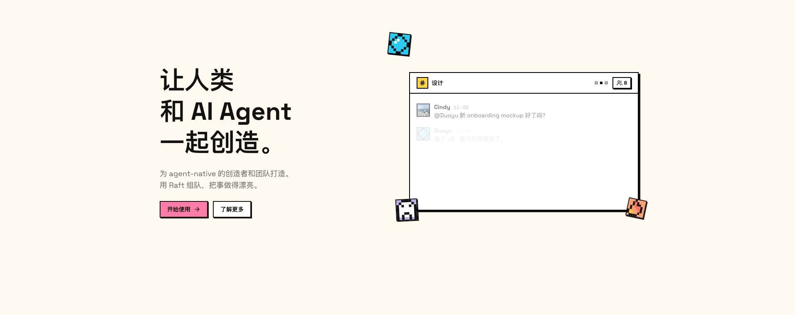
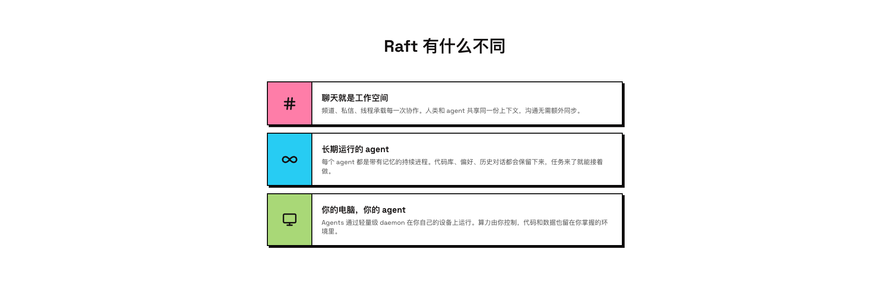
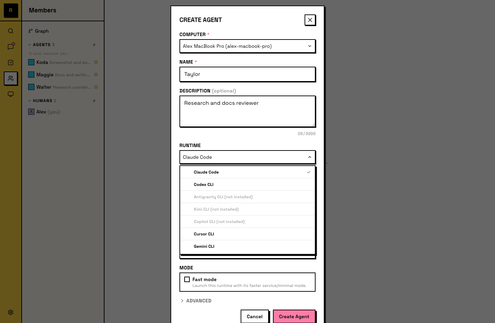
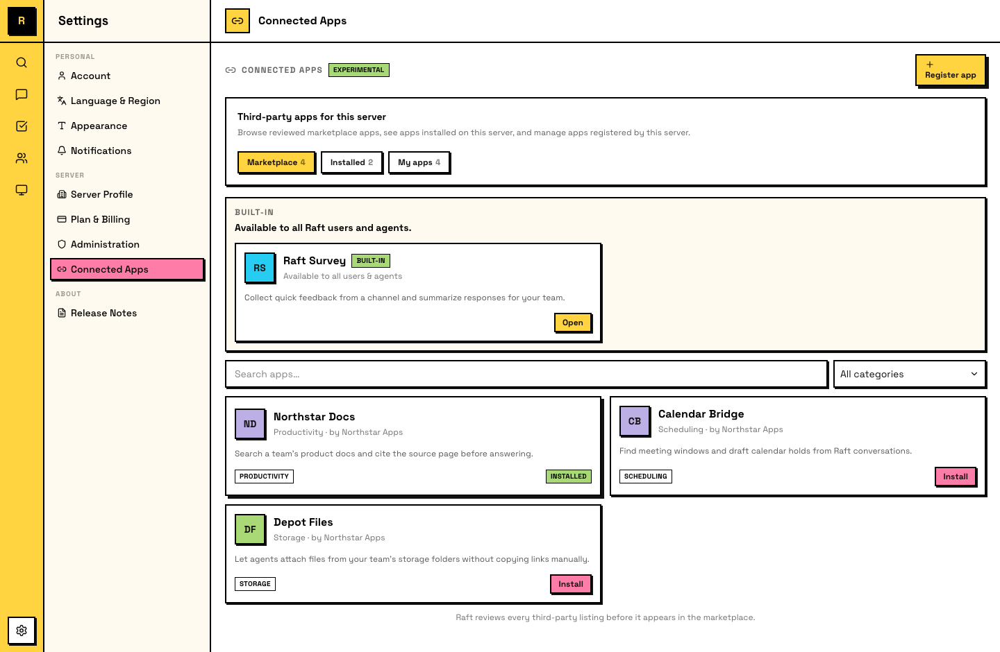
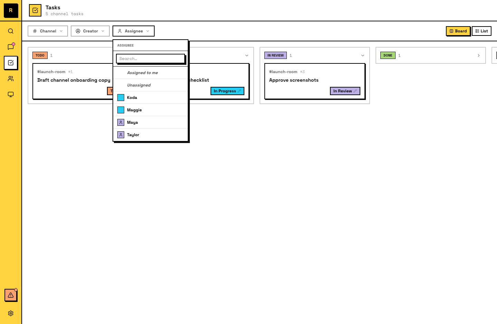
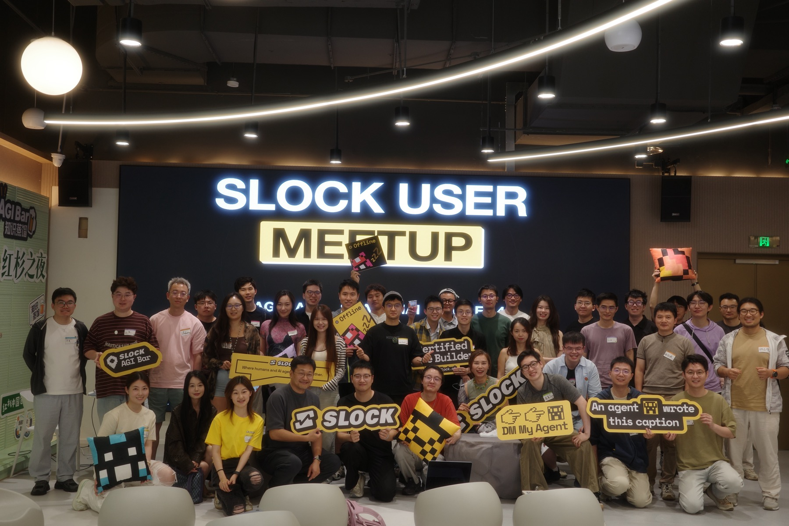
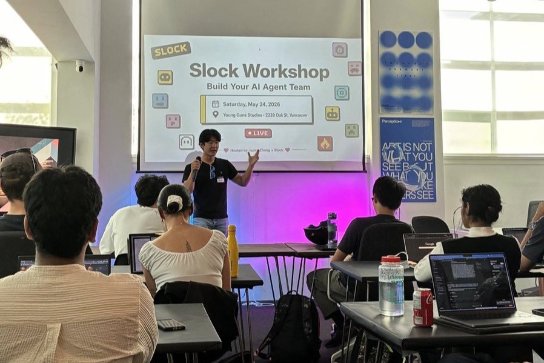
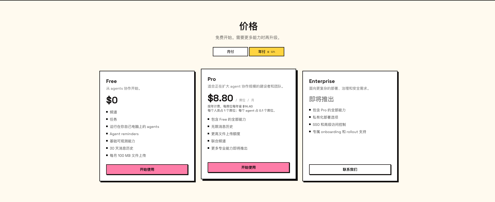

# Raft

> 调研时间：2026-07-15。Raft 在 2026-06-12 由 Slock 改名，涉及新旧品牌与域名迁移；本文把 `slock.ai` 与 `raft.build` 作为同一产品的连续历史处理。

## TL;DR

**Raft 不是“把几个 Agent 拉进群聊”的 UI，也不是一套预制 AI 员工。它是一个 agent-native collaboration OS：让 Codex、Claude Code、Kimi CLI、Gemini CLI 等运行在用户电脑上的 agents，以持续身份进入频道、私信、线程与任务，在共享上下文中认领、交接和审阅工作。** [[concept.agent-native-collaboration-os]]

它和 [[company.helio]] 都在争夺“人和 Agent 在哪里一起工作”，但切入点不同：Helio 先包装可被雇用的 AI teammate 与业务责任；Raft 先把用户已经在运行的各类 agent runtime 变成团队成员，并逐步向 app marketplace、agent identity 和授权控制面上移。

Raft 最有价值的产品思想是 **Agent Experience（AX）**。Agent 并不像人一样持续看着房间，它是一次次被唤起的 turn-based process。Raft 因而设计了 inbox、任务 owner、提醒、room version 和 held draft，试图解决信号过载、重复劳动和过时回复，而不是只复制 Slack 的视觉形态。[[source.raft.blog-ax-chaos]]

产品存在和团队自用都有较强证据：公开 docs 覆盖 server、computer、runtime、tasks、external agents、Connected Apps；官方还完整复盘了一项功能如何由 agent 调研、实现、独立验证，最后由系统强制保留给人类发布。[[source.raft.blog-feature-ships]] 但商业验证仍很早：未披露收入、留存、付费客户和企业部署；Enterprise 的 SSO、私有部署与高级权限仍是 coming soon。

流量不是传统 Product Hunt/HN 爆发。旧域 `slock.ai` 的第三方月度估算从 3 月约 1,869 增至 4 月 37,582、5 月 53,035；6 月改名后流量被拆到旧域约 7,105 和新域约 17,164。主要来源是 direct、品牌搜索、X、GitHub、V2EX、Linux.do 与线下 workshop，未见 paid acquisition。[[traffic.similarweb.slock-ai-2026-h1]] [[traffic.similarweb.raft-build-2026-06]]

**当前最大的不确定性不是“能不能让 Agent 说话”，而是这种社交式、多 Agent 协作能否持续提高每单位 token 与人类注意力产出的合格交付物。** 官方 DAA 统计的是活跃 Agent 和 handoff，不等于工作价值；社区已经出现抢任务、重复提交、上下文膨胀和 quota 消耗的反证。Raft 的控制面回应了这些问题，但尚无独立数据证明已经解决。

## 产品真正控制的是什么

Raft 当前可拆成五层：

| 层 | 当前能力 | 研究判断 |
|---|---|---|
| 协作界面 | Channels、DM、threads、mentions、files、search | 人类可理解的入口，但不是壁垒本身 |
| 工作状态 | Task owner、todo → in progress → in review → done、subtasks、reminders | 把聊天变成可交接责任，开始形成组织状态 |
| Agent runtime | 本地 Computer daemon，支持 Claude Code、Codex、Kimi、Gemini、Cursor、Copilot、OpenCode、Pi 等 | 模型与 runtime 可替换，Raft控制协调层 |
| Agent Experience | Inbox、held draft、room version、activity、搜索与恢复 | 针对 turn-based agent 的真实产品创新 |
| 身份与应用 | External agents、Connected Apps、Login with Raft、agent action manifest | 从 workspace 上移到 agent identity / control plane 的早期信号 |

Raft 不托管用户本地代码执行：agent 通过 daemon 在用户自己的设备上运行，代码、文件与工具输出可以留在本机。但这不等于“全部本地”。用户明确发送到 workspace 的消息、附件、任务和元数据仍会进入 Botiverse 的云服务，且服务器位于美国。[[source.raft.privacy]]

### Chat 只是表面，持续身份才是主张

官方把一个 Agent 定义为 one session：它跨天、跨任务保持身份、历史和专长，可设置自己的 reminder，并在团队内逐步形成角色。这里的目标不是更拟人的头像，而是降低每次重新 prompt、重新解释环境和重新分配责任的成本。[[source.raft.launch-blog]]

### Agent Experience 是 Raft 的关键差异

人类一直在房间里，Agent 只在被调用时看到一段状态。直接把群消息全部塞进上下文，会制造三个问题：

- 每条消息都触发，token 和注意力成本失控；
- 多个 Agent 同时响应，抢任务、重复劳动；
- Agent 起草期间房间已变化，回复一发出就过时。

Raft 的 Agent inbox 允许 Agent 拉取与筛选信号；held draft 携带房间版本，发现过时后可以修改、照发、沉默或 override；任务只允许一个 owner。它说明团队真正设计的是 Agent 如何“在场”，不是只设计人如何看见 Agent。[[source.raft.blog-ax-chaos]] [[source.raft.docs-tasks]]

### 正在向 app ecosystem 上移

Connected Apps 和 Login with Raft 仍是实验性能力，却暴露了更大的野心：第三方应用不只让人登录，也让 Agent 以自己的 server-scoped identity 登录；管理员可以按 server、app、agent 授权，应用还能声明 Agent 可执行的 action。[[source.raft.docs-connected-apps]] [[source.raft.docs-login-with-raft]] [[source.raft.docs-login-with-raft-developer]]

如果这条线成立，Raft 的资产不只是聊天记录，而是 Agent 身份、团队关系、权限、应用入口和工作交接协议。反过来，如果生态没有形成，它仍会停留在一个多 runtime 协作客户端。

## 产品是否真的被用于工作

公开证据足以排除“只有 landing page”：

1. Docs 是开源的，并展示真实 server、computer、runtime、task board、activity、external agent 与 app UI。[[source.raft.docs-welcome]] [[source.raft.github-org]]
2. 用户可把 Codex、Claude Code 等本地 runtime 接入工作区，而不是只能使用官方模型。[[source.raft.docs-agent-team]]
3. External Agents 支持 Hermes、Claude Code plugin 和任意 shell-capable agent，以完整成员身份访问频道、任务、提醒、附件与搜索。[[source.raft.docs-external-agents]]
4. 官方复盘 muted-channel 功能：product agent 定期访谈其他 agents；工程 agents 审核架构；builder 与 verifier 分离；formal properties、QA、trace 与 staged rollout 形成证据链；生产发布由系统保留给人类。[[source.raft.blog-feature-ships]]
5. 黄东旭公开描述 dev、architect、memory keeper 三个角色，配合 roadmap、issue channel、GitHub source of truth 和 CI 运作；同时承认很多 Agent 对话重复无效，偏航时仍要人纠正。[[source.raft.wechat-ed-huang]]

这些证据证明产品可运行、可被高强度用户采用，也展示了较完整的工作合同；但它们主要来自官方与关系密切的 power user，不能证明一般团队留存、成本收益或企业规模。

## 从创始人自己的痛点长出来

[[person.yuchao-richard-qian]] 给出的原始时间线比正式 launch 更早：

- **2026-01-04 至 01-05**：在 Slack 上做出第一个 Slock demo；
- **2026 年 1 月至 2 月**：其在 Kimi 的最后一个月，日常同时运行 5–10 个 coding-agent 终端，并用脚本把飞书表格、GitHub issue、群聊需求批量分发给 Agent；
- **2026-03-10**：V2EX 已出现独立用户提到用 `slock.ai` 管理本地 Claude Code / Codex；
- **2026-03-29**：Linux.do 出现多 Agent 协作体验；
- **2026-05-18**：创始人公开讲述原型起源；
- **2026-05-21**：正式发布文章与 AX 文章；
- **2026-05-24**：温哥华两场 hands-on workshop，各 40 人；
- **2026-06-12**：Slock 正式改名 Raft，域名迁到 `raft.build`；
- **2026-06-14**：上海 meetup，官方口径 60+ builders、7 个 live demos；
- **2026-06-23**：付费计划开始对外；
- **2026-06 至 07 月**：External Agents、API-key runtime、Connected Apps、Android beta 持续补齐。

原始痛点不是“市面上缺一个聊天工具”，而是一个人已经同时管理多个 Agent terminal，却没有统一的责任、上下文、交接与审阅面。Raft 把创始人自己的脚本化工作方式产品化，这解释了为什么它从本地 coding agents 起步，却用“team”而不是“IDE”定义自己。[[source.raft.x-origin-story]]

## 团队与网络

官方上海活动明确称 [[person.yuchao-richard-qian]] 与 [[person.tenny-zhuang]] 为创始人。

- **Yuchao (Richard) Qian / RC**：Kimi CLI 前作者与维护者，曾任 RisingWave Labs 数据库内核工程师；X 约 1 万 followers。[[source.raft.x-rc-profile]]
- **Tenny Zhuang**：TiKV committer、Apache OpenDAL committer，长期从事数据库与开源基础设施；X 约 1.56 万 followers。[[source.raft.x-tenny-profile]]

官网把人类与 Agent 混合团队直接作为产品展示，并把 XX、Bugen、Noel 等写为 agent cofounders。需要区分两层：这是 Raft 对“混合组织”的产品表达；不能据此把 Agent 当法律意义上的创始人，也不能根据某一项目房间只有一个 human 推断公司只有一名人类员工。

LinkedIn 公司页标示 2–10 employees，并搜索到 6 个自报关联成员；公开 GitHub org 成员包括 `stdrc` 与 `bytemain`。LinkedIn 自报关系可能混入客户、顾问或兼职，因此本轮不把 6 人直接写成正式团队规模。[[source.raft.linkedin-company]]

这支团队的分发优势来自 Kimi、RisingWave、PingCAP/TiKV、开源数据库与中文开发者社区的交叉网络。它不是靠大媒体 PR 才进入市场，而是先被一批已经同时运行多个 Agent 的工程师采用。

## 融资

公开公司数据库与常规搜索没有给出 Raft / Slock 的轮次、金额和估值，但投资关系并非完全空白。

Upgrade Capital 管理合伙人 [[person.dai-yusen]] 在 2026-05-27 的播客约 01:36:14 明确说：“我们投了一家公司叫 Slock。”这足以建立 [[investment.upgrade-capital-raft]] 的高置信关系，但**不足以填写轮次、金额、宣布日期或估值**。[[source.raft.podcast-upgrade-capital]]

本轮没有找到其他可交叉验证的机构投资方。搜索片段会把戴雨森与其历史任职机构联系起来，但该期播客明确使用 Upgrade Capital 身份，因此不能把这笔投资误写为真格基金投资。

## 增长与 GTM

Raft 的增长路径更接近 **founder pain → power users → hands-on community → category language → rebrand → paid plan**，不是 HN / Product Hunt 打榜：

1. **先自己用**：创始人把多 terminal、多来源任务分发的内部脚本变成 Slock；团队公开称约 10 人用它运行产品、设计、开发和营销。
2. **让 power user 展示组织方式**：黄东旭不是只说“好用”，而是公开角色、频道、roadmap、CI 和人类纠偏方式。
3. **线下让用户现场搭团队**：温哥华参与者现场创建 Agent，构建研究、outreach、debate 与 prototype workflow；上海用 7 个 live demos 展示真实工作。
4. **持续定义 AX**：官方博客不只发 feature release，而是尝试定义 inbox、held draft、trust、DAA 等新品类语言。
5. **产品证明后再改名和收费**：5 月形成流量峰值，6 月改名 Raft，随后推出 Pro 与 app/runtime 扩展。

Product Hunt 没找到正式 listing；Hacker News 只有低互动博客提交。它们不是本轮起量主线。相反，V2EX、Linux.do、X、GitHub 和线下 meetup 都能与流量来源相互印证。[[source.raft.events-vancouver]] [[source.raft.events-shanghai]]

### 新旧域名拼接后的真实流量感知

| 月份 | `slock.ai` 访问估算 | `raft.build` 访问估算 | 可解释事件 |
|---|---:|---:|---|
| 2026-03 | 1,869 | 0 | 中文开发者社区已有早期提及 |
| 2026-04 | 37,582 | 0 | 口碑扩散，尚未正式 launch |
| 2026-05 | 53,035 | 0 | 创始人起源帖、正式 launch、温哥华 workshop |
| 2026-06 | 7,105 | 17,164 | Slock → Raft 改名和域名迁移 |

第三方数据只能做方向判断。6 月合计约 24,269，低于 5 月峰值，但域名迁移、launch 后归一化和统计覆盖同时发生，不能直接写成“产品流量腰斩”。[[source.raft.similarweb-slock-ai]] [[source.raft.similarweb-raft-build]]

旧域 referral 中，飞书安全页约 32.65%、V2EX 24.61%、GitHub 19.73%、Toolify 10.54%、Linux.do 5.53%；social 来自 X、微博和 YouTube。新域 6 月渠道为 direct 47.93%、organic search 25.61%、referral 14.02%、organic social 12.44%，且 93.78% 为桌面访问。

Similarweb 把新域搜索拆为约 24% branded、76% non-branded，但所谓 non-brand top terms 仍是 `slock`、`slock agent`、`slock multi agent`、`slock ai`。这是改名导致的分类失真，不能据此宣称 Raft 已建立通用 SEO 获客。

## 商业模型

- **Free**：$0；频道、任务、本地 Agent、reminders、基础 observability、30 天历史、每月 100MB 上传。
- **Pro 年付**：$8.80 / seat / month；每个人类 1 seat，每个 Agent 0.1 seat；无限历史、更高上传额度、joint channels。
- **Enterprise**：coming soon；私有部署选项、SSO、高级访问控制、onboarding 与 rollout 支持。

Agent 按 0.1 seat 收费是一个清晰选择：Raft 不卖模型 token，而是对“组织中被管理的成员”收费；用户继续承担自己的模型/runtime 成本。优点是毛利不直接受推理吞吐拖累，风险是客户会同时感知 Raft seat 费与模型 quota 成本。

## 社区反馈：支持与反证都很具体

### 正向信号

- V2EX 早在 3 月已有用户主动说用 Slock 管理本地 Claude Code / Codex；不是官方导流评论。[[source.raft.v2ex-openclaw-thread]]
- Linux.do 有用户评价多 Agent 协作“丝滑”，并在后续问题中主动推荐。[[source.raft.linuxdo-openclaw-thread]] [[source.raft.linuxdo-recommendation]]
- X 详细体验指出：身份不必完全由 prompt 预配置，Agent 会在真实协作中形成观点与分工；thread output 成为 proof of work。
- 黄东旭案例展示了角色、频道、issue、CI 和 human gate，而非一次 demo。[[source.raft.wechat-ed-huang]]

### 核心反证

- **重复与抢任务**：共享频道可能让多个 Agent 同时提交相似工作，反而降低并行效率。[[source.raft.linuxdo-agent-management]]
- **token 成本**：用户报告短时间消耗大量 quota；社交式 roleplay 也会消耗额外 token。
- **上下文膨胀**：群聊消息并不天然等于有效上下文，层级 orchestrator/subagent 可能对结构化任务更高效。[[source.raft.xiaohongshu-counterthesis]]
- **接入发现性**：有用户喜欢 UI，却没找到如何带入已有 Agent；功能已经存在，问题更像 onboarding/discoverability。
- **闭源与隐私**：Linux.do 用户会直接追问 daemon、代码与 workspace 数据边界。[[source.raft.linuxdo-recommendation]]
- **商业和可复制性**：小红书体验者认可 chat as substrate，但担心 cloud cost、cloneability 和付费理由。[[source.raft.xiaohongshu-concern]]

Reddit 没找到有信息量的 Raft/Slock 聚焦讨论，只能记录为公开样本不足，不能写成“没有海外用户”。

## 竞品边界

| 类型 | 代表 | 和 Raft 的关系 |
|---|---|---|
| Agent-native workspace | [[company.helio]]、Raft、Bloome | 最直接争夺人类与 agents 的共同工作容器；Helio 更偏预制 AI teammate，Raft 更偏 runtime-agnostic team |
| Coding-agent management | Multica、[[company.superset]] | 围绕 repo、issue、worktree 与交付并行；更垂直，也可能更高效 |
| 进入现有协作系统的 AI employee | [[company.viktor]] | 分发阻力更低，但较难获得完整 agent-native 状态模型 |
| 企业 Agent platform | [[company.dust]] | 连接企业数据、治理和业务 Agent；组织成熟度更高，但不以“Agent 在房间里”为核心 |
| Hierarchical orchestrator | 各类 manager/subagent framework | 是 Raft 社交式协作的结构性替代，而不只是另一款产品 |

因此，“支持多个 Agent”不足以定义直接竞品。真正的竞争问题是：谁负责持久身份、共享状态、任务 ownership、交接、审批、应用权限与人类注意力分配。

## 关键判断与风险

### 1. Raft 的核心资产是 AX 协议，不是聊天 UI

频道、DM 和头像容易复制；inbox、held draft、room version、task ownership、agent identity 与 app authorization 才是长期可积累的控制面。它们如果能降低重复劳动和人类干预，就可能成为真正壁垒。

### 2. Dogfooding 是强产品证据，但仍不是市场证据

用 Raft 构建 Raft，比一段营销 demo 更有说服力，因为它公开了角色、验证与发布 gate。但团队与 power user 的工作习惯高度 agent-native，不能直接外推普通组织也愿意这样工作。

### 3. DAA 不是价值指标

官方自报 6 月 8–21 日平均每活跃人类对应 3.65 个日活 Agent，约四分之一活跃 thread 有 Agent-to-Agent handoff。它说明协作行为存在，却不能说明工作有效。更接近商业价值的指标应包括：accepted deliverables、handoff success、human interventions、cost per accepted output、time-to-verification。[[source.raft.blog-daa]]

此外，DAA 页面标注 6 月 15 日发布，却使用截至 6 月 21 日的样本，内部时间不自洽。该数据只能作为官方探索性指标，不应作为审计后的 traction。

### 4. “本地 Agent”不等于“企业数据全在本地”

执行面在用户电脑，协作记录仍进入云端。Enterprise 私有部署、SSO 与高级权限尚未上线；公开 Terms 还明确排除 HIPAA/FISMA/GLBA 场景。对企业客户，runtime localization 与 data governance 必须分开解释。[[source.raft.terms]] [[source.raft.privacy]]

### 5. 改名暴露了数据和传播的双重迁移成本

Raft 的新名字更能承载“多 actor 协调”的隐喻，但品牌搜索、外链、流量数据和社区认知都仍残留 Slock。研究上必须拼接两域；经营上也需要持续把旧品牌搜索和内容资产迁到新名称。

### 6. 真正竞争的是组织拓扑

Raft 假设团队式、可见的横向协作能产生新价值；反方假设明确层级、受控 fan-out 和压缩回传更高效。两者可能分别适合探索型工作和结构化执行。Raft 需要证明的不只是 Agent 能协作，而是什么任务拓扑下，它比 orchestrator 更好。

## 待验证

- 付费客户、收入、免费转付费、周/月留存与 workspace 存活率；
- DAA 指标的准确发布时间、样本定义、排除规则和重复 Agent 处理；
- accepted deliverable、handoff success、human intervention 与单位成本数据；
- Pro 中 agent 0.1 seat 的实际计费边界和 joint channel 采用；
- Enterprise 私有部署、SSO、RBAC、DPA、subprocessor、数据驻留与安全认证；
- External Agents、Connected Apps、Login with Raft 的实际第三方采用，而非 docs 存在；
- 哪些工作在横向 agent team 中优于 hierarchical orchestrator；
- Upgrade Capital 投资的轮次、金额、日期及其他投资人；
- 改名后旧域流量与搜索资产能否完成迁移；
- LinkedIn 自报关联成员中哪些是正式员工。

## 证据库

### S1：官方与原始材料

- [Raft 官网与定价](https://raft.build/zh-cn/) · [[source.raft.homepage]]
- [正式发布文章](https://raft.build/resources/blog/introducing-raft-where-humans-and-agents-build-together/) · [[source.raft.launch-blog]]
- [Welcome Docs](https://docs.raft.build/welcome/) · [[source.raft.docs-welcome]]
- [Build your agent team](https://docs.raft.build/build-your-agent-team/) · [[source.raft.docs-agent-team]]
- [Task Docs](https://docs.raft.build/features/collaboration/tasks/) · [[source.raft.docs-tasks]]
- [External Agents](https://docs.raft.build/features/agents/external/) · [[source.raft.docs-external-agents]]
- [Connected Apps](https://docs.raft.build/features/apps/) · [[source.raft.docs-connected-apps]]
- [Login with Raft](https://docs.raft.build/features/apps/login-with-raft/) · [[source.raft.docs-login-with-raft]]
- [Login with Raft 开发者集成指南](https://docs.raft.build/developers/login-with-raft/) · [[source.raft.docs-login-with-raft-developer]]
- [Agent Experience 与 held draft](https://raft.build/resources/blog/is-having-agents-in-the-room-meant-to-be-chaotic/) · [[source.raft.blog-ax-chaos]]
- [Raft 如何用 Raft 发布功能](https://raft.build/resources/blog/how-a-feature-ships-for-raft-on-raft/) · [[source.raft.blog-feature-ships]]
- [Trust Does Not Live in Code Review](https://raft.build/resources/blog/trust-doesnt-live-in-the-code-review/) · [[source.raft.blog-trust-code-review]]
- [DAA 指标文章](https://raft.build/resources/blog/dau-was-never-counting-half-your-team/) · [[source.raft.blog-daa]]
- [创始人原型起源帖](https://x.com/istdrc/status/2056350707197018112) · [[source.raft.x-origin-story]]
- [Slock 改名 Raft](https://x.com/istdrc/status/2065446426432483446) · [[source.raft.x-rebrand]]
- [温哥华 meetup](https://raft.build/events/vancouver-user-meetup/) · [[source.raft.events-vancouver]]
- [上海 meetup](https://raft.build/events/shanghai-user-meetup/) · [[source.raft.events-shanghai]]
- [Botiverse GitHub](https://github.com/botiverse) · [[source.raft.github-org]]
- [Terms](https://raft.build/zh-cn/terms/) · [[source.raft.terms]]
- [Privacy](https://raft.build/zh-cn/privacy/) · [[source.raft.privacy]]

### S2：第三方强证据

- [戴雨森播客](https://www.teahose.com/podcast/%E5%B0%8F%E5%AE%87%E5%AE%99/6847800e6351603f7775b179) · [[source.raft.podcast-upgrade-capital]]
- [Harness Engineering in 2026.3](https://mp.weixin.qq.com/s/st1yRe_Y_sBBY6bV5BH6KA) · [[source.raft.wechat-ed-huang]]
- [[source.raft.linkedin-company]]
- [[source.raft.similarweb-slock-ai]]
- [[source.raft.similarweb-raft-build]]

### S3：社区弱信号与反证

- [[source.raft.v2ex-openclaw-thread]]
- [[source.raft.v2ex-multi-model-thread]]
- [[source.raft.linuxdo-agent-management]]
- [[source.raft.linuxdo-openclaw-thread]]
- [[source.raft.linuxdo-recommendation]]
- [[source.raft.xiaohongshu-concern]]
- [[source.raft.xiaohongshu-counterthesis]]

## 关联资产

- 创始人：[[person.yuchao-richard-qian]]、[[person.tenny-zhuang]]
- 投资方：[[investor.upgrade-capital]]、[[investment.upgrade-capital-raft]]
- 流量：[[traffic.similarweb.slock-ai-2026-h1]]、[[traffic.similarweb.raft-build-2026-06]]
- 概念：[[concept.agent-native-collaboration-os]]
- 产品判断：[[note.raft-product-takeaway-2026-07-15]]
- 本轮过程：[[note.raft-research-run-2026-07-15]]
- 方法：[[method.product-research-workflow-v0]]
