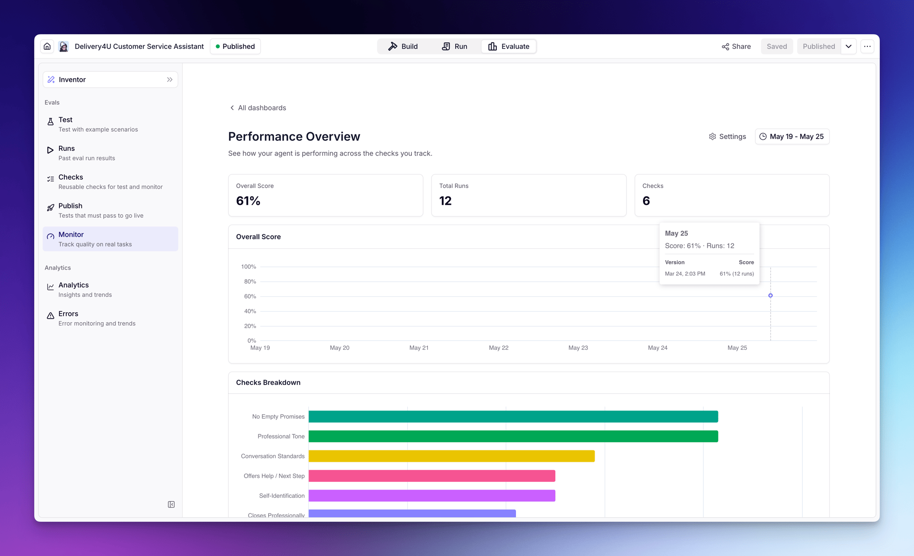
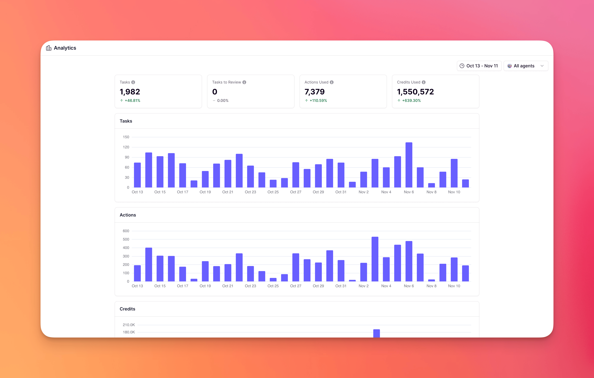
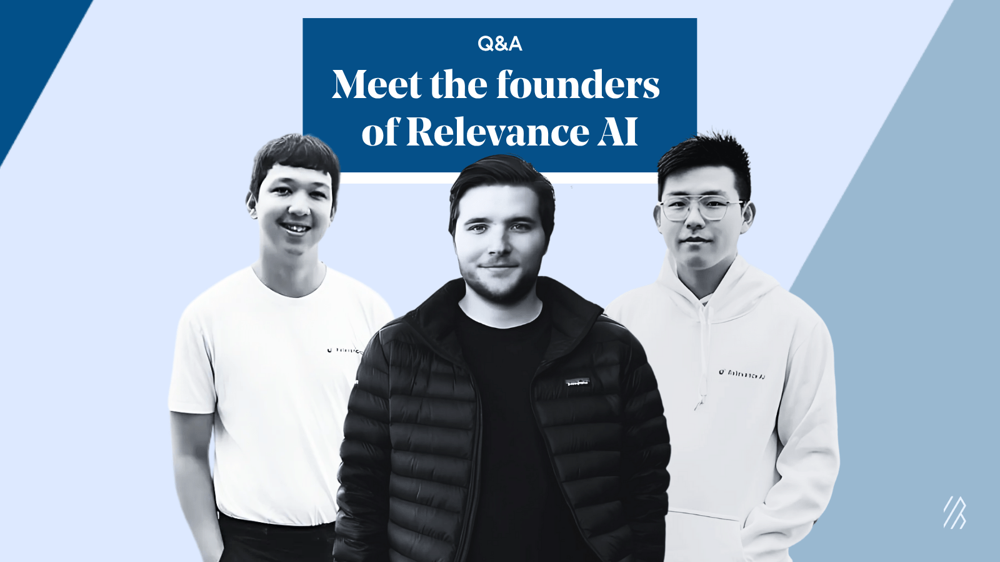
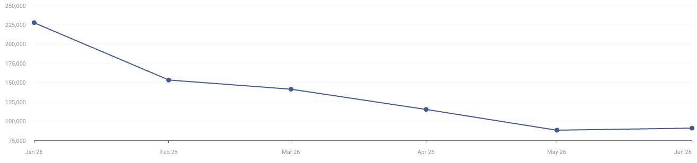

> 调研时间：2026-07-15。本文把官方产品/融资信息、客户侧公开表述、第三方流量与社区反馈分层处理。官网动态图中的任务量、成本和通过率属于营销演示，不当作公司整体运营数据；网站访问也不等于企业产品使用量。

## TL;DR

**Relevance AI 已经不是 2021 年那家“开发者向量平台”，也不宜只理解为无代码 Agent builder。它当前是一套面向企业的 Specialist AI Agent 平台：把 Agent 构建、工具与连接器、模型路由、评测、运行队列、审批、追踪和部署服务放在同一个控制面里。** [[source.relevance-ai.homepage]] [[source.relevance-ai.docs-evals]]

产品演化很清楚：2021 年用 developer-first vector platform 切入非结构化数据；2023 年通过 Ask Relevance、Document AI 和 AI Workforce 把向量能力包装成可组合工作流与多 Agent；2025 年 Series B 后强化 Workforce、Invent 与企业采用；当前首页进一步把自己定位成 specialist agents，并承诺六周内交付首个 Agent team。[[source.relevance-ai.seed-2021]] [[source.hn.ask-relevance-2023]] [[source.relevance-ai.series-a-2023]] [[source.relevance-ai.series-b-2025]]

**最值得关注的变化不是多了几个 Agent 模板，而是商业模式从“用户自己搭”转向“平台 + 嵌入式交付 + 客户内部赋能”。** Relevance AI 先与客户梳理场景、替客户完成第一批 Agent，再训练业务专家持续构建。这是 [[concept.embedded-agent-enablement-loop]]，也是它从 SMB 工具进入企业预算的一条现实路径。

公开客户证据在同类公司里相对扎实。Qualified 案例称 35+ Agents 在六个月形成 700 万美元 pipeline、50 万美元 closed revenue；Send Payments 案例称每周节省 40 小时；Zembl 案例展示从单个过载 Agent 拆成 10–11 个职责 Agent，并称转化率提高 30%。这些仍是供应商案例。更强的客户侧证据来自 Send Payments CEO：公司确实用 Relevance AI 作为 vendor-agnostic 平台，治理委员会批准 mandate 后，一名内部成员平均用 6–9 小时完成生产部署。[[source.relevance-ai.qualified-case]] [[source.relevance-ai.send-payments-case]] [[source.relevance-ai.zembl-case]] [[source.linkedin.send-payments-governance-2026]]

资本与规模也已越过早期实验阶段：三轮已核实融资合计 3,700 万美元，2025 年 Series B 由 Bessemer 领投；官方当时称团队超过 80 人、2025 年 1 月创建 40,000 个 Agents、同比增长 40 倍。LinkedIn 当前显示 51–200 人区间、约 118 个关联员工。**但 Agent creation 不是活跃生产 Agent，团队和融资也不能替代 ARR、续约、任务成功率与人工接管率。** [[source.relevance-ai.series-b-2025]] [[source.linkedin.relevance-ai-company]]

## 从向量平台到企业 Agent 控制面

| 阶段 | 公开定位 | 核心变化 |
|---|---|---|
| 2021 | Developer-first vector platform | 处理非结构化数据、向量检索与开发者基础设施；官方自报 300 万终端用户、每周 1 亿请求 |
| 2023 H1 | Ask Relevance / Document AI | 把向量检索、GPT 和文档抽取包装为无代码工作流；在 HN/PH 小规模试水 |
| 2023 H2 | AI Workforce | 训练 Agent、给 Agent 配工具和集成、编排多 Agent、监控任务 |
| 2025 | Workforce + Invent | 用自然语言生成 Agent，强化多 Agent 可视化与企业销售；完成 2,400 万美元 Series B |
| 当前 | Specialist AI Agents | 按销售、客服、市场、HR、运营、研究等岗位交付 Agent team，并补齐 eval、router、trace、governance 和 embedded deployment |

[[source.relevance-ai.seed-2021]] [[source.relevance-ai.series-a-2023]] [[source.relevance-ai.series-b-2025]] [[source.relevance-ai.homepage]]

这条时间线说明，Relevance AI 的向量基础设施并没有消失，而是沉到 context、dataset、knowledge 与 retrieval 层。外部叙事则不断向业务结果移动：从“帮开发者处理数据”变成“给企业一支 Agent 团队”。

## 当前产品：六层一体化

### 1. Specialist Agents 与多 Agent 团队

用户可以从销售、客服、市场、HR、运营等场景开始，也可以描述目标后生成 Agent。多个 Agent 通过 Workforce 分工和委派；官网用 Assisted、Copilot、Autopilot、Self-Driving 四级阶梯表达自治程度，并强调 L3/L4 才带来显著组织影响。[[source.relevance-ai.homepage]]

这个分级比“全自动”口号更诚实，但目前没有公开 benchmark 说明各级任务成功率、升级条件、人工接管率和长期漂移。

### 2. 工具、连接器、触发器与 MCP

平台支持信号/触发器、API 与 SaaS 工具、远程 MCP server、多实例凭据和 Agent 间协作。当前官网写 1,000+ apps，文档和 LinkedIn 还出现 2,000+；这些应视为页面/时间口径差异，而不是稳定、同深度的连接器数量。MCP Client 支持预置 Notion、Canva、Atlassian 和远程 Streamable HTTP，但不支持本地 MCP server。[[source.relevance-ai.docs-mcp]]

连接数量不代表动作深度。后续应按关键系统检查 OAuth scope、读写能力、幂等、重试、异常恢复和审批，而不是继续累加 logo。

### 3. Runtime、队列与长任务

官方系统限制说明，普通 Agent/user action 多数为 15 分钟上限，部分 tool 可运行 24 小时，bulk task 也可达 24 小时；并发超出套餐后进入队列。Tasks 页面把运行项分为 Approvals、Escalated、Errors 和 All，支持批量批准/拒绝及从失败步骤重跑。[[source.relevance-ai.docs-limits]] [[source.relevance-ai.docs-tasks]]

这说明它不只是设计器，也在承担长任务 runtime 和人工处理队列。但公开材料仍缺少 exactly-once、补偿事务、跨 Agent 状态恢复、队列延迟和失败率数据。

### 4. Evals 与发布闸门

Evals 是本轮最实在的企业能力之一。平台支持 Test、Runs、Checks、Publish、Monitor；检查包括 LLM Judge、Text Includes/Equals 和 Tool Usage，可用模拟工具响应构建测试场景，并可在通过率低于阈值时阻止发布。上线后还能抽样监控，并按版本观察变化。[[source.relevance-ai.docs-evals]]

这使产品进入 [[concept.agent-lifecycle-control-plane]]：不只“搭 Agent”，还要控制能否发布、上线后如何监控。边界是，当前 eval 仍以 LLM judge、规则和 tool use 为主，不能自动证明业务结果正确；eval 本身也消耗 actions/credits。

### 5. Model Router、观测与数据导出

官网声称按 eval score 与 cost 路由模型。企业 Analytics 展示 task、action、credit、error、actions/task、credits/task；OTEL 导出则把 Agent invocation、模型输入输出、工具、token、版本与状态写到客户 S3。[[source.relevance-ai.docs-analytics]] [[source.relevance-ai.docs-otel]]

这能回答“系统跑了多少、花了多少、哪里报错”，但还不能直接回答“销售机会质量是否提高、客户问题是否解决、合规结果是否正确”。它的 analytics 更接近 activity/cost/error observability，而不是业务 outcome measurement。

### 6. 治理与人工闸门

每条 Workforce edge 可设置 Auto Run、Approval Required 或 Let Agent Decide；还能限制自动运行次数并触发 escalation。Tasks 页面提供人工审批和错误恢复。[[source.relevance-ai.docs-approvals]] [[source.relevance-ai.docs-tasks]]

治理边界要看细节：

- “Let Agent Decide”仍依赖提示词与模型信心，不等于确定性 policy engine；
- prompt injection detection 只给 trace 打标，不自动拦截或改写；
- PII redaction 只作用于导出，不代表实时会话和内部存储已脱敏；
- 当前公开文档写多租户逻辑隔离，Enterprise 可独立 service/database；single-tenant options 仍在推进；
- 官方称客户数据不用于训练，支持区域选择、TLS 1.2+、AES-256、SSO/MFA/RBAC/FGA。[[source.relevance-ai.docs-security]] [[source.relevance-ai.docs-otel]]

因此 Relevance AI 的治理能力是真实产品面，但尚不能写成“已经解决企业 Agent 安全”。

## 商业模式：从自助定价转向销售主导

当前首页只展示 Enterprise / Talk to sales，并用六周交付路径解释合作：前两周梳理 use case 和价值，第 3–6 周由 embedded deployment team 定制 Agent，第六周后训练客户专家持续构建。[[source.relevance-ai.homepage]]

文档仍保留旧/并行套餐矩阵：Free 200 actions + 1,000 一次性 credits，Pro 2,500 actions + 10,000 credits，Team 7,000 actions + 35,000 credits，Enterprise 自定义；G2 页面还显示 Team $199、Business $599。[[source.relevance-ai.docs-pricing]] [[source.g2.relevance-ai-reviews]]

这不是简单的“价格冲突”，更像 GTM 迁移：自助入口和历史额度体系仍在，官网则把主叙事转向企业交付。双计量 Actions + Vendor Credits 能反映平台执行与模型/第三方成本，但也增加预算预测难度。后续应验证：自助层是否仍可购买、企业合同如何计费、实施服务是否另收费、额度超限和退款规则如何处理。

## 客户采用：证据阶梯

### 客户侧证据：Send Payments

Send Payments CEO Ryk Neethling 公开写道，公司把 Relevance AI 作为 vendor-agnostic 平台；一旦内部 Governance Committee 批准 mandate，由一名内部成员把 Agent 推到生产平均需要 6–9 小时，相比外部六周实施更快。[[source.linkedin.send-payments-governance-2026]]

另一篇客户侧帖子称，公司运行与人类员工数量相当的 AI Agents，并给每个 Agent 设置汇报线、岗位说明和 measured hours；还披露 46% SDLC improvement、20%+ operational uplift、过去 12 个月避免 200 万美元以上 overhead。[[source.linkedin.send-payments-metrics-2026]]

**归因边界：**第二篇没有把全部指标单独归因给 Relevance AI，只能证明客户已经把 Agent 当作组织劳动力管理，不能把 200 万美元直接写成 Relevance AI ROI。

### 供应商案例：Qualified、Zembl、Send Payments

- Qualified：官方称 35+ Agents、六个月 700 万美元 pipeline、50 万美元 closed revenue；并称一周内把 40–50 个 BDR tasks 整合成一个 human-level Agent。客户据称评估过 60 家供应商。[[source.relevance-ai.qualified-case]]
- Zembl：2024 年 10 月开始，2025 年 1 月 Toni 上线；先人工审批邮件、逐步提高日处理量，再移除部分 guardrail。单 Agent 过载后拆成 Salesforce、SMS、比较报价等 10–11 个职责 Agent；官方称通话从 22 分钟降到 8–9 分钟、同团队转化率提高 30%。[[source.relevance-ai.zembl-case]]
- Send Payments：官方称每周节省 40 小时、全天候处理数千次对话。[[source.relevance-ai.send-payments-case]]

这些数字比 logo wall 有价值，但仍由供应商发布。最重要的后续证据不是更多案例，而是客户自己披露的失败率、人工接管、上线周期、续约与多月运营数据。

## 团队：三位创始人的互补结构

| 创始人 | 公开角色与信号 | 当前判断 |
|---|---|---|
| [[person.daniel-vassilev]] | 联合创始人兼 co-CEO；早期负责产品/工程；公开播客称少年时期做的应用达到百万级用户 | 产品、工程、对外叙事和美国市场节点 |
| [[person.jacky-koh-relevance-ai]] | 联合创始人；AI/ML 背景；与 Daniel 是高中朋友 | 早期 AI/ML 与技术底座 |
| [[person.daniel-palmer-relevance-ai]] | 联合创始人兼 co-CEO；公开记录企业 GTM 与官网重定位 | 企业销售、产品包装与 GTM 转型 |

[[source.january-capital.daniel-vassilev-podcast]] [[source.linkedin.daniel-vassilev]] [[source.linkedin.jacky-koh]] [[source.linkedin.daniel-palmer]]

Forbes 把三人列入 2025 Asia 30 Under 30 AI。LinkedIn 当前公司页约 4.2 万 followers，员工搜索约 118 人；公司范围 51–200。2025 年官方融资稿称超过 80 人，团队分布于 Sydney、San Francisco、Barcelona。[[source.forbes.relevance-ai-profile]] [[source.linkedin.relevance-ai-company]]

这支团队的连续性很强：Daniel Vassilev 与 Jacky Koh 的关系早于公司，Daniel Palmer 则补上企业 GTM。风险在于双 co-CEO 的职责边界、快速扩张后的组织效率，公开资料尚不足判断。

## 融资：累计 3,700 万美元，三轮关系清楚

| 时间 | 轮次 | 金额 | 已核实投资方 |
|---|---|---:|---|
| 2021-12-14 | Seed | $3M | [[investor.insight-partners]] 领投；[[investor.galileo-ventures]]、[[investor.archangel-ventures]] 参与 |
| 2023-12-12 | Series A | $10M | [[investor.king-river-capital]]、[[investor.peak-xv-partners]]、Insight Partners、Galileo Ventures；官方未明确本轮 lead |
| 2025-05-06 | Series B | $24M | [[investor.bessemer-venture-partners]] 领投；King River、Insight、Peak XV 继续参与 |

[[source.relevance-ai.seed-2021]] [[source.relevance-ai.series-a-2023]] [[source.relevance-ai.series-b-2025]] [[source.bvp.relevance-ai-2025]]

总融资 3,700 万美元可由三轮官方材料直接相加。每条投资边只记录本轮总额，不向单家拆分。连续跟投说明老股东愿意支持产品从 vector infrastructure 转向 enterprise workforce；Bessemer 的加入则强化 enterprise software 网络。它仍不能证明估值或收入质量，公开材料没有披露估值。

## Launch 与 GTM：PH/HN 不是增长引擎

早期公开传播很克制：

- 2023-02-04 Show HN“Ask Relevance”只有 5 points、1 条评论；帖子重点解释 vector search + GPT + CSV/API。[[source.hn.ask-relevance-2023]]
- 2023-03-16 Ask by Relevance AI 在 Product Hunt 获 98 points、28 条评论，日榜 #24；[[source.producthunt.ask-relevance-2023]]
- 2023-03-30 Document AI 获 82 points、4 条评论，日榜 #29。[[source.producthunt.document-ai-2023]]

这些 launch 证明产品演化和早期开发者试水，没有形成 Superset 式的榜单放大。当前公司 X 约 3,780 followers，而 LinkedIn 约 4.2 万 followers；企业客户、创始人、投资人、workshop 和案例内容明显更重要。[[source.x.relevance-ai-profile]] [[source.linkedin.relevance-ai-company]]

Daniel Palmer 公开记录团队在五天内把官网从 generic/self-serve reposition 到 enterprise GTM。[[source.linkedin.dan-palmer-gtm-reposition-2026]] 这与当前首页、六周交付和销售主导定价一致。**Relevance AI 的 GTM 不是靠“AI employee”概念自然传播，而是靠嵌入式实施拿到第一个结果，再把客户团队训练成内部扩张节点。**

## 网站流量：自然搜索强，但 2026 H1 持续回落

第三方估算的主域月线：

| 月份 | visits |
|---|---:|
| 2026-01 | 227,489 |
| 2026-02 | 153,082 |
| 2026-03 | 141,214 |
| 2026-04 | 114,967 |
| 2026-05 | 88,047 |
| 2026-06 | 90,704 |

月线合计约 815,503，六月较一月低约 60%，五月后略有企稳。同期页面还显示 75,554 unique visitors、2:11 时长、2.28 pages/visit、57.78% bounce；desktop 58.94%、mobile 41.06%。[[source.similarweb.relevance-ai-2026-h1]] [[traffic.similarweb.relevance-ai-2026-h1]]

渠道结构：Organic Search 52.79%、Direct 24.65%、Paid Search 8.43%、Referral 5.77%、Organic Social 3.39%、GenAI 2.72%。搜索约 72% brand、28% non-brand；国家占比 India 16.16%、US 14.93%、UK 8.37%、Australia 7.04%、France 5.26%。社交流量主要来自 YouTube 73.8% 和 LinkedIn 17.1%。

两项重要边界：

1. 同页 top card 显示六个月 2.462M visits，与月线合计明显冲突，可能是域名/子域/产品口径差异，但本轮无法证明，因此不合并；
2. non-brand 关键词出现多项明显噪声，similar sites 也混入 vertical products、自动化工具和受众邻接站点，不能直接当竞品列表。

流量下降不等于业务下降。企业客户可能通过 app、内部入口和 sales-led deployment 使用产品；但公开认知与自助漏斗确实比年初弱，值得持续追踪。

## 社区与中文世界：教程传播强，深度生产复盘薄

Reddit 主讨论有 18 score、39 comments。最具体的正向反馈是：一位用户用它快速抓取并聚合 Amazon 竞品评论，因为想尽快跑通而选择 Relevance AI 而非 n8n。主要负向观点是：multi-agent 难调试、orchestration 可控性不足、企业级复杂流程可能最终要自建；还有用户认为技术门槛高于营销。线程中大量回复推荐自身产品或竞品，推广噪声很高。[[source.reddit.relevance-ai-community-2025]]

G2 当前 4.3/5、20 reviews。正面集中在上手快、自定义 Python、API/集成和多 Agent；负面集中在界面拥挤、编辑同步、错误反馈、文档变化、credits 消耗、缺少管理控制和部分集成。样本量小，不能外推整体客户满意度。[[source.g2.relevance-ai-reviews]]

中文世界形成了两层传播：

- 经济观察网/创业邦式媒体在 2024 年用“三个澳洲青年打造 AI 同事”解释团队和早期 traction；文中 6,000 companies、250,000 tasks 和历史 $19–$599 定价属于当时公司/媒体口径。[[source.eeo.relevance-ai-2024]]
- 小红书存在真实教程采用。一篇零基础用户跟随 YouTube 教程，用 Relevance AI + Firecrawl + GPT-4o mini 搭建销售通话前背调 Agent，获得 4,748 likes、5,481 saves、87 comments；这证明教程驱动的低代码认知扩散，不证明企业规模。另一篇“8 款免费 Agent 工具”有 629 likes、942 saves，但只是泛工具清单。[[source.xiaohongshu.relevance-ai-sales-agent-2026]] [[source.xiaohongshu.relevance-ai-tools-2024]]

因此，中文公共内容对 Relevance AI 的理解仍偏“无代码 Agent 搭建工具”，落后于其当前 enterprise specialist platform 定位。

## 竞品与相邻边界

| 类型 | 代表 | 与 Relevance AI 的关系 |
|---|---|---|
| 企业 AI employee / workforce platform | [[company.ema]]、Lindy、Lyzr、Beam | 最直接竞争：构建、连接、运行、治理和企业交付均有重叠 |
| General no-code Agent builder | MindStudio、Botpress、VectorShift、n8n | 自助用户、workflow 和集成重叠；企业交付与 eval/governance 深度不同 |
| 企业 AI workspace | [[company.dust]]、[[company.viktor]]、Sana | 更偏知识协作、员工入口和团队 workspace，部分场景重叠 |
| 垂直 AI employee | EliseAI、SalesCloser、[[company.artisan]] | 用行业/岗位闭环换更强结果，横向平台可能成为其底座或竞争者 |
| Agent infra / orchestration | CrewAI、Temporal、Composio、OpenRouter、Braintrust、Langfuse | Relevance AI 把多项基础设施整合成一个产品；它们则允许团队自组更可控的 stack |

关键不是名字都带 Agent，而是谁控制：业务流程定义、企业 context、工具权限、运行队列、评测、模型路由、人工闸门、观测、部署服务和客户内部扩张。

## 关键判断与风险

### 1. Relevance AI 的真正对手不是单个 builder，而是“可组合 stack + 实施团队”

它用一体化减少集成和运维成本；成熟团队则可能选择 n8n/Temporal + 模型网关 + eval/observability + 自研 UI，以换取控制力。Relevance 必须证明一体化在复杂流程中不是新的 lock-in。

### 2. Embedded deployment 是 GTM 优势，也可能成为服务负担

六周交付和客户赋能能跨过 enterprise adoption gap；但若每个客户都需要高强度定制，收入增长会受实施人力约束。后续要看从首个 Agent team 到客户自主扩张的转化率，而不是只看交付数量。

### 3. Evals 是方向正确的控制面，但尚未等于业务可靠性

发布闸门、测试场景、live sampling 和版本标记是严肃能力；LLM judge 与规则检查仍会漏掉业务语义、数据权限和跨系统副作用。需要客户级 benchmark、失败分类、回滚和人工接管数据。

### 4. 客户证据比多数同赛道公司强，归因仍需克制

Send Payments 的客户侧确认很有价值；Qualified/Zembl 数字也具体。但公开证据不足以估算 ARR、NRR、平均合同、生产 Agent 活跃率和实际成功率。客户的整体组织提升不能全部归因给平台。

### 5. 定价与官网口径正在迁移

自助套餐、双额度和企业销售页并存，说明公司还在调整市场层级。双计量可能让成本与价值对齐，也可能让买家难以预测预算。退款、credits 消耗和 admin control 已在评论中出现摩擦。

### 6. 流量与品牌不能替代产品采用

H1 主域月线明显下降，Organic Search 和品牌词仍强。它可能反映内容/自助漏斗降温，也可能是 enterprise GTM 后网站角色变化。必须继续结合 app 子域、客户发布、招聘和融资节点观察。

## 持续监控

1. 企业首页与旧自助套餐是否进一步合并，真实合同和计费口径如何变化；
2. 六周 embedded deployment 后，客户内部每周创建/上线多少 Agent，多少仍需供应商参与；
3. Evals 的任务成功率、false pass、失败分类、回滚和人工接管；
4. prompt injection、PII、single-tenant、MCP credential 与 tool permission 的实际安全边界；
5. Send Payments、Qualified、Zembl、KPMG、Autodesk、Canva 等客户侧独立复盘；
6. Agent creation 与 active production agents 的差异；
7. 网站流量是否在 9 万/月附近稳定，paid search 和 YouTube/LinkedIn 分发是否继续；
8. Lindy、Ema、Lyzr、MindStudio、n8n 与云厂商 Agent 平台的产品合流；
9. 三位创始人和 Sydney/SF/Barcelona 团队的组织扩张。

## 证据库

### S1：官方产品、文档、融资与客户案例

- [[source.relevance-ai.homepage]]
- [[source.relevance-ai.docs-pricing]]
- [[source.relevance-ai.docs-security]]
- [[source.relevance-ai.docs-limits]]
- [[source.relevance-ai.docs-evals]]
- [[source.relevance-ai.docs-approvals]]
- [[source.relevance-ai.docs-tasks]]
- [[source.relevance-ai.docs-analytics]]
- [[source.relevance-ai.docs-otel]]
- [[source.relevance-ai.docs-mcp]]
- [[source.relevance-ai.seed-2021]]
- [[source.relevance-ai.series-a-2023]]
- [[source.relevance-ai.series-b-2025]]
- [[source.bvp.relevance-ai-2025]]
- [[source.relevance-ai.qualified-case]]
- [[source.relevance-ai.send-payments-case]]
- [[source.relevance-ai.zembl-case]]

### S2：客户侧、人物、媒体、平台与流量

- [[source.linkedin.send-payments-governance-2026]]
- [[source.linkedin.send-payments-metrics-2026]]
- [[source.linkedin.relevance-ai-company]]
- [[source.linkedin.daniel-vassilev]]
- [[source.linkedin.jacky-koh]]
- [[source.linkedin.daniel-palmer]]
- [[source.january-capital.daniel-vassilev-podcast]]
- [[source.forbes.relevance-ai-profile]]
- [[source.linkedin.dan-palmer-gtm-reposition-2026]]
- [[source.producthunt.ask-relevance-2023]]
- [[source.producthunt.document-ai-2023]]
- [[source.eeo.relevance-ai-2024]]
- [[source.similarweb.relevance-ai-2026-h1]]
- [[source.x.relevance-ai-profile]]
- [[source.x.daniel-vassilev-profile]]

### S3/S4：社区、中文生态与体验边界

- [[source.hn.ask-relevance-2023]]
- [[source.reddit.relevance-ai-community-2025]]
- [[source.g2.relevance-ai-reviews]]
- [[source.xiaohongshu.relevance-ai-sales-agent-2026]]
- [[source.xiaohongshu.relevance-ai-tools-2024]]
- [[source.weixin.relevance-ai-search-2026]]
- [[source.relevance-ai.app-smoke-2026]]
