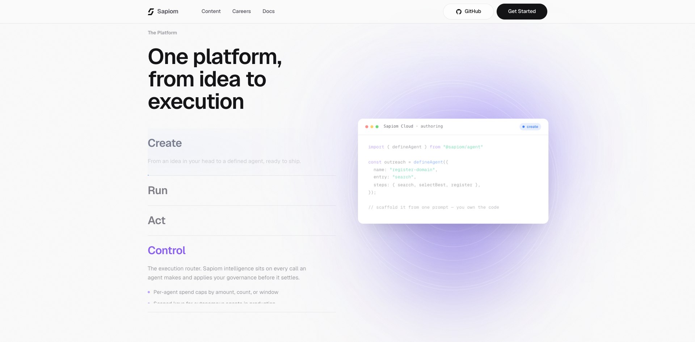
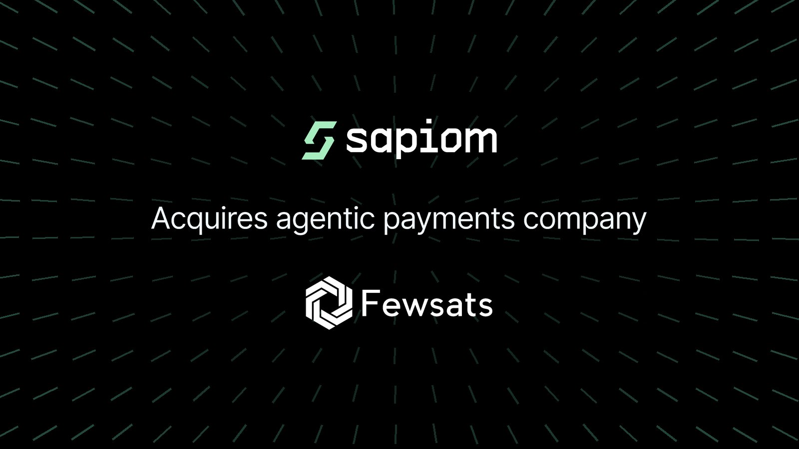
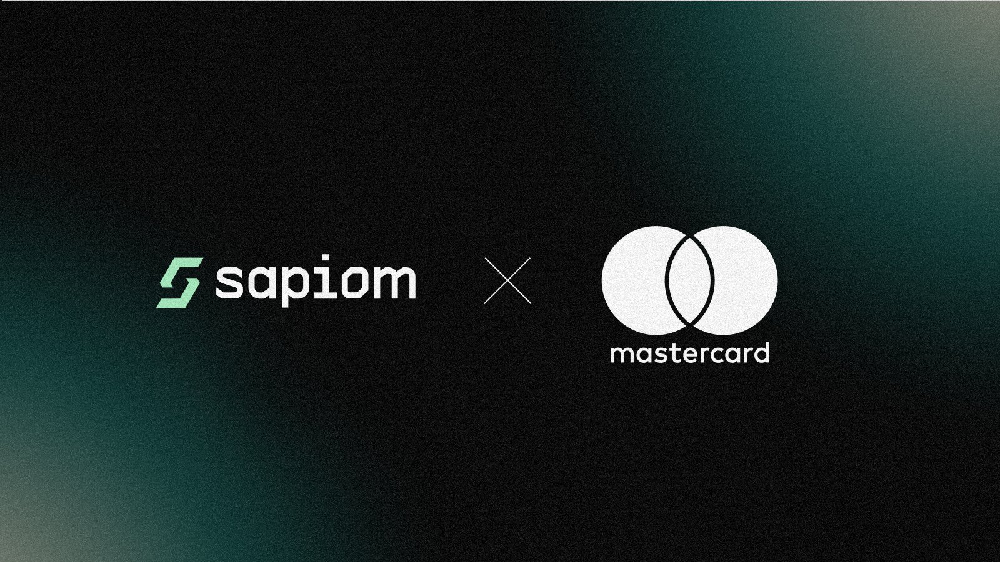
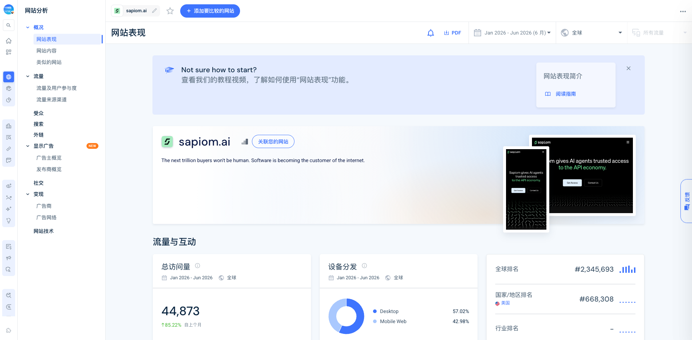

# Sapiom

> **一句话**：Sapiom 正把最初的 Agent 支付网关扩成一套执行引擎，让开发者用一个 key 接入模型、浏览器、沙盒、数据和通信能力，在同一运行时内完成调用、计费、预算控制与审计。

## TL;DR

Sapiom 最值得关注的不是“让 Agent 自己买 API”这一句故事，而是产品边界在一年内连续上移：2025 年夏从支付与能力访问起步，2026 年 2 月公开融资，6 月收购 L402 基础设施 Fewsats 并进入 Mastercard Agent Pay for Machines 生态，7 月又发布 typed graph runtime。它试图把 **access + execution + payment + governance** 合成一个控制面，而不只做支付协议。

这条路线有真实产品基础：公开 CLI 可创建并检查 agent graph，authoring MCP 在本地成功跑完两步 workflow；文档列出 130 个远程 MCP tools 和覆盖 50+ 服务的能力目录。与此同时，成熟度并不均匀：gateway 已迭代数月，新 `@sapiom/agent` package 直到 2026-07-08 才发布；公开治理文档目前能验证的是预算、调用量、token、速率和日志，官网更宽的 KYA、风险和多支付轨道叙事还没有全部落到可见接口。

它的融资、合作与团队信用很强，但外部注意力仍早期：2026 年上半年官网第三方估算总访问约 4.49 万，6 月月访问约 5,109，品牌词占搜索 96%。官方则声称单日处理 150 万以上 Agent transactions、约 4 万 active agents。两组数据不矛盾，因为 API-first 产品的网站访问不等于 backend 使用；但后一个数字仍是公司自报，缺少独立审计。

## 产品到底是什么

官网把平台分成五层：

| 层 | 当前公开能力 | 判断 |
| --- | --- | --- |
| Create | TypeScript `defineAgent`、typed graph、MCP/Skill/SDK | 新发布的 authoring surface |
| Run | 云端 runtime、状态、分支、循环、暂停/恢复、人类 gate、schedule | 已有本地可验证路径，云端未登录实测 |
| Act | 模型、搜索、浏览器、沙盒、数据库、消息、存储等能力 | 通过统一 key 和 capability marketplace 聚合供应商 |
| Control | spend、usage、rate limits 与 transaction/rule logs | 文档可验证；更强 KYA/risk 仍是扩展承诺 |
| Pay | 按调用付费、x402/L402 与多轨结算方向 | 原始产品根基，Fewsats 与 Mastercard 强化该层 |

远程 MCP 暴露 `https://api.sapiom.ai/v1/mcp`，文档称有 130 个 tools，并用 `tool_discover` 控制上下文。能力目录包括 400+ 模型、网页搜索与浏览器、Blaxel 沙盒、Postgres/Redis/vector/search、消息队列与 schedule、存储、代码仓库、email/enrichment、域名/DNS、电话验证和多媒体生成。Sapiom 的核心抽象因此不是“另一张 Agent 信用卡”，而是：**一次 Agent intent 进入后，由平台选择并调用能力，在执行层同步完成授权、支付、治理和记录。**

价格目前按使用付费，无订阅和最低消费。官网示例包括搜索约 `$0.006`、网页提取 `$0.01`、图像 `$0.004/MP`、验证 `$0.015`、音频 `$0.08`，模型按 token 计费。它降低了开发者逐家开户、保管密钥和拼接账单的摩擦，但也意味着 Sapiom 位于每次能力调用的关键路径。

## 本轮实测

本轮没有注册账号，也没有调用付费服务。可复现的无账号验证包括：

1. 运行 `npx -y @sapiom/cli --help`，确认 CLI 命令面存在。
2. 用 CLI scaffold 在临时目录生成 TypeScript agent；安装依赖后执行 `agents check .`，返回 `2 step(s), graph OK`。
3. 通过 `@sapiom/mcp` 的 stdio authoring MCP 调用本地运行工具，完整执行两步 workflow；没有付费调用，stubs 无缺失警告。

这证明 authoring/runtime 不是只有首页 mockup，但只覆盖本地开发链路。云部署、真实 provider 调用、生产成功率、计费准确性和治理拦截没有在本轮验证。SDK 文档还显示：自动重试上限需要开发者自己设计；`run_local` 不会在入口自动拒绝 malformed input。这些不是致命问题，但说明新 runtime 仍要求使用者理解 graph 和失败边界。

证据：[[source.sapiom.product-smoke-test-2026-07-14]]、[[source.sapiom.docs-authoring-2026-07-14]]、[[source.sapiom.npm-agent-package-2026-07-14]]。

## 一年内的产品演化

- **2025 夏**：TechCrunch 回溯称产品从上一年夏天开始。核心问题是 Agent 每接入一个 API 都需要人类账户、密钥与付款关系。
- **2025-09 / 11**：GitHub org 创建；`@sapiom/axios` 从 11 月开始发布，说明 gateway 早于当前 runtime。
- **2026-02-05/06**：公开 launch，并宣布 `$15.75M` seed。公开叙事集中在 Agent 购买 API、算力、数据与软件。
- **2026-06-10/11**：进入 Mastercard AP4M 首批生态；收购 Fewsats，把 L402/x402 和 machine-native HTTP payments 纳入执行引擎。
- **2026-07-08**：`@sapiom/agent` 首次发布；官网从支付控制面进一步转向 “Build agentic products”。

这不是简单换 tagline。收购前后，Sapiom 从“替 Agent 管密钥和付款”走向“替 Agent 运行完整任务并控制每次能力调用”。创始人 Ilan Zerbib 用 “horseless carriage test” 描述这一点：如果产品只是把原有 SaaS 加一层 Agent 包装，可能仍在复刻人的工作流。Sapiom 想控制的是机器原生执行路径。

## 团队与资本

创始人 [[person.ilan-zerbib]] 曾创办 Earny，后在 Shopify Payments 近五年，官方材料称其参与扩展 Shop Pay 至超过 `$100B GMV`，并构建 Shop Cash。这解释了团队为何从 payment control plane 切入，而不是先做一个通用 agent framework。

Sapiom 公开 LinkedIn 标注 2-10 人。本轮高置信识别到至少 6 位可归属成员，包括 Ilan、Fewsats 创始人兼 Sapiom founding engineer [[person.jordi-montes]]，以及 engineering、operations、talent、payments infrastructure 职能。员工搜索混入了 3 个无关人物，未计入团队规模。

2026 年 2 月 seed 总额 `$15.75M`，[[investor.accel]] 领投；Gradient Ventures、Array Ventures、Okta Ventures、Menlo Ventures、Anthropic、Coinbase Ventures、Formus Capital、Operator Collective 参投。法律公告还提到来自 Shopify、OpenAI、Vercel、GitHub、Circle、Mercury 的高知名度 operator/angel，但未逐一命名，因此没有把这些公司硬建成机构投资关系。

Fewsats 不是只有一个创始人的 acquihire。其 GitHub org 有 58 个公开仓库；`awesome-L402`、`amazon-mcp`、`proxy402`、`fewsats-mcp` 等项目已有实际 star 与协议资产。收购补的是机器原生支付工程与开发者生态。

Mastercard AP4M 把 credentialing、permissioning、transaction 和 cards/accounts/stablecoins settlement 组合成机器支付框架，Sapiom 是 30 多个首批参与方之一。它是生态合作与分发信号，不是独家合作，也不是投资关系。

## 规模、流量与 GTM

第三方流量快照显示，2026 年 1-6 月 `sapiom.ai` 总访问约 **44,873**；最新月约 **5,109 visits / 2,760 unique visitors**。渠道为 direct 51.48%、organic search 29.15%、referral 10.35%、organic social 6.00%、email 3.03%，没有可见 paid traffic。美国占 91.98%，搜索中品牌词占 96%。Referral 主要来自 TechCrunch、Okta 和 shared links，社交来源以 X 为主。

这更像一家公司在融资 PR、投资人网络和品牌传播中建立早期认知，而不是已经形成广泛非品牌 SEO 获客。官网流量不适合衡量其 API 真实调用规模。

官方 X 在 6 月 30 日声称前一日处理 150 万以上 Agent transactions、约 4 万 tenant sandboxes、约 4 万 active agents、66.2 万 governance checks 和 65.4 万 paid transactions；另有日度 gateway calls 与模型调用拆分。数字足够大，值得后续连续监控，但目前只有官方自报，不能当作已审计客户规模。

Product Hunt 搜索没有命中 Sapiom 同名产品，不能据此断言没有 launch。HN 只找到团队成员发布的 Realism 工具，4 points、2 comments，并非 Sapiom 主产品 launch。当前公开 GTM 更依赖融资媒体、投资人网络、X、生态合作与开发者文档，而不是 PH/HN 榜单放大。

中文世界已有公众号与短视频围绕融资和“AI 自主消费”传播，但找到的公众号文章基本转述 TechCrunch，小红书结果只有 metadata，没有可靠转录。它们说明叙事进入中文内容流，不说明中文开发者采用。

## 社区提出的真问题

Reddit 一条围绕 Agent 自主购买 API key 的讨论只有 13 条评论，样本很小，但问题很具体：

- 人类最终仍需承担责任，支付错误不可轻易逆转；
- 单次、单日、供应商类别和总任务必须有硬上限；
- 新 vendor / 新 capability 应单独触发 human gate，而不只是共享预算；
- retry 与总花费必须同时封顶，否则 Agent 会“为完成任务不惜成本”；
- 该层可能被云厂商或大模型平台内置，独立公司的长期入口仍需证明。

公开文档已覆盖 spend、API calls、tokens、per-service usage、rate limit 和 rule logging，能回应部分问题。仍未清楚看到的是：新 capability 审批、不可逆交易恢复、vendor category policy、强身份/KYA 与复杂风险策略。这正是后续产品监控应盯的 control surface，而不是泛泛问“Agent 会不会乱花钱”。

## 竞品边界

| 类型 | 对象 | 与 Sapiom 的关系 |
| --- | --- | --- |
| 直接 | [[company.skyfire]] | 更强调 KYA、wallet、pay token 和 buyer/seller commerce；身份与支付面更直接 |
| 直接 | [[company.nevermined]] | 更强调 meter、access、pricing、settlement，以及 x402/MCP/A2A 的 Agent monetization |
| 协议/轨道 | Coinbase x402、Mastercard AP4M | 可能标准化底层支付 rail；不是完整执行平台 |
| Runtime 邻近 | Temporal、Trigger.dev、Inngest、Restate、LangGraph、OpenAI Agents SDK | 与新 authoring/runtime 层竞争，但通常不捆绑付费能力市场 |
| 供应商 | OpenRouter、Blaxel、Upstash、Firecrawl 等 | 被 Sapiom 聚合的能力，不应误判为直接竞品 |

Sapiom 的差异化赌注是“一个 key + 能力市场 + runtime + governance”。优势是闭环更短；代价是竞争面同时扩张：支付/KYA 需要对抗专门平台，workflow/runtime 需要对抗成熟编排框架，能力市场还要证明供应、价格、可靠性和迁移成本。

## 关键判断与风险

1. **最有价值的产品变化是从 payment gateway 上移到 execution layer。** 支付本身容易被协议化；如果能控制 Agent 每一次能力选择、执行、回退和治理，平台位置更强。
2. **创始人的支付前史与 Fewsats 的 L402 资产形成可信的 path dependence。** 这条路线不是临时追逐 agent framework 热点，但新 runtime 的公开发布时间很短，仍需看真实采用。
3. **官网统一叙事领先于各层成熟度。** Gateway 有较长发布历史，authoring/runtime 刚出现；KYA/risk/multi-rail 的公开接口也弱于营销表述。研究时必须逐层审计，不能把五层平台视为同一成熟度。
4. **分发目前更像 network-led。** Accel、Okta、Anthropic、Coinbase、Mastercard 和 TechCrunch 能快速建立可信度，但 96% 品牌搜索说明 category demand 尚未通过网站自然流量显现。
5. **最大的产品风险不是“Agent 不会付款”，而是谁拥有 control point。** x402/AP4M 标准、云平台 bundling、模型平台内置采购、专门 payment players 与成熟 workflow runtimes 都可能挤压独立层。

## 待验证

- 官方日度 transaction / active agent 指标的定义、去重方式、客户集中度和付费收入。
- 生产 runtime 的稳定性、retry/cost recovery、可观察性与部署边界。
- KYA、wallet、risk、多支付轨道哪些已公开可用，哪些仍是 roadmap 或合作层能力。
- capability marketplace 的供应商合同、加价方式、故障责任与迁移成本。
- 收购 Fewsats 后 L402/x402 资产如何进入统一 SDK，而不只是协议与团队整合。
- Mastercard AP4M 带来的是标准兼容、客户分发还是结算能力。

## 证据索引

产品与实测：[[source.sapiom.homepage-2026-07-14]]、[[source.sapiom.docs-index-2026-07-14]]、[[source.sapiom.docs-authoring-2026-07-14]]、[[source.sapiom.docs-governance-2026-07-14]]、[[source.sapiom.docs-agent-identity-2026-07-14]]、[[source.sapiom.product-smoke-test-2026-07-14]]、[[source.github.sapiom-js-2026-07-14]]。

团队与资本：[[source.sapiom.funding-official-2026-02-06]]、[[source.sidley.sapiom-seed-2026-02-06]]、[[source.techcrunch.sapiom-funding-2026-02-05]]、[[source.linkedin.sapiom-company-team-2026-07-14]]、[[source.sapiom.fewsats-acquisition-2026-06-11]]、[[source.mastercard.ap4m-sapiom-2026-06-10]]。

增长与市场：[[source.similarweb.sapiom-2026-h1]]、[[source.x.sapiom-scale-2026-06-30]]、[[source.reddit.sapiom-agent-spending-2026-04-26]]、[[source.hn.sapiom-realism-2026-03-18]]、[[source.wechat.sapiom-ai-vision-2026-02-06]]、[[source.producthunt.sapiom-search-2026-07-14]]。

竞品与协议：[[source.skyfire.official-product-2026-07-14]]、[[source.nevermined.official-product-2026-07-14]]、[[source.coinbase.x402-how-it-works-2026-07-14]]。

研究判断与过程：[[note.sapiom-product-takeaway-2026-07-14]]、[[note.sapiom-competitor-map-2026-07-14]]、[[note.sapiom-research-run-2026-07-14]]、[[concept.agent-native-payments]]。
