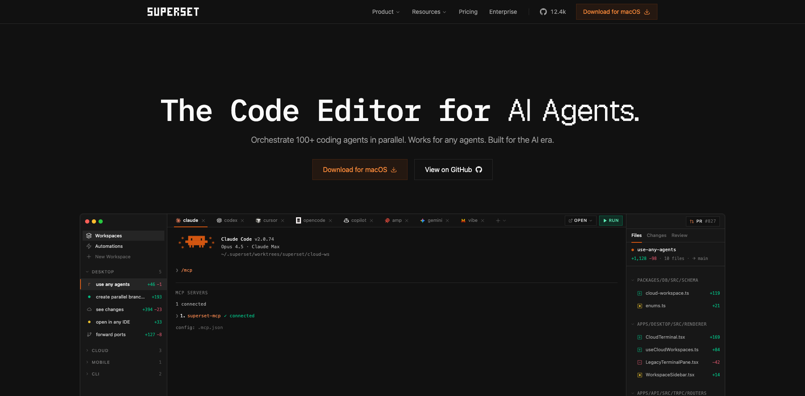

# Superset

Superset 是 YC P26 公司，定位为面向工程师的 agentic IDE / coding agent cockpit，用来组织和审查多个 coding agent 的并行工作。当前更准确的理解是：它不是“又一个 coding agent”，而是把多 agent 任务拆分、运行、观察、结果比较和合并，做成一个面向开发者的操作台。

## 产品理解

Superset 的核心场景是工程师同时驱动多个 coding agents，让它们围绕同一个代码库或任务并行探索方案。产品价值不在单次代码生成，而在“并行 agent 工作流”的管理层：任务分发、运行状态、结果查看、选择合并、回滚和协作。

这类产品的前提是 coding agent 使用已经足够普遍，用户的问题从“怎么让 AI 写代码”转向“多个 agent 同时工作后，怎么管理它们的产物”。Superset 押注的是这个管理层会变成新的开发者工作台。

## 团队与网络

已确认 founder：

- Kiet Ho: https://x.com/FlyaKiet
- Avi Peltz: https://x.com/avimakesrobots
- Satya Patel: https://x.com/saddle_paddle

三位创始人都有较强的 YC / 开发者工具背景。这个背景对 Superset 的早期传播很关键：Product Hunt launch 由 Garry Tan 参与/推动，是它能拿到高质量初始曝光的重要因素。这里的判断是：早期产品的分发不只是内容本身，创始人网络和信任背书会显著影响 launch 上限。

## 增长路径观察

Superset 的增长可以粗略理解为三段：

1. Hacker News 试水：早期 Show HN 帖先验证英文开发者社区反馈。
2. Product Hunt 放大：有了一定表达、视频和案例之后，通过 PH 获得更集中的曝光。
3. 多社区扩散：X、V2EX、linux.do 等社区继续带来开发者讨论和流量。

HN 上 12-01 和 12-23 两次传播的差异很有启发：前一次反馈很少，后一次内容明显更完整，评论量大幅增加。这里的产品传播教训是：每一次公众传播都应该当成一次 Elevator Pitch。案例、具体使用场景、视频演示，会比抽象文字更快抓住注意力。

## 社区反馈

已观察过的平台包括 Hacker News、Product Hunt、X、Reddit、V2EX、linux.do、GitHub、Similarweb。整体看，Superset 在英文开发者社区和中文开发者社区都有讨论价值，但不同平台承担的角色不同：

- HN: 适合英文开发者产品试水，能看到高密度质疑和真实反馈。
- Product Hunt: 更像放大器，适合在表达成熟后冲榜，不适合只当发布登记页。
- V2EX / linux.do: 对开发者工具的中文流量和讨论很重要，应该进入长期监控。
- GitHub: 用 star history、issue、repo 活跃度辅助判断开发者采用。
- Similarweb / Google Trends: 用来做规模判断，但要记录口径，特别是是否包含子域名。

## 当前判断

Superset 值得持续关注，不只是因为它是 YC P26 公司，而是因为它处在“agent coding 从单 agent 使用转向多 agent 编排”的节点上。如果这个方向成立，工作台/编排层会成为新的控制面。

风险也明确：这类产品容易被 IDE、代码托管平台、Claude Code / Codex 等上游工具夹击。Superset 需要证明自己不是临时 UI，而是能沉淀工作流、协作、审查和团队级管理能力。

## 证据入口

- YC profile: https://www.ycombinator.com/companies/superset
- Website: https://www.superset.sh
- X: https://x.com/superset_sh
- GitHub: https://github.com/superset-sh/superset
- Product Hunt: https://www.producthunt.com/products/superset-5
- HN 12-01: https://news.ycombinator.com/item?id=46109015
- HN 12-23: https://news.ycombinator.com/item?id=46368739
- HN Launch: https://news.ycombinator.com/item?id=48236770

## 待补

- 把 Product Hunt launch、HN thread、GitHub repo、Similarweb snapshot 分别建成 source.item。
- 把 PH/HN/V2EX/linux.do/GitHub touchpoint 补全。
- 把“PH 作为放大器”“公众传播即 Elevator Pitch”“开发者工具需关注 V2EX/linux.do”抽成 concept。
