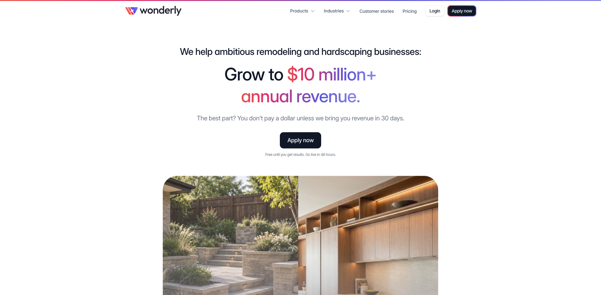
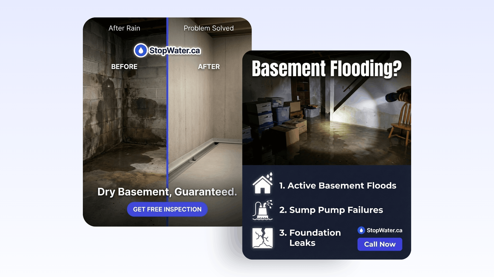
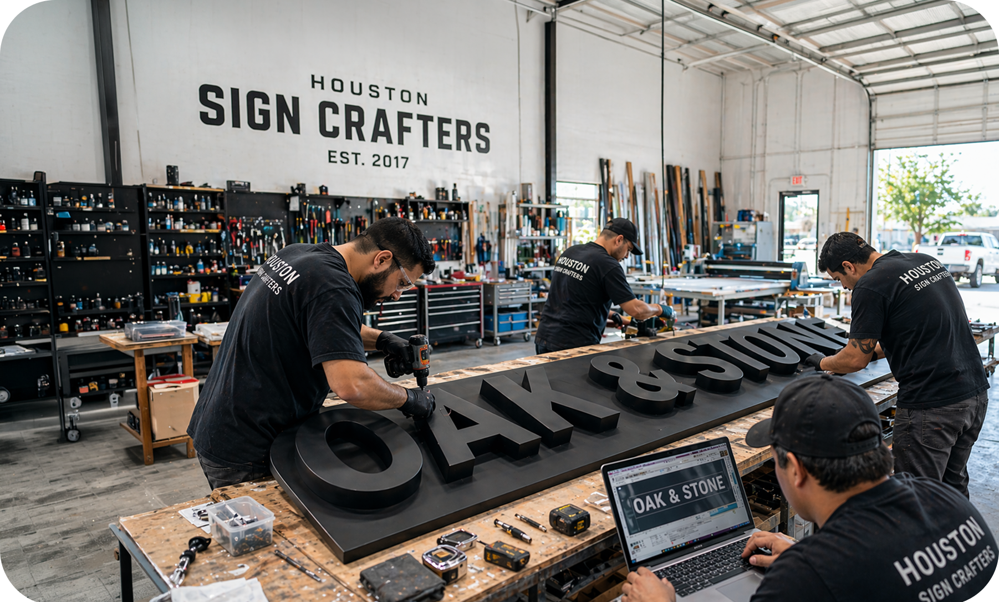
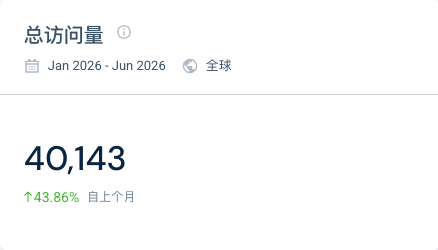

> 调研时间：2026-07-15。Wonderly 仍处于早期公开阶段，准确 launch 日期未知。本文用官网与 Terms、Motion 法律主体、LinkedIn 共享团队、招聘页、社区首次发现与第三方流量估算交叉验证；收入增长、客户数和效果承诺均未独立审计。

## TL;DR

**Wonderly 是 Motion 团队把横向 AI Employees 下沉成垂直 service SMB 收入系统的产品。** 它当前只把 remodeling 与 hardscaping 放在首页第一屏，却交付从网站、广告、SEO、电话、CRM、AI receptionist、sales coach、设计 mockup、报价、合同、支付到项目管理的一整套商业操作系统。[[source.wonderly.homepage-2026-07-15]]

它与普通 Agent builder 最大的区别不是 Agent 数量，而是 **厂商参与客户的完整获客和履约链**。Terms 允许 Revenue Share Agreement，Wonderly 控制 lead routing、attribution 与 redistribution；客户在 30 天产生收入前不付费。也就是说，它同时是 SaaS、AI 劳动力、营销/实施服务和效果分成渠道。[[source.wonderly.terms-2026-07-15]]

Wonderly 与 [[company.motion]] 共享 Nexusbird, Inc、创始人与多名员工。当前更合理的建模是独立产品主体 + 产品谱系关系，不是把它写成收购，也不能仅凭招聘页说 Motion 已经完全更名。[[source.motion.terms-2026-07-15]] [[source.linkedin.wonderly-company-2026-07-15]]

第三方估算显示 `wonderly.com` 2026 H1 每月访问量约 7,393，远小于 Motion 的 446,487；72.74% 来自 mobile web，社交流量中 Reddit 占 90.26%。它仍是小体量、北美集中的早期网站，而不是已验证的大规模新业务。[[source.similarweb.wonderly-2026-h1]]

## 产品：把 20 家供应商合并成一个交付系统

Wonderly 首页列出的工作面覆盖：

| 阶段 | 产品/服务 |
|---|---|
| 获客 | 网站、landing page、Google/Meta/Maps/LSA、SEO/AEO、direct mail、Reddit、scraping、cold calling |
| 线索接入 | 表单、AI website chatbot、AI receptionist、电话、短信、邮件、预约 |
| 销售 | CRM、统一 inbox、AI follow-up、qualification、sales coaching、call recording |
| 现场成交 | AI design/mockup、90% accurate quote 自报、合同、电子签 |
| 收款与交付 | invoice、payments、project management、dispatch |
| 复购 | reviews、customer reengagement、upsell |

[[source.wonderly.homepage-2026-07-15]]

官网称 30 分钟 onboarding、48 小时上线，背后有 dozens of AI Agents 和 done-for-you implementation。**这意味着产品不是纯自助 SaaS。** 用户购买的是一套被配置好的业务机器，实施团队、广告运营、行业数据和 Agent 共同交付。

本轮没有创建账户或进入后台，不能确认这些模块是统一原生系统、第三方白标、人工服务还是混合实现；报告只按官网和合同确认能力边界。

## 商业模式：免费到结果，但不是无条件免费

官网的购买语言是：

- “You don't pay a dollar unless we bring you revenue in 30 days”；
- “Free until you get results”；
- Go live in 48 hours；
- 目标是把企业做到 500 万、1,000 万美元以上收入。

[[source.wonderly.homepage-2026-07-15]]

Terms 揭示了更完整的商业合同：

- 客户可能另签 Revenue Share Agreement、order form 或 pricing schedule；
- 已产生的 revenue share、tail period 与归因义务可在终止后继续；
- Wonderly 控制 lead scoring、routing、recycling 与 attribution；
- 除非书面约定，不保证 lead、地域或渠道独占；
- 同一 lead 可以分配给多个企业，包括竞争对手；
- 客户需准确报告 Wonderly-originated customer 的收入和支付。

[[source.wonderly.terms-2026-07-15]]

这比 seat/credits 更接近 outcome pricing，但仍不是简单的“只为成交付费”。客户实际可能承担广告、通信、支付、合规和后续分成，具体比例未公开。

## 为什么从 Motion 演化到 Wonderly

Motion 2025 的核心论点是：SMB 不会自己拼几十个 Agent 与工具，需要一个 agent-native work suite。Wonderly 把这个论点推进了一步：**如果 SMB 连配置 Agent 都不想做，就不要卖 workflow 或员工，直接卖一个行业的收入增长系统。** [[source.motion.funding-2025]]

共享关系的强证据：

1. Motion Terms：Nexusbird, Inc 提供 Motion；
2. Wonderly Terms：Nexusbird, Inc 提供 Wonderly；
3. Wonderly Terms 仍残留优化 schedule 的历史描述；
4. LinkedIn 员工页出现多名 `Motion & Wonderly` 共同任职者；
5. 招聘页公开写 `Wonderly, formerly Motion`；
6. 2026-04 社区已发现 `business.motion.com` 方向转到 Wonderly。

[[source.motion.terms-2026-07-15]] [[source.wonderly.terms-2026-07-15]] [[source.linkedin.wonderly-company-2026-07-15]] [[source.wttj.wonderly-2026-07-15]] [[source.reddit.wonderly-discovery-2026]]

准确 launch 日期仍没有官方证据。2026-04-07 只能写成最迟公开可见节点；LinkedIn 自称过去两年服务数百家 SMB，也可能把 Motion 的既有试验计入，不能倒推出 Wonderly 品牌 2024 年已经 launch。

## 团队：共享 Motion 的创始人与执行团队

当前证据支持 [[person.harry-qi]]、[[person.omid-rooholfada]]、[[person.ethan-yu]] 是 Wonderly 核心创始团队；招聘页也列出 [[person.chander-ramesh]] 的履历，但没有足够官方证据确认他在 Wonderly 的具体 founder title，因此 company 的强 founder 字段只连接前三人。[[source.wttj.wonderly-2026-07-15]]

LinkedIn 公司页约 440 followers，平台人数栏 51-200，员工搜索 total=17；当前页可见的工程、增长、视频、客户成功和 partnership 岗位，有多人与 Motion 共同任职。[[source.linkedin.wonderly-company-2026-07-15]]

这说明 Wonderly 不是一个完全独立的小团队侧项目，而是复用 Motion 的工程与增长机器。精确投入人数未知：51-200 是平台区间，17 是搜索结果，招聘页又写 1-20，三者不能合并。

## 融资：没有独立 Wonderly 融资证据

Wonderly 官网称系统由 50 位工程师和 6,500 万美元打造；招聘页也把 Motion 的历史融资映射到 Wonderly。它们说明新品牌在继承 Motion 的资本与研发资产，**不等于 Wonderly 独立完成一轮 6,500 万美元融资。** [[source.wonderly.homepage-2026-07-15]] [[source.wttj.wonderly-2026-07-15]]

本库不为 Wonderly创建任何独立 investment 边。需要等公司公告或投资人 portfolio 明确说明资金投向和品牌关系后再补。

## 流量：非常早期，mobile 与 Reddit 信号突出

2026 H1 第三方估算：每月访问量 7,393，月独立访客 4,491，访问时长 0:39，1.37 pages/visit，bounce 79.55%。美国约 71.65%，加拿大 25.37%，印度 2.98%；mobile web 占 72.74%。[[source.similarweb.wonderly-2026-h1]] [[traffic.similarweb.wonderly-2026-h1]]

渠道：Direct 43.07%、Organic Search 17.90%、Referral 5.99%、Display 8.07%、Organic Social 12.92%、Paid Social 7.38%。社交占 20.3%，其中 Reddit 90.26%。

三个判断边界：

- 低流量不等于没有客户，done-for-you/销售型产品可能不靠公开站自助转化；
- 高 Reddit share 可能来自首次产品发现或定向分发，不等于正面口碑；
- Similar sites 里大量同名域名和 Klaviyo 是算法邻接，不是直接竞品。

## GTM：结果承诺 + 行业窄入口 + done-for-you

Wonderly 当前 GTM 与 Motion 的自助 SaaS 有四个明显差异：

### 1. 第一屏只说收入，不说模型或 workflow

目标客户不需要理解 Agent。首页承诺是增长到 1,000 万美元年收入，以及 30 天内没有收入就不付费。

### 2. 用极窄行业提高转化与执行深度

当前首屏只点 remodeling/hardscaping。窄行业使报价、设计 mockup、lead qualification、广告素材和销售话术可以预训练成行业 skill，而不是每个客户从空白 builder 开始。

### 3. 用实施团队消除 adoption gap

官网把 20 家供应商、数十个 Agent 和一整套软件预先配置。客户买的是 go-live，不是软件许可证。这能提高 time-to-value，也意味着毛利、服务容量和交付一致性需要单独观察。

### 4. 用 revenue share 把销售和产品价值绑在一起

分成提高厂商与客户目标一致性，也制造新的控制权：lead ownership、归因、tail period、竞争企业之间的分配和通信合规都进入产品合同。

## 合规与风险：闭环越深，责任面越大

Terms 把 AI calls、SMS、email、广告和 lead capture 的 TCPA、CAN-SPAM、10DLC、consent、suppression list 与平台规则责任主要放给客户，并允许把 carrier fines 传递给客户。[[source.wonderly.terms-2026-07-15]]

因此 Wonderly 的核心风险不是聊天幻觉，而是：

- 广告与销售 claim 是否真实、可追溯；
- 电话/短信是否有合法 consent；
- 同一 lead 分配给多个商家时如何告知和避免冲突；
- 90% 报价准确度出错时谁承担成本；
- Agent 与人工服务的执行日志能否支持 revenue attribution；
- 终止后 tail period 与客户数据如何处理。

这些是 [[concept.vertical-agent-outcome-stack]] 成立后必须一起出现的治理问题。

## 社区与中文世界

r/UseMotion 在 2026-04 发现 Wonderly，讨论只有 6 points、2 comments；它能证明产品已公开，并提示 Motion 用户注意到共享团队，不能代表独立用户采用。[[source.reddit.wonderly-discovery-2026]]

X 官方账号抓取时只有 10 followers、0 tweets。当前没有形成可用的 X 产品反馈流。[[source.x.wonderly-profile-2026-07-15]]

本轮微信、小红书没有找到可用 Wonderly 中文产品讨论。报告明确标记“未搜到”，不据此推断中国市场没有用户。

## 竞品：先看 home-services operating system，不只看 Agent

| 层级 | 代表 | 关系 |
|---|---|---|
| Home-services OS | ServiceTitan、Jobber、Housecall Pro、Buildertrend | 同样覆盖 CRM、报价、调度、支付与项目，是最直接的系统替代关系 |
| SMB growth/automation platform | GoHighLevel、Klaviyo 等 | 争夺获客、CRM、营销自动化，但行业交付深度与线下运营不同 |
| AI employee suite | [[company.sintra]]、[[company.marblism]]、[[company.lindy]] | 都能完成市场/销售任务，但通常不控制 lead、报价、支付与 revenue share |
| 同一产品谱系 | [[company.motion]] | 提供资金、工程、上下文与分发；不是外部竞品 |

是否为直接竞品要看客户是否会用它替代整套现有系统，而不是网页关键词相似。Wonderly 的真正竞争可能来自行业 SaaS + 营销代理商 + 人工销售团队的组合。

## 关键判断与风险

### 证据较强的事实

- Wonderly 当前聚焦 remodeling/hardscaping service SMB；
- 产品公开覆盖获客、通信、CRM、报价、支付和项目交付；
- Terms 允许 revenue share、非独占 lead routing 和多商家分发；
- 与 Motion 共享 Nexusbird, Inc 及多名团队成员；
- 公开网站流量仍处早期小体量阶段。

### 研究判断

1. **Wonderly 是 AI Employee 产品演化的重要下一步：从岗位人格转为行业结果。** 用户无需选择 Alfred 或 Suki，只需购买更多客户和更完整的业务闭环。
2. **真正的壁垒可能是执行供应链，不是模型。** 行业数据、广告运营、电话合规、报价规则、支付与人工实施共同构成系统。
3. **Revenue share 让产品更接近结果，也让治理变成商业核心。** 归因、lead ownership、tail period 和跨客户冲突必须像模型质量一样被产品化。
4. **复用 Motion 是巨大优势，但旧品牌迁移是持续风险。** 现金流、团队和 acquisition 可复用；旧用户信任、产品注意力和功能承诺也会被带入。

### 未知与待验证

- 官方 launch 日期、当前付费/分成客户、收入与留存；
- 30 天收入承诺的资格、基线、退款与 failure path；
- 哪些模块为原生软件、第三方集成、人工服务或白标；
- 每个行业的报价准确率、人工复核与责任边界；
- Motion 与 Wonderly 最终品牌/产品架构；
- 独立客户侧 ROI 与长期评价。

## 证据导航

- 当前产品与商业模式：[[source.wonderly.homepage-2026-07-15]]、[[source.wonderly.terms-2026-07-15]]
- 团队与品牌关系：[[source.linkedin.wonderly-company-2026-07-15]]、[[source.motion.terms-2026-07-15]]、[[source.wttj.wonderly-2026-07-15]]
- 公开节点与增长：[[source.reddit.wonderly-discovery-2026]]、[[source.similarweb.wonderly-2026-h1]]、[[source.x.wonderly-profile-2026-07-15]]
- 本轮判断与过程：[[note.wonderly-product-takeaway-2026-07-15]]、[[note.motion-wonderly-research-run-2026-07-15]]
