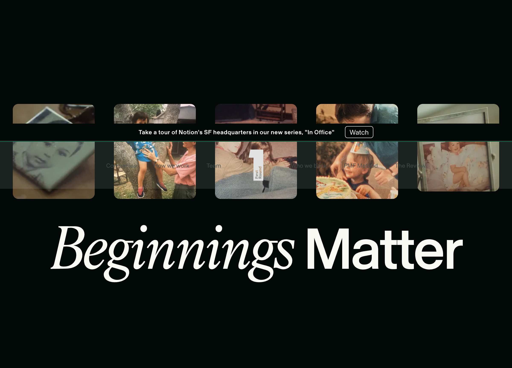
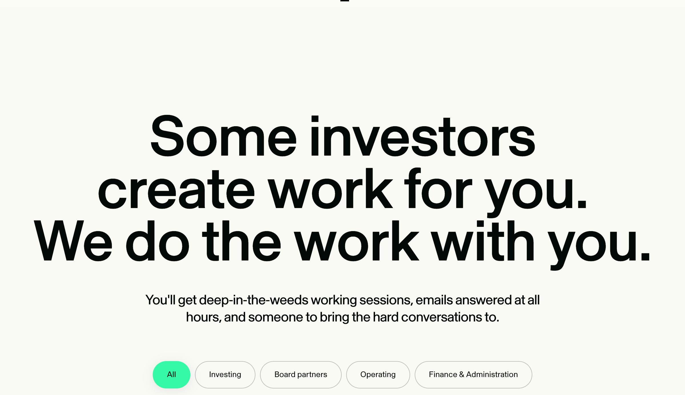
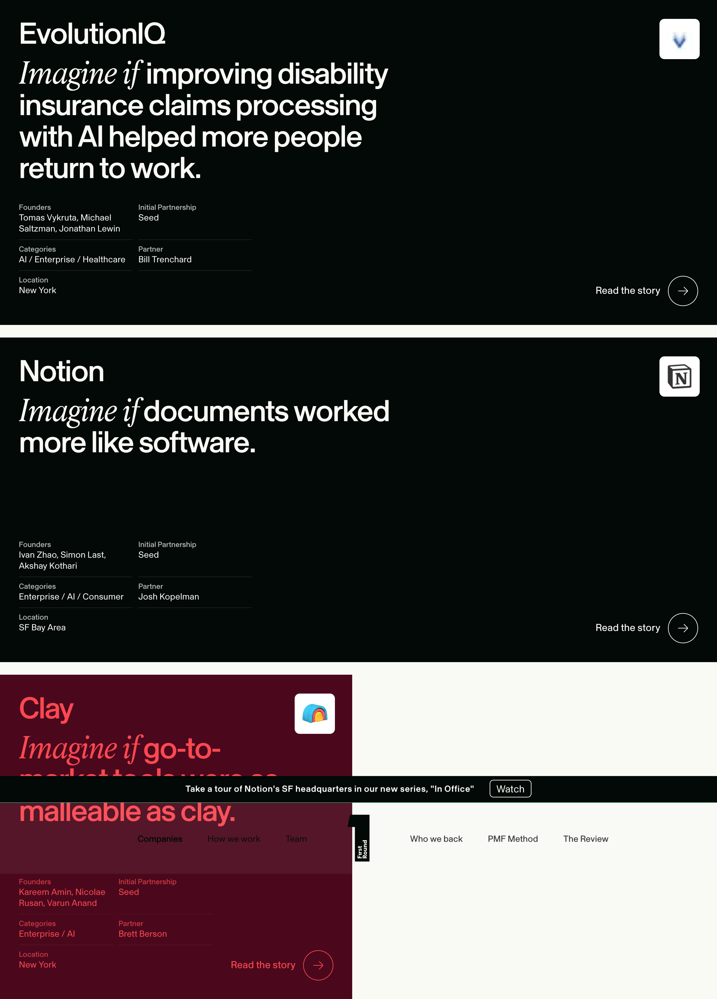
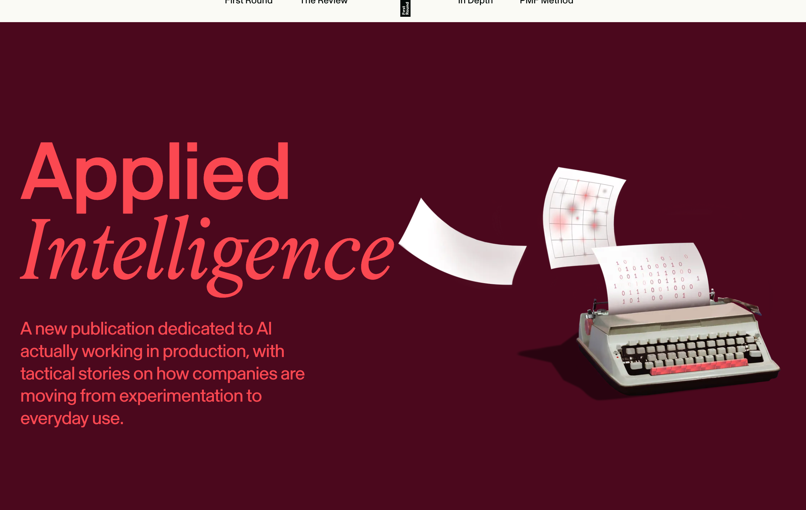

# First Round Capital

> **一句话判断：** First Round 不是一支追逐单一 AI 主题的基金，而是一家把投资决策、合伙人专长、招聘、GTM、后续融资、内容和早期社群连接起来的 **pre-PMF 风投操作系统**。它在 AI 上的优势，不只来自项目数量，更来自长期守在 Seed、让 partner cluster 各自形成判断能力，并用内容与项目持续接近最早期创始人。

## 机构轮廓

- **成立与定位：** [[person.josh-kopelman]] 于 2004 年创办 First Round。官网把目标明确限定为公司创建的最早阶段，重点是 idea 到 product-market fit，而不是覆盖完整资本生命周期。
- **阶段与地域：** 官方称主要投资美国公司，初次合作集中于 Pre-Seed、Seed 和少量 Series A；办公室在旧金山、纽约和费城。
- **行业边界：** 不是垂直主题基金，组合集中于 enterprise、AI、hardware、healthcare、fintech、consumer，但官方强调由创始人教它“下一步是什么”。
- **团队：** 当前官网列出六位 Partner：[[person.josh-kopelman]]、[[person.todd-jackson]]、[[person.brett-berson]]、[[person.bill-trenchard]]、[[person.liz-wessel]]、[[person.hayley-barna]]；[[person.annie-duke]] 是 Special Partner, Decision Science。另有投资、Founder Success/GTM、招聘、品牌内容、工程与财务团队。
- **公开规模信号：** 官网称累计投资 500+ 家公司；X 账号在 2026-07-21 抓取时约 26.3 万关注者，LinkedIn 公司页约 16.5 万关注者、展示 11–50 人规模。社交平台人数只能表示页面自报与传播规模，不能当作精确 headcount。

## 资本工具：规模稳定比规模扩张更值得注意

SEC Form D 显示：

- First Round Capital IX 于 2022-05-11 提交新发行通知，**Total Offering Amount 为 5 亿美元**；
- First Round Capital X 于 2025-09-17 提交新发行通知，**Total Offering Amount 同样为 5 亿美元**；
- X 的 filing 把 Josh Kopelman、Bill Trenchard、Brett Berson、Meka Asonye、Hayley Barna、Todd Jackson、Liz Wessel列为 related executive officers。

这支持一个有限判断：First Round 在 IX 到 X 之间没有把旗舰基金申报目标继续推成巨型多阶段基金，和它持续强调 earliest stage 的公开定位相互一致。但 **Form D 的 offering amount 是发行目标，不等于已经完成募资或最终 close 金额**；两份初始 filing 的 amount sold 都是 0，不能写成“已募得 5 亿美元”。

## 机构的核心产品：把 Seed 投资做成操作系统

### 1. 选前：把投资判断当作可迭代产品

团队页明确写到，投资机会会由团队共同评估，也会把公司转交给对该领域或地域更有经验的 partner。[[person.annie-duke]] 的角色进一步揭示了内部机制：建立 decision rubric、降低偏差、改善数据收集，并在决策后做 retrospective review。

这比“合伙人凭经验拍板”多了一层：First Round 试图把长期、稀疏反馈的风险投资判断变成可复盘系统。公开材料仍没有披露 rubric 的字段、通过门槛、partner meeting 投票结构或历史准确率，因此只能确认机制存在，不能评价其有效性。

### 2. 投后：围绕最初 24 个月补位

官方把投后支持拆成四个最直接的早期问题：

1. **Build your team：** 直接做候选人 sourcing、outreach 和关键早期招聘；
2. **Position your product：** 在公司有正式营销负责人前帮助定位、叙事与发布；
3. **Get to repeatable revenue：** 帮助 founder-led sales、客户引荐、销售复盘、ICP、定价和首位销售负责人招聘；
4. **Raise your next round：** 通过 Pitch Assist 打磨叙事、deck、投资人引荐与演练。

Partner 往往在最初进入董事会，后续轮次可把席位让给新投资人。相比传统 board update，First Round 更强调每 4–6 周围绕一个具体难题进行 working session。2016 年的 Pitch Assist 文章称，该项目是 4–6 周的后续融资 bootcamp，并引用了当时组合公司 1,000+ 轮、180 亿美元后续融资经验；这是机构自述的历史累计口径，不等于 Pitch Assist 对融资额的因果贡献。

### 3. 上游：在投资发生前建立关系

- **PMF Method：** 面向早期 B2B 创始人的免费密集项目，不给资金、不收股权；目标是把 customer discovery、design partner、定位、产品迭代和 founder-led sales 方法化。官方甚至写明：机构获得观察潜在好公司的机会，创始人获得了解 First Round 的机会。
- **Angel Track：** 官方称已有 400+ alumni，教授 sourcing、团队/市场/产品判断、组合构建和 founder working session。更关键的是，First Round 明确说会邀请 alumni 参与相关轮次，alumni 也会向 First Round 推荐创始人。
- **The Review / In Depth：** 将内部积累拆成可传播的创业方法论，长期服务创始人和 operator 社群。

因此，PMF Method、Angel Track 和内容并非孤立的品牌项目。它们共同构成 [[concept.content-community-dealflow-loop]]：一端训练潜在创始人和 angel，另一端沉淀公开知识、形成长期信任，再反向带来案源、共同投资者和投后资源。

## AI 组合：不是一个中心化 thesis，而是 partner clusters

2026-07-21 从官方 Companies 页结构化数据提取到 **48 家标为 AI 的公司**：44 家 Initial Partnership 为 Seed，3 家 Series A，1 家 Pre-Seed；其中 43 家页面状态仍为 active，4 家 acquired，1 家 IPO。这个统计只说明 First Round 当前如何给历史组合打标签，不证明每笔投资当时以“AI thesis”作出。

当前或历史 partner 映射显示：

| Partner cluster | AI 标记项目数 | 代表项目 | 可见能力圈 |
|---|---:|---|---|
| [[person.liz-wessel]] | 11 | Reducto、Gumloop、David AI、Blaxel、Onyx、Spur | AI infra、企业工作流、早期 GTM |
| [[person.bill-trenchard]] | 11 | Together AI、Serval、Assort Health、Dyna、FleetWorks | enterprise infra、AI employee、医疗/现实工作流 |
| [[person.todd-jackson]] | 10 | Fal、Parallel、Ploy、Town、Actively、Artemis | 开发者基础设施、AI-native product、复杂技术产品化 |
| [[person.josh-kopelman]] | 6 | Notion、Upstart、Aisera、Suki、Parallel | category creation、AI 应用、长期产品公司 |
| [[person.brett-berson]] | 4 | Clay、SafetyKit、Laurel、Andrenam | GTM、trust & safety、专业服务自动化 |
| [[person.hayley-barna]] | 3 | Brellium、SiteRx、Gritt Robotics | 医疗、现实行业、hard problems |

Rob Hayes 的 2 家和 Meka Asonye 的 1 家属于历史/角色变化后的组合记录，不能写成当前六位 Partner 的新增投资活动。Parallel 同时映射 Todd Jackson 与 Josh Kopelman，因此 partner 计数之和会比公司数多 1。

当前研究图只保留与我们 AI company atlas 直接相交且已由官方页确认的强关系：[[company.clay]]、[[company.fal]]、[[company.gumloop]]、[[company.parallel]]、[[company.ploy]]、[[company.serval]]、[[company.together-ai]]。没有为了做大图谱而一次搬入全部 48 家。

## AI 内容不是 market map，而是生产现场采样

First Round 在 2025-07-15 推出 Applied Intelligence，刻意把主题限定为“AI actually working in production”。它关注的不是宏大趋势，而是基础设施选择、团队结构、eval、实际 dashboard 和工作流变化。首批案例包括 Shopify、Carta、Figma、Linktree、Brex、Warp 等。

这条内容线同时承担三种功能：

1. **研究：** 从成熟公司与 AI-native 公司抽取生产经验；
2. **服务：** 把真实采用经验反哺 portfolio 的 AI 落地与 GTM；
3. **网络：** 通过内容接近正在做 AI 转型的 operator、潜在创始人和客户。

它不直接证明 First Round 的投资回报，但能说明机构把“生产中的 AI”视为当前重要观察面，也解释了为什么它的 AI 组合横跨 infra、开发工具、企业入口和垂直工作流，而不是只押模型层。

## 中文世界里的 First Round

本轮分别搜索微信和小红书，看到的不是一个完整的当前机构画像：

- 微信结果长期集中在早期创业建议、历史投资规律、全球投资人榜单，以及 Rewind 等单笔融资新闻；
- 小红书较明确的机构型内容是 PMF 方法论，更多结果仍是 Dyna、Town、Crunched、Persona 等具体公司的融资或创始人故事；
- 对 2025–2026 年 AI portfolio、Applied Intelligence、六位 partner cluster 和 decision science 机制的中文系统介绍很少。

因此中文心智更接近“高质量创业方法论来源 + 知名 Seed 投资方”，而不是“AI 投资机构”。这是传播认知，不是对机构真实能力的否定。微信搜索结果数量和小红书互动也不能当作品牌份额或声量统计。

## 关键判断

### 判断 1：First Round 的差异化是 stage discipline，而不是 sector prediction

它没有把自己包装成预测 AI 未来的主题基金，而是长期守住 pre-PMF，并把招聘、GTM、融资和决策支持围绕这个阶段做深。连续两期 5 亿美元 Form D 目标与官方 earliest-stage 叙事相互支持，但不构成回报或募资完成证明。

### 判断 2：AI thesis 应从 partner cluster 读取

48 家 AI 标记公司里，Liz、Bill、Todd 三人合计覆盖 32 个 partner attribution。研究下一家公司时，比“First Round 投了什么”更有价值的问题是：**由谁负责、这个人的 operator 背景是什么、过去形成了哪条能力链。**

### 判断 3：内容和项目本身是机构基础设施

The Review、Applied Intelligence、PMF Method、Angel Track 和 Pitch Assist 分别覆盖知识分发、潜在创始人、angel network 与后续融资。它们共同构成 [[concept.earliest-stage-venture-operating-system]]，不是几项独立的市场活动。

### 判断 4：强运营叙事仍需结果证据

绝大多数“帮到创始人”的材料来自 First Round 自己或被投创始人 testimonial。公开层仍缺：项目参与 cohort 的对照结果、招聘完成率、销售转化、Series A 成功率、工作时长，以及 operating team 对回报的可分离贡献。后续不能把“服务完整”直接写成“服务有效”。

## 风险与待验证

- Form D 只证明发行申报目标，不证明最终 close 或可投资余额。
- Portfolio 页当前标签会把历史公司按今天的 AI 语义重新分类，存在 hindsight relabeling。
- Partner attribution 说明负责人，不等于单人完成 sourcing、决策或投后。
- 官网案例和 testimonial 存在选择偏差，失败项目、低参与度公司和冲突案例不可见。
- 当前未获得独立 LP 回报、基金部署节奏、ownership target、reserve ratio 和初始 check size的可靠一手口径。
- 中文材料以转载和方法论二次传播为主，不能替代机构一手资料。

## 监控入口

- [[touchpoint.first-round.website]]：定位和机构公开叙事；
- [[touchpoint.first-round.portfolio]]：新增公司、partner 和 stage 映射；
- [[touchpoint.first-round.team]]：合伙人及角色变化；
- [[touchpoint.first-round.applied-intelligence]]、[[touchpoint.first-round.review]]：当前议题与 operator network；
- [[touchpoint.first-round.pmf-method]]、[[touchpoint.first-round.angel-track]]：上游 founder/angel 网络；
- [[touchpoint.first-round.x]]、[[touchpoint.first-round.linkedin]]：新投资、内容和活动信号。

## 证据索引

**S1 官方/监管：** [[source.first-round-home]]、[[source.portfolio.first-round-companies]]、[[source.first-round-team]]、[[source.first-round-who-we-back]]、[[source.first-round-how-we-work]]、[[source.first-round-pmf-method]]、[[source.first-round-angel-track]]、[[source.first-round-applied-intelligence]]、[[source.first-round-applied-intelligence-launch]]、[[source.first-round-decision-science]]、[[source.first-round-pitch-assist]]、[[source.sec-first-round-capital-ix-form-d-2022]]、[[source.sec-first-round-capital-x-form-d-2025]]。

**S1 平台自报：** [[source.linkedin-first-round-capital]]、[[source.x-first-round-capital]]。

**S3/S4 中文认知采样：** [[source.search-xhs-first-round-2026-07-21]]、[[source.search-wechat-first-round-2026-07-21]]。

过程记录：[[note.first-round-research-run-2026-07-21]]；研究判断：[[note.first-round-investment-system-takeaway-2026-07-21]]；试行方法：[[method.investor-research-sop-v0]]。
