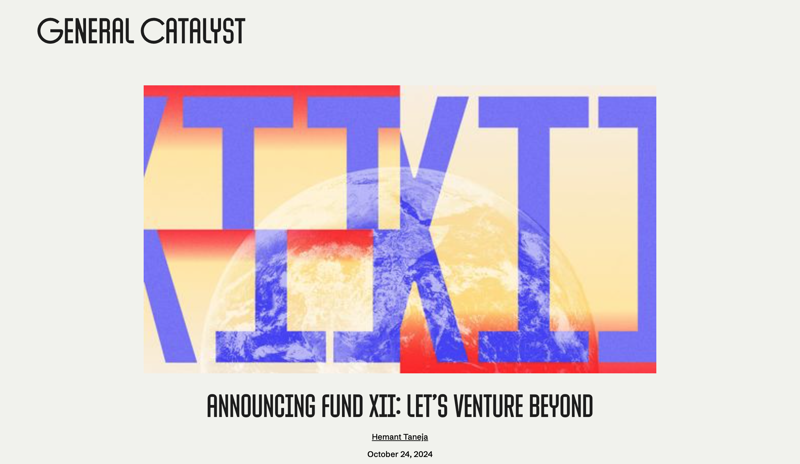

# General Catalyst

## TL;DR

General Catalyst（GC）不能只被理解成一家管理规模很大的多阶段 VC。它公开把自己称为 **global investment and transformation company**，实际同时运行四套系统：传统 seed/growth venture capital、从零孵化或收购改造公司的 Creation、为增长支出提供专用资本的 Customer Value，以及把 portfolio、企业客户、医疗系统和政府政策连接起来的 Transformation/Institute 网络。

2024 年 GC 宣布约 80 亿美元新资本，其中约 45 亿美元用于 core VC funds，15 亿美元用于 Creation，20 亿美元为 separately managed accounts。这里最重要的不是 80 亿美元这个 headline，而是 GC 已经开始按风险类型设计不同资本工具：产品与技术的不确定风险用 equity，较可预测的获客支出用 Customer Value，行业改造和服务并购用 Creation/Transformation。来源：[[source.story.general-catalyst-fund-xii-2024-10-24]]、[[source.story.general-catalyst-customer-value]]。

在当前 AI 公司图谱中，GC 与 14 家公司形成已验证关系，从 [[company.anthropic]]、[[company.mistral-ai]]、[[company.together-ai]]、[[company.adept]]、[[company.cognition]] 到 [[company.eudia]]、[[company.long-lake]]、[[company.dwelly]]、[[company.titan]]、[[company.serval]]。它们揭示了两条并行下注：一条是模型、AI infra 和通用执行能力；另一条是通过垂直软件、服务并购和真实交付重做行业。

**核心判断：** GC 的差异不是“投后团队更多”，而是试图同时控制资本结构、公司创建、客户入口和行业部署。它可能提高 AI 公司从技术到真实业务的转化速度，也会带来结构复杂、利益边界不透明、机构自述难以独立验证等问题。

## 机构身份与当前规模

- 官网：https://www.generalcatalyst.com/
- 类型：多阶段投资机构 + company creation / transformation platform
- 历史：官方在 2024 年称已有 25 年建设历史；按该口径可追溯至约 2000 年。
- 官网当前展示：6 个全球办公室、430 亿美元以上 AUM、900 家以上 portfolio companies、45 家以上 hatched companies。页面同时给出了统计日期，不能当作实时精确数字。来源：[[source.website.general-catalyst-home-2026-07-08]]。
- 主要地区网络：北美、欧洲、印度及 MENA；欧洲整合 La Famiglia，印度整合 Venture Highway。
- 关注领域：AI、healthcare、defense & intelligence、climate & energy、industrials、fintech 等。

GC 的品牌话语从 venture capital 扩大到 transformation，并不意味着所有业务已形成统一经营实体或统一收益模型。研究时必须分别回答：谁出资、资金属于什么 vehicle、谁负责项目、GC 提供的是股权、增长资本、公司共建还是企业部署渠道。

## 资本架构：不是一个 80 亿美元基金

### 1. Core VC funds：约 45 亿美元

Fund XII 公告将 core VC 分为 Ignition、Endurance、Health Assurance，覆盖 seed 与 growth equity。这部分最接近传统风险投资，但 GC 又通过全球 seed 网络、行业平台和后续资本方案延长关系。

[[source.story.general-catalyst-seed-2025-07-08]] 给出了较具体的 seed 原则：Seed 不是 Growth fund 的 feeder；GC 希望在最早期建立关系，下一轮如果继续参与，通常争取 pro rata 而不领投，以减少对新 lead 的信号干扰。这是机构公开原则，不是每笔交易的硬约束。

### 2. Creation：约 15 亿美元

Creation 包括 hatches、transformations、venture buyouts 和 AI-enabled roll-ups。它不是简单地在现有 startup 里买股，而是可能从 thesis 出发共同创建公司、收购服务企业并改造交付模型。[[person.marc-bhargava]] 是当前这条线的关键公开负责人。

在 [[concept.ai-enabled-roll-up]] 中，GC 主张技术团队直接拥有或运营服务交付层，通过收购获得客户、现金流、数据和工作流，再用 AI 重构服务，而不是只向传统服务商卖一层 SaaS。官方称已投入数十亿美元并完成数十次收购，但这些 aggregate claim 缺少统一 cohort、回报与整合失败率，不能直接当成模式已被验证。

### 3. Separately managed accounts：约 20 亿美元

公告披露 20 亿美元 SMA，但没有在同一页面给出投资人、期限、行业、费率或 portfolio 映射。当前只保留 vehicle 事实，不把它解释成新的 flagship fund，也不把某家公司自动归因到 SMA。

### 4. Customer Value：增长支出的专用资本

Customer Value strategy 预付公司产品市场匹配后的销售与营销预算，并从这部分新增客户价值中获得有上限的回报。GC 表示，如果支出没有产生预期客户收入，GC 承担 downside，公司不按固定计划还本。

它与传统 equity 的区别在于把较可预测的 CAC/S&M 支出从公司股权融资中拆出来；与固定债务的区别在于回款和客户价值挂钩。但“non-dilutive”不等于没有成本，公开材料没有统一披露资金价格、损失率和不同 cohort 结果。来源：[[source.story.general-catalyst-customer-value]]、[[source.website.general-catalyst-capital-2026-07-08]]。

## 谁在形成判断

GC 团队规模很大，本研究不导入完整组织目录，只建能解释当前 AI 交集和机构机制的责任节点。

### [[person.hemant-taneja]]：机构级 transformation 与 applied AI

Hemant 是 CEO，也是 GC 从 VC 向 investment and transformation company 扩张的主要公开叙事者。他把 applied AI 与 healthcare、defense、industrials、energy、financial services 的转型联系起来。当前图谱中，[[company.anthropic]] 与 [[company.mistral-ai]] 等项目能看到他的直接 attribution。

### [[person.marc-bhargava]]：Creation、AI roll-up 与 fintech

Marc 负责 Creation strategy，公开 profile 直接列出 [[company.accrual]]、[[company.dwelly]]、[[company.eudia]]、[[company.long-lake]]、[[company.serval]]、[[company.titan]]、[[company.mercor]]、[[company.cognition]]、[[company.together-ai]] 等项目。他是当前图谱中连接公司最多、最能解释 GC applied AI 路线的 partner。

### [[person.jeannette-zu-furstenberg]]：欧洲 seed、工业网络与政策入口

Jeannette 负责欧洲业务，La Famiglia 的关系网络让 GC 获得欧洲早期 founder、传统工业家族、客户和政策入口。她与 Mistral、Helsing 等项目的关系说明 GC 在欧洲并非只做美国基金的区域 sourcing。来源：[[source.team.general-catalyst-jeannette-2026-07-21]]。

### [[person.quentin-clark]]：AI 与企业基础设施

Quentin 的公开重点是早期 AI、企业基础设施和赋能日常工作的产品。他与 [[company.mistral-ai]]、[[company.together-ai]] 的投资文章共同署名，代表模型和 infra 层的产品判断。来源：[[source.team.general-catalyst-quentin-2026-07-21]]。

### 历史署名不等于 current team

2023 年 Adept 文章披露 GC 项目团队为 Deep、Ragavan、Chris。后续公开报道显示 GC 团队发生变化，因此本轮保留文章当时 attribution，不把历史署名人自动写成当前核心人物。来源：[[source.story.general-catalyst-adept-2023-03-14]]。

## 当前图谱中的 14 家公司

这不是完整 portfolio 导入，而是当前已经研究过、且有官方或公司侧证据支持的交集。

### 模型、基础设施与通用执行

- [[company.anthropic]]：GC 官网与 portfolio 的高置信关系；当前边不补猜具体轮次：[[investment.general-catalyst-anthropic-portfolio]]。
- [[company.mistral-ai]]：开放模型、欧洲 AI 与 sovereign/resilience 叙事：[[investment.general-catalyst-mistral-ai-portfolio]]、[[source.story.general-catalyst-mistral-2023-12-11]]。
- [[company.together-ai]]：开放、分布式 AI cloud 和训练/推理基础设施：[[investment.general-catalyst-together-ai-portfolio]]、[[source.story.general-catalyst-together-ai-2025-02-20]]。
- [[company.adept]]：2023 年 3.5 亿美元 Series B，GC 明确领投：[[investment.general-catalyst-adept-series-b-2023]]。
- [[company.cognition]]：Marc 官方 profile 的 portfolio relation，具体轮次未在该证据中建模：[[investment.general-catalyst-cognition-portfolio]]。

这组投资说明 GC 对 AI 的判断不只在 application，也包括模型开放性、企业基础设施和能在软件界面中执行任务的 agent。但 Adept 后续变化也提醒：技术愿景与持续商业组织不是同一件事。

### AI-enabled services 与 Creation

- [[company.accrual]]：面向 CPA/accounting 的 AI operating system：[[investment.general-catalyst-accrual-portfolio]]。
- [[company.eudia]]：法律服务与 AI transformation：[[investment.general-catalyst-eudia-portfolio]]。
- [[company.long-lake]]：home services 方向的 AI-enabled company building：[[investment.general-catalyst-long-lake-portfolio]]。
- [[company.dwelly]]：英国 lettings/property management 转型样本：[[investment.general-catalyst-dwelly-portfolio]]。
- [[company.titan]]：IT services/MSP 的 applied AI 路径：[[investment.general-catalyst-titan-portfolio]]。
- [[company.beacon-software]]：在垂直软件与经营公司之间的 Creation 样本：[[investment.general-catalyst-beacon-software-portfolio]]。
- [[company.serval]]：AI 驱动的服务/企业工作样本：[[investment.general-catalyst-serval-portfolio]]。

这些边目前多数只证明官方 portfolio 或 Creation relation，不证明每家都使用同一种 acquisition vehicle，也不证明所有公司已经完成 roll-up。

### 人才市场与全球 seed

- [[company.mercor]]：AI 人才与劳动力市场，Marc profile 列为当前投资：[[investment.general-catalyst-mercor-portfolio]]。
- [[company.luel]]：公司公告称 3,120 万美元 seed/financing 由 GC 与 Lightspeed 共同领投；当前保持 medium confidence，避免把含混 financing 口径写成标准 seed round：[[investment.general-catalyst-luel-seed-2026]]。

## 决策系统：从 founder 到行业结构

GC 的公开材料呈现出四层判断：

1. **Founder-level insight：** seed 阶段优先寻找能重新描述现实、在模糊期形成非共识判断的 founder；
2. **Technology layer：** 模型、数据、基础设施和 agent execution 是否带来能力跃迁；
3. **Industry structure：** 行业是否碎片化、服务供给稀缺、客户与数据能否通过收购/运营形成复利；
4. **Capital fit：** 当前风险应该由 equity、Customer Value、结构化资本、Creation 还是 SMA 承担。

这比“看团队、市场、产品”更接近 GC 的真实差异。它同时也增加了判断难度：同一家公司可能既是 equity portfolio，又使用 Customer Value 或进入 Transformation network，公开页面并不总能说明各层合同关系。

## 投后与分发：不只是招聘和 PR

### GC Famiglia 与全球 seed

La Famiglia、Venture Highway、Wayfinder/YC 等网络被整合进全球 seed 策略。公开材料强调技术招聘、客户连接、社群和下一轮融资支持。效果仍应逐公司验证，不能用平台存在推断每家公司都得到同等资源。

### Transformation Flywheel

GC 试图把 portfolio innovators 与大型 adopters 连接起来。HATCo 聚合医疗系统合作，Percepta 面向关键行业做 applied AI transformation，GC Institute 连接 startup 与政府政策。这些组织更像 deployment/distribution infrastructure，而不是传统“投后服务菜单”。来源：[[source.website.general-catalyst-transformations-2026-07-08]]。

### 内容、政策与人才入口

官网 stories、portfolio、团队目录、YouTube、X、LinkedIn 与 portfolio jobs 共同构成持续入口。内容不只做品牌传播，也公开 partner attribution、thesis、客户案例和新公司创建方向；Institute 则把政策与政府关系纳入机构网络。

## 对 AI 公司 GTM 的启发

GC 最值得借鉴的不是“VC 帮公司做销售”，而是把 GTM 问题拆成不同资产：

- 产品卖不进传统行业，可能需要 Transformation/FDE 与行业伙伴；
- 分发被传统服务公司占据，可能需要收购或经营服务层；
- 增长已可预测但持续吃 equity，可能需要专用 CAC 资本；
- 涉及政府、医疗、国防等高门槛市场，需要政策和机构网络；
- 早期公司仍需要精品 seed 关系和技术招聘，而不是一开始就被大型平台流程淹没。

这条路径与 HN、Product Hunt、SEO、社区增长并不冲突，只是适用于迁移成本高、交付复杂、结果责任重的企业与垂直市场。

## 中文世界如何理解 GC

本轮中文检索主要命中三类内容：具体融资新闻中的投资方名单、对 AI roll-up 的二次转述、海外 AI 投资报告里的公司/轮次表。高质量中文材料很少解释 Customer Value、Creation、SMA、Transformation 之间的结构差异。

因此中文语境容易产生两个偏差：一是把 GC 简化成“又一家押注 AI 的美国大基金”；二是只看到 roll-up 的并购叙事，忽略它同时需要软件平台、运营改造和结果责任。当前不以低质量中文转述反向证明 GC 机制，只把这个认知缺口作为内容机会。

## 关键判断

### J1：GC 正在把 VC 从单一股权产品改造成资本与转型工具箱

这是事实支持较强的判断。80 亿美元资本拆分、Customer Value、Creation、Transformations 和 Institute 都是官方可验证结构。尚不能证明它们能稳定产生优于传统 VC 的回报。

### J2：AI-enabled roll-up 的真正壁垒可能是分发与运营责任，不只是模型

收购服务公司可以获得客户、数据和工作流，也意味着整合、人力、合规和客户结果都进入平台责任。模式是否成立，应看收购后增长、毛利、客户留存、自动化比例和整合成本，而不是只看融资和收购数量。

### J3：GC 的 partner network 已出现清晰 cluster

Hemant 连接机构级 AI/transformation，Marc 连接 Creation 与 applied AI services，Jeannette 连接欧洲 seed/工业/政策，Quentin 连接 AI infra。当前 14 家交集不是随机散点，已经能反映 sourcing 与判断结构。

### J4：大型平台的“全机构支持”需要降级理解

GC 团队页称与一家合作就是与整个 partnership 合作，但实际项目仍有主要责任人、地域和资本工具。研究中应优先跟踪明确 partner attribution 和具体服务使用，而不是把机构所有能力都归给每一家 portfolio company。

## 风险与待验证

1. **结构复杂度：** core funds、SMA、Creation、CVF、Transformation 的实体与经济关系并未完全公开。
2. **机构自述偏差：** roll-up、客户增长与 transformation 案例主要来自 GC 自己，缺统一独立评估。
3. **并购整合风险：** 服务企业的人力、文化、系统和监管不能只靠 AI 平台统一。
4. **资本错配风险：** 可预测 CAC、结构化收益和真实 downside 的边界若判断错误，会把风险从公司转移到资本 vehicle。
5. **团队变化：** 历史投资署名与 current team 可能不同，必须按时间记录。
6. **指标缺口：** 缺少 CVF cohort 回报、Creation 收购后经营数据、Transformation 客户留存和平台覆盖率。
7. **利益相关：** 投资方文章中的客户、合同和能力表述不能替代公司侧或客户侧证据。

## 监控清单

- 新 fund、SMA、Creation 或 Customer Value vehicle 的监管 filing 与 final close；
- GC portfolio 页面新增 AI 公司、responsible partner、backed since、seed/CVF/creation 状态；
- Marc Bhargava 的新 Creation、venture buyout 与 AI roll-up 项目；
- Hemant Taneja 的季度 review、Percepta 与 Transformation 进展；
- Jeannette 的欧洲 AI/工业/政策网络；
- Quentin 的 AI infra 与 enterprise software 投资；
- Customer Value 的客户侧融资成本、回报和失败样本；
- roll-up 公司收购后的营收质量、毛利、留存、自动化比例与整合事件。

持续入口：[[touchpoint.general-catalyst-website]]、[[touchpoint.general-catalyst-portfolio]]、[[touchpoint.general-catalyst-stories]]、[[touchpoint.general-catalyst-team]]、[[touchpoint.general-catalyst-x]]、[[touchpoint.general-catalyst-linkedin]]、[[touchpoint.general-catalyst-youtube]]、[[touchpoint.general-catalyst-jobs]]。

## 证据库

### 机构、资本与机制

- [[source.website.general-catalyst-home-2026-07-08]]
- [[source.story.general-catalyst-fund-xii-2024-10-24]]
- [[source.website.general-catalyst-capital-2026-07-08]]
- [[source.story.general-catalyst-customer-value]]
- [[source.story.general-catalyst-seed-2025-07-08]]
- [[source.website.general-catalyst-transformations-2026-07-08]]
- [[source.story.general-catalyst-future-of-services-2025-08-28]]
- [[source.story.general-catalyst-europe-ai-services-2026-04-08]]

### 当前人物与 attribution

- [[source.website.general-catalyst-team-2026-07-21]]
- [[source.team.general-catalyst-hemant-taneja-2026-07-08]]
- [[source.team.general-catalyst-marc-bhargava-2026-07-08]]
- [[source.team.general-catalyst-jeannette-2026-07-21]]
- [[source.team.general-catalyst-quentin-2026-07-21]]

### 投资与公司关系

- [[source.story.general-catalyst-adept-2023-03-14]]
- [[source.story.general-catalyst-mistral-2023-12-11]]
- [[source.story.general-catalyst-together-ai-2025-02-20]]
- [[source.blog.luel-seed-2026-05-15]]
- [[source.website.general-catalyst-portfolio-2026-07-08]]

本轮过程与方法反思：[[note.general-catalyst-research-run-2026-07-21]]。原始 CP takeaway：[[note.general-catalyst-takeaway-2026-07-08]]。
