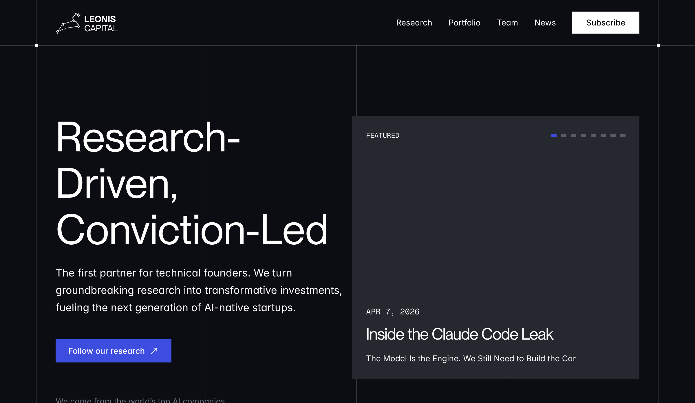
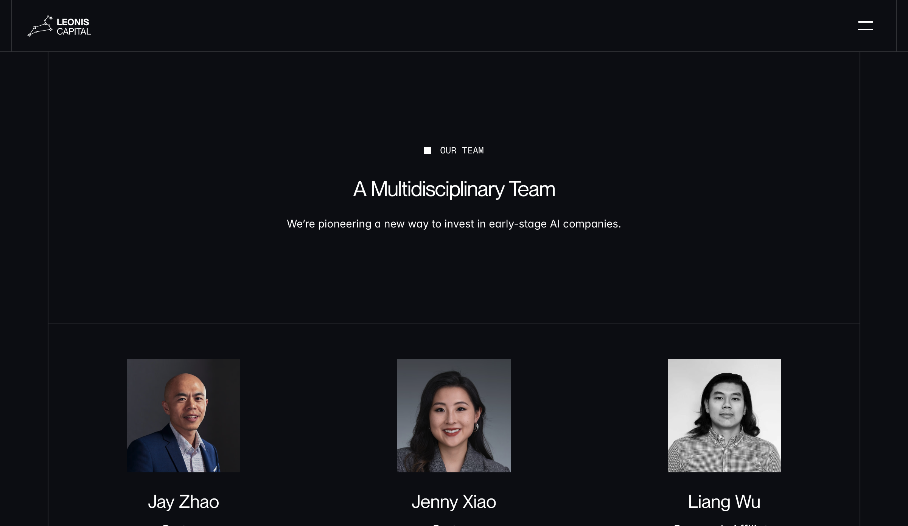
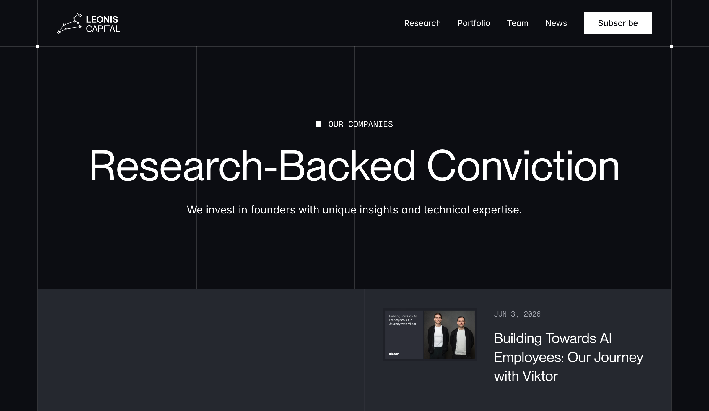
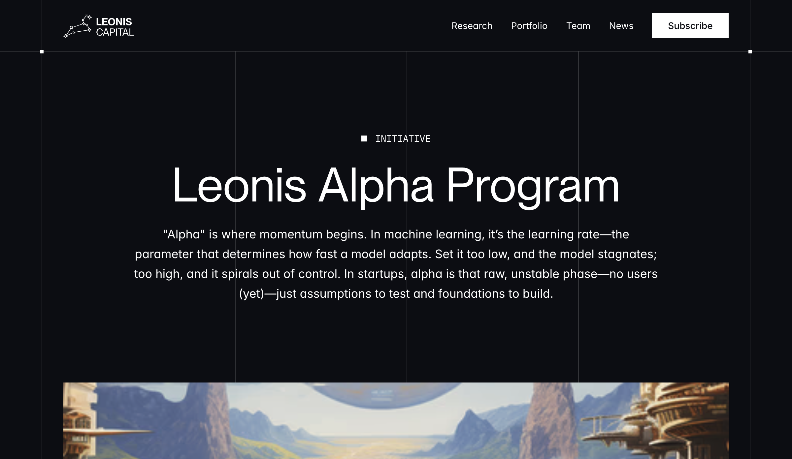

# Leonis Capital

Leonis Capital 是一家 2021 年成立、以 AI-native 公司为主的早期风险投资机构。它把自己定义为 **“Research-Driven, Conviction-Led”**，通常希望成为技术创始人的第一张机构支票，主要覆盖 pre-seed 与 seed。与大型多阶段基金相比，Leonis 的识别度不来自资本规模或完整 platform team，而来自小团队持续研究、主动 sourcing、较低投资频次和早期技术判断。

本轮最重要的结论是：**Leonis 不是偶然投中了一批 AI 公司，而是在把“研究 -> 人才信号 -> 早期接触 -> 高确信下注 -> 研究复盘”做成一套轻量机构系统。** 公开 research 索引、Alpha Program、Viktor 早期案例和内部 Alfa 信号系统能够互相支持这一判断；但 Alfa 的实际准确率、IC 决策机制、Fund I 回报和投后效果仍主要是机构自述，不能升级为独立验证。

## 一句话判断

Leonis 位于“个人能力驱动的精品 seed fund”和“制度化研究机构”之间：[[person.jay-zhao]] 提供跨周期早期投资经验与商业判断，[[person.jenny-xiao]] 提供 AI 研究能力，团队再用公开研究、research affiliates、Alpha Program 和内部信号追踪把个人判断部分系统化。它最值得关注的不是基金有多大，而是能否持续在产品成形前识别技术创始人，并把早期 thesis 变成一组相互解释的 portfolio。

## 机构身份与资本架构

### 当前可确认的机构边界

- 官网把 Leonis 定义为研究驱动、以技术创始人为核心的 AI-native 早期投资机构，并强调“usually the first institutional check”。[[source.leonis.homepage-2026-07-21]]
- 官网团队页称机构成立于 2021 年，目标是捕捉 AI supercycle，而不是采用广撒网的 spray-and-pray 模式。[[source.leonis.team-2026-07-21]]
- 2025 年 9 月的公司新闻稿称 Fund II 完成 2,500 万美元募资，出资者包括机构 LP、fund of funds、基金会，以及 Nvidia、OpenAI、Anthropic 的 AI operators、researchers 与 executives。该稿件由机构发布并经新闻分发平台传播，属于 sponsor-originated source，不是独立媒体确认。[[source.leonis.fund-ii-2025-09-16]]
- SEC Form D 显示 Leonis Capital Fund II, LP 于 2024 年 1 月首次申报：offering amount 为 Indefinite、amount sold 为 0、investor count 为 0、first sale 尚未发生。它证明 vehicle 在当时启动募资，不代表后续没有募到；2025 年官方新闻稿提供了后续“fully subscribed $25M”的机构口径。[[source.sec.leonis-fund-ii-form-d-2024-01-17]]
- 2026 年 3 月 Form ADV 把 Leonis Capital Partners LLC 列为 California active exempt reporting adviser，并报告 6 个 private funds。Fund II 的 current gross asset value 为 21,521,292 美元、beneficial owners 为 78；另有 Leonis DoubleDown Fund 等 vehicle。GAV 是申报时点资产价值，不能和 2,500 万美元 committed/subscribed capital 直接等同。[[source.sec.leonis-form-adv-2026-03-31]]

### 不能混用的数字

| 数字 | 能说明什么 | 不能说明什么 |
|---|---|---|
| Form D 的 Indefinite / 0 sold | 2024-01-17 时 vehicle 刚启动、尚无首售 | Fund II 最终规模或募资失败 |
| 官方 2,500 万美元 Fund II | 机构在 2025-09-16 宣布 fully subscribed | 独立审计的 final close、已部署资本或回报 |
| ADV 的约 2,152 万美元 GAV | 2026-03-31 的 filing-time gross asset value | committed capital、dry powder 或投资成本 |
| Business Insider 所称 4,000 万美元 second fund | 媒体文章存在这一表述 | 不能覆盖官方 2,500 万美元口径；当前视为未解决冲突 |

机构新闻稿还称 2021 vintage Fund I 被 PitchBook 评为 top 1%，并有 50x–200x markup。没有取得对应 PitchBook 原始表或独立 fund-level return 数据，因此这里只把它记录为 Leonis 的营销主张，不作为已验证业绩。

## 当前团队：小型核心，而非大型平台

### 投资与研究核心

- [[person.jay-zhao]]：官网列 Partner，LinkedIn 自述 Managing Partner。曾在 T Fund、Walden、Granite Ventures 任职，并有 Marqeta 董事经历。公开资料支持他是机构治理与投资核心，但没有公开 IC 投票结构。
- [[person.jenny-xiao]]：Partner，哥伦比亚大学 AI 与经济学博士、前 OpenAI researcher。她的公开研究与采访集中在模型能力边界、AI 产品 moat、技术路线和中美 AI 市场差异。
- [[person.liang-wu]]：Research Affiliate，曾任 Harvard Business School Senior Researcher。当前公开职责支持研究关联，不足以证明其拥有投资决策权，因此不把他升级为 partner。
- [[person.isaac-schefer]]：CFO，负责财务与运营。官网没有把他列为投资合伙人。

2023 年钛媒体采访曾把 Jay、Jenny 和 Val Gui 描述为三位合伙人，并分别解释投资、AI 技术和运营能力。当前官网团队页已不再列 Val，因此该文章只能说明历史组织状态，不能用于当前团队强关系。[[source.wechat.tmt-leonis-2023-09-11]]

官网另列 research fellows。2025 年 Fund II 新闻稿称有 8 位 research fellows，当前团队页公开可见 3 位；这可能是时间、项目 cohort 或公开展示口径差异，不能直接推断缩编。

### 组织优势与 key-person risk

小团队能让研究、投资和投后沟通由 partner 直接完成，也更容易保持集中 portfolio；但它同时带来明显 key-person risk。公开材料大量围绕 Jay 与 Jenny 的经验、判断和人脉展开，尚未看到独立于两位合伙人的稳定 IC、succession、冲突管理和 portfolio coverage 机制。

## 决策系统：技术问题清楚，治理机制不透明

Business Insider 访问 Jay 与 Jenny 后列出一组比“市场大不大”更接近实际技术尽调的问题：[[source.businessinsider.leonis-ai-evaluation-2026-01-29]]

- 模型能力达到什么 threshold 才会让产品成立；
- foundation model lab 的 roadmap 是否会吞掉当前产品；
- 产品运行能否生成专有数据或学习闭环；
- 产品是否容易被 clone；
- 哪些 architecture decision 一旦做出就很难改；
- 创始人是否能主动 unlearn，是否能说清 hidden advantage；
- 什么新证据会让团队改变判断；
- 外部依赖改变时，产品还剩下什么。

这套问题和 Leonis 公开研究一致：它关注模型能力变化如何重画 application boundary，也关注产品是否能从 workflow、proprietary data、distribution 或系统集成形成耐久优势。Viktor 的案例尤其典型：Leonis 称自己在产品、收入和常规 GTM 形成前，就基于 autonomous action model 与 persistent contextual understanding 的技术方向下注。[[source.leonis.viktor-ai-employees-journey]]

但以下部分仍然没有可靠公开证据：

- standard seed deal 是否必须进入正式 IC；
- partner meeting、投票、否决和 sponsor 机制；
- reference check、memo 和 post-mortem 的固定流程；
- 同类公司冲突、信息墙和竞争投资规则；
- 估值纪律、ownership 目标、reserve 比例和 follow-on policy。

Alpha Program 只说明其可以“within days”做决定，Business Insider 只说明评估 rubric；两者都不能证明内部治理机制。

## 研究系统：从公开 thesis 到内部 Alfa

Leonis 的 research 索引不是一次性的 AI 观点合集。公开文章从 2020 年 automation thesis、2022 年 generative AI、2023 年 agents 与 LLM stack，延伸到 2025 年 developer tools、MCP、OpenAI 与估值，再到 2026 年 OpenClaw、systems of action 和 Claude Code。[[source.leonis.research-index-2026-07-21]]

这形成三层价值：

1. **类别形成。** 在产品成熟前先描述能力边界、价值链和潜在 moat。
2. **创始人筛选。** 研究让团队能和技术创始人在模型、架构和市场结构上建立更高密度对话。
3. **portfolio 解释。** 后续 investment memo 与 research article 可以把单笔投资重新放回机构 thesis。

2025 年新闻稿还披露内部系统 **Alfa**：系统学习机构过去的思考，并跟踪 GitHub contribution、论文和 conference signal，希望在创业者成立公司前发现技术人才。这个描述和 Viktor 的“从 Llama 2 paper 发现创始人”相互呼应，但目前仍只有机构自述：没有公开 precision、recall、false positive、命中转化或由 Alfa 直接带来的投资样本统计。

因此更稳妥的判断是：**Leonis 已经把 research-driven sourcing 产品化到一定程度，但不能证明该系统比优秀合伙人的个人网络更有效。**

## Portfolio：不是“全投 Agent”，而是围绕 AI-native stack 形成连续下注

本轮观察到官网 portfolio 页面公开展示 46 个公司卡片。最上方重点展示 Viktor、MaintainX、Motion、Spline、Method、SpectroCloud、Anaplan、Marqeta 八个 “Why We Invested” 案例。这个列表只证明 Leonis 公开承认 portfolio membership；它不能自动证明 round、lead、金额、日期或当前 ownership。[[source.leonis.portfolio-2026-07-08]]

当前 vault 已验证并建立 8 条 Leonis 投资关系：

| 公司 | 当前结构化边界 | 对机构能力圈的意义 |
|---|---|---|
| [[company.viktor]] | 2024 早期投资，高置信；轮次与单家金额未公开 | AI employee、autonomous action、persistent context |
| [[company.motion]] | 2025 融资公告列为新投资者，高置信 | 从 productivity suite 向 agentic work suite 演进 |
| [[company.kylon]] | 官方 portfolio，medium | Agent gateway、权限与 runtime access |
| [[company.general-analysis]] | 官方 portfolio，medium | Agent-native analytics / technical workflow |
| [[company.scalestack]] | 官方 portfolio，medium | Agent GTM 与企业数据工作流 |
| [[company.paysponge]] | 官方 portfolio，medium | Agent payments / financial action |
| [[company.introspection]] | 官方 portfolio，medium | Agent improvement / reasoning feedback |
| [[company.qualgent]] | Seed lead 的既有证据，medium | 垂直 QA Agent 与软件交付 |

这组公司比“Leonis 是 AI 基金”更具体：它覆盖 Agent 进入企业后所需的执行模型、上下文、gateway、评估、支付、GTM 与垂直工作。但仍不能把所有公司写成统一的 agent thesis；官网也有 SaaS、cloud infrastructure、data、bioinformatics 和历史 fintech 项目。

其他公开候选包括 Paradigm Study、Holo、Panta、Sully、Orchids、AnythingLLM、Nex、Onlook、Amy、Describe、Kubit、Meticulate、Yarn、Unify、Blink 等。它们可作为下一轮 seed，不在本轮为了“全量”而创建全部公司和 investment。尤其官网的 Kepler 指向 `getkepler.ai`，不能和现有历史对象 Kepler AI 自动合并。

## Alpha Program：把 pre-seed 支票与 company building 绑定

Alpha Program 是 Leonis operating model 最具体的公开入口。页面称：

- 提供 10 万美元、founder-friendly terms；
- 面向 technical core 已可验证、但公司和市场仍很早期的团队；
- 以“founding COO”方式协助 company setup、产品方向、technical pilot、网络和 seed 准备；
- 在数日内做决定，并由团队 hands-on 参与。[[source.leonis.alpha-program-2026-07-21]]

这说明 Leonis 不只是等标准 seed round，而是把 discovery、第一张支票和早期公司建设连接起来。它也与 Jay 在 2023 年采访中“早期 VC 是 company-building service business”的表述一致。

公开边界仍然很清楚：页面 FAQ 没有稳定渲染完整条款；没有 cohort 数、后续融资率、pilot 转化、失败率或创始人侧独立评价。因此不能把 10 万美元和支持目录直接解释为 program effectiveness。

## 投后系统：partner direct，但缺少结果层证据

2023 年采访称，Leonis 每年只做 5–7 笔投资，单支基金目标 25–35 家，合伙人直接参与投后，不把服务交给后台平台团队。Jay 负责客户与长期商业判断，Jenny 提供 AI 技术与资源连接，历史上的 Val Gui 负责运营增长。[[source.wechat.tmt-leonis-2023-09-11]]

官网 Alpha Program 进一步支持其 company setup、产品方向、pilot、网络和 seed preparation 能力。可以确认的是“谁来做”和“公开承诺做什么”；仍不能确认：

- 每家 portfolio 获得多少 partner time；
- technical pilot、客户引荐和后续融资的成功率；
- 投后介入是否只集中在少数高优先级项目；
- founder 对支持质量的独立评价；
- board、follow-on 和危机处理能力。

因此 Leonis 更像 **partner-led boutique support**，不是可规模化的 platform service。小而集中是其策略，也限制了覆盖能力。

## 中文世界如何理解 Leonis

微信以 “Leonis Capital” 搜索时显示约 94 条候选，“Leonis 资本”约 71 条。搜索数是平台估算，不代表声量份额。高质量中文材料主要集中在 2022–2023 年 AIGC 热潮和华人投资人访谈。

钛媒体 2023 年长访谈形成了中文世界最鲜明的 Leonis 标签：

- “硅谷华裔背景、专注 AI 的早期风险投资机构”；
- 第一性原理、非共识创始人；
- 每年 5–7 笔、基金 25–35 家；
- B2B AI transformation、vertical AI、developer tools；
- Jay 的早期投资经验、Jenny 的 AI 学术背景和当时 Val Gui 的运营背景。

这些描述对理解机构历史非常有用，但也容易把 Leonis 简化为“华人 AI 基金”。英文一手材料更强调 research system、technical founder sourcing、Alpha Program、Alfa 以及模型能力变化对产品边界的影响。中文文章较少讨论 SEC vehicle、current team 变化、IC/no-hit 和 portfolio evidence boundary。

小红书样本 [[source.xiaohongshu.leonis-jenny-china-us-ai-2026-01-15]] 延续了 Jenny 解读中美 AI 创投差异的个人品牌，但只有 9 个点赞、4 个收藏，是单条二手转述，不能代表中文市场整体认知。

## 传播与案源：机构账号弱，个人与研究更关键

2026-07-21 快照中，Leonis LinkedIn 公司页显示 2–10 employees、约 3,000 followers；机构 X 账号仅约 279 followers 且公开发帖很少。[[source.linkedin.leonis-company-2026-07-21]]

相比之下，Jenny 与 Liang 的个人账号、官网 research、采访和 Alpha Program 更可能承担 sourcing/distribution。对小型机构而言，这不是“社媒弱所以品牌弱”，而是传播重心从机构账号转向 partner expertise 与可检索研究。后续监控应优先看：

- [[touchpoint.leonis.research]]：新 thesis 与投资解释；
- [[touchpoint.leonis.portfolio]]：新增公司和重点案例；
- [[touchpoint.leonis.team]]：current team 与 fellow 变化；
- [[touchpoint.leonis.alpha]]：条款、cohort 和运营数据；
- [[person.jay-zhao]]、[[person.jenny-xiao]]、[[person.liang-wu]] 的公开输出；
- SEC 新 vehicle 与 amendment。

## 证据边界

### 可以直接说明

- Leonis 是 2021 年成立、研究驱动的 AI-native 早期机构；
- Fund II 有 2024 Form D 和 2025 机构宣布的 2,500 万美元 fully subscribed；
- 2026 ADV 报告 6 个 private funds，并给出 filing-time GAV；
- 当前官网核心人物是 Jay、Jenny、Liang，Isaac 负责 CFO；
- portfolio 页公开 46 个公司卡片，本 vault 已验证 8 条相关投资边；
- Alpha Program 公开 10 万美元与 hands-on company-building 支持；
- Viktor 案例和 research index 支持其 agent/AI-native thesis 连续性。

### 研究判断

- Leonis 的差异化更接近“研究与人才信号驱动的早期发现”，而不是资本规模或平台服务；
- Alfa、research affiliates 和公开内容正在把 partner intuition 部分制度化；
- portfolio 中已形成 agent execution / context / gateway / eval / payments / GTM 的相邻 cluster；
- 小团队带来高密度 partner involvement，也带来 key-person 与覆盖风险。

### 仍不可验证

- Fund I 独立净回报、DPI/TVPI/IRR 与所谓 top 1%；
- Alfa 的真实命中率和对投资结果的增量贡献；
- 标准 IC、投票、否决、冲突与 post-mortem；
- Alpha Program cohort、后续融资率和公司存活率；
- partner attribution、board involvement 与单笔决策权；
- portfolio 的完整性、当前 ownership、reserve 和 follow-on 分配；
- 2026 媒体所称 4,000 万美元 fund 与官方 2,500 万美元之间的差异。

## 后续更新触发器

1. SEC 出现新 vehicle、Form D/A 或 ADV 更新；
2. Leonis 正式解释 2,500 万 / 4,000 万美元口径；
3. Alpha Program 公布 cohort、条款或结果数据；
4. Alfa 出现可验证案例、产品化说明或性能指标；
5. portfolio 新增与 Agent infra、AI employee、evaluation、payments 相关公司；
6. current team、research affiliate 或 fellow 发生变化；
7. portfolio founder 对投后支持给出客户侧评价。

本轮流程与方法反思见 [[note.leonis-capital-research-run-2026-07-21]]；机构级操作基线见 [[method.investor-research-sop-v0]]。
