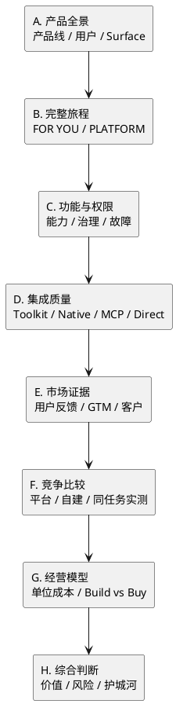

# Composio 竞品调研与功能拆解框架

Created at：2026-07-29（Asia/Shanghai）

状态：研究路线图，等待 Owner 逐项选择和 review。本文描述“还可以研究什么”，不把待执行
项目写成已确认事实。

## 研究目的

现有研究已经回答：

1. Composio 的核心概念和对象如何关联；
2. FOR YOU 与 PLATFORM 的部分真实 UX；
3. 当前价格与 2026-08-15 新付费模型。

下一阶段要从“理解概念”转向“拆解一个真实产品”：

- 用户为什么进入；
- 如何完成第一次价值；
- 每个功能承担什么任务；
- 权限与失败如何呈现；
- Toolkit 是否真的可用；
- 与竞品和自建相比优势在哪里；
- 使用规模扩大后成本和风险如何变化。

## 当前研究资产

- [[note.composio-concept-model-2026-07-29]]
- [[note.composio-ux-walkthrough-2026-07-29]]
- [[note.composio-pricing-model-2026-07-29]]
- [[company.composio]]

## 总体拆解结构



## 第一组：产品功能拆解

### 1. 产品地图

#### 研究问题

- Composio 有哪些正式产品线？
- FOR YOU、PLATFORM、CLI、MCP Gateway、Enterprise 是产品、入口还是能力？
- 每个页面服务哪类用户？
- 页面之间如何导流和交接？

#### 初始结构

```text
Composio
├─ FOR YOU
│  ├─ Connected Apps
│  ├─ CLI
│  ├─ MCP
│  └─ Enhanced Controls
├─ PLATFORM
│  ├─ Projects
│  ├─ Toolkits
│  ├─ Auth Configs
│  ├─ Connected Accounts
│  ├─ Users
│  ├─ Sessions
│  ├─ Triggers
│  └─ Logs / Usage
└─ ENTERPRISE
   ├─ Team Roles
   ├─ IP Allowlist
   ├─ Self-managed Credentials
   ├─ VPC / Self-hosting
   └─ Compliance / Support
```

#### 执行方式

- 逐个读取官网一级入口；
- 对照真实 Dashboard 导航；
- 记录每个 Surface 的目标用户、输入、输出和下一步 CTA；
- 区分网站宣传、控制台事实和研究判断。

#### 交付物

- 一张产品地图；
- 一张 Surface 职责表；
- 页面之间的转化路径；
- 重复、缺口和概念泄漏清单。

### 2. FOR YOU 完整用户旅程

#### 研究问题

个人用户如何从“不知道 Composio”到让 Codex、Claude 或 Cursor 真正操作自己的应用？

#### Golden Path

```text
发现产品
→ 注册
→ 连接 App
→ 安装 CLI/MCP
→ 客户端登录 Composio
→ Agent 搜索 Tool
→ 首次真实执行
→ 检查结果与日志
→ 调整权限
→ 断开和撤销
```

#### 每一步记录

| 维度 | 内容 |
|---|---|
| 用户目标 | 用户此刻想完成什么 |
| 入口 | 从哪里进入 |
| 操作 | 点击、输入和授权 |
| 系统反馈 | 页面如何确认成功或失败 |
| 概念负担 | 用户必须理解什么 |
| 权限变化 | 哪个主体获得什么能力 |
| 成功证据 | 如何证明动作真实发生 |
| 失败状态 | 失败是否可理解、可恢复 |

#### 交付物

- 全链路 UX 时间线；
- 首次价值时间；
- 每一步截图；
- 权限变化图；
- 主要摩擦和恢复路径。

### 3. PLATFORM 完整用户旅程

#### Golden Path

```text
创建 Project
→ 选择 Toolkit
→ 配置 Managed/Custom Auth
→ 创建 Platform User
→ 让最终用户连接账号
→ 创建 Session
→ Agent 执行 Tool
→ 查看 Logs
→ 处理账号过期
→ 删除、撤销和清理
```

#### 额外问题

- 开发者和最终用户分别看到什么？
- User、Connected Account 和 Session 在产品中如何呈现？
- 从 Demo 到 Production 需要跨过哪些配置门？
- 哪些功能是 Dashboard 操作，哪些只能通过 SDK/API？

#### 交付物

- 开发者 Journey Map；
- 最终用户授权 Journey Map；
- 前后端责任矩阵；
- Production Readiness Checklist。

### 4. 功能矩阵

不按菜单罗列，而按用户任务归类：

| 用户任务 | 对应能力 | FOR YOU | PLATFORM | Enterprise |
|---|---|---:|---:|---:|
| 连接应用 | Managed Auth | 是 | 是 | 是 |
| 自有 OAuth | Custom Auth | 否 | 是 | 是 |
| 自管凭证 | Self-managed Credentials | 否 | Business 起 | 是 |
| Agent 调用 | MCP/Native | 是 | 是 | 是 |
| 外部事件 | Trigger | 个人弱感知 | 是 | 是 |
| 工具收窄 | Controls/Session Scope | 有限 | 是 | 是 |
| 调试 | Logs | 简化 | 是 | 长期保留 |
| 私有部署 | VPC/Self-hosting | 否 | 否 | 是 |

#### 交付物

- 功能—任务矩阵；
- 套餐门禁；
- 功能重复和责任缺口；
- 官网、文档和真实界面的冲突。

### 5. 权限场景测试

#### 测试样本

- GitHub 读取当前用户；
- GitHub 创建 Issue；
- Slack 发送消息；
- Notion 修改页面；
- 一个删除型动作停在确认前；
- 一个 User 连接两个同类账号；
- 两个 User 的账号隔离；
- 同一 Connected Account 跨 Session 复用；
- MCP 与 Native 的审批差异；
- Revoke 后旧 Session 再执行。

#### 证据要求

每个动作保留：

```text
Provider 账号角色
OAuth Scope
Connected Account
Project API Key
Session Tool Scope
审批界面
执行日志
Provider 最终状态
```

#### 交付物

- 声明权限与实际权限矩阵；
- 跨用户隔离证据；
- 高风险动作的 fail-closed 表现；
- Revoke/Delete 的真实效果。

### 6. Toolkit 深度与质量

#### 抽样对象

- GitHub：Tool 数量多、能力深；
- Slack：消息和频道；
- Notion：结构化内容；
- Gmail：高敏感 OAuth；
- 一个冷门 Toolkit：长尾维护质量；
- 一个 Premium Tool：Composio 自营或付费能力。

#### 评价维度

```text
Tool 数量
读写覆盖
Schema 清晰度
Tool 搜索准确率
认证复杂度
返回结果质量
错误信息
版本维护
危险动作标记
真实执行成功率
Provider 能力缺失
```

#### 交付物

- Toolkit 抽样评分卡；
- “目录规模”与“可生产质量”的区分；
- 长尾 Toolkit 风险；
- 适合进一步横评的固定样本集。

### 7. Native、MCP 与 Direct Execution 对比

使用同一个任务分别通过三条路径完成：

| 维度 | Native SDK | Hosted MCP | Direct Execution |
|---|---|---|---|
| 接入代码量 | 待测 | 待测 | 待测 |
| 首次成功时间 | 待测 | 待测 | 待测 |
| Tool 发现 | 待测 | 待测 | 待测 |
| Schema 控制 | 待测 | 待测 | 待测 |
| 执行 Hook | 待测 | 待测 | 待测 |
| 审批能力 | 待测 | 待测 | 待测 |
| Logs | 待测 | 待测 | 待测 |
| 错误恢复 | 待测 | 待测 | 待测 |
| Tool Calls | 待测 | 待测 | 待测 |
| 延迟 | 待测 | 待测 | 待测 |

#### 交付物

- 三条路径的实测对照；
- 何时应该用哪条路径；
- MCP 带来的可移植性与治理损失；
- Session 对调用成本和状态的影响。

### 8. 可观测性与故障恢复

#### 低风险故障样本

- 缺少必填参数；
- OAuth Scope 不足；
- Connected Account 过期；
- Session 使用错误账号；
- Tool 不在 allowlist；
- Project API Key 没有执行权限；
- Provider Rate Limit；
- Webhook 重复或延迟。

#### 核心问题

开发者能否快速回答：

```text
哪里失败？
为什么失败？
影响哪个用户？
用的是哪个账号？
是否已产生外部副作用？
应该重试、重连还是停止？
```

#### 交付物

- Failure Taxonomy；
- 日志可诊断性评分；
- 恢复和补偿路径；
- 不可观察或容易误判的状态。

## 第二组：市场与竞品调研

### 9. 用户评价与真实反馈

#### 来源

- X；
- Reddit；
- GitHub Issues；
- Discord/社区；
- Hacker News；
- Product Hunt；
- 独立开发者文章；
- 客户案例。

#### 分类

```text
为什么采用
替换了什么
最常用功能
认证痛点
Toolkit 质量
MCP 体验
稳定性
价格反馈
安全顾虑
迁移或放弃原因
```

#### 证据纪律

- 保留作者、时间、使用场景和原链接；
- 区分真实用户、Composio 员工、合作推广和未核验账号；
- 不以单条高赞推文代表总体用户意见；
- 不只统计正负面，先解释评论适用的用户和场景。

#### 交付物

- 反馈主题图谱；
- 代表性正反案例；
- 官方价值主张与用户实际价值的对照；
- 仍缺少证据的用户群。

### 10. 竞争分类

Composio 面对多种不同竞争关系：

| 竞争方向 | 候选对象 | 主要比较 |
|---|---|---|
| Agent Tool/Auth | Arcade | 授权、Tool、安全 |
| Agent Integration | Pipedream Connect | 集成、运行、工作流 |
| 开源集成设施 | Nango | 自托管、凭证、同步 |
| Unified API | Merge | 统一数据模型、企业 SaaS |
| MCP Gateway | MCP 聚合平台 | 协议、发现、治理 |
| 自建 | OAuth + API + MCP | 成本、控制、维护 |

#### 研究原则

不只比较“有没有某功能”，而要比较：

> 每家替开发者承担了哪一层责任，剩余责任由谁承担？

#### 交付物

- 竞争分类图；
- 可比与不可比项；
- 产品边界矩阵；
- 需要进入真实同任务测试的候选。

### 11. 同任务横向实测

固定任务示例：

> 用户授权 GitHub，Agent 查找 Repository、创建 Issue，并把结果发到 Slack。

对 Composio、一个主要竞品和自建最小路径比较：

- 首次接入时间；
- OAuth 工作量；
- 代码量；
- 用户和账号模型；
- Tool 质量；
- 权限控制；
- 日志；
- 错误恢复；
- 成本；
- 锁定程度。

#### 交付物

- 同任务 Benchmark；
- 完整过程证据；
- 每条路径的适用条件；
- 不能比较或未公平控制的变量。

### 12. 定位与 GTM

#### 拆解对象

- Hero 卖什么；
- 首个 CTA 去哪里；
- FOR YOU 如何获客；
- CLI/MCP 如何形成开发者入口；
- 免费额度如何促进激活；
- 开源 SDK 的分发作用；
- 客户案例集中在哪些行业；
- 何时把用户导向 Enterprise；
- “1000+ Toolkits”是获客话术还是使用核心。

#### 交付物

- Homepage 信息架构；
- Acquisition → Activation → Enterprise 路径；
- 两条产品线是否互相导流；
- 定位与真实产品能力的差异。

### 13. 开源、迁移性与锁定

#### 核验问题

- SDK 哪些部分开源；
- Tool 定义是否开放；
- Auth/Connection 配置能否导出；
- MCP 降低了哪部分运行时锁定；
- Connected Account 能否迁移；
- 自有 OAuth 与 Self-managed Credentials 的边界；
- 停用 Composio 后需要重建什么。

#### 交付物

- 开源资产清单；
- Exit Cost 模型；
- 协议层与数据层锁定的区分；
- 自托管能力的真实范围。

## 第三组：经营和价值分析

### 14. 真实任务单位经济

对一个完整任务记录：

```text
模型调用数
Meta Tool 数
正式 Tool Calls
Premium Tool Calls
Trigger Events
Sandbox 时长
Filesystem 用量
失败重试
```

再计算：

- 单任务成本；
- 单活跃用户成本；
- 1K/10K/100K 用户月成本；
- Session 与非 Session 成本差；
- Composio 与自建的成本分界。

#### 证据边界

公开定价只能提供公式。必须以真实工作流测量调用量，不能用一个 Tool Call 等同于一个
完整用户任务。

### 15. Build vs Buy

按场景比较：

1. 单用户、单应用；
2. 内部团队、多应用；
3. SaaS 产品、千名最终用户；
4. 企业、高敏感权限；
5. 需要私有部署。

评价维度：

```text
初始开发成本
OAuth 与 Provider 审核
Tool Schema 维护
Token Refresh
用户/账号映射
日志与故障处理
安全与合规
运行成本
迁移成本
供应商依赖
```

### 16. 护城河与风险

#### 待验证的护城河候选

- Toolkit 广度和维护速度；
- Tool Schema 与执行成功率数据；
- OAuth Provider 运维经验；
- Connected Account 存量；
- Agent Framework 分发；
- MCP 兼容性；
- 企业合规；
- 调用日志形成的质量优化数据。

#### 主要风险候选

- Provider 和 Composio 双重依赖；
- OAuth 凭证集中；
- Toolkit 质量不均；
- MCP 标准降低集成壁垒；
- 新价格提高规模成本；
- 开发者只采用认证层并绕开执行层；
- Enterprise 能力与公开开发者体验脱节。

#### 交付物

- 已验证与未验证护城河；
- 风险发生机制；
- 反证和替代解释；
- 后续深度战略分析问题。

## 推荐执行顺序

```text
1. 产品地图
2. FOR YOU 完整旅程
3. PLATFORM 完整旅程
4. Toolkit 抽样质量
5. Native / MCP / Direct 同任务对比
6. 用户评价
7. 竞争分类与同任务对比
8. 单任务成本与 Build vs Buy
9. 汇总价值、风险和护城河候选
```

前三步先把产品本体看清；第四、五步验证能力是否真实；第六、七步引入市场和竞品证据；
第八步才计算经营价值。避免先做官网功能表，然后用未经实测的功能数量推导竞争结论。

## 每阶段共同工作方式

Owner 要求本轮共同研究、每一步 review，不全自动执行。每一阶段按以下节奏：

```text
Research 提出本阶段问题和操作范围
→ Owner review
→ 逐步浏览或实测
→ 当场记录观察与截图
→ 区分事实、官方声明、推断和未知
→ 写入对应 Note
→ Owner review 后进入下一阶段
```

涉及 OAuth、新账号、成员邀请、付费、Provider 写入、删除或权限变化时，在实际动作前单独
确认；遇 CAPTCHA、权限墙或不安全操作立即 STOP。

## 完成边界

本路线图本身完成不等于 Composio 竞品研究完成。只有选定模块经过来源核验或真实实测，
并形成对应证据和 Note，才能标记该模块完成。
