# 自顶向下理解 Composio

Cutoff：2026-07-29（Asia/Shanghai）

状态：七层概念模型已完成，等待 Owner 逐层 review。当前覆盖产品定义、能力来源、
两套产品模式、PLATFORM 租户、应用认证、能力模型、运行模型、权限治理和
运行生命周期。

## 研究目的

Composio 的控制台包含大量页面、凭证和运行时对象。如果按页面菜单理解，很容易把
Composio 简化为 OAuth Token 仓库，或者混淆 Member、User、Agent、Session 与
Connected Account。

本 Note 不按网页导航整理，而是建立一套从产品本体到运行细节的概念模型。

## 概念展开顺序

1. 产品目标：Agent 为什么需要 Composio；
2. 产品模式与参与者：FOR YOU 和 PLATFORM 分别服务谁；
3. 租户与归属：Organization、Project、User；
4. 应用认证：Toolkit、Auth Config、Connected Account；
5. 能力模型：Tool、Trigger、Schema、Version；
6. 运行模型：Session、Native Tool、MCP Server；
7. 权限治理：API Key、OAuth Scope、Allowlist、Approval；
8. 运行与生命周期：Logs、Usage、Webhook、Expire、Revoke。

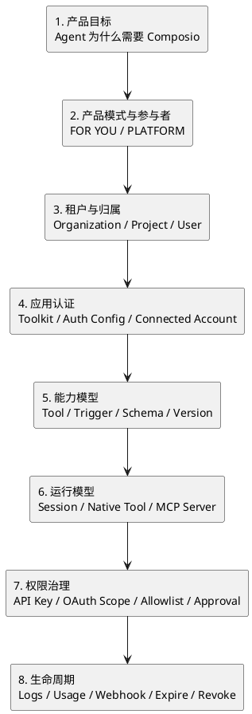

## 产品定义

用最直接的话说：

> Composio 让 AI 能够使用你的 GitHub、Slack、Notion 等应用，同时替你处理
> 应用授权、工具封装和调用记录。

但 Composio 同时服务两类不同用户，因此需要分别定义。

### 对个人用户

> Composio 是给 Codex、Claude、Cursor 等现成 AI 客户端连接 GitHub、Slack、
> Notion 等外部应用的工具与授权中心。

本轮实测例子：

1. CP 在 Composio FOR YOU 中连接 GitHub；
2. 在本地安装并登录 Composio CLI；
3. 搜索“读取当前登录的 GitHub 用户”；
4. Composio 调用已经连接的 GitHub；
5. 返回公开账号 `yan5xu`；
6. 整个执行没有再次要求 GitHub OAuth。

### 对 Agent 开发者

> Composio 是管理最终用户应用授权，并向 Agent 提供标准化工具执行能力的
> 基础设施。

假设开发者正在构建一个 AI GitHub 助手：

1. 客户 Alice 登录开发者的产品；
2. 开发者把她映射成 `user_alice`；
3. Alice 通过 Composio 授权自己的 GitHub；
4. 开发者的 Agent 为 `user_alice` 创建 Session；
5. Agent 调用 GitHub Tool；
6. Composio 自动找到 Alice 对应的 GitHub Connected Account；
7. Bob 使用同一个 Agent 产品时，使用的是 Bob 自己的连接。

开发者因此不需要分别重建：

- GitHub、Slack、Notion 的 OAuth 流程；
- Token 保存、刷新与连接失效处理；
- 每个 SaaS API 的 Agent Tool Schema；
- Alice、Bob 等最终用户的连接隔离；
- Hosted MCP Server；
- 工具调用日志与连接事件。

### 统一定义

> Composio 把“某个 Agent 可以代表某个用户，通过某个已授权应用账号执行哪些动作”
> 建模、运行并治理起来。

它不是单纯保存一份 OAuth Token。一个可运行的 Agent 外部动作至少包含：

```text
Authenticated Action Capability
= Tool Schema
+ Connected Account
+ User Identity
+ Session Context
+ Execution Policy
+ Runtime / Audit
```

以“读取 Alice 的 GitHub 用户”为例，需要：

1. `GITHUB_GET_THE_AUTHENTICATED_USER` 的工具定义；
2. Alice 的 GitHub OAuth 连接；
3. 这个连接归属 `user_alice`；
4. 哪个 Agent Session 正在调用；
5. API Key、OAuth scope 和 tool allowlist 是否允许；
6. 调用结果、耗时、状态和日志。

缺少其中任何一层，都不是一个完整的 Agent action capability。

## 能力从哪里来：Toolkit 不是 MCP 清单

目前可以确认的产品结构是：

```text
GitHub / Slack / Notion 等外部服务
↓
Composio 维护的 Toolkit
↓
Tool + Auth Config + Connected Account
↓
Session
↓
Native Tool 或 Composio 托管的 MCP Server
↓
Agent
```

这里最重要的区分是：

> Composio 的核心资产首先是它维护的应用 Toolkit 和认证执行层；MCP 是把这些
> 能力交给 Agent 的一种协议出口，不等于 Toolkit 的底层一定来自第三方 MCP。

### Toolkit 具体是什么

官方 Glossary 将 Toolkit 定义为一个外部服务的一组相关工具。例如 GitHub Toolkit
包含读取用户、查询仓库、创建 Issue 等工具；用户先连接 GitHub，工具再使用该用户
的凭证执行。

以 GitHub 为例：

```text
GitHub Toolkit
├── GITHUB_GET_THE_AUTHENTICATED_USER
├── GITHUB_LIST_REPOSITORIES
├── GITHUB_CREATE_AN_ISSUE
└── GitHub OAuth / API 凭证处理
```

它不只是一个“GitHub MCP 地址”，还包含：

- 一组由 Composio 命名、描述和版本化的 Tool；
- 参数及返回值 Schema；
- OAuth 或 API Key 的认证配置；
- 最终用户的 Connected Account；
- 调用、错误和连接状态的运行记录。

Composio 的 Toolkit 页面同时提供 **MCP** 和 **direct API-based integrations**，
并称 Toolkit 集成由 Composio 维护和更新。这支持“Composio 自己维护应用适配层”
这一理解。

### 同一能力的两种交付方式

假设 Alice 已连接 GitHub，开发者要让 Agent 读取她的仓库。

Native Tool 路径：

```text
Agent SDK
→ session.tools()
→ Composio GitHub Tool
→ Alice 的 Connected Account
→ GitHub API
```

MCP 路径：

```text
MCP Client
→ session.mcp.url
→ Composio 托管 MCP Server
→ 同一个 Composio GitHub Tool
→ Alice 的 Connected Account
→ GitHub API
```

官方 Sessions via MCP 文档明确说明：同一个 Session 同时支持 `session.tools()` 和
MCP，托管 MCP endpoint 暴露的是 Composio hosted tools。因此 Native Tool 与 MCP
不是两套独立集成，而是同一 Toolkit、认证和 Session 能力的两个出口。

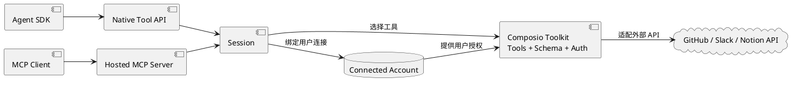

### 直接来源

- [Composio Glossary：Toolkit、Session、Native Tools、MCP](https://docs.composio.dev/reference/glossary)
- [Sessions via MCP：同一 Session 的 hosted MCP endpoint](https://docs.composio.dev/docs/sessions-via-mcp)
- [Kit Toolkit 页面：MCP 与 direct API-based integration](https://composio.dev/toolkits/kit)
- [Composio MCP Gateway](https://composio.dev/mcp-gateway)
- [MCP Servers to Sessions migration](https://docs.composio.dev/docs/migration-guide/mcp-servers-to-sessions)

## 第一层：两套产品模式及其参与者

### 模式一：FOR YOU

FOR YOU 面向已经使用 Codex、Claude、Cursor 等 AI 客户端的个人用户。

```text
你
↓
Codex / Claude / Cursor
↓
Composio FOR YOU
↓
你已连接的 GitHub / Slack / Notion
```

#### FOR YOU 的参与者

| 参与者 | 具体含义 |
|---|---|
| 用户 | 直接使用 Composio 和 AI Client 的人，例如 CP |
| AI Client | Codex、Claude、Cursor 等 |
| Composio FOR YOU | 保存个人连接，向 Client 提供工具 |
| Connected App | 用户已经连接的 GitHub、Slack、Notion 账号 |
| Provider | GitHub、Slack、Notion 的外部 API |

在理解 FOR YOU 时，不需要先引入 Business User、Project、Auth Config 等
Platform 内部概念。

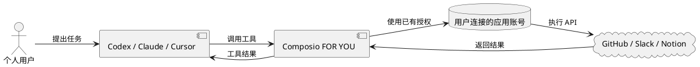

### FOR YOU 的权限模型

FOR YOU 不使用 PLATFORM 的 `Project → User → Session` 多租户模型。它更接近：

> 一个 Composio Workspace 保存个人应用连接，再授权 CLI 或 MCP Client 使用这些
> 连接，并通过 Enhanced Controls 限制 Agent 可以执行的动作类型。

权限链可以分成五道门：

```text
1. 谁能管理 Composio Workspace
2. Composio 能访问哪个外部账号
3. 哪个 AI Client 能进入 Composio
4. Agent 能执行哪些类型的动作
5. 哪些动作需要人类再次批准
```

#### Workspace 管理权限

FOR YOU 虽然面向个人使用，但本轮实测中的身份容器仍是一个
Organization/Workspace：

```text
lueco.x_workspace
├── Members
├── Connected Apps
├── Sessions & API Key
└── Enhanced Control
```

Members 管理谁能进入 Composio 后台和管理 Workspace。它不等于 GitHub、Slack、
Notion 中的账号权限。

#### 外部应用授权

用户分别连接具体的外部账号：

```text
GitHub → 一个 Active Connected Account
Notion → 一个 Active Connected Account
Slack  → 一个 Active Connected Account
```

每个连接可以 Reconnect、Connect another account、Delete，并查看 Available Tools。
外部 Provider 的 OAuth consent 决定 Composio 获得哪些 scope；Composio 随后保管
和刷新连接凭证。

当前页面没有看到连接完成后的 OAuth scope 编辑器。已连接应用详情主要提供重连、
增加账号、删除连接和查看工具。

#### AI Client 入口权限

CLI 路径：

```text
Codex
→ 本地 Composio CLI Session
→ Composio Workspace
→ Connected Apps
```

本轮 `composio login` 的授权页明确要求：

- Access all your organizations；
- Access all your projects；
- Act on your behalf。

这是一项较宽的账户级授权。当前 Sessions 页面把该登录显示为独立的
`composio cli` Session，具有创建时间、到期时间和撤销入口。

MCP 路径：

```text
Codex / Claude / Cursor
→ Consumer API Key 或 MCP OAuth Client
→ https://connect.composio.dev/mcp
→ FOR YOU Connected Apps
```

Sessions & API Key 页面提供 Consumer API Key、Regenerate、CLI Sessions 和
MCP Session Management。Composio Connect 通过一个 MCP endpoint 暴露少量
Meta Tools，Agent 再使用这些工具发现、连接和执行应用能力。

#### Enhanced Controls

Enhanced Controls 是 FOR YOU 的动作权限层，目前为 Beta，且本轮 Workspace 中
默认关闭。

它不按单个 Tool 配置，而是把支持的应用工具分成三类：

| 风险类别 | 示例 | 官方默认策略 |
|---|---|---|
| Read | 读取邮件、查看文档 | Always Allow |
| Write | 发送邮件、编辑页面 | Ask Every Time |
| Destructive | 删除邮件、永久删除文件 | Never Allow |

每一类可以选择：

```text
Always Allow
Ask Every Time
Never Allow
```

例如：

```text
GitHub Read          → Always Allow
GitHub Write         → Ask Every Time
GitHub Destructive   → Never Allow
```

`Always Allow` 和 `Never Allow` 由 Composio 服务端执行。`Ask Every Time`
依赖 Client 支持 MCP elicitation，才能在会话中向人类发起审批。当前控制台列出
Codex、Claude Code、Cursor 等桌面或 CLI Client；ChatGPT.com、Claude.ai 等
网页 Agent 不支持这类会话内审批。

Enhanced Controls 只覆盖部分标有支持标签的应用，也只能按
Read / Write / Destructive 分类。需要逐 Tool allowlist 时，应使用
PLATFORM/SDK 的 Session 配置。

#### 撤销与停止

个人可以从不同层级切断访问：

```text
删除 Connected Account
→ Composio 不再拥有该应用账号连接

撤销 CLI Session
→ 该本地 CLI 登录失效

撤销 MCP OAuth Client
→ 对应 MCP Client 失效

Regenerate Consumer API Key
→ 旧 Key 不应继续作为有效客户端入口

Never Allow
→ 对应风险类型的 Tool 被服务端阻止
```

本轮没有执行 FOR YOU 的删除、撤销或 Key regeneration，因此后三项只记录产品
控制入口，不把未执行的失效传播过程写成实测结论。

#### 当前边界和缺口

1. 当前 Workspace 的 Enhanced Controls 为关闭状态，GitHub、Notion、Slack
   只是已连接，没有启用分类动作策略；
2. 当前界面没有显示按 Client 分配 Connected App 的权限矩阵，例如“Codex 只能用
   GitHub、Cursor 只能用 Slack”；
3. CLI 授权页没有提供 Organization、Project、App 或只读范围选择；
4. Enhanced Controls 不是逐 Tool 控制；
5. 实测只读 GitHub 用户查询返回了比问题所需更完整的 Provider payload，说明工具
   执行许可不等于返回字段最小化。

因此，在没有更细证据前，应把获得 FOR YOU Client 权限的 Agent 保守理解为可能
发现 Workspace 中的多个个人连接，再由 Enhanced Controls 限制动作；不能假设每个
Client 天然只看到一个应用。

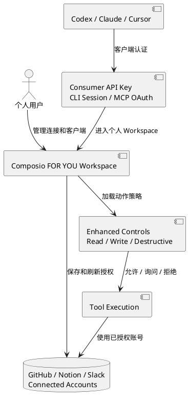

FOR YOU 的权限模型可以总结为：

> 个人账号连接池 + Client 入口凭证 + 动作风险策略。

直接来源：

- [Composio Connect](https://docs.composio.dev/docs/composio-connect)
- [Introducing Enhanced Controls (Beta)](https://composio.dev/content/introducing-enhanced-controls-beta)
- 实测步骤与截图：
  `note.composio-ux-walkthrough-2026-07-29`

### 模式二：PLATFORM

PLATFORM 面向正在构建 Agent 产品的开发者。开发者的产品可能拥有 Alice、Bob
等大量最终用户，每个用户连接自己的外部应用账号。

#### PLATFORM 的参与者

| 参与者 | 具体含义 |
|---|---|
| Developer | 构建 Agent 产品的人或团队 |
| Composio Member | 登录控制台并管理 Organization/Project 的身份 |
| End User | Developer 产品里的 Alice、Bob |
| Agent Backend | Developer 构建的 Agent 服务 |
| Composio Project | 该 Agent 产品在 Composio 中的管理空间 |
| Connected Account | Alice 或 Bob 授权的具体应用账号 |
| Provider | GitHub、Slack、Notion 等外部 API |

PLATFORM 中的 End User 由开发者提供的 `user_id` 表示。例如：

```ts
composio.create("user_alice")
```

`user_alice` 不是 Composio 登录账号，而是开发者业务系统里的最终用户标识。

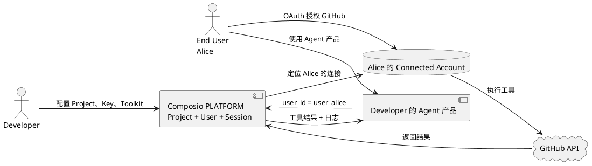

### 两条不同的分类轴

不能把产品模式和运行协议混为一谈：

```text
产品模式：
1. FOR YOU
2. PLATFORM

PLATFORM 的工具交付方式：
1. Native Tool
2. MCP Server
```

Native Tool 与 MCP Server 不是第三、第四种产品模式，而是 PLATFORM 复用同一
Project、User、Session 与 Connected Account 基础设施的两种工具交付协议。

### 当前阶段必须保持的概念区分

```text
FOR YOU 用户 != PLATFORM End User
Composio Member != PLATFORM End User
End User != Provider Account
Agent != End User
API Key != OAuth Token
Session != Agent
Connected Account != Auth Config
产品模式 != 工具交付协议
```

## 第二层：PLATFORM 的租户与归属

先给出最简层级：

```text
Organization
└── Project
    ├── Project API Keys
    ├── Auth Configs
    ├── Users（开发者提供的 userID）
    │   ├── Connected Accounts
    │   └── Sessions
    ├── Webhook
    └── Logs / Usage
```

这不是普通 SaaS 中简单的“公司 → 员工”结构。这里存在两种完全不同的“人”：

1. **Composio Member**：登录 Composio 控制台、管理 Organization 和 Project 的
   开发者或团队成员；
2. **Platform User**：开发者产品里的最终用户，例如 Alice 和 Bob，由开发者传入
   `userID`。

```text
Composio Member = 谁管理集成基础设施
Platform User   = Agent 正代表谁执行外部动作
```

### Organization：开发团队的管理边界

Organization 是 Composio 账户和团队的最上层容器。它包含：

- 登录控制台的 Members；
- 一个或多个 Projects；
- 组织级管理和汇总视图；
- 用于管理 Project 的 Organization API Key。

本轮控制台实测中，Organization Member 的邀请角色包括 Developer、Admin、
Viewer。它们约束“谁能管理 Composio 资源”，不表示谁能让 Agent 使用自己的
GitHub、Slack 或 Notion。

例如：

```text
Organization: Acme AI
Members:
- founder@acme.com   Admin
- engineer@acme.com  Developer
- auditor@acme.com   Viewer
```

这三个人是 Acme 的 Composio 管理团队，不是 Acme Agent 产品中的 Alice、Bob。

### Project：真正的隔离环境

官方将 Project 定义为 Composio 的 multi-tenancy primitive。一个 Organization
可以建立多个 Project，而且不同 Project 的资源互相不可访问。

Project 隔离的对象包括：

- Project API Keys；
- Auth Configs；
- Connected Accounts；
- Webhook 配置；
- Sessions、Logs 和 Usage。

最常见的拆分方式：

```text
Organization: Acme AI
├── Project: assistant-staging
└── Project: assistant-production
```

也可以按产品或客户拆：

```text
Organization: Acme AI
├── Project: sales-agent
├── Project: support-agent
└── Project: enterprise-client-a
```

因此，Project 不只是控制台中的文件夹，而是连接、凭证和运行记录的隔离边界。
`assistant-staging` 中 Alice 的 GitHub 连接，不能被
`assistant-production` 的 API Key 或 Session 直接使用。

### User：开发者产品里的业务身份

Platform User 不是一个需要先注册 Composio 的自然人账户。它是开发者从自己业务
系统传给 Composio 的稳定标识：

```ts
const session = await composio.create("user_alice");
```

`user_alice` 应该对应开发者数据库里的 Alice。Composio 用这个 ID 隔离：

- Alice 的 Connected Accounts；
- Alice 发起的授权；
- Alice 的 Sessions；
- Alice 名下的工具执行记录。

官方建议使用稳定且不会变化的数据库 ID，而不是邮箱、昵称等可变字段。

```text
Developer DB              Composio Project
-------------             ----------------
customer.id = 42    →     userID = customer_42
customer.id = 77    →     userID = customer_77
```

Agent 本身不是 User。一个 Agent backend 可以先后为许多 User 创建 Session：

```text
同一个 Acme Agent Backend
├── Session A1 → user_alice
├── Session A2 → user_alice
└── Session B1 → user_bob
```

### Connected Account：某个 User 授权的具体外部账号

Connected Account 是一个 User 与一个 Toolkit 之间已经完成认证的具体连接。

例如：

```text
user_alice
├── GitHub: alice-work
├── Gmail: alice@acme.com
└── Gmail: alice.personal@gmail.com
```

它存储或管理 OAuth Token、API Key 等凭证，并引用：

- 所属 Project；
- 所属 `userID`；
- Toolkit；
- Auth Config；
- 连接状态。

默认情况下，Connected Account 是 **PRIVATE** 的，只能由拥有它的 `userID`
使用。不同 User 之间不会因为处于同一个 Project 就自动共享连接。

Composio 另有显式的 **SHARED connection + ACL** 模型，可让其他 User 使用团队
邮箱或服务账号，但这是主动配置的例外，不是默认行为。

### Session：一个 User 的 Agent 运行上下文

Session 把以下对象临时组合成一个可运行上下文：

- 一个 `userID`；
- 可发现或允许使用的 Toolkit / Tool；
- Auth Config；
- 选中的 Connected Account；
- Agent 执行状态、日志、MCP 状态和 Workbench 文件。

同一个 User 可以创建多个 Session，并复用其已经存在的 Connected Account：

```text
user_alice
└── GitHub Connected Account
    ├── Session A1：Native Tool
    ├── Session A2：MCP
    └── Session A3：新的对话任务
```

这正是“认证一次，后续多个 Agent 任务不必反复 OAuth”的准确适用范围：

> 在同一 Project 内，多个代表同一 `userID` 的 Session，可以复用该 User
> 已授权的 Connected Account。

但它不等于：

> 一份 OAuth Token 默认对所有 Project、所有 User、所有 Agent 无条件共享。

### API Key、Logs 和 Usage 挂在哪里

服务端 Agent 使用 **Project API Key** 访问一个 Project。它不是外部应用的 OAuth
Token，也不是 Alice 的身份；它回答的是“这个 Agent backend 能访问当前 Project
里的哪些 Composio 资源”。

```text
Project API Key
→ 允许 Agent backend 进入某个 Project

userID
→ 指定 Agent 当前代表谁

Connected Account
→ 指定使用谁授权的哪个外部账号
```

工具调用发生后，Composio 可以按这些维度追踪：

- Project；
- User；
- Session；
- Toolkit / Tool；
- Connected Account；
- 成功、失败、耗时和用量。

因此，API Key 是项目入口，User 是业务主体，Session 是运行上下文，
Connected Account 是外部身份；四者不能互换。

### 完整例子

Acme 开发了一个能操作 GitHub 的 Agent 产品，拥有 staging 和 production 两套环境。
Alice 和 Bob 都是它的客户。

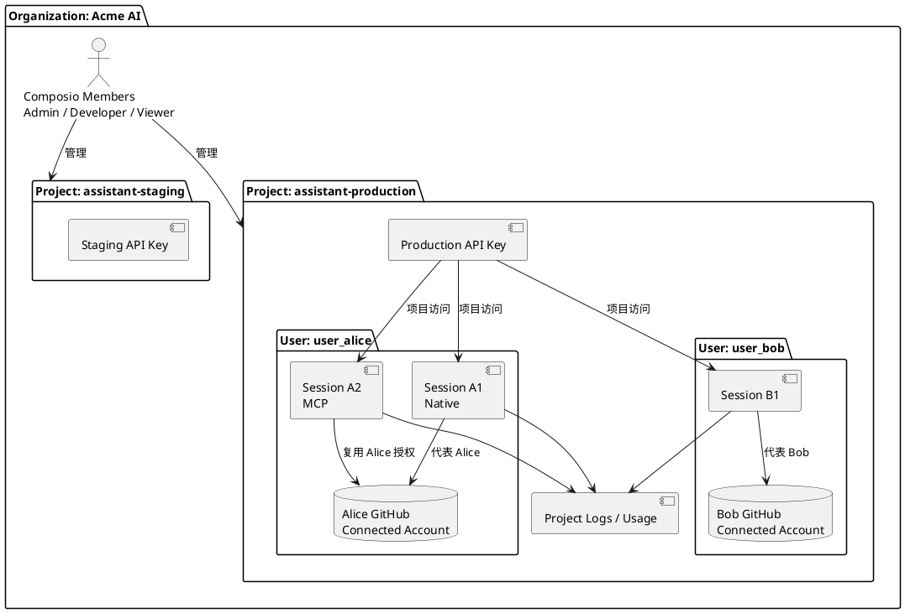

这个例子中：

1. Alice 只需为自己的 GitHub 完成一次 OAuth；
2. Alice 的 Native Session 和 MCP Session 可以复用同一连接；
3. Bob 不能默认使用 Alice 的连接；
4. staging 不能默认使用 production 的连接；
5. Acme 工程师能管理 Project，不代表其本人是 Alice 或 Bob；
6. 一个 Agent backend 可以服务许多 User，但每次 Session 都必须有明确的
   `userID`。

### 本层关系总结

```text
Organization 管“谁管理哪些 Projects”
Project 管“哪套产品/环境拥有哪批资源”
User 管“Agent 当前代表哪个业务用户”
Connected Account 管“这个用户授权了哪个外部账号”
Session 管“这次 Agent 运行使用哪些工具、连接和状态”
Project API Key 管“服务端调用者可以进入并操作哪些项目资源”
Logs / Usage 记录“谁在什么 Session 中通过哪个连接调用了什么”
```

### 本层直接来源

- [Projects：Project 是隔离的 multi-tenancy primitive](https://docs.composio.dev/reference/api-reference/projects)
- [Authentication：User 是 Agent 所代表的业务用户](https://docs.composio.dev/docs/authentication)
- [What is a session?：Session 绑定 User、工具、认证与连接](https://docs.composio.dev/docs/how-composio-works)
- [Connected Accounts：连接属于 User 并管理凭证生命周期](https://docs.composio.dev/reference/v3/api-reference/connected-accounts)
- [Shared connections：PRIVATE 默认与显式 SHARED ACL](https://docs.composio.dev/docs/shared-connections)
- [Scoped Project API Key](https://docs.composio.dev/reference/authenticating-to-composio/project-api-key-permissions)
- [Organization / Project Usage](https://docs.composio.dev/reference/api-reference/organization)

## 第三层：应用认证模型

这一层回答：

> 用户在 GitHub、Slack 或 Notion 授权以后，Composio 保存了什么？后续 Agent
> 复用的又是什么？

最简关系是：

```text
Toolkit
→ Auth Config
→ User 完成认证
→ Connected Account
→ Session 使用该连接执行 Tool
```

四个对象分别回答不同问题：

| 对象 | 回答的问题 |
|---|---|
| Toolkit | GitHub、Slack 等服务有哪些可供 Agent 使用的能力？ |
| Auth Config | 通过什么认证方式、OAuth App 和 scopes 建立连接？ |
| Connected Account | 哪个 User 已经授权了哪个具体外部账号？ |
| Session | 这次 Agent 运行选用哪个 User、连接和 Tool？ |

### Toolkit：能力与认证入口的目录

Toolkit 表示一个外部服务的集成，例如 GitHub Toolkit。它包含 Tool 定义，也声明
该服务支持哪些认证方式。

例如：

```text
GitHub Toolkit
├── Tools
│   ├── GET_AUTHENTICATED_USER
│   ├── LIST_REPOSITORIES
│   └── CREATE_ISSUE
└── Supported Auth
    └── OAuth2
```

Toolkit 不保存 Alice 的 OAuth Token。它描述的是“GitHub 这类服务如何连接、能做
什么”，不是“某个人已经授权的 GitHub 账号”。

### Auth Config：可复用的认证蓝图

Auth Config 定义一类 User 应该怎样连接某个 Toolkit。官方定义包含三部分：

```text
Auth Config
= Authentication Method
+ Scopes
+ Credentials
```

具体包括：

1. 认证方式：OAuth2、API Key、Bearer Token 或 Basic Auth；
2. Scopes：外部 Provider 允许这套集成申请什么权限；
3. OAuth 凭证：使用 Composio 的 OAuth App，还是开发者自己的
   Client ID / Client Secret。

例如：

```text
Auth Config: ac_github_production
├── Toolkit: GitHub
├── Method: OAuth2
├── Scopes: repo, read:user
└── OAuth App: Acme 自己注册的 GitHub App
```

一个 Auth Config 可以被同一 Project 中的许多业务 User 使用：

```text
同一个 GitHub Auth Config
├── Alice 完成 OAuth → Alice Connected Account
├── Bob 完成 OAuth   → Bob Connected Account
└── Carol 完成 OAuth → Carol Connected Account
```

因此，Auth Config 不是用户 Token，也不是一条用户连接。它更像统一的“开户规则”。

同一个 Toolkit 可以存在多个 Auth Config，例如：

```text
GitHub Toolkit
├── Auth Config A：staging OAuth App
├── Auth Config B：production OAuth App
├── Auth Config C：只读 scopes
└── Auth Config D：完整 scopes
```

需要拆成多个 Auth Config 的常见原因包括不同环境、不同 OAuth App、不同 scopes、
不同配额或自托管实例。

### Managed Auth 与 Custom Auth（PLATFORM）

这一组选择属于 PLATFORM。FOR YOU 只提供个人连接流程，当前界面不暴露
Auth Config 对象，也不提供创建 Custom Auth Config 的入口。

#### Composio Managed Auth

Composio 为许多主流 Toolkit 注册并维护 OAuth App。开发者不需要自己申请
Client ID / Client Secret，也不需要实现 redirect、code exchange 和 token refresh。

Managed Auth 同时服务两条产品线：

- FOR YOU：作为默认且隐藏的个人应用连接机制；
- PLATFORM：作为 Project Auth Config 的默认快捷选择。

```text
User
→ Composio Connect Link
→ “Composio wants to access your GitHub”
→ Provider OAuth
→ Composio 保存 Connected Account
```

适合：

- 快速开发和测试；
- 默认 scopes 已经够用；
- 不介意 OAuth consent 显示 Composio 品牌；
- 不想维护 OAuth App 和 Token refresh。

#### Custom Auth Config

开发者也可以提供自己的 OAuth App 或其他认证凭证：

```text
User
→ Composio Connect Link
→ “Acme Agent wants to access your GitHub”
→ Provider OAuth
→ Composio 保存 Connected Account
```

适合：

- OAuth consent 需要显示自己的产品品牌；
- 需要不同或更细的 scopes；
- 需要独立 Provider API quota；
- Toolkit 没有 Composio Managed Auth；
- 需要自定义 subdomain、region 或私有实例。

即使使用 Custom Auth，Composio 仍可托管 Connect Link、callback、Connected
Account 和后续工具执行。开发者自带的是认证蓝图和 OAuth App，不是重新实现整套
Agent Tool Runtime。

Custom Auth Config 只属于 PLATFORM。FOR YOU 用户在连接某些应用时输入个人
API Key，只是在创建该用户的 Connected Account，不等于创建可供许多业务 User
复用的 Custom Auth Config。

### Connected Account：真正的用户授权结果

当 User 完成 Auth Config 定义的认证流程后，Composio 创建 Connected Account。

```text
Connected Account
├── Project
├── userID
├── Toolkit
├── Auth Config
├── Status
└── Credentials
    ├── access token
    ├── refresh token
    └── 或 API key / bearer token / basic credentials
```

例如：

```text
ca_alice_github
├── Project: assistant-production
├── userID: user_alice
├── Toolkit: github
├── Auth Config: ac_github_production
└── Status: ACTIVE
```

OAuth Token 等敏感凭证保存在 Connected Account 的认证状态中，由 Composio
代为使用和刷新。Agent 和模型通常只需要知道：

```text
userID
sessionID
connectedAccountID
toolSlug
```

不需要直接读取 OAuth Token。

因此，之前的说法：

> 一份 OAuth Token 留在 Composio，多个 Agent 同时使用。

更准确地改写为：

> 某个 User 完成一次应用授权后，Composio 保存一个 Connected Account；同一
> Project 中代表该 User 的多个 Session，可以通过 Composio 复用该连接，而不必
> 每次重新 OAuth。Agent 不直接持有或传递 OAuth Token。

### 一个 User 连接多个同类账号

Connected Account 与 Toolkit 不是一对一关系。Alice 可以同时连接工作和个人
Gmail：

```text
user_alice
└── Gmail Toolkit
    ├── ca_gmail_work      alias=work-gmail
    └── ca_gmail_personal  alias=personal-gmail
```

Session 可以显式指定使用哪个连接：

```ts
const session = await composio.create("user_alice", {
  connectedAccounts: {
    gmail: ["ca_gmail_work"],
  },
});
```

如果没有显式选择，Session 会根据 Auth Config、现有连接和 Composio 的选择顺序
解析连接；有多个账号时不应依赖隐式选择来处理高风险业务。

### FOR YOU 如何隐藏认证复杂度

FOR YOU 页面没有向个人用户展示 Auth Config 列表。用户看到的是：

```text
Connect GitHub
→ Provider OAuth consent
→ GitHub Active
```

背后仍然需要完成认证方式、scopes、OAuth App、callback、token 保存和 refresh，
只是这些由 Composio Managed Auth 预先配置并隐藏。

FOR YOU 用户主要管理：

- 连接哪个 App 和账号；
- Reconnect、增加账号或删除连接；
- 哪些 Client 可以进入 Workspace；
- Enhanced Controls 的 Read / Write / Destructive 策略。

个人用户不能从当前 FOR YOU 界面看到或编辑完整的 Project Auth Config。需要自有
OAuth App、精确 scopes 或不同 User 隔离时，应进入 PLATFORM。

### PLATFORM 如何显式管理认证

PLATFORM 把认证对象暴露给开发者：

```text
Project
├── Auth Config
│   ├── Managed OAuth
│   └── Custom OAuth
├── User: Alice
│   └── Connected Account
├── User: Bob
│   └── Connected Account
└── Sessions
```

本轮实测中：

1. 创建 Platform Session 时，FOR YOU 已连接的 GitHub 没有被复用；
2. Platform User 需要单独完成 GitHub OAuth；
3. OAuth 后出现该 Project/User 的 Connected Account；
4. Native 与 MCP 两条 Session 复用了这个 Connected Account；
5. 删除 Platform Auth Config 后，关联的 Platform User/Connected Account 从
   控制台消失；
6. FOR YOU 的 GitHub、Notion、Slack 连接没有受影响。

这证明 FOR YOU 与 PLATFORM 至少不是同一 Connected Account 池。

### scopes、Tool 和动作策略不是同一层

应用权限至少有三层：

```text
Provider Account Privilege
∩ OAuth / Auth Config Scopes
∩ Composio Tool / Session / Enhanced Control Policy
= Agent 最终可执行的动作
```

例如 Alice 在 GitHub 本身不是 Organization Admin，即使 OAuth scope 很宽，
Agent 也不能执行只有 GitHub Admin 才能执行的动作。

反过来，OAuth scope 包含仓库写权限，也不表示 Agent 必须拥有所有写 Tool：

- PLATFORM 可通过 Session Tool allowlist 进一步限制；
- FOR YOU 可通过 Enhanced Controls 对 Write 设置 Ask Every Time；
- Destructive 可以设为 Never Allow。

因此：

```text
OAuth scope = Provider 允许这套连接做什么
Tool allowlist = Agent 能看到和调用什么
Approval policy = 本次调用是否需要人类批准
```

三者不能互相替代。

### 连接生命周期

Connected Account 的主要状态变化：

| 动作或状态 | 含义 |
|---|---|
| ACTIVE | 当前连接可用于 Tool 执行 |
| INACTIVE / Disable | 暂停 Composio 使用，但保留连接记录 |
| Automatic refresh | Composio 自动刷新 OAuth access token |
| EXPIRED | refresh token 失效或被 Provider 撤销，需要重新授权 |
| Reconnect / Reauthorize | User 再次完成认证，恢复连接 |
| REVOKED | 尝试在上游 Provider 撤销 Token |
| Delete | 从 Composio 删除或软删除连接记录 |

需要特别区分 Revoke 与 Delete。当前 API 文档说明：

- `revoke` 是对上游 Provider 的 best-effort Token 撤销；
- 默认 `delete` 主要让连接无法继续被 Composio 使用并保留审计记录；
- 若需要同时撤销上游凭证，应显式使用 revoke，或在支持的删除接口中设置
  `revoke_on_delete=true`；
- Provider 不一定支持撤销所有 Token，必须检查实际 `revoked_tokens`。

本轮只在 PLATFORM 控制台删除过临时 Auth Config，并观察到关联连接从页面消失；
没有读取或验证 Provider 上游 Token 的撤销状态。因此不能把“页面已删除”写成
“上游授权一定已撤销”。

### 完整认证流程

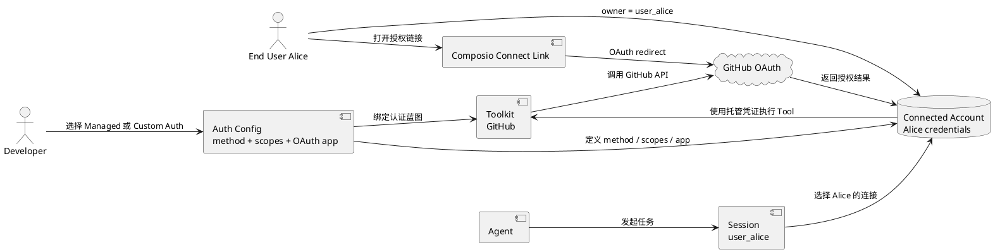

### 本层总结

```text
Toolkit 是能力目录
Auth Config 是认证蓝图
Connected Account 是用户授权结果
Session 是运行时连接选择
OAuth Token 是 Connected Account 内部管理的凭证
Agent 复用 Connected Account 的能力，不直接共享 Token
```

### 本层直接来源

- [Authentication](https://docs.composio.dev/docs/authentication)
- [Managed Auth](https://docs.composio.dev/toolkits/managed-auth)
- [Managed vs custom auth](https://docs.composio.dev/docs/custom-app-vs-managed-app)
- [Auth Configs](https://docs.composio.dev/reference/api-reference/auth-configs)
- [Custom Auth Configs](https://docs.composio.dev/docs/auth-configuration/custom-auth-configs)
- [Connected Accounts](https://docs.composio.dev/reference/api-reference/connected-accounts)
- [Managing multiple connected accounts](https://docs.composio.dev/docs/managing-multiple-connected-accounts)
- [Configuring Sessions](https://docs.composio.dev/docs/configuring-sessions)
- [Revoke a connected account](https://docs.composio.dev/reference/api-reference/connected-accounts/postConnectedAccountsByNanoidRevoke)
- [Delete a connected account](https://docs.composio.dev/reference/api-reference/connected-accounts/deleteConnectedAccountsByNanoid)

## 第四层：能力模型

认证解决了“Agent 可以代表谁访问外部服务”。能力模型继续解决：

> Agent 如何知道外部服务能做什么、调用时应传什么参数、返回什么结果，以及外部
> 事件发生后如何通知 Agent 产品？

最简结构：

```text
Toolkit
├── Tools
│   ├── Tool Slug
│   ├── Description
│   ├── Input Schema
│   ├── Output Schema
│   └── Version
└── Trigger Types
    ├── Config Schema
    ├── Payload Schema
    └── Version
```

### Tool：Agent 可以主动执行的一个动作

Tool 是 Toolkit 中一个边界明确、可执行的动作。命名通常采用：

```text
{TOOLKIT}_{ACTION}
```

例如：

```text
GITHUB_GET_THE_AUTHENTICATED_USER
GITHUB_LIST_REPOSITORIES
GITHUB_CREATE_ISSUE
SLACK_SEND_MESSAGE
GMAIL_SEND_EMAIL
```

外部 API 原本可能表现为 HTTP method、URL、query、body、pagination 和 Provider
错误。Composio 把它包装成 Agent 能理解的函数式动作：

```text
GitHub REST API
POST /repos/{owner}/{repo}/issues

↓ Composio Tool

GITHUB_CREATE_ISSUE({
  owner,
  repo,
  title,
  body
})
```

Tool 的价值不只是替开发者发送 HTTP 请求。它还需要提供：

- 清楚的名称和用途说明；
- 参数 Schema；
- 返回结果 Schema；
- 所属 Toolkit 与认证要求；
- 需要的 OAuth scopes；
- 可执行版本；
- 调用结果、错误和日志。

### Schema：Agent 与外部 API 之间的机器契约

每个 Tool 至少有两类 Schema：

```text
Input Schema
→ Agent 调用时必须提供什么

Output Schema
→ Tool 正常返回什么结构
```

以创建 GitHub Issue 为例：

```json
{
  "type": "object",
  "properties": {
    "owner": { "type": "string" },
    "repo": { "type": "string" },
    "title": { "type": "string" },
    "body": { "type": "string" }
  },
  "required": ["owner", "repo", "title"]
}
```

Agent 不需要提前学习 GitHub REST 文档，而是读取 Tool description 和 Input Schema，
生成符合要求的结构化参数。

执行链：

```text
用户自然语言
→ Agent 选择 Tool
→ Agent 按 Input Schema 生成 JSON
→ Composio 使用 Connected Account 执行
→ 返回 Output Schema 对应的数据
→ Agent 解释结果
```

Output Schema 也很重要。如果开发者要把结果写入数据库或交给确定性程序处理，
必须知道字段、类型和嵌套结构。模型能够“看懂大概”不等于程序能承受 Schema 漂移。

Composio 提供 `COMPOSIO_GET_TOOL_SCHEMAS`，让 Agent 在已经知道 Tool Slug 后再取
完整 Schema，而不是一开始把所有 Tool 定义放进上下文。

### Tool discovery：为什么不把 893 个 GitHub Tool 全塞给模型

本轮 FOR YOU 的 GitHub 页面显示 `Available Tools (893)`。这个数字不能理解为
Agent 每轮对话都会加载 893 个函数定义。

Composio Session 默认提供少量 Meta Tools：

```text
COMPOSIO_SEARCH_TOOLS
COMPOSIO_GET_TOOL_SCHEMAS
COMPOSIO_MANAGE_CONNECTIONS
COMPOSIO_MULTI_EXECUTE_TOOL
...
```

典型流程：

```text
用户：“查看我的 GitHub 账号”
↓
COMPOSIO_SEARCH_TOOLS("get authenticated GitHub user")
↓
返回 GITHUB_GET_THE_AUTHENTICATED_USER
↓
按需取得 Schema
↓
执行 Tool
```

这样做的原因：

- 减少模型上下文中的 Tool Schema 数量；
- 根据当前任务动态发现能力；
- 认证缺失时可以在同一运行时发起 Connect Link；
- 让一个 Session 跨多个 Toolkit 工作。

本轮真实 CLI 实测正是：

```text
composio search
→ 找到 GITHUB_GET_THE_AUTHENTICATED_USER
→ composio execute
→ 返回已认证 GitHub 用户
```

### Tool 数量不等于产品能力质量

`893 GitHub Tools` 只能证明当前目录中存在大量 Tool 定义，不能直接证明：

- 893 个独立用户场景都被良好设计；
- 每个 Tool 都经过稳定生产验证；
- Schema 没有错误或遗漏；
- OAuth scopes 一定足够；
- 错误、pagination、rate limit 都被良好处理；
- 每个 Tool 都适合让 Agent 自主调用；
- 这些 Tool 在当前版本全部可用。

大量 Tool 可能只是把 Provider API endpoint 细粒度包装出来。因此评估 Toolkit
不能只看 Tool 数量，还要看：

```text
覆盖率
+ Schema 质量
+ 认证正确性
+ 错误处理
+ 版本稳定性
+ Agent 可发现性
+ 高风险动作治理
+ 真实执行成功率
```

### Version：固定 Tool 和 Trigger 的行为契约

Tool 和 Trigger 会随 Provider API 及 Composio 定义变化。版本通常使用日期格式：

```text
YYYYMMDD_NN
```

例如：

```text
github: 20251027_00
```

新版本可能改变：

- 新增或移除 Tool；
- Tool description；
- Input/Output Schema；
- OAuth scope 要求；
- Provider endpoint；
- 错误处理；
- Trigger config 或 payload。

因此：

```text
latest
→ 自动获得最新能力
→ 适合主要由 LLM 动态理解结果的探索型 Agent

pinned version
→ 固定 Tool 与 Schema
→ 适合生产、自动化测试和确定性数据管道
```

Session 型 Agent 通常使用最新 Toolkit 能力。手工 Tool 执行或程序化解析应把版本
解析为明确值；如果代码会解构固定字段，应该 pin 已测试版本并主动升级。

版本不是 SDK package version：

```text
@composio/core 0.14.0
!=
GitHub Toolkit 20251027_00
```

前者是客户端库版本，后者是 GitHub Tool/Trigger 定义版本。

### Trigger：外部应用主动发生的事件

Tool 与 Trigger 的方向相反：

```text
Tool
Agent → Composio → External App

Trigger
External App → Composio → Developer Webhook → Agent Product
```

例如：

```text
Tool:
Agent 主动创建 GitHub Issue

Trigger:
GitHub 仓库出现新 Commit 后通知 Agent 产品
```

Trigger 也分成两层。

#### Trigger Type

Trigger Type 是事件模板，定义：

- Trigger Slug；
- 要监听什么事件；
- 创建实例需要什么 Config；
- 事件 Payload Schema；
- 所属 Toolkit 和 Version。

例如：

```text
GITHUB_COMMIT_EVENT
Config:
- owner
- repo

Payload:
- commit_sha
- message
- author
- timestamp
```

#### Trigger Instance

Trigger Instance 是某个 User 在某个 Connected Account 上启用的具体监听：

```text
Trigger Type: GITHUB_COMMIT_EVENT
User: user_alice
Connected Account: Alice GitHub
Config: owner=acme, repo=agent
Trigger ID: ti_xxx
```

实例可以独立 enable、disable 或 delete。

### Trigger 事件如何送到开发者应用

PLATFORM Project 配置 Webhook Subscription 后，多个 Trigger 的事件可以统一发送到
一个 URL：

```text
GitHub / Slack / Gmail
→ Composio
→ POST https://acme.com/webhooks/composio
→ Acme 根据 trigger_slug / trigger_id 路由
```

事件 envelope 包含：

- `trigger_id`；
- `trigger_slug`；
- `connected_account_id`；
- `user_id`；
- `auth_config_id`；
- 结构化 `data`；
- timestamp。

Webhook 还包含签名 header，生产处理方应验证签名后再消费。

Provider 事件来源可能是：

```text
Realtime
→ Provider 主动推送给 Composio
→ 通常接近实时

Polling
→ Composio 定时检查 Provider
→ 可能有分钟级延迟
```

两者对开发者使用相同的结构化事件出口，但实时性和 Provider 约束不同。

### FOR YOU 与 PLATFORM 在能力模型上的差异

两条产品线消费同一个 Toolkit/Tool 目录，但暴露程度不同。

FOR YOU：

- 个人主要看到 App、Available Tools 和自然语言任务；
- CLI/MCP 通过 Meta Tools 动态搜索、认证和执行；
- 不要求个人管理 Schema、Version 或 Trigger Webhook；
- Enhanced Controls 提供按风险分类的动作策略。

PLATFORM：

- 开发者可读取 Tool Input/Output Schema；
- 可选择 Tool/Toolkit allowlist；
- 可直接执行、使用 Session 或托管 MCP；
- 可 pin Toolkit Version；
- 可创建 Trigger Instance；
- 可接收、验签和路由 Project Webhook。

因此，FOR YOU 卖的是“直接让我的 Agent 使用应用”，PLATFORM 卖的是“把应用能力
嵌入我自己的 Agent 产品并治理其契约”。

### Tool、Trigger、Schema、Version 的关系

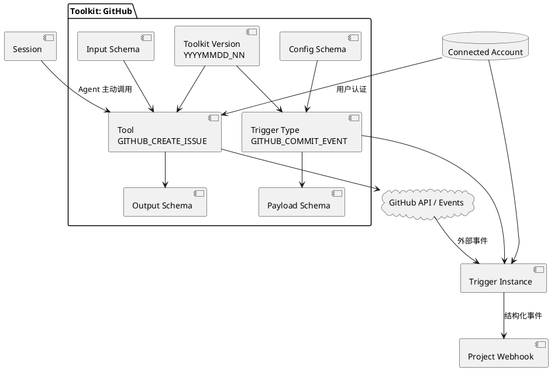

### 本层总结

```text
Toolkit 是一个外部服务的能力集合
Tool 是 Agent 主动执行的单个动作
Input/Output Schema 是 Tool 的机器契约
Version 固定某一时点的 Tool 与 Trigger 定义
Trigger Type 是外部事件模板
Trigger Instance 是某个用户连接上的具体监听
Webhook 是 Trigger 事件进入开发者应用的出口
```

### 本层直接来源

- [Toolkits](https://docs.composio.dev/reference/api-reference/toolkits)
- [Tools](https://docs.composio.dev/reference/api-reference/tools)
- [Fetching tools and schemas](https://docs.composio.dev/docs/tools-direct/fetching-tools)
- [Meta Tools](https://docs.composio.dev/toolkits/meta-tools)
- [Get Tool Schemas](https://docs.composio.dev/toolkits/meta-tools/get_tool_schemas)
- [Toolkit Versioning](https://docs.composio.dev/docs/tools-direct/toolkit-versioning)
- [Triggers](https://docs.composio.dev/docs/triggers)
- [Creating triggers](https://docs.composio.dev/docs/setting-up-triggers/creating-triggers)
- [Receiving events](https://docs.composio.dev/docs/setting-up-triggers/subscribing-to-events)
- [Webhook Subscriptions](https://docs.composio.dev/reference/api-reference/webhook-subscriptions)

## 第五层：运行模型

这一层回答：

> Agent 真正开始工作时，Composio 如何把“某个用户、可以使用哪些工具、使用哪个
> 账号”组装成一次可持续的运行环境？

核心对象是 `Session`。

### Session 是什么

官方将 Session 定义为某个用户的一段运行时上下文。创建时至少给出 `userId`：

```text
session = composio.create(userId)
```

它把以下信息放进同一个执行边界：

- 当前 Platform User；
- 当前允许使用的 Toolkit 和 Tool；
- 可用的 Auth Config 与 Connected Account；
- Meta Tools；
- 可选的 Sandbox/Workbench；
- 运行时状态。

每次 `create` 会生成新的 Session ID。Session 保存在 Composio 服务端，之后可以通过
`use(sessionId)` 恢复，因此同一任务的后续轮次不必重新组装全部上下文。

需要区分两类“会话”：

1. PLATFORM Session：开发者产品中某个用户的一段 Agent 运行上下文；
2. FOR YOU 的 CLI/MCP 登录 Session：个人客户端获得 Composio 访问能力的登录授权。

它们都叫 Session，但不是同一种业务对象。

### 为什么不直接把所有 Tool 一次交给模型

Composio 的默认 Session 允许 Agent 使用 Meta Tools 动态发现 Toolkit 和 Tool。例如：

- `SEARCH_TOOLS`：根据任务搜索可用工具；
- `GET_TOOL_SCHEMAS`：取得输入输出契约；
- `MANAGE_CONNECTIONS`：发起或检查连接；
- `MULTI_EXECUTE_TOOL`：并行执行多项调用；
- `REMOTE_BASH` / `REMOTE_WORKBENCH`：在远程执行环境中处理数据。

这解决两个问题：

1. 工具目录很大，不适合把全部 Schema 一次塞进模型上下文；
2. Agent 可以先理解任务，再只加载需要的 Tool。

但默认动态发现也意味着 Session 的初始能力面较宽。对边界确定的生产流程，开发者可以
只暴露特定 Toolkit、特定 Tool，或使用标签过滤能力。

### Native Tool 与 MCP Server

同一个 Session 可以有两种主要消费方式。

#### Native Tool

开发者使用 Composio SDK，并选择对应 Agent 框架的 provider package。SDK 将 Tool
转换成框架原生格式。

适合：

- 需要 SDK 级执行钩子；
- 需要修改 Tool Schema；
- 需要在执行前后增加业务逻辑；
- 已经确定 Agent 框架。

#### MCP Server

创建 Session 时启用 `mcp: true`，Composio 返回 MCP URL 和请求头。任何兼容 MCP 的
客户端都可以连接该托管 Server。

适合：

- 希望跨 Agent 框架复用同一接口；
- 不想安装特定 provider package；
- 客户端原生支持 MCP。

Native 和 MCP 可以由同一个 Session 支撑，并复用同一组 Toolkit、Auth Config 和
Connected Account。MCP 不是 Composio 的全部产品，而是 Composio 暴露运行能力的
一个协议出口。

重要限制：托管 MCP 的执行绕过 SDK 本地的 `beforeExecute`、`afterExecute` 和
`modifySchema` 钩子，本地自定义 Tool 也不会自动出现在 Composio 托管 MCP 中。

### 三种执行方式

| 方式 | 工具范围 | 认证与账号 | Session 状态 | 适合场景 |
|---|---|---|---|---|
| 动态 Session | 可搜索或按范围发现 | Session 管理 | 有 | 多轮 Agent、能力动态 |
| Direct Tools Preset | 创建时固定一组 Tool | 仍可由 Session 管理 | 有 | 确定流程、降低工具面 |
| Direct Execution | 代码直接获取 Schema 并执行 | 应用自行组织 | 无 Session Sandbox | 低延迟、强控制、单步调用 |

Direct Tools Preset 是中间态：不让模型动态发现全部工具，但仍保留 Session 的认证、
Connected Account 和可选 Sandbox。

### Sandbox / Workbench

Sandbox 是 Session 内持久的远程 Python 环境。同一 Session 的多次调用可以共享文件和
变量，适合：

- 批量处理多个 Tool 的结果；
- 清洗和转换大量数据；
- 在把结果交回模型前进行计算；
- 避免把大块原始数据全部塞进模型上下文。

Workbench 和 Bash 是 Agent 使用该环境的入口。官方当前同时支持 `sandbox` 和
`workbench` 配置名，但建议使用 `sandbox`。

### Session 内部关系

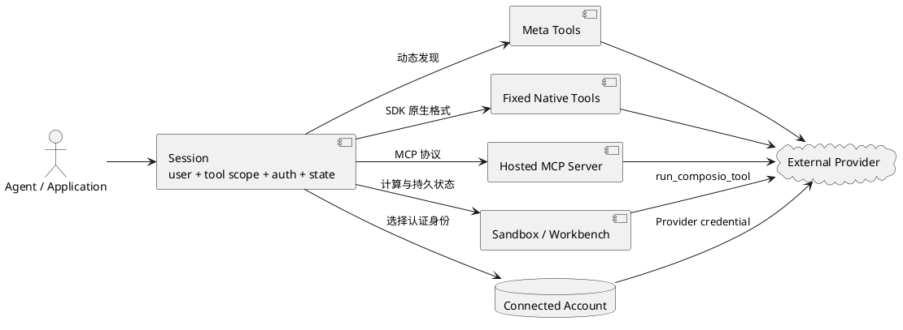

### 本轮实测

同一个 Platform User 和 Connected Account 下，我们分别创建过 Native Session 和
MCP Session：

- 两者拥有不同 Session ID 和执行日志；
- 两者复用同一用户身份与 Connected Account；
- Session 可通过 ID 恢复；
- Native 和 MCP 路径都成功执行；
- 实验结束后两个临时 Session 均被删除。

这说明“账号复用”与“任务会话复用”是两层不同关系：Connected Account 可以被多个
Session 使用，但每个 Session 仍有自己的运行边界。

### 本层总结

```text
Session = 某个用户的一段 Agent 运行上下文
Meta Tools = 运行中发现、连接和执行能力
Native Tool = SDK/Agent 框架原生工具
MCP Server = 同一 Session 的协议化出口
Direct Execution = 绕过 Session 的代码直调
Sandbox = Session 内可持续的远程计算环境
```

### 本层直接来源

- [How Composio works](https://docs.composio.dev/docs/how-composio-works)
- [Configuring sessions](https://docs.composio.dev/docs/configuring-sessions)
- [Sessions via MCP](https://docs.composio.dev/docs/sessions-via-mcp)
- [Sessions vs direct execution](https://docs.composio.dev/docs/sessions-vs-direct-execution)
- [Meta Tools](https://docs.composio.dev/toolkits/meta-tools)
- [Remote sandbox](https://docs.composio.dev/docs/sandbox/remote)

## 第六层：权限治理

这一层回答：

> 当一个 Agent 要执行“读取 Issue”“发 Slack 消息”或“删除 Notion 页面”时，
> 最终是否允许，不是由一个开关决定，而是哪些边界共同决定？

### 有效权限是多层交集

在 PLATFORM 中，一次 Tool 调用的有效权限至少是以下边界的交集：

```text
Provider 账号自身角色
∩ Auth Config 请求的 OAuth Scope
∩ Connected Account 的状态与归属
∩ Project API Key 权限
∩ Session 的 Toolkit / Tool / Tag 过滤
∩ Agent 客户端或业务代码的审批策略
```

任何一层不允许，调用都不应被视为有权执行。

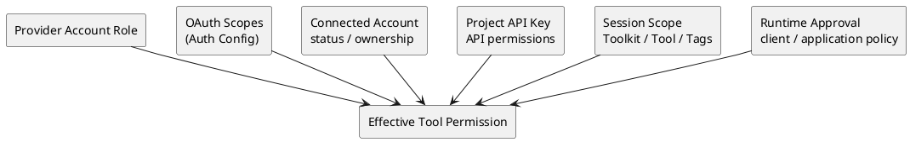

### 第一层：Provider 账号与 OAuth Scope

Composio 不能让一个 GitHub 普通成员越过 GitHub 自身的组织权限。Auth Config 中申请的
OAuth Scope 又进一步限定 Token 可以访问哪些 API。

因此“在 Composio 里连上 GitHub”不等于“Agent 获得 GitHub 的全部权限”。

### 第二层：Connected Account

Connected Account 默认是 `PRIVATE`，只属于对应 Platform User。PLATFORM 还支持显式
创建 `SHARED` 连接并配置访问控制，但共享连接不会被普通 Session 隐式选中，需要明确
指定。

这纠正了一个容易产生的误解：

> Composio 的默认模型不是“一份 OAuth Token 自动供所有 Agent、所有用户共用”，
> 而是“同一用户的 Connected Account 可以被授权给该用户的多个 Session/Agent 任务
> 复用”。跨用户共享必须显式设计。

### 第三层：Project API Key

PLATFORM 的 API Key 可以按能力域授权，例如：

- Auth Config；
- Connected Account；
- Tool 读取；
- Tool 执行；
- Proxy Execute；
- Toolkit；
- Trigger；
- Webhook；
- Observability；
- Session。

权限可设为无、只读、写入或读写，具体取决于能力域。Key 创建后权限不可修改；要改变
范围，需要创建新 Key 并轮换旧 Key。

本轮实测中，一个不含 Connected Account 写权限的 scoped key 删除账号时返回 `403`；
Key 被撤销后再次调用返回 `401`。这说明 Project API Key 的范围和生命周期会被服务端
执行，而不是只用于界面提示。

### 第四层：Session 能力范围

Session 可以按以下方式收窄：

- 允许或拒绝 Toolkit；
- 允许或拒绝具体 Tool；
- 按 Tool 标签筛选：
  - `readOnlyHint`
  - `destructiveHint`
  - `idempotentHint`
  - `openWorldHint`
- 使用 Direct Tools Preset 固定工具集合；
- 显式选择 Auth Config 和 Connected Account；
- 开启或关闭 Sandbox。

默认动态 Session 可以发现全部 Toolkit，因此生产场景不能把“默认可发现”误认为
“最小权限”。

### 第五层：执行审批

FOR YOU 提供 Enhanced Controls，将动作大致分成：

- Read；
- Write；
- Destructive。

其 Beta 版本默认策略为：

- Read：Always Allow；
- Write：Ask Every Time；
- Destructive：Never Allow。

但它当前只覆盖部分 App，不提供逐 Tool 粒度；`Ask Every Time` 还依赖 MCP 客户端支持
elicitation。本轮工作区中 Enhanced Controls 未开启。

PLATFORM 的精确审批由开发者结合 Tool allowlist、风险标签、SDK 钩子及自身业务流程
实现。不能把 FOR YOU 的 Enhanced Controls 当成 PLATFORM 自动拥有的统一审批层，也
不能假设每个 MCP 客户端都会显示相同审批 UI。

### Native 与 MCP 的治理差异

Native SDK 路径可以使用执行前后钩子和 Schema 修改，在本地加入：

- 参数校验；
- 敏感动作确认；
- 审计字段；
- 输出脱敏；
- 业务级策略。

托管 MCP 路径绕过这些 SDK 本地钩子，因此如果关键治理逻辑只写在 SDK hook 中，切换
到 MCP 会失去这层控制。MCP 客户端或后端必须重新承担相应治理。

### 凭证可见性不是动作权限

Composio 默认在 API 响应中遮蔽敏感凭证，但 Project 设置可关闭 masking。关闭后会扩大
密钥暴露风险。

同时，允许某个只读 Tool 并不等于返回数据自动最小化。本轮 GitHub 只读调用返回了完整
Provider payload。因此还需要区分：

1. 能否执行某动作；
2. 动作能读取哪些对象；
3. 返回结果中哪些字段可以进入模型、日志和下游。

### FOR YOU 与 PLATFORM 的权限重点

| 维度 | FOR YOU | PLATFORM |
|---|---|---|
| 权限主体 | 个人 Workspace 与连接的 App | Organization/Project/User |
| Provider 授权 | 用户本人连接 | 开发者配置认证，最终用户连接 |
| 工具收窄 | Enhanced Controls、客户端行为 | Toolkit/Tool/Tag、代码策略 |
| API 凭证 | Consumer API Key、CLI/MCP 登录 | Project API Key |
| 跨用户共享 | 不是默认模型 | 可显式 SHARED + ACL |
| 审批 UI | 依赖 FOR YOU 与 MCP 客户端 | 由开发者产品实现 |
| 执行钩子 | 个人通常不管理 | Native SDK 可管理，托管 MCP 绕过 |

### 本层总结

```text
Composio 不创造 Provider 权限
OAuth Scope 限制 Token 能做什么
Connected Account 决定使用谁的身份
Project API Key 限制后端能调用哪些 Composio API
Session Scope 限制本次 Agent 能看到哪些工具
Approval 决定高风险动作是否在此刻执行
Output Policy 决定结果中的哪些数据可以继续流动
```

### 本层直接来源

- [Project API key permissions](https://docs.composio.dev/reference/authenticating-to-composio/project-api-key-permissions)
- [Configuring sessions](https://docs.composio.dev/docs/configuring-sessions)
- [Shared connections](https://docs.composio.dev/docs/shared-connections)
- [Connected accounts](https://docs.composio.dev/docs/auth-configuration/connected-accounts)
- [Enhanced Controls](https://composio.dev/content/introducing-enhanced-controls-beta)
- [Sessions via MCP](https://docs.composio.dev/docs/sessions-via-mcp)

## 第七层：运行与生命周期

这一层回答：

> 授权和 Tool 调用成功以后，系统如何观察、续期、失效、告警、清理和追责？

### 需要分别管理的生命周期

Composio 中至少有六类独立生命周期：

1. Project API Key；
2. Auth Config；
3. Connected Account；
4. Session；
5. Trigger Instance 与 Webhook；
6. Tool 调用日志和 Usage。

它们不能被一个“已连接/未连接”状态概括。

### Connected Account 生命周期

典型状态流转：

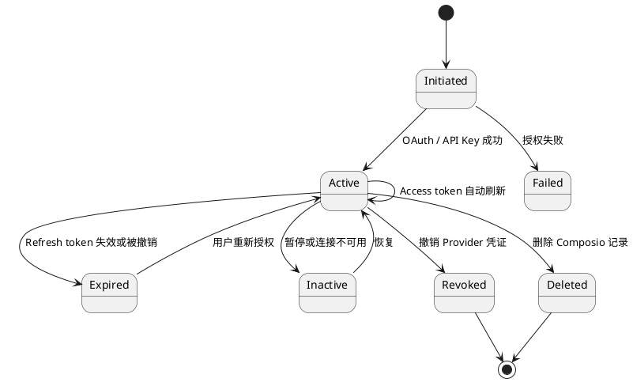

Composio 会自动刷新可刷新的 Access Token；如果 Refresh Token 过期或被 Provider
撤销，Connected Account 会进入 `EXPIRED`，需要用户重新认证。

要区分：

- 删除 Connected Account：删除 Composio 中的连接记录；
- Revoke：撤销 Provider 端授权；
- 删除 Auth Config：删除认证配置，可能连带影响基于它建立的连接；
- FOR YOU 连接与 PLATFORM 连接：两条产品线相互隔离。

本轮清理 PLATFORM 实验对象后，FOR YOU 的 GitHub、Notion、Slack 连接仍然存在，说明
两条产品线不是同一个账号池。

### Session 生命周期

- `create`：每次产生新的 Session ID；
- `use`：通过 ID 恢复服务端 Session；
- 多轮复用：保留同一任务上下文；
- 更新：可以调整 Session 的 Toolkit、Tool 或认证配置；
- 删除：任务结束后清理临时 Session。

Session 的长期复用应与任务边界一致。新工作流应创建新 Session；同一工作流的后续步骤
可以复用原 Session。否则，不同任务的工具范围、状态和执行记录可能混在一起。

FOR YOU 的 CLI/MCP 登录授权还可能有明确到期时间。本轮界面曾显示三个月有效期，但这
只是当时具体登录 Session 的观测，不能外推为所有 Composio Session 的统一期限。

### Trigger 与 Webhook 生命周期

PLATFORM 中，开发者先创建 Trigger Instance，再由 Project Webhook 接收事件。Webhook
使用签名验证来源，并可能遇到重试、重复投递或顺序变化。

因此下游应处理：

- 签名验证；
- 幂等；
- 重试；
- Trigger 启用、禁用和删除；
- Webhook Secret 轮换；
- `connected_account.expired` 等生命周期事件。

Trigger 是外部事件进入 Agent 产品的长期入口，不应与某次 Session 的主动 Tool 调用
混为一谈。

### Logs

Composio 为每次 Tool 调用生成日志。官方日志接口可按以下维度筛选：

- Tool / Toolkit；
- Connected Account / Auth Config；
- User / Session / Sandbox；
- 状态；
- Request ID / Log ID。

日志详情可包含：

- 请求和响应 Payload；
- 状态与错误消息；
- 执行耗时；
- 调用来源，例如 MCP、SDK 或 API；
- Framework 和语言。

这使开发者能回答“谁在什么 Session 中，用哪个账号调用了哪个 Tool，结果如何”。同时
也意味着日志可能保存敏感业务数据，不能只把它视作普通调试文本。

### Usage

Usage 是聚合层，不是单次调用证据。它可以统计 Tool call 与 Session 数，并按项目、用户、
工具或 Session 等维度分组。

因此：

- Log 用于逐次追踪和故障调查；
- Usage 用于容量、成本和采用趋势；
- 两者都不能单独证明最终业务动作已在 Provider 内正确生效，关键动作仍应核验 Provider
  返回和必要的外部状态。

### 常见失败与处理

| 失败位置 | 可见状态 | 正确处理 |
|---|---|---|
| Provider OAuth | 用户拒绝、Scope 不足 | 重新确认授权范围 |
| Connected Account | EXPIRED/INACTIVE | 重新授权或恢复，不伪装成功 |
| Project API Key | 401/403 | 检查撤销状态与最小权限 |
| Session | Tool 不可见、账号不匹配 | 核对用户、scope、sessionId |
| Tool | Provider 错误、Schema 不匹配 | 保留输入、输出、版本和错误 |
| Trigger/Webhook | 验签失败、重复、延迟 | 验签、幂等、重试和告警 |
| MCP 客户端 | 审批/elicitation 不支持 | fail closed 或换受控路径 |
| Provider/Composio 服务 | 暂时不可用 | 保留失败时点，按策略重试 |

### 删除和撤销的顺序

测试或下线场景应按依赖关系清理：

```text
停止新任务
→ 删除或关闭 Trigger
→ 删除临时 Session
→ 删除/撤销 Connected Account
→ 删除无用 Auth Config
→ 撤销 Project API Key
→ 检查 Log、Webhook 和 Provider 端残留
```

只删除 Composio 对象不必然等于 Provider 端 Token 已撤销；涉及安全下线时，需要核验
Provider 的 Authorized Apps 或 Token 状态。

### 本层总结

```text
Connected Account 负责 Provider 凭证的活跃、刷新、过期和重连
Session 负责一段 Agent 工作流的运行状态
Trigger/Webhook 负责长期外部事件
Log 负责单次调用追踪
Usage 负责聚合统计
Revoke 与 Delete 不是同一动作
```

### 本层直接来源

- [Authentication](https://docs.composio.dev/docs/authentication)
- [Connected accounts](https://docs.composio.dev/docs/auth-configuration/connected-accounts)
- [Logs](https://docs.composio.dev/reference/api-reference/logs)
- [Organization usage](https://docs.composio.dev/reference/api-reference/organization)
- [Triggers](https://docs.composio.dev/docs/triggers)
- [Webhook subscriptions](https://docs.composio.dev/reference/api-reference/webhook-subscriptions)
- [How Composio works](https://docs.composio.dev/docs/how-composio-works)

## 全局模型

### PLATFORM 端到端链路

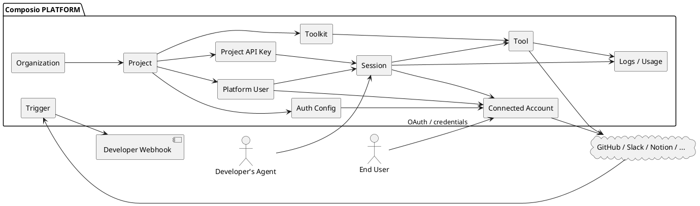

一句话解释：

> 开发者在 Project 中定义认证和能力；最终用户连接自己的外部账号；Agent 以该用户的
> Session 选择一组 Tool 和 Connected Account 执行；Composio 负责认证、工具契约、
> 执行与观测，开发者产品仍负责业务流程和最终权限政策。

### FOR YOU 端到端链路

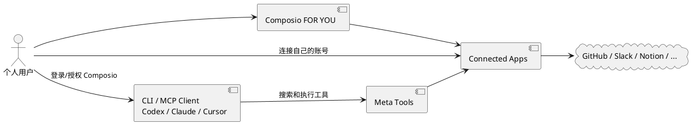

一句话解释：

> 个人先在 Composio 中连接 App，再让兼容的 AI 客户端通过 CLI 或 MCP 使用这些连接；
> 用户不需要自己开发 Auth Config、Session 后端和 Webhook。

### 两条产品线的完整对照

| 问题 | FOR YOU | PLATFORM |
|---|---|---|
| 谁购买/使用 | 想让个人 AI 使用 App 的用户 | 构建 Agent 产品的开发者 |
| 谁是外部账号主体 | 当前个人 | 开发者产品中的最终用户 |
| 主要复用单位 | 个人 Connected App | User 的 Connected Account |
| 谁创建 Agent | Codex/Claude/Cursor 等客户端 | 开发者自己的应用 |
| 认证配置 | Composio 托管并隐藏 | Managed Auth 或 Custom Auth Config |
| 运行入口 | CLI / MCP | SDK / Session / MCP / Direct Execution |
| 工具治理 | Enhanced Controls、客户端 | API Key、Session scope、业务策略 |
| 事件能力 | 个人通常不管理 | Trigger + Project Webhook |
| 主要价值 | 少做重复连接和本地集成 | 少建多应用、多用户的认证与工具基础设施 |

### 什么可以复用

```text
Toolkit/Tool 定义：可被许多项目、用户和 Agent 工作流复用
Auth Config：可被同一 Project 中多个最终用户用于建立各自连接
Connected Account：可被同一用户的多个 Session 使用
Session：可被同一工作流的多个轮次恢复
Project API Key：可被权限范围内的后端进程使用
Log/Usage：作为调用证据和统计记录保留
```

最关键的边界是：

> 复用 Tool 定义，不等于共享用户 Token；复用 Connected Account，也不等于允许所有
> 用户访问；复用 Session，更不等于把不同任务混成一个无限期上下文。

## 最终产品定义

综合七层后，更准确的定义是：

> Composio 是面向 AI Agent 的“带认证的外部行动运行时”。它把外部应用的认证、
> Tool/Trigger 契约、用户与账号归属、运行时发现和执行、权限收窄、日志与生命周期
> 管理组合成可复用基础设施，并通过 SDK、Native Tool 和 MCP 提供给 Agent。

它不是：

- Agent 或大模型本身；
- 只有 OAuth Token 的密钥仓库；
- 只有一个 MCP Server；
- 默认把一份 Token 分享给所有 Agent 和所有用户；
- 自动替开发者决定业务权限与高风险审批；
- “1000+ Toolkit 都具有相同深度和可靠性”的证明。

### 为什么不全部自己做

如果只有一个 Provider、一个内部用户和几个固定 API，自己实现并不复杂。

复杂度来自下列维度相乘：

```text
Provider 数量
× 认证方式
× 最终用户数量
× 每个用户的账号数量
× Tool/Trigger 数量
× Agent 框架和运行协议
× Token、Schema、Webhook、日志的生命周期
```

Composio 的价值不是让一次 API 请求变简单，而是把这组重复的跨应用基础设施变成统一
对象和运行面。是否值得使用，取决于产品是否真的面对上述规模；不能只用“写一个 OAuth
回调并不难”来判断。

### 当前仍需保留的判断边界

1. Tool/Toolkit 数量是目录规模，不代表每个集成都同样完整；
2. Composio 托管认证降低开发工作，也集中形成第三方凭证与运行依赖；
3. 默认动态 Session 的能力面较宽，生产环境需要主动收窄；
4. 托管 MCP 提高兼容性，但会绕过 Native SDK 的本地治理钩子；
5. FOR YOU Enhanced Controls 仍为 Beta、覆盖部分 App，且本轮工作区未开启；
6. Logs 便于审计，也可能携带敏感请求和响应；
7. Provider、Composio 和客户端任一层不可用，都可能阻断最终动作；
8. 本 Note 解释产品模型，不等于已完成各 Toolkit 的质量横评。

## 证据入口

完整页面实测、截图和授权生命周期证据见：
`note.composio-ux-walkthrough-2026-07-29`。

当前与 2026-08-15 新付费模型的独立拆解见：
`note.composio-pricing-model-2026-07-29`。
