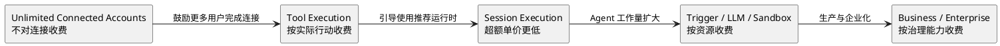

# Composio 付费模型拆解

Cutoff：2026-07-29（Asia/Shanghai）

状态：research-complete，等待 Owner review。Composio 正处于价格迁移期，本 Note
严格区分 2026-07-29 的现行价格与 2026-08-15 生效的新价格。

## 先说结论

Composio 的付费模型正在从：

> 低价、大额度、主要按 Tool Calls 计费

转向：

> 免费连接账号，按 Agent 的实际行动、事件和计算资源收费，再通过凭证治理、权限、
> 支持、合规和私有部署收取企业溢价。

FOR YOU 个人使用不计入 PLATFORM 用量；真正商业化的主要对象是构建 Agent 产品的
开发团队。

## 一、2026-07-29 现行价格

| 套餐 | 月费 | 标准 Tool Calls | 超额价格 | 支持 |
|---|---:|---:|---:|---|
| Totally Free | $0 | 20,000/月 | 达上限停止 | Community |
| Ridiculously Cheap | $29 | 200,000/月 | $0.299/1K | Email |
| Serious Business | $229 | 2,000,000/月 | $0.249/1K | Slack，带条件 |
| Enterprise | 定制 | 定制 | 定制 | SLA、VPC/On-Prem 等 |

现行价格基本围绕一个主计量单位：

> 成功执行的 Tool Call 数量。

它不按 Connected Account 数量收费，也不是典型的按开发者席位收费。

### 现行 Pro Tools

需要 Composio 承担额外第三方 API 或计算成本的工具单独计量，例如：

- 搜索 API；
- Code Sandbox；
- 网页抓取与结构化提取；
- AI/ML 推理；
- 文档解析与 OCR；
- 重型计算。

| 套餐 | Standard Calls | Pro Tool Calls | Pro 超额 |
|---|---:|---:|---:|
| Free | 20K | 1K | 无 |
| $29 | 200K | 5K | $0.897/1K |
| $229 | 2M | 50K | $0.747/1K |

官方概括 Pro Tool Call 大约是 Standard Tool Call 的三倍。

## 二、2026-08-15 起的新价格

### 基础套餐

| 套餐 | 月费 | Tool Calls | Trigger Events | 团队成员 |
|---|---:|---:|---:|---:|
| Free | $0 | 20K | 20K | 3 |
| Pro | $29 | 50K | 50K | 无限 |
| Business | $599 | 50K | 50K | 无限 |
| Enterprise | 定制 | 定制 | 定制 | 无限 |

变化最明显的部分：

- `$29` 套餐从 200K Calls 降到 50K；
- 原 `$229/2M` 的高调用量套餐不再存在于新公开价；
- `$599` Business 和 `$29` Pro 拥有相同的 50K Included Calls；
- Business 主要出售治理、安全、Support 和组织能力，不是流量折扣。

### 新增计量维度

| 资源 | Free | Pro/Business | 超额价格 |
|---|---:|---:|---:|
| Tool Calls | 20K | 50K | $4/1K；Session 内 $3/1K |
| Trigger Events | 20K | 50K | $1/1K |
| LLM Tokens | 1M | 3M | $3.75/M |
| Premium Tool Credit | $2 | $5 | Variable |
| Sandbox | 10 GB-hour | 50 GB-hour | $0.50/GB-hour |
| Filesystem | 1 GB | 10 GB | $0.05/GB |

新价格实际对五类消耗计量：

```text
Agent 执行动作
+ 外部事件进入系统
+ Composio 代为调用的 LLM
+ 搜索、爬虫、OCR 等 Premium 能力
+ Sandbox 和文件系统资源
```

## 三、什么算一次收费

### 计费

- 成功执行的普通 Tool；
- Proxy/raw API 请求；
- `MULTI_EXECUTE_TOOL` 内实际执行的每一个 Tool；
- Trigger 投递的每一个事件；
- Premium Tool 的普通 Tool Call 加额外 surcharge；
- Sandbox、Filesystem 及其中使用的 Composio LLM 资源。

例如：

```text
MULTI_EXECUTE_TOOL 并行执行 4 个 GitHub Tool
```

计为 4 次 Tool Calls，而不是 1 次或 5 次。

### 不计费

- 失败的 Tool Call；
- Composio Meta Tool 自身；
- 创建 Session；
- Connected Account 数量；
- FOR YOU 的个人使用。

Free 是硬上限，达到后暂停到下个月或升级，不自动产生超额账单。

## 四、每个套餐真正出售什么

### Free：获客与验证

允许开发者验证：

- 目标 Toolkit 是否存在；
- OAuth 是否成功；
- Agent 是否能真实执行；
- Session 和 Trigger 是否能跑通。

新价格下的限制包括 3 名成员、7 天 Log Retention，不含 Custom Tools & MCP。

### Pro：开发者生产入口

`$29` 主要解锁：

- Custom Tools & MCP；
- White-labeling；
- 无限团队成员；
- 30 天 Log Retention；
- Payload Retention opt-out；
- Email Support。

因此 Pro 不再主要是“大量便宜调用包”，而是开发者正式把 Composio 嵌入产品的最低
公开门槛。

### Business：治理与安全

`$599` 主要解锁：

- Self-managed Credentials；
- Higher API Rate Limits；
- Read-only Dashboard Role；
- IP Allowlist；
- Slack Support；
- 6 小时 Support SLA；
- 90 天 Log Retention；
- `$500/月` 的 DPA 附加项。

Business 与 Pro 拥有相同公开调用额度和超额单价，其价格轴主要是：

> 企业能否控制凭证、成员权限、网络入口、日志和支持响应。

### Enterprise：部署、合规和定制

主要出售：

- VPC/Self-hosting；
- Custom Integration；
- Enhanced Security & Compliance；
- Dedicated Support；
- Custom Usage；
- ZDR；
- Custom SLA。

## 五、价格如何引导产品使用



### 不按 Connected Account 收费

官方明确 Connected Accounts 无限且不收费。这减少了以下行为的购买摩擦：

- 让更多最终用户完成 OAuth；
- 每个用户连接更多应用；
- 一个用户连接多个同类账号。

等 Agent 真正执行动作后，Composio 才开始按价值和资源消耗收费。

### Session 超额更便宜

新价格中：

- 普通超额：$4/1K；
- Session 内超额：$3/1K。

这是明确的价格引导：Composio 希望开发者把 Session 作为推荐执行上下文，而不是只把它
当作可选概念。

### Business 不提供公开流量折扣

Pro 和 Business 都包含 50K Calls，超额表也放在同一栏。因此 Business 的公开价值不是
更多调用量，而是安全、凭证、权限和支持。

高流量客户会更自然地进入 Enterprise 商务报价。

## 六、价格变化的数量级

### 包内单位成本

现行 `$29/200K`：

```text
$0.145 / 1K Calls
```

新 `$29/50K`：

```text
$0.58 / 1K Calls
```

新价格的超额：

```text
Session：$3 / 1K
非 Session：$4 / 1K
```

### 200K Calls 示例

现行套餐：

```text
$29
```

新套餐，全部通过 Session：

```text
$29 + 150 × $3 = $479
```

新套餐，不通过 Session：

```text
$29 + 150 × $4 = $629
```

这是公开标价下的机械计算，不包含 Enterprise 报价、折扣、税费、Premium Tool、
Trigger、Sandbox 或其他 Provider 成本。

## 七、开发者的完整成本

不能只看 Tool Call：

```text
Composio Subscription
+ Tool Call Overage
+ Trigger Events
+ Premium Tools
+ Sandbox / Storage / Composio LLM
+ 主 Agent 的模型 API
+ 外部 SaaS/API 订阅
+ 开发者自身服务端成本
```

Composio 没有替开发者支付所有 GitHub、Slack、Salesforce、Search API 或主模型成本。
因此 `$29/月` 不是一个 Agent 产品的完整运行成本。

## 八、研究判断

### 1. FOR YOU 是低摩擦入口

FOR YOU 不计入 PLATFORM Usage Limits，更像个人获客、体验与生态培养入口。它让个人先
体验“Agent 使用真实 App”，但商业化主要发生在开发者把相同能力嵌入自己的产品之后。

### 2. 新价格从 Call 套餐转向 Agent 基础设施账单

计费对象扩展到 Trigger、LLM、Sandbox 和 Filesystem，说明 Composio 不再只把自己定位
成 Tool API，而是希望拥有更多 Agent Runtime 的资源层。

### 3. 新套餐把规模客户推向销售

公开高调用量套餐消失，而超额单价显著提高。高用量 Agent 产品若直接按公开价长期运行，
成本会快速增加，因此 Enterprise 定制会成为自然路径。

### 4. 企业溢价来自治理

Business/Enterprise 的核心不是更多 Connected Accounts，而是：

- 凭证所有权；
- 网络边界；
- 团队角色；
- 日志和 Payload Policy；
- SLA、DPA 与私有部署。

这与 Composio 托管高敏感 OAuth 凭证的产品位置一致。

## 九、证据边界与待验证

1. 新价格在 2026-07-29 仍是预告，需在 2026-08-15 后核验实际 Dashboard。
2. 官网近期内容文章已出现新旧数字混用，本 Note 以正式 Pricing 和 Updated Pricing
   页面为价格权威来源。
3. 公开价不能证明 Enterprise 的真实折扣和承诺。
4. 机械 Tool Call 数不能直接预测成本；必须以真实工作流测量平均 Tool Calls、Trigger
   Events、Premium Tools 和 Sandbox 消耗。
5. 本 Note 不判断 Composio 是否值得购买，只描述计费结构及其产品含义。

## 直接来源

- [[source.website.composio-pricing-2026-07-29]]
- [[source.website.composio-updated-pricing-2026-07-29]]
- [[source.website.composio-pro-tools-pricing-2026-07-29]]

## 关联研究

- [[company.composio]]
- [[note.composio-concept-model-2026-07-29]]
- [[note.composio-ux-walkthrough-2026-07-29]]
