# Composio 控制台 UX 与权限体系逐步体验

Cutoff：2026-07-29（Asia/Shanghai）

体验环境：`/tmp/pinixc browser`，`default` profile。只操作新开的 Composio tab，不读取浏览器凭证、cookies、storage 或其他业务 tab。

## 记录方法

每一步固定记录：

1. 页面目的与可见文案；
2. 用户输入或操作；
3. 系统反馈与下一状态；
4. 新增、复用或暴露的数据与权限；
5. 截图；
6. 事实与 UX 判断分离。

## 概念模型

产品定义、概念层级与参与者模型已独立维护在：
`note.composio-concept-model-2026-07-29`。

本 Note 只保留逐步 UX 实测、页面事实、截图、权限变化与生命周期证据。

## Step 0：Composio 账号登录

### 页面事实

- 官网 `GET STARTED` 进入 `dashboard.composio.dev/login`。
- 登录由 `login.composio.dev` / WorkOS 承载，提供邮箱、Google、GitHub 三种入口。
- 本轮选择 Google。
- Google 同意页只显示姓名、头像和邮箱地址，没有请求 Gmail、Drive、Calendar 等业务数据权限。

### 操作与结果

- 使用 default profile 中已有的 Google 会话完成 Composio 登录。
- 登录成功后进入 Composio onboarding。

### 权限变化

- 新增的是 Composio 账号登录身份。
- 尚未建立任何外部应用 Connected Account。
- 尚未观察到 Project、组织成员、Agent、API Key 或外部 OAuth Token。

### UX 判断

- **判断**：Composio 把“登录 Composio”与“授权业务应用”拆成两个阶段，避免在初始注册时一次申请大量业务权限。
- **未知**：当前尚未看到 Composio 内部如何把登录用户映射到组织、项目或运行时用户。

## Step 1：来源问卷

### 页面事实

- 页面问题：`How did you hear about Composio?`
- 单个自由文本输入框和 `Continue` 按钮。
- 输入框进入页面时显示 `x`；研究操作将其明确改为 `X (Twitter)` 后提交。

### 操作与结果

- 提交 `X (Twitter)`。
- 系统进入 `/onboarding/platform`。

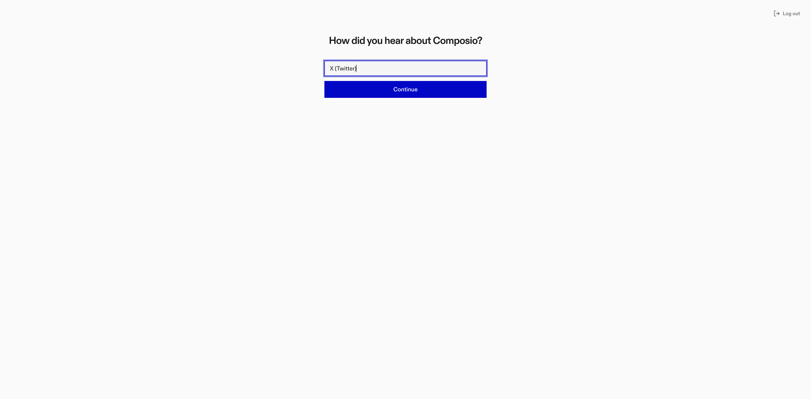

### 权限变化

- 只提交了获客来源信息。
- 没有新增外部应用权限。

### UX 判断

- **判断**：这是增长归因问题，不承担产品配置作用。
- **观察点**：自由文本而非选项，会得到更丰富但更难标准化的归因数据。

## Step 2：产品路线选择（当前停点）

### 页面事实

页面询问：`How do you want to use Composio?`

提供两个并列选择：

1. `Use Composio`：`Integrate with Claude Code, ChatGPT, Cursor, and more`
2. `Build with Composio`：`Use the Composio SDK to build AI agents`

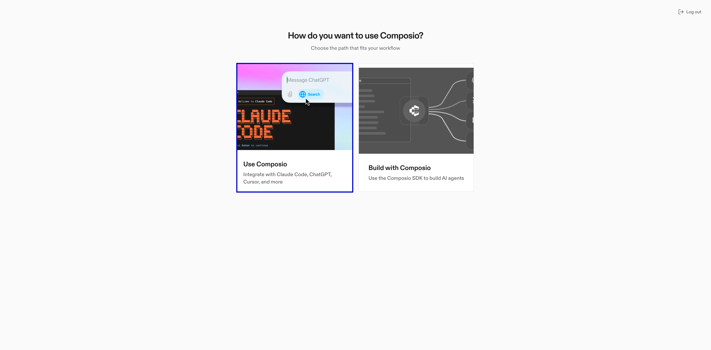

### 当前状态

- 尚未选择任一路线。
- 页面没有在此处解释两条路线能否之后切换，也没有展示权限差异。

### 初步判断

- **判断**：Composio 在 onboarding 第一处分流两类消费者：
  - 已有 Agent 的最终使用者，目标是给 Claude Code、ChatGPT、Cursor 等接入工具；
  - Agent 应用开发者，目标是通过 SDK 把工具和认证嵌入自己的产品。
- **待验证**：两条路线是否只是不同 onboarding 引导，还是会创建不同项目结构、凭证和权限模型。

## 未执行动作

- 未选择 `Use Composio` 或 `Build with Composio`。
- 未连接任何外部应用。
- 未创建项目、组织、API Key 或邀请成员。
- 未进入付费、权限扩张或生产动作。

## Step 3：`Use Composio` 用户角色分流（当前停点）

### 操作

- Owner review 后选择 `Use Composio`。
- 系统进入 `/onboarding/consumer-role`，没有立即要求连接 Agent 或授权应用。

### 页面事实

页面询问：`What best describes you?`

提供六种角色：

1. `Sales & Revenue`：Close deals faster
2. `Marketing & Growth`：Acquire and engage users
3. `Engineering & DevOps`：Build and ship software
4. `Finance & Operations`：Manage money and processes
5. `E-Commerce`：Sell products online
6. `Content & Media`：Create and distribute content

另有 `Skip`。

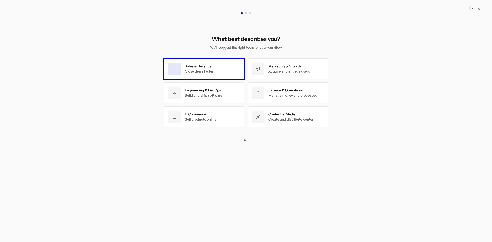

### 权限变化

- 选择 `Use Composio` 目前只改变 onboarding 路线。
- 尚未出现外部应用 OAuth、API Key、项目、组织或成员权限。

### UX 判断

- **判断**：`Use Composio` 并不是单一开发者流程。产品会继续按业务职能定制推荐工具或 Agent 用例。
- **判断**：提供 `Skip` 表明该角色数据不是进入产品的必要权限条件。
- **待验证**：角色选择是否只影响推荐内容，还是会创建不同的默认工具集或权限模板。

## 当前未执行动作

- 尚未选择业务角色或 `Skip`。
- 尚未连接任何 Agent/client 或外部应用。

## Step 4：Engineering 应用连接推荐（当前停点）

### 操作

- Owner review 后选择 `Engineering & DevOps`。
- 系统进入 `/onboarding/consumer-connect-apps?flow=engineering`。

### 页面事实

标题：`Connect your apps, unlock your workflows`

页面提供 8 个独立连接项，初始全部未选：

| 应用 | 页面描述 |
|---|---|
| Gmail | Read and send emails |
| GitHub | Manage issues and pull requests |
| Notion | Search and update docs |
| Slack | Coordinate with your team |
| Supabase | Query your database |
| Linear | Track tickets and cycles |
| Figma | Reference designs |
| Vercel | Check deployments |

每一项均显示 `Connect`。底部 `Continue` 在零选择时仍可用。

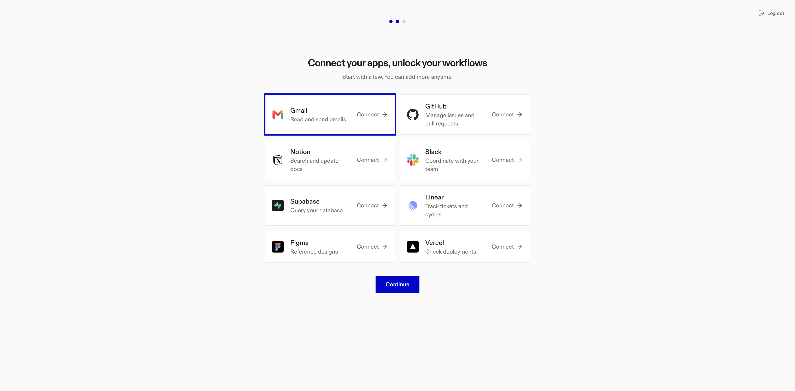

### 权限变化

- 选择 Engineering 只产生了角色对应的推荐列表。
- 8 个应用全部保持未连接状态。
- 没有出现“一次授权全部应用”的操作，也没有外部 OAuth 同意页。

### 初步判断

- **观察**：Composio 的连接模型至少在 UI 上以“应用”为独立单位，而不是一个跨所有应用的通用 OAuth Token。
- **判断**：用户先选择业务角色，Composio 再提供角色相关的推荐应用，降低从 1,000+ integrations 中自行寻找的负担。
- **判断**：零选择也能继续，说明连接应用不是完成 onboarding 的硬门槛。
- **待验证**：点击某个 `Connect` 后，是立即发起应用 OAuth，还是先建立 Composio 内部 user/entity/connection 对象。
- **待验证**：同一应用连接后，是否能被多个 Agent/client 复用，以及复用范围由用户、项目还是组织控制。

## 当前未执行动作

- 未点击任何应用的 `Connect`。
- 未触发 Gmail、GitHub、Slack 等外部授权。
- 未点击本页 `Continue`。

## Step 5：Owner 手动完成三项应用授权

### 事件说明

- Owner 在浏览器中直接操作，先后授权了 GitHub、Notion、Slack。
- 该段操作未由 Research 逐屏观察，因此 OAuth 中间页、请求的 scopes、账号/工作区选择、同意文案与回跳顺序没有完整截图证据。
- Research 不根据最终状态倒推缺失的授权细节。

### 回跳后的可见事实

Research 在同一 onboarding 页面重新读取状态：

| 应用 | 页面状态 |
|---|---|
| GitHub | `checked=true`，不再显示 `Connect` |
| Notion | `checked=true`，不再显示 `Connect` |
| Slack | `checked=true`，不再显示 `Connect` |
| Gmail | `checked=false`，仍显示 `Connect` |
| Supabase | `checked=false`，仍显示 `Connect` |
| Linear | `checked=false`，仍显示 `Connect` |
| Figma | `checked=false`，仍显示 `Connect` |
| Vercel | `checked=false`，仍显示 `Connect` |

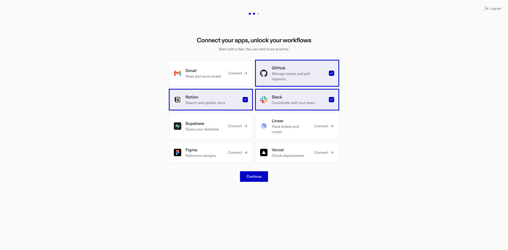

### 可以支持的结论

- 三个不同外部服务在 Composio 中形成了三个独立的已连接状态。
- 应用连接后，onboarding 卡片从带 `Connect` 的未选状态变成 checked 状态。
- 多个应用连接可以并存于同一个 Composio 登录账号的 onboarding 中。

### 不能支持的结论

- 当前证据不能说明每个服务授予了哪些精确 scopes。
- 当前证据不能说明 Token 的保存格式、刷新周期或加密方式。
- 当前证据不能说明三个连接是否属于个人、项目、组织或某个 Composio user entity。
- 当前证据不能说明多个 Agent 是否已经能共享这些连接。
- 当前证据不能说明取消卡片勾选是否会撤销外部 OAuth，还是只改变 onboarding 选择。

### 后续回看计划

完成 onboarding 后，从控制台的 Connected Accounts、项目/用户、团队/成员、安全或审计页面逐项回看：

1. 每个连接的账号与状态；
2. scopes 或权限描述；
3. 连接归属层级；
4. Agent/client 复用方式；
5. revoke、disconnect 与重新授权行为。

## Step 6：选择 Composio 使用客户端（当前停点）

### 操作

- 在 GitHub、Notion、Slack 已显示连接成功后，点击应用连接页的 `Continue`。
- 系统进入 `/onboarding/consumer-choose-client`。

### 页面事实

标题：`Install Composio Anywhere`

副标题：`Composio works wherever you work — pick a client to get started`

页面提供四个客户端选项：

1. Claude Code
2. OpenClaw
3. Codex
4. Notion

默认展示 Claude Code 内容，并提供：

- `Get started with Claude Code`
- `Skip for now`

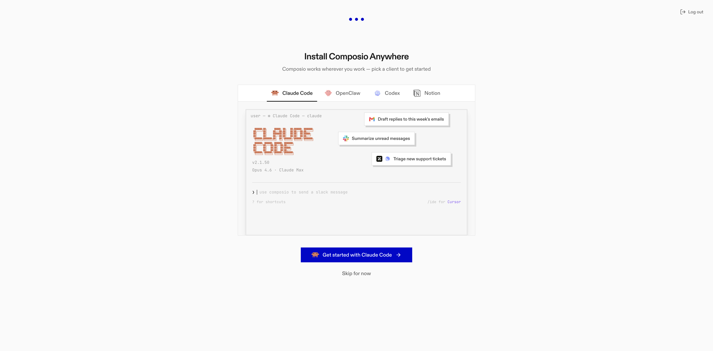

### 权限变化

- 点击上一页 `Continue` 只进入客户端选择，没有新增外部 OAuth。
- 尚未执行客户端安装，也未观察到 API Key、MCP endpoint 或本地命令。

### 初步判断

- **观察**：Composio 把“应用连接”和“消费连接的 Agent/client”分成前后两个步骤。
- **判断**：这与当前假设一致：先在 Composio 建立应用连接，再把一个或多个客户端接到 Composio。
- **未知**：四个客户端是否共享同一个 Composio 身份/API Key/MCP endpoint。
- **未知**：客户端接入后，能否默认看到全部三个已连接应用，还是还需逐 Agent 分配。
- **注意**：`Notion` 在此作为 client 选项出现，但仅凭当前页面不能确定它是 Notion Agent、Notion MCP client 或其他形态。

## 当前未执行动作

- 未点击 Claude Code、OpenClaw、Codex 或 Notion 的安装入口。
- 未生成、复制或运行任何安装命令。
- 未点击 `Skip for now`。

## Step 7：切换到 Codex 客户端（当前停点）

### 操作

- 在客户端选择页切换到 `Codex`。
- 页面鼠标自动点击曾超时且选中态没有变化；确认按钮可见、可命中且没有可见遮挡后，改用键盘聚焦并按 Enter，Codex 成功选中。
- 该现象只记录为本次浏览器交互异常，当前证据不足以判断是 Composio 产品缺陷、页面事件处理问题还是自动化环境差异。

### 页面事实

- `Codex` 标签显示为选中态。
- 主按钮变为 `Get started with Codex`。
- 页面中央展示一段静态产品演示，包含：
  - `user — codex`
  - `Codex v0.1 · research-preview`
  - 用户请求 `Review open PRs and summarize`
  - `composio - GITHUB_LIST_PULLS`
  - `Found 3 open PRs. Reviewing...`
  - `composio - SLACK_SEND_MESSAGE`
- 该演示同时引用 GitHub 与 Slack 工具，但页面没有证明它使用的是 Owner 刚完成授权的真实连接，也没有发生真实工具调用。

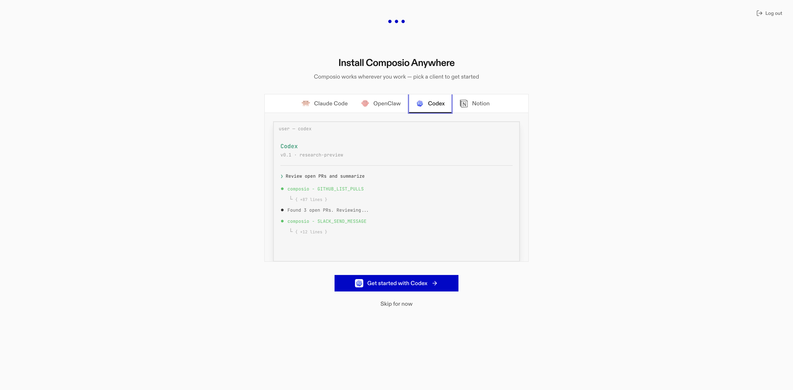

### 初步判断

- **观察**：Composio 把 Codex 定位成消费其工具与连接的一个客户端。
- **观察**：产品演示用一个跨应用工作流表达价值：先读取 GitHub PR，再向 Slack 发送消息。
- **判断**：这一层的核心卖点不是单个 OAuth Token，而是让客户端通过 Composio 调用多个已连接应用的工具。
- **不能证明**：同一 GitHub 或 Slack 连接能否同时被多个 Codex Agent 使用。
- **不能证明**：客户端接入后是否默认拥有全部已连接应用，或是否存在按 Agent、用户、项目、组织分配连接的权限层。
- **不能证明**：演示中的 `GITHUB_LIST_PULLS` 与 `SLACK_SEND_MESSAGE` 是当前产品的精确生产工具名、权限粒度或实际调用结果。

## 当前未执行动作

- 未点击 `Get started with Codex`。
- 未生成、复制或运行 Codex 安装命令。
- 未读取或暴露任何 API Key、Token、MCP endpoint 或凭证。
- 未点击 `Skip for now`。

## Step 8：进入 Codex 安装页（当前停点）

### 操作

- 点击 `Get started with Codex`。
- 系统从 onboarding 跳转到 workspace 内的 Codex 客户端安装页：
  `/lueco.x_workspace/~/connect/clients/codex`。

### 页面事实

- 客户端标题：`Codex`
- 客户端说明：`OpenAI's coding agent`
- 页面提示：`Paste every step as a single prompt.`
- 页面提供 `Copy Prompt`，可把整套步骤复制为一个 prompt。
- 当前可见安装步骤：
  1. `Install the Composio CLI`
     - 可见命令：`curl -fsSL https://composio.dev/install | bash`
  2. `Log in`
     - 可见命令：`composio login`
- 左侧导航包括：
  - Home
  - Connect Apps
  - Install
  - Help
  - Settings
  - Members
  - Sessions & API Key
  - Billing
- 页面提供 `Looking for your projects? Go to the Developer Platform`，说明当前 workspace 消费端与 Developer Platform 至少在导航上被区分。
- 当前页面未显示明文 API Key、OAuth Token 或 MCP endpoint。

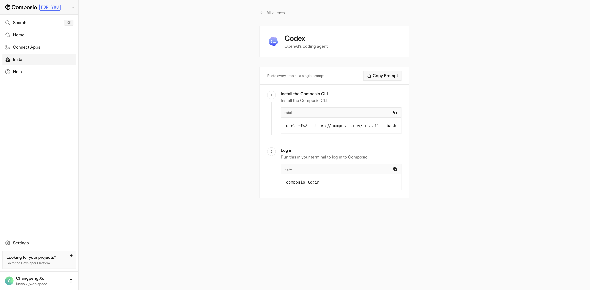

### 初步判断

- **观察**：Composio 对 Codex 的接入入口是本地 CLI，而不是在网页里直接“分配一个 Agent”。
- **观察**：安装和身份登录被拆成独立步骤；外部应用 OAuth 连接在更早的 onboarding 中完成。
- **判断**：`composio login` 很可能用于把本地 Codex/CLI 与当前 Composio workspace 身份绑定，但尚未执行，不能确认其具体认证方式、会话范围或凭证落点。
- **判断**：`Copy Prompt` 把环境安装委托给 Codex 本身，是一种 Agent-native onboarding 设计。
- **未知**：登录后是生成本机 session、API key、device authorization，还是浏览器回跳。
- **未知**：一个登录会话是否能访问当前 workspace 的全部已连接应用。
- **未知**：Members、Sessions & API Key 与 Connected Apps 之间如何共同约束多 Agent 复用和权限隔离。

## 当前未执行动作

- 未点击 `Copy Prompt`。
- 未运行远程安装脚本。
- 未执行 `composio login`。
- 未进入 `Members`、`Sessions & API Key` 或 Developer Platform。
- 未创建或暴露任何客户端凭证。

## Step 9：安装 Composio CLI 与 Codex 插件（当前停点）

### 安装前检查

- 先下载并读取 `https://composio.dev/install`，脚本 SHA-256：
  `7e6752681a93d308c32a62e9835c09f85d8592a82b3343a31a2cf5de31532542`。
- 脚本的默认行为包括：
  - 从 `ComposioHQ/composio` GitHub Releases 下载当前平台的 CLI；
  - 用 release `checksums.txt` 校验下载包；
  - 安装到 `~/.composio/composio`；
  - 向 shell 配置添加 `~/.composio` 到 PATH；
  - 自动检测已存在的 Agent host，并为检测到的 host 安装 Composio 插件；
  - 默认安装过程不执行登录，除非显式传入 `--agent`。

### 首次安装失败

- 按网页原始命令执行时，安装器在“Finding latest CLI release”阶段停止。
- 原因是匿名 GitHub API 请求额度已耗尽，安装器无法自动发现最新带 macOS arm64 资产的稳定 CLI release。
- 失败发生在下载和写入之前；当时没有生成 CLI、PATH 配置或插件。

### 恢复与执行

- 从 GitHub Releases 公开页面确认当前稳定标签为
  `@composio/cli@0.2.32`；`0.2.33` 当前出现为 beta 系列，不作为稳定版本选择。
- 核对以下官方 release 资产均可访问：
  - `composio-darwin-aarch64.zip`
  - `checksums.txt`
- 使用同一官方安装脚本并显式传入稳定版本：
  `bash install-script '@composio/cli@0.2.32'`。
- 下载包的 checksum 验证通过。

### 安装结果

- Composio CLI 安装路径：`~/.composio/composio`
- CLI 版本：`0.2.32`
- `~/.zshrc` 新增：

  ```sh
  # Composio CLI
  export COMPOSIO_INSTALL_DIR="/Users/cp/.composio"
  export PATH="$COMPOSIO_INSTALL_DIR:$PATH"
  ```

- 交互式 zsh 可解析 `composio` 并返回版本 `0.2.32`。
- 安装器检测结果：
  - Codex：detected
  - Claude Code：not detected
- Composio Codex 插件已安装并启用；插件版本目录：
  `~/.codex/plugins/cache/composio/composio/0.2.2`
- 插件包含 app manifest、plugin manifest、hooks 与 `skills/composio/SKILL.md`。
- 本步骤没有执行 `composio login`。

### 附带环境观察

- 验证交互式 zsh 时，现有 `~/.zshrc` 另外报告 `go: command not found`；
  该问题不是本次 Composio 安装创建，也未阻止 Composio CLI 返回版本。

### 初步判断

- **观察**：网页的单条安装命令不仅安装 CLI，还会自动把 Composio 集成到检测到的 Codex host。
- **判断**：Composio 的 Codex UX 实际包含两层本地能力：全局 CLI 与 Codex 插件。
- **观察**：CLI 版本 `0.2.32` 与 Codex 插件版本 `0.2.2` 独立演进，不能把两者当成同一个版本。
- **风险**：依赖匿名 GitHub API 自动发现稳定版本，会在 API rate limit 时让官方一键安装直接失败；显式版本可恢复。
- **未知**：插件启用后是否需要重启当前 Codex 会话才能加载。
- **未知**：`composio login` 将生成何种本地 session，以及该 session 如何映射到 workspace、成员和已连接应用。

## 当前未执行动作

- 未执行 `composio login`。
- 未创建、读取或暴露 Composio session、API Key 或 Token。
- 未调用 GitHub、Notion、Slack 的任何工具。
- 未进入网页的 Members 或 Sessions & API Key。

## Step 10：CLI 登录与组织级授权

### 登录启动

- 执行 `composio login`。
- CLI 创建一次性交互式登录会话，输出带临时 `cliKey` 的登录 URL，并等待浏览器回调。
- 系统没有自动在 Pinix `default` profile 中打开该 URL，因此 Research 将一次性 URL 打开到新的隔离标签页 `tab-268`。
- 临时 `cliKey` 未写入 Vault、截图说明或研究结论。

### 授权页事实

页面标题：`Authorize CLI — Composio`

主说明：`Review and approve organization-wide access for the CLI.`

页面明确列出三项权限：

1. `Access all your organizations`
   - `Read and use organization-level resources across your account.`
2. `Access all your projects`
   - `Work across every project currently available to you.`
3. `Act on your behalf`
   - `Execute CLI requests using your authenticated Composio account.`

页面说明该授权对象是从当前 terminal 创建的 interactive session。

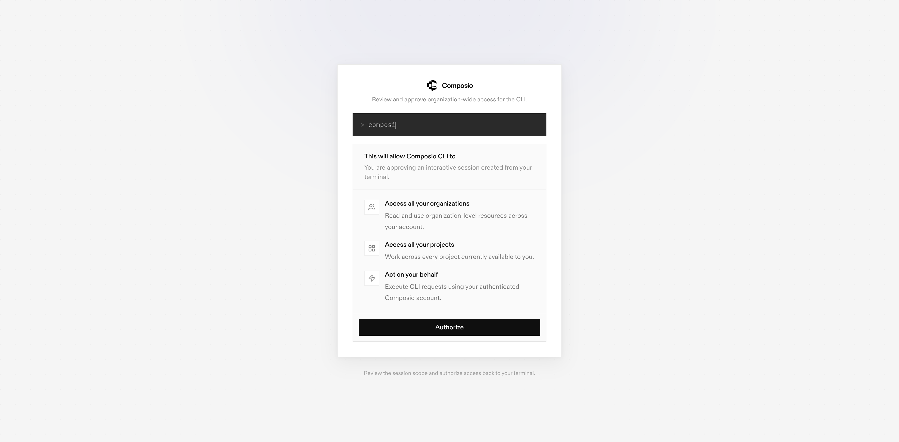

### 登录结果与回读

- CLI 返回 `Login successful`。
- 当前加载组织数量：1。
- 当前选中组织：`lueco.x_workspace`。
- `composio whoami` 返回：
  - `account_type=human`
  - 当前组织 `lueco.x_workspace`
  - `enhanced_controls_enabled=false`
- Research 没有读取 `~/.composio/user_data.json` 内的认证内容，也没有记录 email、session 或 token 原值。
- CLI 刚返回成功时，浏览器授权页短暂仍保留 `Authorize` 按钮；随后页面完成更新，进入授权成功状态。

### 授权后页面

- 页面显示：`You can close this window and return to the terminal.`
- 页面取消授权按钮，改为两个 Agent 使用示例：
  - `Ask your agent`，示例输入为连接某个应用；
  - `Or just have your agent act`，示例为读取一个应用的数据并通过另一应用发送结果。
- 页面展示 Gmail、Slack、GitHub、X、Notion、Google Calendar、Salesforce、
  HubSpot、Linear、Jira、Asana、Discord、Figma、Dropbox、Google Drive、
  Trello、Zoom、Shopify、Stripe、Zendesk、Intercom、Airtable、Confluence、
  Monday、ClickUp、Twilio、Calendly、Mailchimp、Google Sheets、Teams 等应用图标。
- 这些图标是产品能力展示，不能据此认定当前账号已连接所有应用。

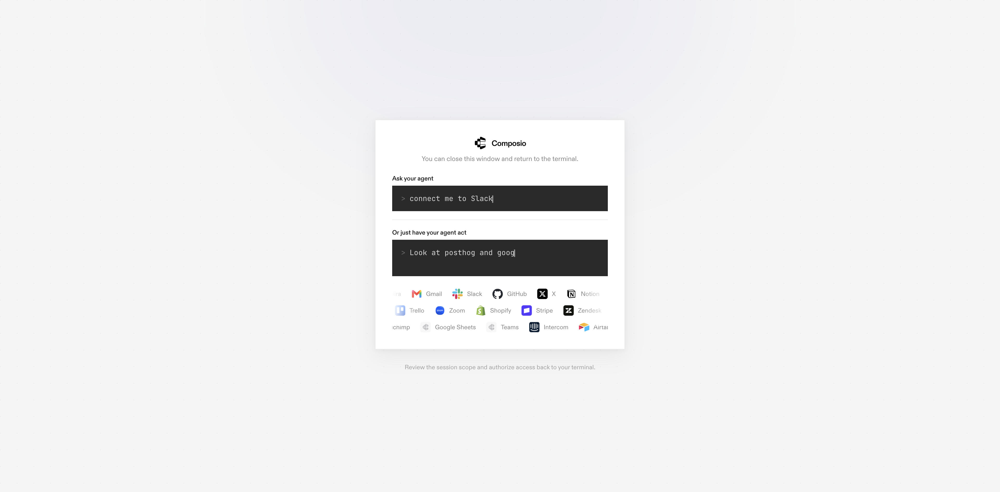

### 初步判断

- **观察**：CLI 登录授权是 Composio 账户级、跨组织和跨项目的广权限，不是只授权当前 Codex 客户端或当前 workspace。
- **观察**：CLI 获得“代表用户执行请求”的能力，因此它是一个高权限消费入口。
- **判断**：此前“一个 Token 给多个 Agent 复用”的说法仍不够准确。当前证据支持的是：一个本地 CLI session 可以在当前 Composio 账号权限下访问其组织和项目资源；是否允许多个 Agent 共享该 session，取决于本地运行环境、Composio 的 session/API Key 设计和后续权限控制。
- **判断**：外部应用 OAuth 连接与 CLI 登录是两层授权：
  - 外部应用连接决定 Composio 可以访问哪些 GitHub、Notion、Slack 账号；
  - CLI 登录决定当前本地客户端可以在多大范围内调用 Composio 账户资源。
- **风险**：授权页当前没有提供组织、项目或只读/写入范围的细粒度选择。
- **未知**：`enhanced_controls_enabled=false` 的正式产品语义、启用条件与可增加的控制项。
- **未知**：Members 与 Sessions & API Key 能否把广泛 CLI 权限进一步限制到单个 Agent、用户、项目、工具或连接。

## 当前未执行动作

- 未调用任何 GitHub、Notion 或 Slack 工具。
- 未执行有写副作用的 `composio execute` 或 `composio proxy`。
- 未读取本地认证文件或 API Key。
- 未进入 Members、Sessions & API Key 或增强控制设置。

## Step 11：首个真实只读任务——读取已连接 GitHub 账号

### 任务选择

- 目标：验证 CLI session、既有 GitHub OAuth 连接与工具执行链路。
- 安全边界：只读，不创建 Issue、不修改仓库、不发送消息。
- 查询：`get the authenticated GitHub user`
- 限定 toolkit：`github`

### 工具发现

执行：

```sh
composio search "get the authenticated GitHub user" \
  --toolkits github --limit 5 --human
```

Composio 返回 5 个候选工具，首选：

`GITHUB_GET_THE_AUTHENTICATED_USER`

搜索结果还生成了执行计划，明确建议把返回 handle 作为 canonical，并且
`return only a small allowlist of non-sensitive fields`。

### 真实执行

执行：

```sh
composio execute GITHUB_GET_THE_AUTHENTICATED_USER -d '{}'
```

结果：

- `successful=true`
- 已连接 GitHub 公开 handle：`yan5xu`
- 公开姓名：`Yanwu`
- 执行过程中没有再次出现 GitHub OAuth 或账号选择页。
- Composio 返回了可追踪的 execution log ID；未把该 ID 提升为外部审计证据。

### 数据最小化观察

- 虽然搜索计划建议只返回少量非敏感字段，实际 `execute` 返回的是完整
  GitHub authenticated-user payload。
- 返回载荷除公开资料外，还包含私有仓库数量、账户套餐、2FA 状态等本任务
  不需要的账号字段。
- Research 没有把这些不必要的私有字段写入 Vault，也不在研究回执中复述。

### 初步判断

- **观察**：同一 Composio CLI session 可以直接使用 onboarding 中已经建立的
  GitHub 连接；本次调用没有重复认证。
- **观察**：工具发现与工具执行是两个独立阶段；搜索不仅返回 tool slug，还会生成
  建议性执行计划。
- **判断**：这次实测支持“Composio 代管外部连接，客户端后续调用无需每次 OAuth”，
  但仍未证明多个不同 Agent 或不同机器能共享同一连接。
- **风险**：搜索层的数据最小化建议没有自动约束执行层返回字段，调用者或 Agent
  需要自己做结果裁剪。
- **风险**：CLI 的组织级授权加上完整 provider payload，会让最小只读任务也获得
  比业务问题更宽的信息面。
- **未知**：是否可通过 tool schema、proxy 字段选择、GraphQL 或增强控制在服务端
  强制结果字段最小化。

## 当前未执行动作

- 未调用任何 GitHub 写操作。
- 未读取仓库内容、Issue、PR、组织或私有仓库列表。
- 未调用 Notion 或 Slack。
- 未将完整 provider payload、私有账号字段或本地认证状态写入 Vault。

## Step 12：进入 Developer Platform 与自动创建的项目

### 从根地址进入 Platform

- 原 FOR YOU 控制台标签已关闭，Research 保留授权成功页并在新标签打开
  workspace 根地址。
- 根地址进入的是 `Composio PLATFORM`，不是此前的 `FOR YOU`。
- 页面标题：`Projects`
- 当前已有一个自动创建的项目：
  `lueco.x_workspace_first_project`
- 项目创建时间：2026-07-29。
- 页面还提供 `New Project` 与 `Create Project`，本步骤没有创建第二个项目。

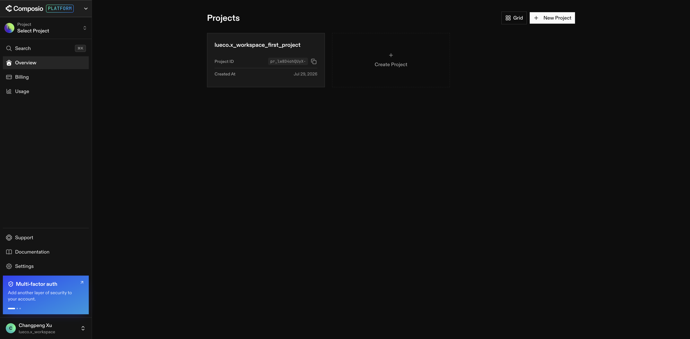

### 项目内 Getting Started

点击既有项目后进入 `Getting Started`。左侧项目级导航包括：

- Playground
- Toolkits
- API Keys
- Users
- Sessions
- Auth Configs
- Triggers
- Logs

页面另列出 Settings 分组：

- General
- API Keys
- Webhooks
- White Labeling

以及组织或账号相关入口：

- Members
- Billing
- Usage
- Account Settings

### Agent 接入向导

Getting Started 把首次 tool call 拆成：

1. Select your framework
   - Vercel AI SDK
   - Claude Agents SDK
   - OpenAI Agents SDK
2. Select language & mode
   - TypeScript
   - Native Tool
   - MCP Server
3. Setup your agent
   - Install packages
   - Set environment variables
   - Add agent code
4. Make your first tool call

当前默认展示 Vercel AI SDK、TypeScript、Native Tool，并给出包安装命令。
环境变量示例为：

```text
COMPOSIO_API_KEY=<your_api_key_here>
```

页面只显示占位符，没有显示真实 API Key。

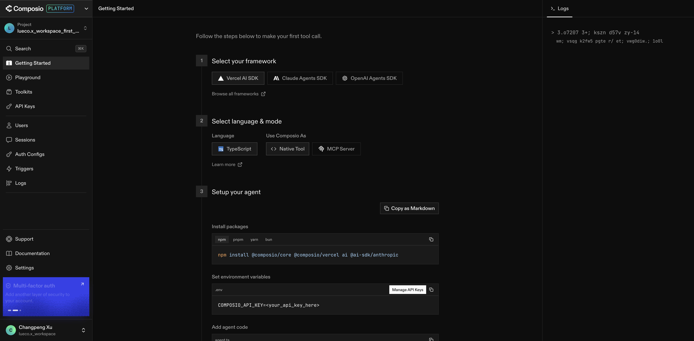

### 安全能力信号

项目页展示 `New safety features`：

- Multi-factor auth
- IP Whitelisting
- Scoped API keys

当前只观察到入口名称，没有进入详情或启用任何设置。

### 初步判断

- **观察**：Composio 同一账号下至少存在两套产品界面：
  - FOR YOU：面向现成 Agent/client 直接使用连接；
  - PLATFORM：面向开发者按 Project 构建和管理 Agent 集成。
- **观察**：Platform 的主要隔离对象是 Project；Project 下继续区分 Users、
  Sessions、Auth Configs 与 API Keys。
- **判断**：此前“一个 OAuth Token 被多个 Agent 共用”忽略了 Platform 的中间层。
  更接近当前证据的模型是：
  `Organization → Project → User/Session/Auth Config → Connected Account → Tool Call`。
- **判断**：CLI human session 与项目 API Key 是两条不同的客户端认证路径。
- **观察**：Scoped API keys 被作为“新安全能力”推广，说明基础 API Key 可能默认较宽，
  细粒度 scope 需要额外配置或特定方案。
- **未知**：Scoped API Key 可以限制到哪些对象：项目、toolkit、tool、action、
  user、connected account、环境或 IP。
- **未知**：Users 与 Sessions 是否就是多 Agent 复用连接时的主要隔离实体。

## 当前未执行动作

- 未创建新 Project、User、Session、Auth Config 或 API Key。
- 未进入 API Keys 或 Scoped API Keys 详情。
- 未修改 MFA、IP Whitelist、Webhook、成员或 Billing。
- 未复制任何环境变量或项目凭证。

## Step 13：Scoped API Keys 入口与项目 API Key 空状态

### 安全功能卡

- 在 Getting Started 的 `New safety features` 中选择 `Scoped API keys`。
- 卡片显示：
  `Choose each key's scope at creation. Extra access is off by default.`
- 卡片链接指向当前 Project 的 Settings → API Keys。
- 轮播会自动重建 DOM 并切回其他安全卡，第一次点击详情引用因此失效；
  重新读取可见链接后在新隔离标签页打开 API Keys 页面。

### API Keys 页面事实

页面说明：

- `Manage API keys for authenticating with this project.`
- `Scoped API keys`
  - `Choose each key's permissions at creation.`
  - `Scoped keys only get the areas you enable.`
- `IP Whitelists`
  - `Only allow API traffic from trusted networks.`
  - `Configure IP whitelists per key from the key list.`

当前项目处于 API Key 空状态：

- `Create an API key`
- `Get started by creating your first key for this project.`
- 页面没有列出既有 Key，也没有显示任何 Key 原值。

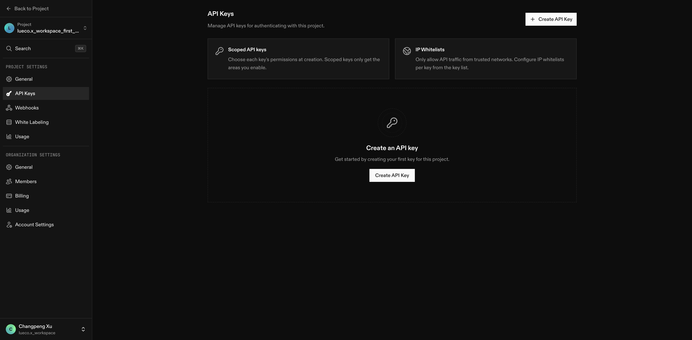

### 初步判断

- **观察**：API Key 属于 Project，而不是直接属于整个 Organization。
- **观察**：权限采用显式启用模型，页面称额外权限默认关闭。
- **观察**：IP Whitelist 也是 per-key 配置，不是只提供组织级总开关。
- **判断**：这比 CLI human session 的“所有组织、所有项目、代表用户执行”授权明显更细。
- **未知**：创建表单中的实际 scope 粒度。
- **未知**：默认 scope 是否为空、只读或一组基础权限。
- **未知**：能否限制 toolkit、tool/action、User、Session、Auth Config 或 Connected Account。

## 当前未执行动作

- 未创建、复制或保存任何 API Key。
- 未配置 IP Whitelist。

## Step 14：Create API key 权限表单

已点击 `Create API Key` 并打开创建表单，停在提交前。没有填写名称、修改权限或创建 Key。

表单提示：

- 为 API Key 设置描述性名称并选择权限。
- `Permissions can't be changed after creation.`
- 提供 `Project API key permissions` 文档入口。

### 默认权限

- `Read All`：默认选中。
- `Write All`：默认未选中。

因此，前一页所称 `Extra access is off by default` 不能理解为“新 Key 默认没有任何访问权”。
当前实际默认是较广的管理面只读权限，写入与执行类权限关闭。

### 权限矩阵

| 资源或能力 | Read 默认 | Write 默认 | 页面说明 |
|---|---:|---:|---|
| Tools | 开 | 不提供 | View tool definitions, inputs, scopes, and versions. |
| Tool execution | 不提供 | 关 | Execute predefined Composio tools. |
| Proxy execute | 不提供 | 关 | Execute raw proxy requests against connected accounts. |
| Sessions | 开 | 关 | Create and operate sessions and MCP servers. |
| Connected accounts | 开 | 关 | View and manage connected accounts. |
| Auth configs | 开 | 关 | View and modify auth configs. |
| Toolkits | 开 | 关 | View and install toolkits. |
| Triggers | 开 | 关 | View trigger types and manage trigger instances. |
| Webhooks | 开 | 关 | View and manage webhook endpoints and subscriptions. |
| Observability | 开 | 不提供 | View execution logs and project usage summaries. |

页面的资源行说明同时描述 read/write 能力，不能仅凭一句说明判断当前默认只读 Key
可以执行其中的管理动词；实际授权仍以每行勾选状态为准。

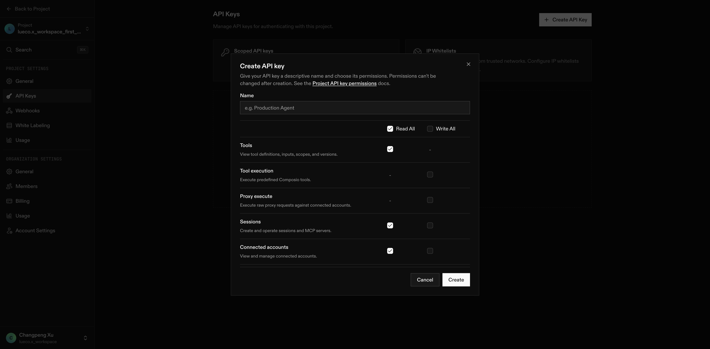

### 初步判断

- **观察**：项目 API Key 支持按资源区分 read/write，并把工具执行和 raw proxy
  单列为写权限。
- **观察**：默认 `Read All` 会读取 Tools、Sessions、Connected Accounts、
  Auth Configs、Toolkits、Triggers、Webhooks 与 Observability。
- **观察**：默认不授予 `Tool execution`、`Proxy execute` 或其他资源写权限。
- **观察**：权限创建后不可修改；后续调整需要新建 Key，而不是修改既有 Key。
- **判断**：默认状态适合观察和诊断，不等于最小知情权限。若只想让某个 Agent
  执行限定工具，应从关闭 `Read All` 后的最小权限组合开始验证。
- **判断**：`Proxy execute` 比预定义 `Tool execution` 更接近绕过工具定义直接访问
  Connected Account，应作为单独的高风险能力评估。
- **未知**：这些权限是否还能进一步限制到特定 toolkit、tool、session、user、
  connected account 或 environment。
- **未知**：权限表没有显示 deny、有效期、调用额度或按 Agent 身份绑定。

## 当前未执行动作

- 未填写 API Key 名称。
- 未改变任何默认权限。
- 未点击 `Create`，因此没有生成、复制或保存任何 API Key。
- 未配置 IP Whitelist。

## Step 15：创建最小可用的 Project API Key

### 权限选择

为覆盖 Native Tool 与 MCP Server 的真实执行，同时避免管理面写权限，本轮创建临时
Key `ux-native-mcp-test-2026-07-29`，只启用：

- Tools：read；
- Tool execution：write；
- Sessions：read + write；
- Connected accounts：read；
- Toolkits：read。

关闭 Proxy execute、Auth configs write、Connected accounts write、Triggers、
Webhooks 与 Observability。控制台将该组合显示为 `5 Scopes`。Key 不设 IP
allowlist；这是测试环境限制，不是安全建议。

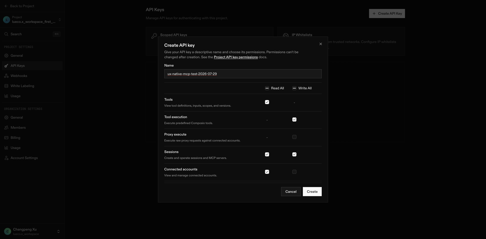
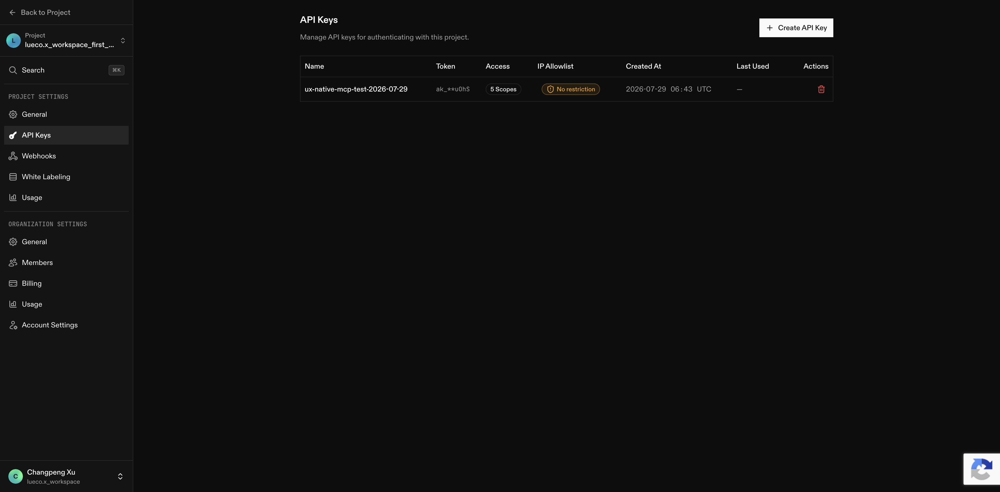

### 可见行为

- Secret 只在创建时显示一次，之后列表仅显示掩码。
- 权限创建后不可修改，只能撤销并新建。
- 实际调用后 `Last Used` 更新，证明本轮 SDK 请求确实使用了该 Key。

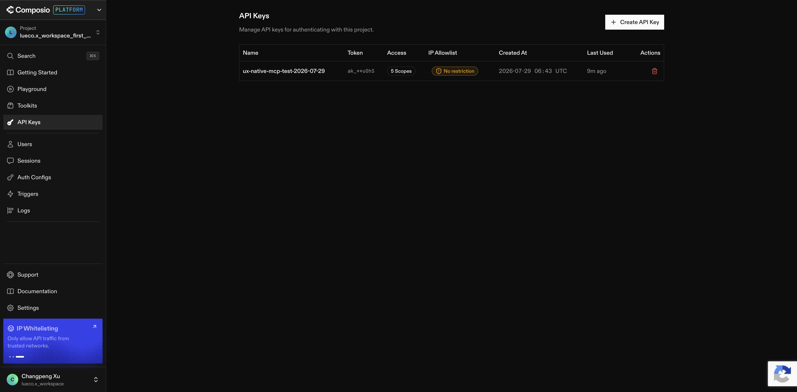

### 判断

- **事实**：Project API Key 是服务端 Agent 集成的项目级凭证；它与 FOR YOU 的
  consumer key、CLI human session 是三条不同认证路径。
- **判断**：权限粒度停在资源级 read/write，未观察到按 toolkit、tool、
  connected account 或具体 user 限制 Key 的 UI。
- **判断**：默认 Read All 不是最小知情权限；真实 Agent 应按任务重新组合 scope。

## Step 16：Native Tool 模式真实执行

### 运行路径

在临时 TypeScript 项目中安装 `@composio/core@0.14.0`，使用 scoped Key：

1. `composio.create("user_uappan9")` 创建 Native Session；
2. `session.tools()` 返回六个 Composio 路由工具；
3. `session.search()` 查找 `GITHUB_GET_THE_AUTHENTICATED_USER`；
4. 首次执行因 Platform User 没有 GitHub Connected Account 返回无活动连接；
5. `session.authorize("github")` 发起 GitHub OAuth；
6. Owner 账号确认后回到 Composio，Platform 创建 Managed Auth Config 和
   Connected Account；
7. 再次执行成功，公开结果为 GitHub handle `yan5xu`、姓名 `Yanwu`。

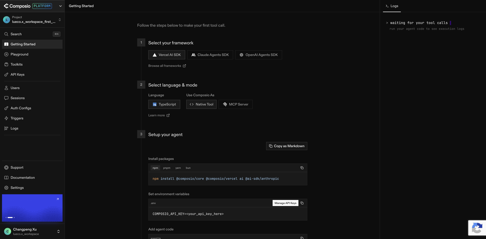
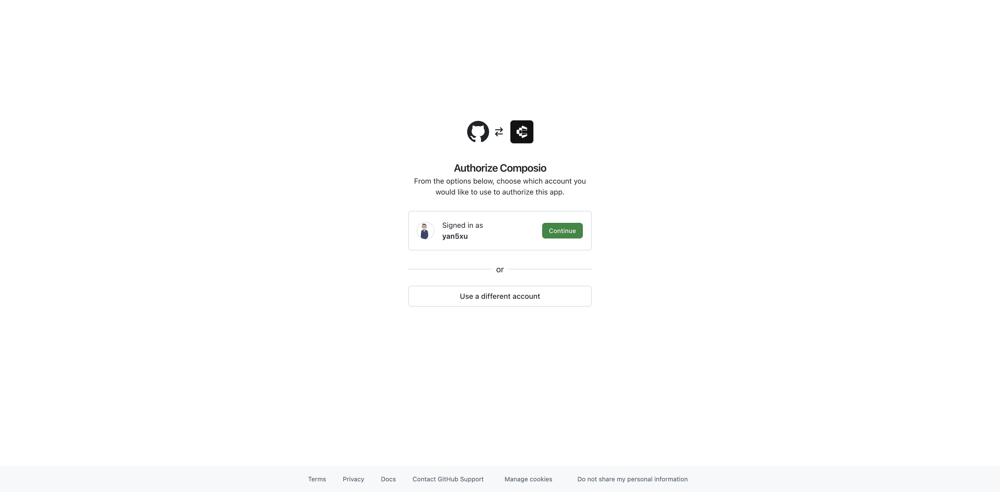
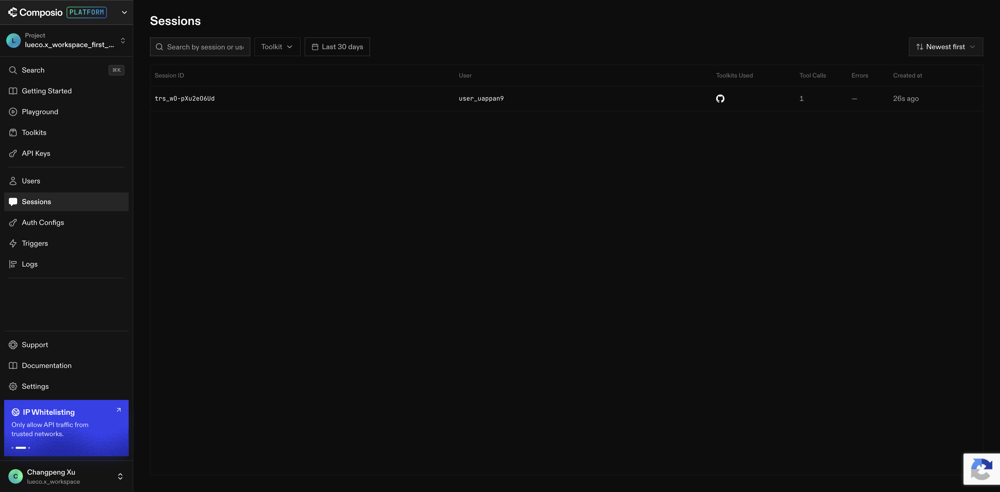

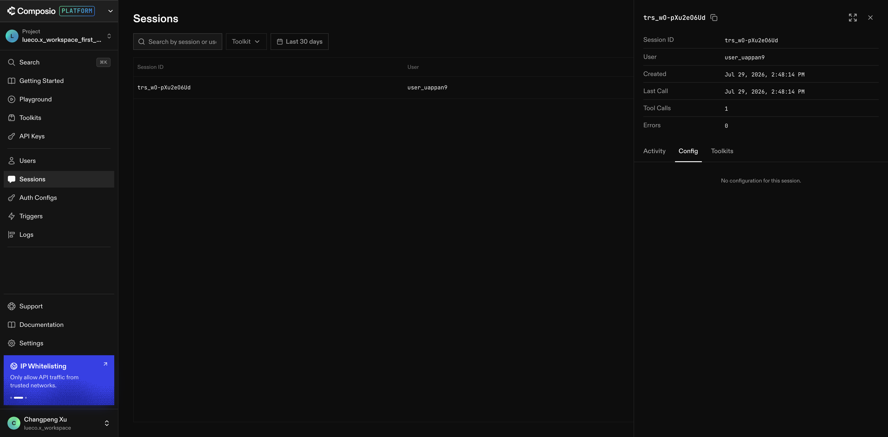
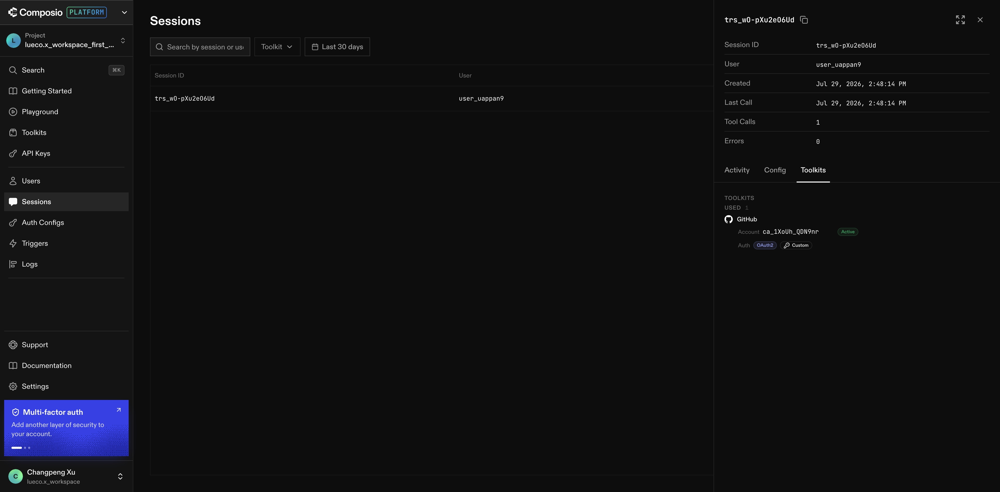

### Native 模式的产品对象

- SDK 把 Composio 的路由工具直接交给所选 Agent framework。
- Session 是服务端持久对象，可通过 session ID 恢复。
- User ID 是开发者提供的业务用户标识，不要求先在控制台创建。
- OAuth 结果落到该 Project/User 的 Connected Account，不复用 FOR YOU 连接。
- Session detail 把 Activity、Config、Toolkits 分开；本轮 Config 为空。

### 数据最小化问题

虽然任务只需要公开 handle 与姓名，GitHub 工具仍返回完整 authenticated-user
payload，其中包含本任务不需要的私有账号元数据。Research 只保留公开 allowlist，
不记录完整响应。

## Step 17：Platform 的 User、Auth Config、Connected Account 与日志

### 页面事实

- Users 列表按 User ID 聚合 Connected Apps、active/expired/dropped/failed/inactive
  account 与 Last Activity。
- User detail 分 Accounts、Triggers、Sessions、Logs。
- Account 行明确连接：
  `User → Connected Account → Auth Config → Toolkit → Status`。
- 本轮 GitHub Auth Config 是 Managed OAuth2，启用状态。
- Scopes 页面显示七项：`repo`、`user`、`gist`、`notifications`、`project`、
  `workflow`、`codespace`。
- Execution Allowlist 为空时表示允许全部 GitHub tools。

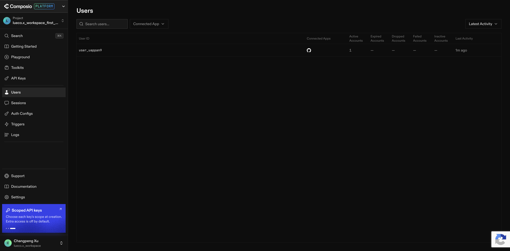
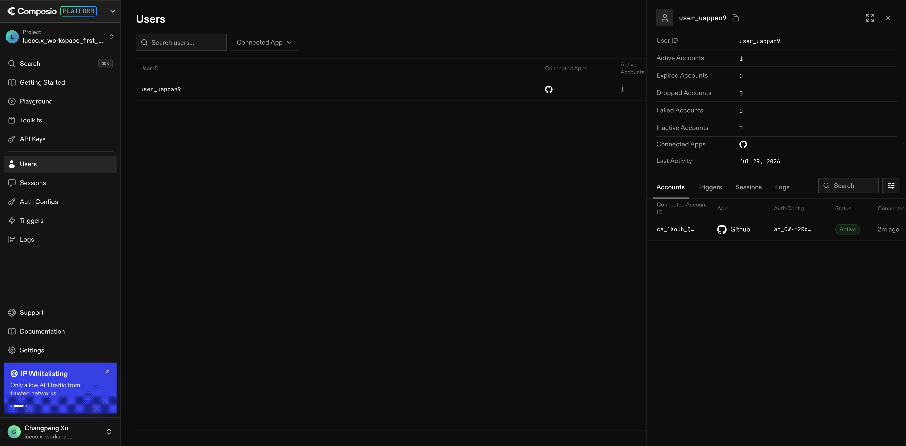
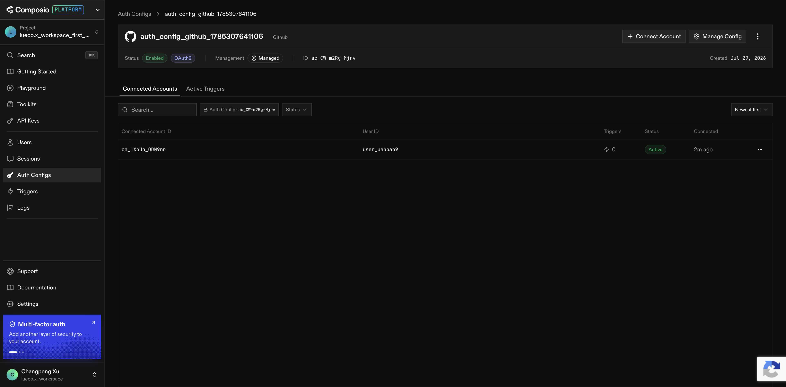
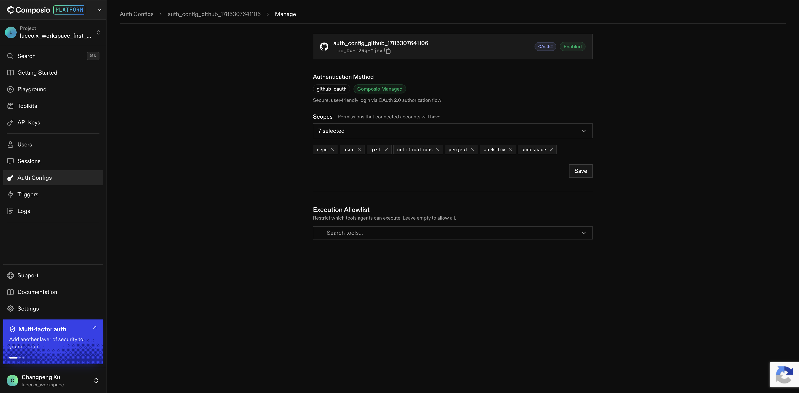

### 判断

- **事实**：OAuth scope 与可执行 tool allowlist 是两层控制；本轮前者较宽，
  后者默认全放开。
- **SDK 事实**：当前 SDK 的常规 `session.authorize()` 默认创建 private
  connection；experimental API 另提供 shared connection 与 per-user ACL。
- **判断**：用户关于“一个 OAuth token 被多个 Agent 共用”的理解只在受控共享
  场景下成立，不能作为默认模型。默认更接近“Project 内每个业务 User 拥有自己的
  Connected Account，多个 Session 可复用该 User 的连接”。

## Step 18：MCP Server 模式真实执行

### 运行路径

在同一 Project、同一 User、同一 GitHub Connected Account 下创建第二条 Session：

1. 获取 hosted MCP URL 与认证 headers；
2. 用 `@ai-sdk/mcp` 建立 HTTP MCP client；
3. MCP client 看到与 Native 模式相同的六个 Composio meta-tools；
4. 通过 `COMPOSIO_SEARCH_TOOLS` 找到 GitHub 工具；
5. 通过 `COMPOSIO_MULTI_EXECUTE_TOOL` 执行；
6. 返回同一公开 GitHub 身份，未再次 OAuth。

MCP URL 可记录其 hosted transport 与 host，但认证 headers 未写入 Vault。

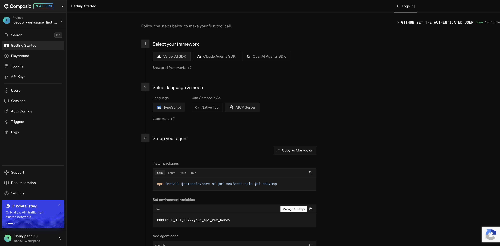
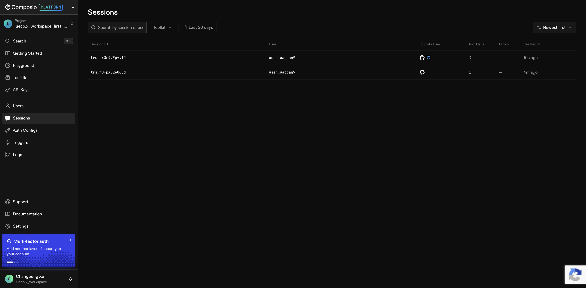
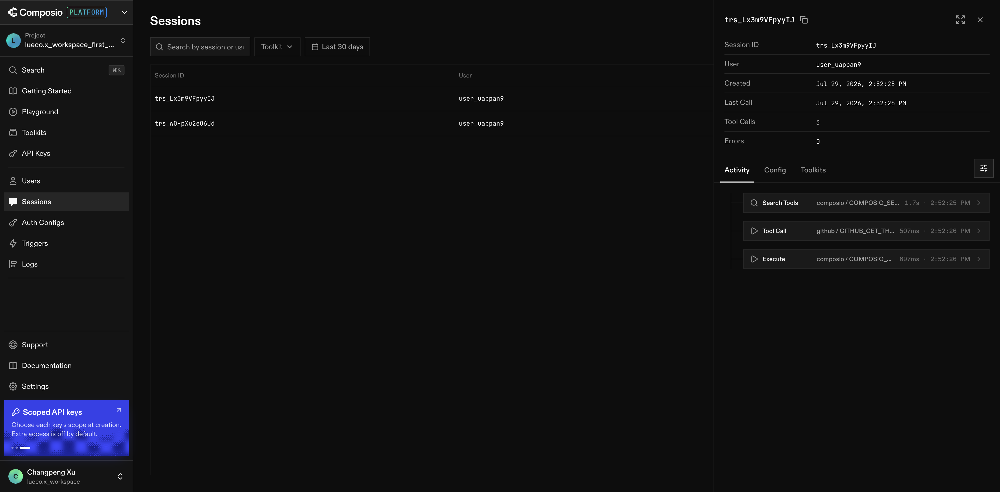

### 两种运行模式的异同

| 维度 | Native Tool | MCP Server |
|---|---|---|
| 交付协议 | Composio SDK 直接返回 framework tools | Hosted MCP endpoint + authenticated headers |
| Agent 侧依赖 | `@composio/core` 与 framework provider | 任意兼容 MCP 的 client |
| 主要调用形态 | `session.search/execute/tools` | MCP meta-tools 搜索与执行 |
| User/Connection | 复用同一 Project User 与 Connected Account | 同左 |
| Session/日志 | 独立 Session、独立调用日志 | 独立 Session、独立调用日志 |
| OAuth | 无连接时通过 Session 发起 | 可复用同一 User 已有连接 |

**判断**：Native 与 MCP 不是两套认证产品，而是同一 Session/Connection substrate
的两种工具交付协议。MCP 适合跨客户端兼容；Native 更贴近框架 SDK 和类型系统。

## Step 19：Toolkits、Tools、Playground 与执行日志

### Toolkits

- Catalog 页面显示 `1052 toolkits`。
- 卡片展示 tool 数、trigger 数、auth method 与版本。
- GitHub catalog 卡片显示 871 tools，detail 显示 893 tools；同一时点存在页面内计数冲突。
- GitHub detail 提供版本选择、View changes、Docs、Playground、Add to Project、
  Tools 与 Triggers。
- 精确 slug 搜索仍返回 22 个模糊结果，检索不是严格唯一匹配。

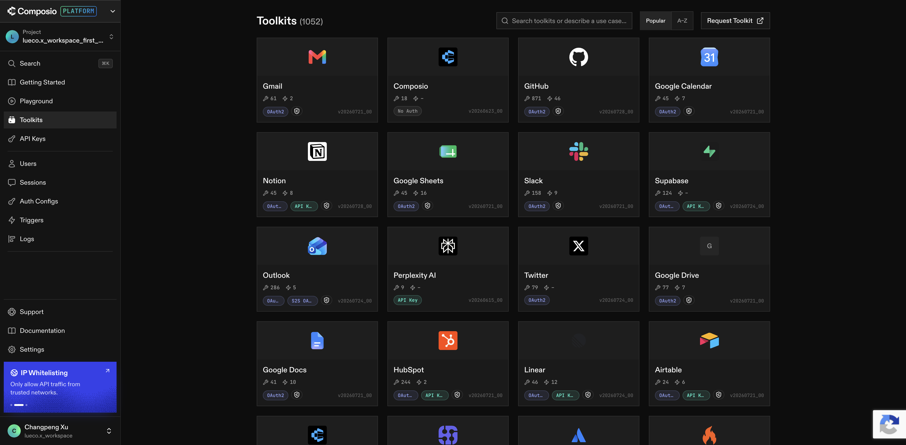
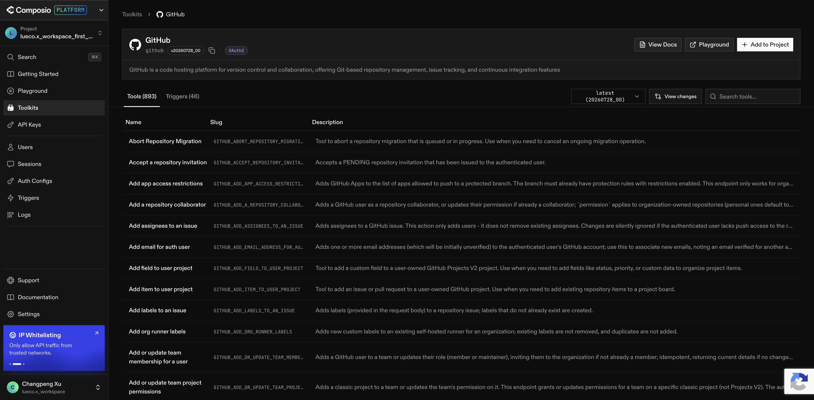
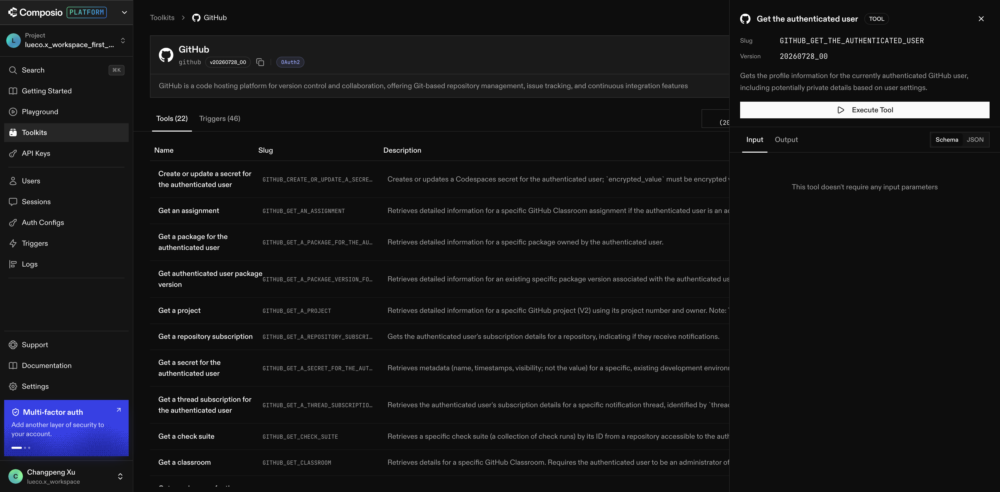

### Playground 与日志

- Tool detail 展示 slug、版本、说明、Input/Output Schema 与 Execute Tool。
- 独立 Playground 能识别 Auth Config，却显示 `No connected accounts found`，
  与 Users/Sessions 中的 active account 不一致；页面没有自动带入 User context。
- Logs 将 Composio meta-tool 与真实 provider tool 分行记录，包含时间、状态、
  toolkit、duration、connected account 与 user，并可展开完整响应。

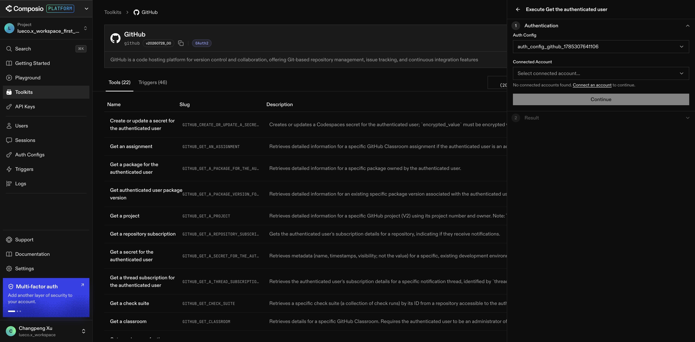
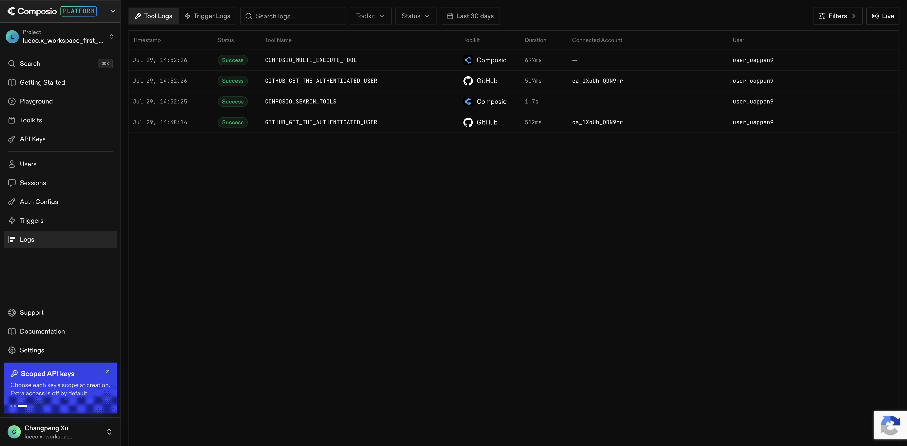

### 判断

- **判断**：Toolkits 是能力目录，Session 才是带 User/Connection 上下文的运行容器。
- **风险**：Playground 未明确要求选择 User，容易让开发者误以为连接丢失。
- **风险**：完整日志响应可能包含 provider 私有字段；Observability read 本身是
  敏感权限，不应只按“只读”低估。

## Step 20：Triggers 与 Webhooks

### 页面事实

- Triggers 空状态解释其用途是通过 webhooks 通知应用。
- Add Trigger 只提供 SDK 代码：获取 trigger type config、按 slug/user/config
  创建 trigger、订阅 handler；没有可视化配置向导。
- Project Webhook 支持 endpoint 与 payload V3，当前可见事件：
  - `composio.trigger.message`
  - `composio.connected_account.expired`
  - `composio.trigger.disabled`

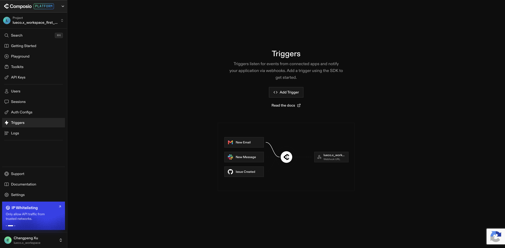
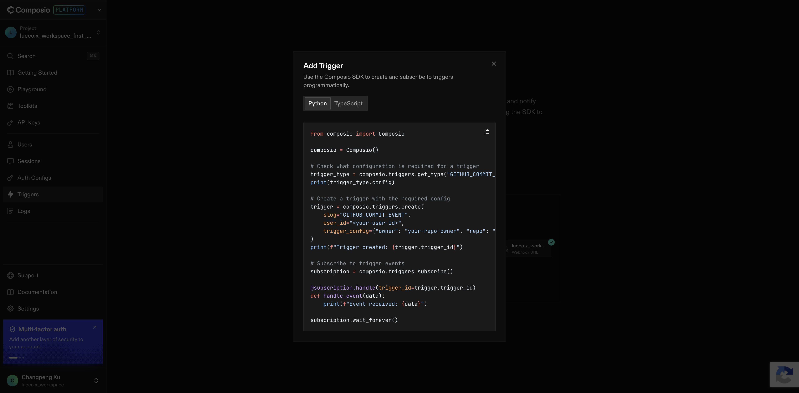
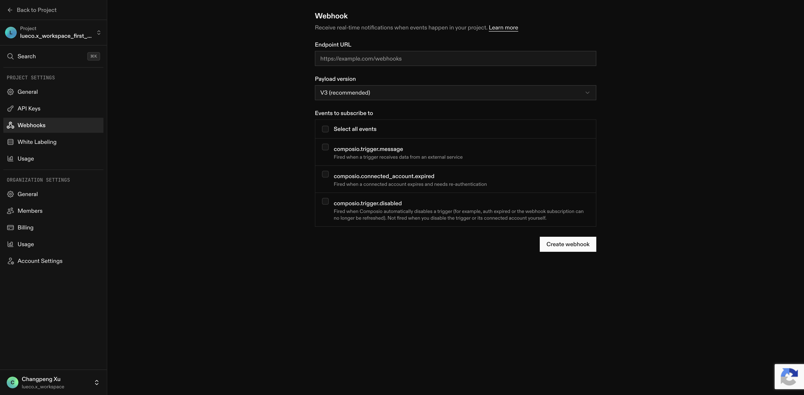

### 判断

- **判断**：Composio 的主动事件模型是 Trigger Instance → Project Webhook，
  不是 Agent 自己长期轮询 provider。
- **判断**：当前 Trigger UX 明显偏开发者，控制台更多承担发现和代码生成，不承担
  完整 no-code 运维。

## Step 21：组织、项目安全与数据保留

### 页面事实

- Organization 邀请角色默认 Developer，可选 Developer、Admin、Viewer。
- Project General 显示 MFA 要求开启、MCP 需 API Key。
- Log storage 可选 `Store all logs` 或 `Don't store data`；未见字段级 masking、
  retention duration 或按 toolkit 的差异策略。
- White Labeling 可定制 OAuth 连接页 App Title 与 Logo；使用 Managed OAuth 时
  仍显示 `Secured by Composio`，自有 OAuth credentials 才能去除。

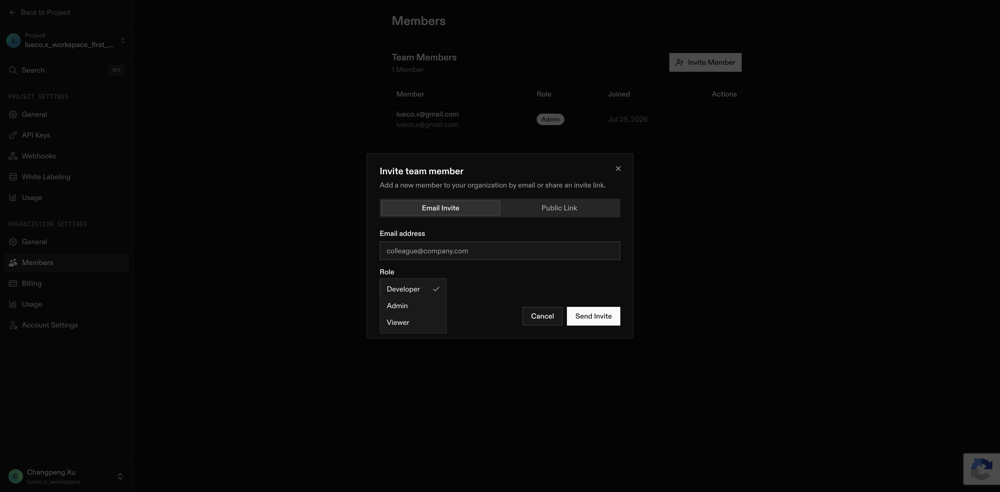
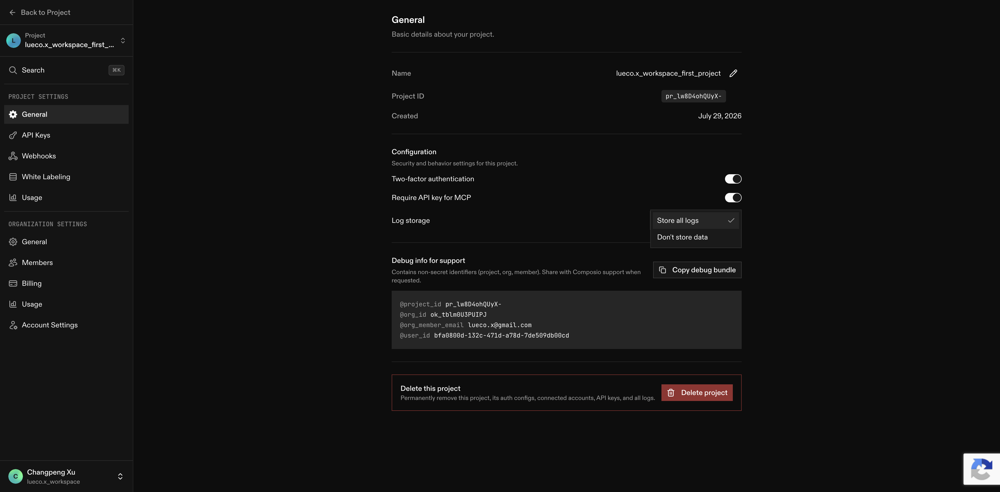
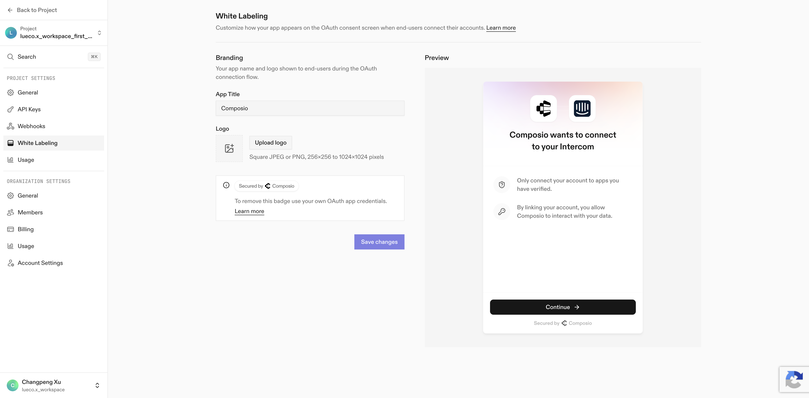

内部截图 `39-project-security-settings-sensitive.png` 包含账号标识，只保留在受控
Vault，不作为外部引用。

### 权限模型汇总

1. Composio account / Organization role：谁能管理组织资源；
2. Project：Agent 集成、日志和连接的生命周期边界；
3. Project API Key scope / IP allowlist：服务端调用者能读写哪些资源；
4. Auth Config OAuth scopes：Composio 对 provider 可申请什么；
5. Execution Allowlist：已连接 provider 中允许调用哪些 tools；
6. User / Connected Account：业务用户与具体 provider 账号的归属；
7. Session：一次 Agent 运行上下文、toolkit 配置和日志；
8. FOR YOU Enhanced Control：MCP client 运行时是否需要用户批准具体 action。

这些层互补，不能把任何一层简化成“一个共享 OAuth token”。

## Step 22：Usage 与 Billing

### 页面事实

- 本轮 Usage 显示 4 次 tool calls、2 sessions、1 active user，Top Apps 为
  GitHub 与 Composio。
- Premium categories 单列 Search、Browser、AI/ML、Data extraction、
  Document processing、Sandbox。
- 2026-07-29 页面显示并提示 8 月 15 日价格将调整：
  - Hobby：$0/月，20,000 calls；
  - Starter：$29/月，200,000 calls；
  - Growth：$229/月，2,000,000 calls；
  - Enterprise：custom，含 SLA/on-prem 等。

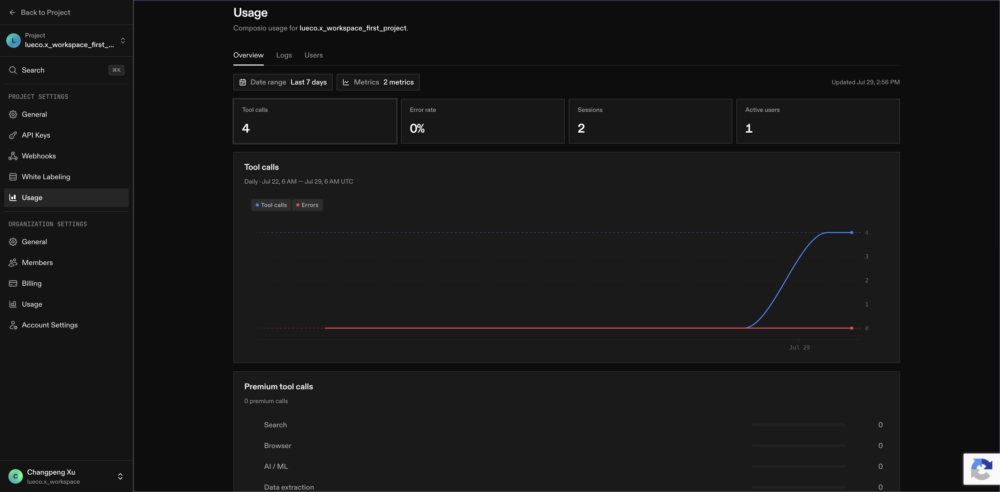
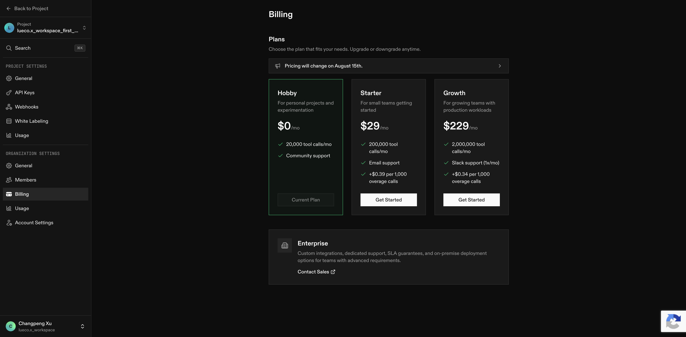

价格是时间点事实，不应作为长期不变规格。

## Step 23：FOR YOU 产品面

### 页面结构

FOR YOU 面向“给现成 AI client 接工具”的最终用户：

- Home 聚合 connected apps、client 安装、CLI/MCP 入口与 recent activity；
- Connect Apps 管理个人 GitHub、Notion、Slack 等连接；
- Install 覆盖 Claude/Cowork、Claude Code、Codex、ChatGPT、Cursor、OpenClaw、
  Notion、Gemini CLI、VS Code、Devin、OpenAI Agent Builder、n8n 等；
- Sessions & API Key 提供 consumer key 与 MCP OAuth client 管理；
- generic MCP endpoint 为 `https://connect.composio.dev/mcp`。

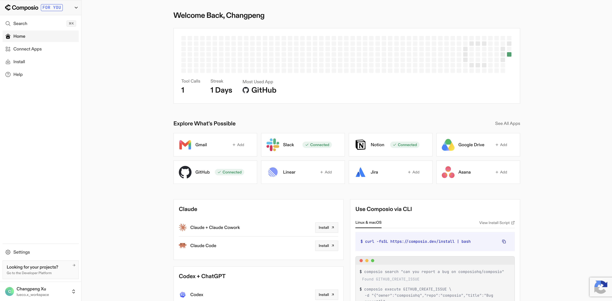
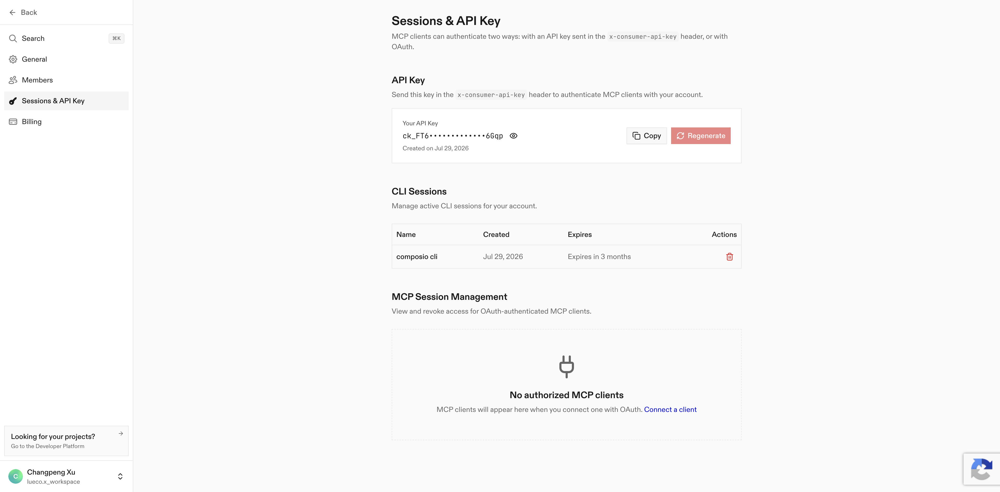
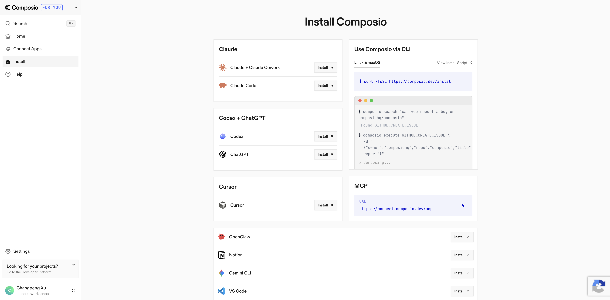
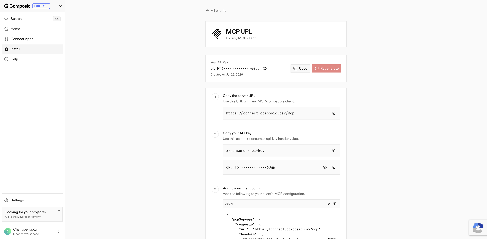

### Enhanced Control

- Beta 功能，默认关闭。
- 可按 toolkit 设置 freely allow、每 session 询问、锁定 destructive action。
- 策略随 MCP session 下发，依赖 client 支持 MCP elicitation。
- 支持 Claude Code、Codex、Cursor 及其 CLI；不支持 Claude.ai、ChatGPT.com。

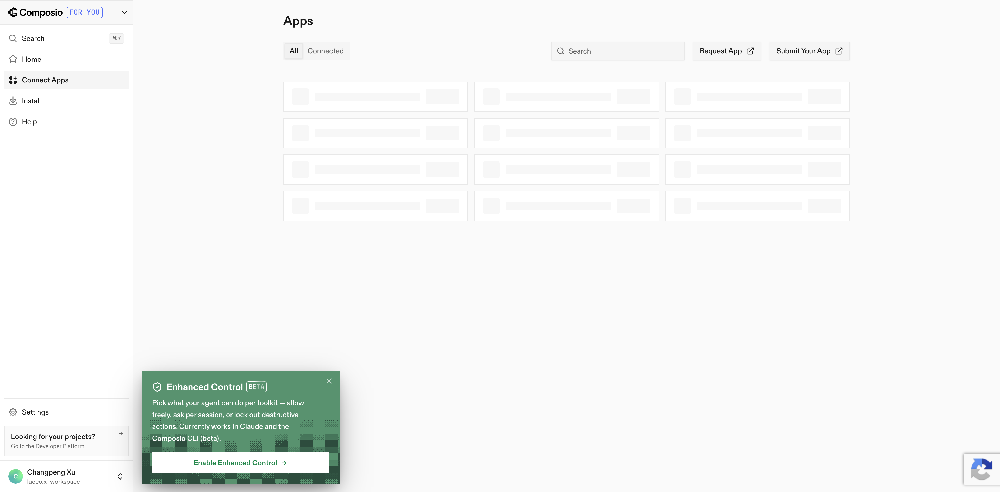
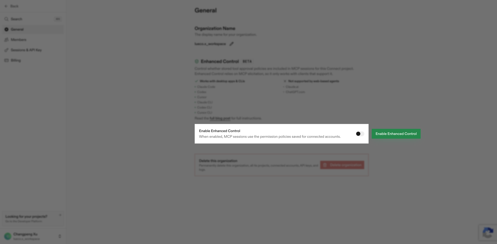

### Connected Apps

- GitHub、Notion、Slack 各有 1 个 Active connection。
- GitHub detail 提供 Reconnect、Connect another account、delete 和
  `Available Tools (893)`。
- Enhanced Control 关闭时，该页只展示工具目录，不提供可见的逐工具策略编辑。

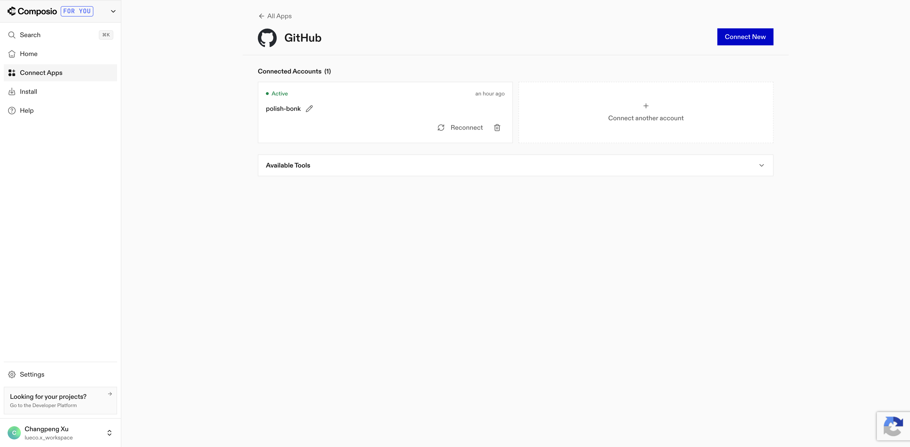
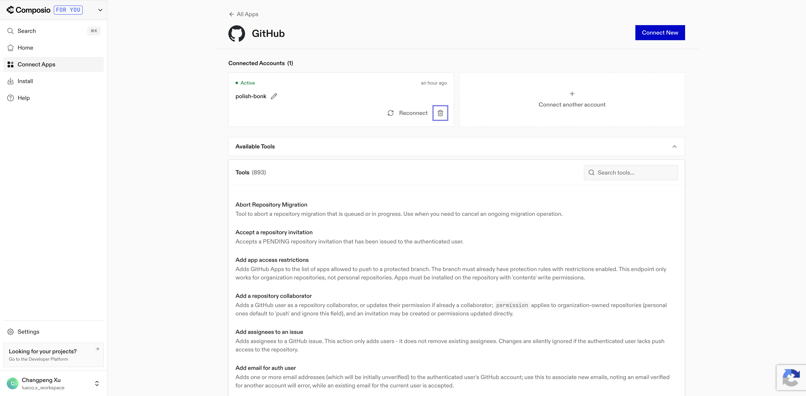

## Step 24：FOR YOU 与 PLATFORM 的真实隔离

### 实测

- FOR YOU onboarding 中已有 GitHub、Notion、Slack。
- 创建 Platform Session 时，GitHub initially reported no active connection；
  必须为 Platform User 单独 OAuth。
- Native 与 MCP 可共同复用这个 Platform User 的 GitHub connection。
- 删除 Platform Auth Config 后，关联 Platform User/Connected Account 消失。
- 回到 FOR YOU，GitHub、Notion、Slack 仍显示 Connected。

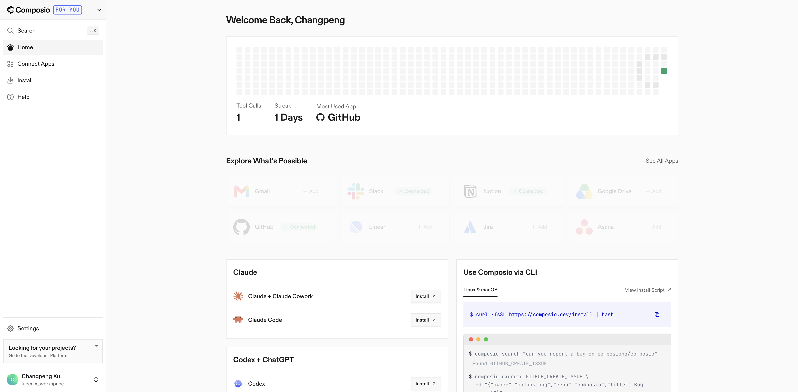

### 结论

产品存在两条需要明确区分的轴：

1. **产品面**：FOR YOU vs PLATFORM；
2. **Agent 工具交付模式**：Native Tool vs MCP Server。

FOR YOU 与 PLATFORM 不是同一连接池的两种皮肤；本轮证据显示它们至少对
Connected Account 和 client credential 采用不同归属。Native/MCP 则共享
Platform 的 Project/User/Connection substrate。

## Step 25：生命周期、撤销与清理

### 实测

1. 用 scoped Key 删除两条临时 Session，成功；
2. 同一 Key 尝试删除 Connected Account，因没有该 write scope 返回 403；
3. 从控制台删除 Managed Auth Config，关联 Platform User/Connected Account 消失；
4. 撤销临时 Project API Key，控制台提示使用该 Key 的 Agent/Integration 会立即失效；
5. 撤销后再次创建 Session 返回 401 `Invalid API key`；
6. 删除本地临时 Key 文件；
7. API Keys 页面回到空状态。

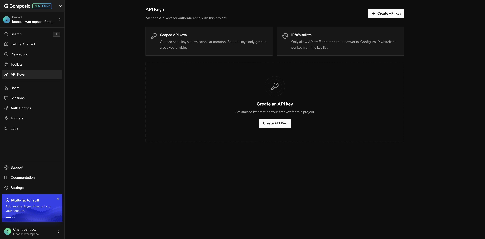

### UX 缺陷

- Auth Config 和 API Key 删除成功后，确认弹窗没有自动关闭，名称变成空字符串；
  刷新页面后状态正确。
- 页面数据有时需要手动刷新才能从空列表/旧列表切换到后端真实状态。

## 产品设计总结

### Composio 真正卖的对象

Composio 不是单纯的 OAuth Token 仓库。它卖的是一个 **Agent action
infrastructure**：

- 用 Toolkit/Tool schema 统一不同 SaaS API；
- 用 Auth Config/Connected Account 代管 provider 认证；
- 用 User/Session 把连接放进业务运行上下文；
- 用 Native SDK 或 MCP 把动作交给 Agent；
- 用 Logs/Usage/Triggers/Webhooks 承担运行、观察与事件入口；
- 用 Project/API Key/Organization/Enhanced Control 分层控制谁能调用什么。

### 核心 UX 路径

`选择消费/开发模式 → 连接应用或创建 Project → 建立 client credential →
创建 User/Session → 缺连接时 OAuth → 搜索 Tool → 执行 → 日志/用量 →
触发器/Webhook → 撤销/清理`

### 做得好的地方

- 把 provider OAuth、Agent client 登录、Project API Key 分层；
- Native/MCP 共用底层模型，减少两套后端；
- User ID 可由业务系统直接提供，接入门槛低；
- 无连接时在 Session 内按需授权，执行后可复用；
- scopes、tool allowlist、runtime approval、IP allowlist 各自独立；
- Dashboard 能从 User、Session、Connected Account、Tool Log 多方向追踪；
- onboarding 以业务角色和 client 驱动，降低 1,000+ toolkit 的发现成本。

### 主要问题与风险

- FOR YOU 与 PLATFORM 的关系解释不足，用户容易误以为连接天然共享；
- CLI human session 的跨组织/跨项目授权很宽；
- Project Key scope 仍偏资源级，未见 tool/account/user 级限制；
- Managed GitHub OAuth scopes 与空 allowlist 默认都较宽；
- Enhanced Control 依赖 client 能力，ChatGPT.com/Claude.ai 不支持；
- Playground 不自动带入 User context，出现“有连接但找不到连接”；
- Tool count、card/chart/列表状态存在控制台内部不一致或刷新延迟；
- 日志和工具返回可能暴露远超业务需求的 provider 私有字段；
- Trigger 仍是 SDK-only，非开发者运维成本高；
- 删除成功后的 stale dialog 是明确的完成态反馈缺陷。

## 最终回答用户原始理解

“一份 OAuth token 通过 Composio 被多个 Agent 同时使用，省掉多个 Agent 反复认证”
只对了一部分。更准确的表达是：

> Composio 为每个 provider 账号维护 Connected Account。被授权的 Agent Session
> 可以复用该连接，不必每次重新 OAuth；是否允许多个 Agent/用户共享，由产品面、
> Project、User、connection type、API Key scope、tool allowlist 与运行时批准策略
> 共同决定，默认不能假设全局共享。

本轮已真实证明：

- FOR YOU 已连接应用可被 CLI 直接调用且不重复 OAuth；
- Platform 同一 User 的 Native 与 MCP Session 可复用同一 GitHub connection；
- FOR YOU 与 PLATFORM 的连接不能自动互用；
- Key 无 Connected Account write 时删除会被服务端拒绝；
- Session、Auth Config、Connected Account 与 API Key 都有可验证的撤销生命周期。

## 仍未知

- Composio 后端 token 的加密、刷新与密钥轮换实现；
- shared connection ACL 的正式稳定性、UI 与审计体验；
- 高并发多 Agent 同时使用同一 connection 时的锁、配额与冲突行为；
- Enterprise on-prem 的实际边界；
- Enhanced Control 对每个 destructive tool 的默认分类质量；
- webhook delivery retry、signature、dead-letter 与顺序保证；
- provider OAuth scope 缩减后对 893 个 GitHub tools 的可解释影响。
