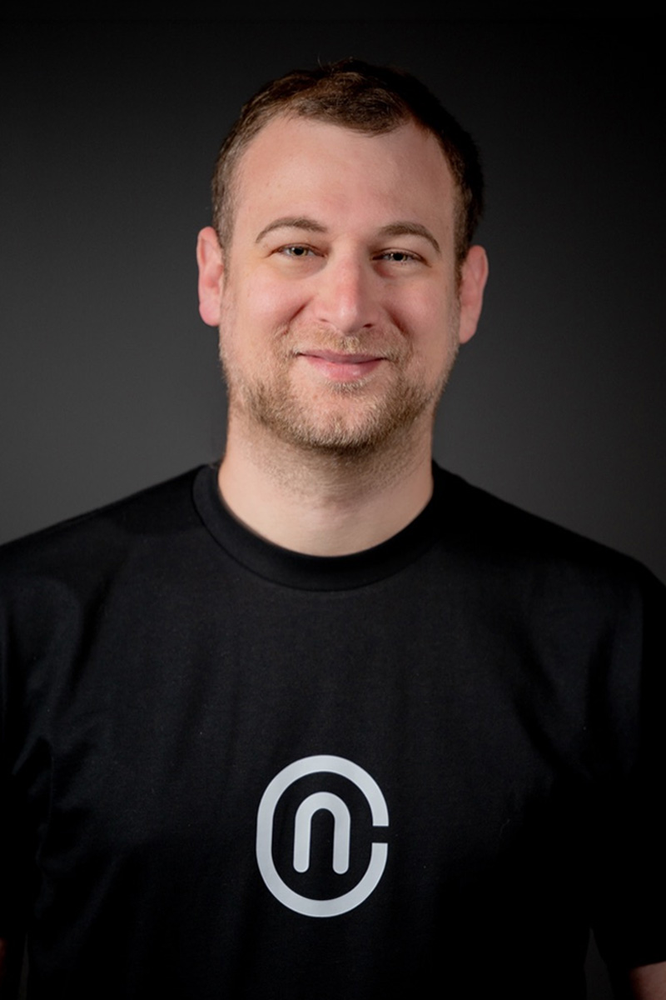

[[company.newcore]] 联合创始人兼 CTO，负责安全架构与 Agent 授权方向。

- NewCore 官方称其曾创办 Nym Health，是 applied AI 创业者。
- 曾任以色列 Unit 8200 研究负责人，并有长期 offensive security 研究背景。
- 2026-06-24 代表 NewCore 解读 MCP Enterprise-Managed Authorization（EMA），主张把 MCP 授权重新集中到企业 IdP，并进一步扩展为 Agentic SSO、task-scoped token、inventory 与 machine-speed control。
- 2026-07-15 抓取 LinkedIn 时约 7530 位关注者；公开 headline 仍显示 stealth，说明个人资料可能滞后。

他的公开观点是 NewCore 产品方向的重要一手材料，但其中“100 倍身份数量、100 倍事件量、人类活动低于 1%”属于公司预测，不是独立统计事实。[[source.newcore.launch-66m]] [[source.newcore.ema]] [[source.linkedin.amihai-neiderman]]
