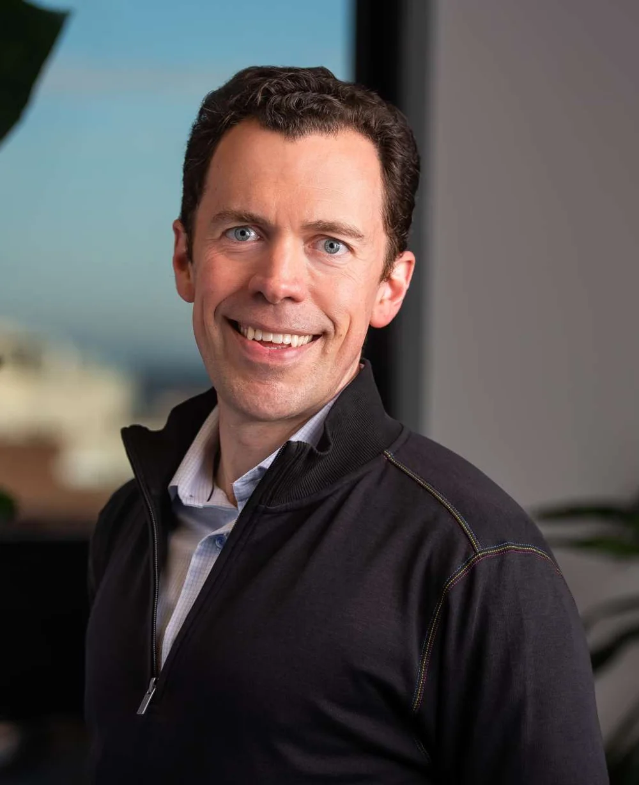

# Bill Trenchard

First Round Partner，能力圈偏企业软件、基础设施与公司扩张。官方资料强调他的创业和运营背景，其中 LiveOps 曾发展到约 1 亿美元销售额。这让他在机构内部更适合判断 enterprise go-to-market、组织建设和从早期产品走向规模化的路径。

官网 AI portfolio 把 Together AI、[[company.serval]]、Assort Health、Dyna、FleetWorks 等归到 Bill 名下。组合覆盖模型基础设施、企业服务、医疗和物流，交集不是单一行业，而是 AI 如何进入真实业务流程并形成可交付系统。

Bill 的组合也是 First Round 并非只投“轻量 AI 应用”的反证：Together AI 代表基础设施，Serval 等则代表企业执行层。公开 portfolio attribution 能说明负责关系，但没有披露每笔交易的 lead、board seat、持股或资金金额。

- 官方资料：[[source.first-round-profile-bill-trenchard]]
- X：[btrenchard](https://x.com/btrenchard)
- LinkedIn：[Bill Trenchard](https://www.linkedin.com/in/billtrenchard)
