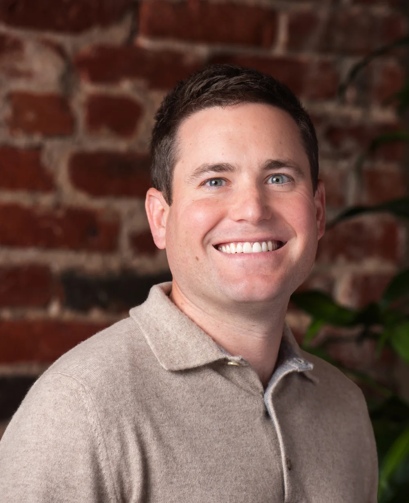

# Brett Berson

First Round Partner，也是机构产品化能力的重要设计者。官方介绍称他在 First Round 已超过 15 年，并参与建立 First Round Review、Angel Track 等项目。这使他的角色同时覆盖投资与机构建设：一边选择公司，一边把 founder knowledge、内容和早期投资人社群做成持续资产。

官网 AI portfolio 将 [[company.clay]]、SafetyKit、Laurel、Andrenam 等归到 Brett 名下。其组合公开样本不算最大，但 Clay 显示他对产品驱动增长、数据与 GTM 软件的长期关注。

从研究角度，Brett 最值得关注的不是“投了哪些明星公司”，而是他如何连接 [[concept.content-community-dealflow-loop]]：The Review 形成知识入口，Angel Track 形成早期投资人网络，再反哺创始人发现、判断与服务。公开材料能证明这些项目由机构持续运营，尚不能证明它们具体贡献了多少 dealflow 或投资回报。

- 官方资料：[[source.first-round-profile-brett-berson]]
- X：[brettberson](https://x.com/brettberson)
- LinkedIn：[Brett Berson](https://www.linkedin.com/in/brett-berson-9986094)
