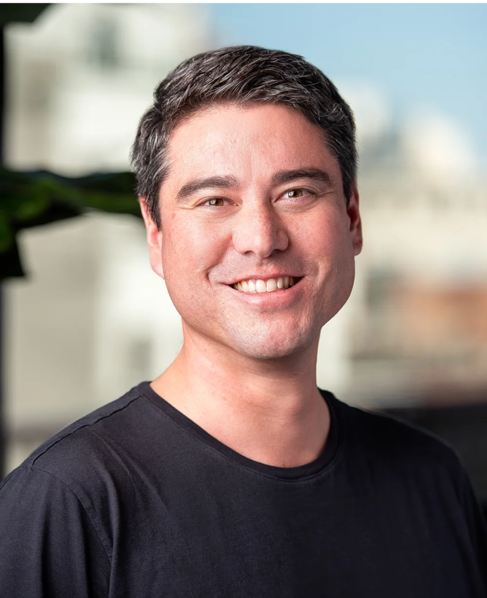

# Todd Jackson

First Round Partner，产品与 product-market fit 是他的主要能力圈。加入投资行业前，他在 Google、Facebook、Twitter 和 Dropbox 从事产品工作，也创办过 Cover。这样的履历使他更适合评估产品行为、用户需求与产品团队，而不是只从技术新颖性判断公司。

First Round 官网在 AI 组合中把 fal、[[company.parallel]]、[[company.ploy]]、Town、Actively、Artemis 等归到 Todd 名下。这里既有开发者基础设施，也有面向业务团队的应用产品，较一致的线索是：产品能否把新技术变成高频、清晰、可交付的工作流。

他也是 [[concept.earliest-stage-venture-operating-system]] 中 PMF 能力的重要承载者。不过公开页面没有披露他在具体项目中的投票权、board role 或实际投后投入，partner attribution 只应理解为官方归属，不应扩写成独立决策人。

- 官方资料：[[source.first-round-profile-todd-jackson]]
- X：[tjack](https://x.com/tjack)
- LinkedIn：[Todd Jackson](https://www.linkedin.com/in/toddj0/)
