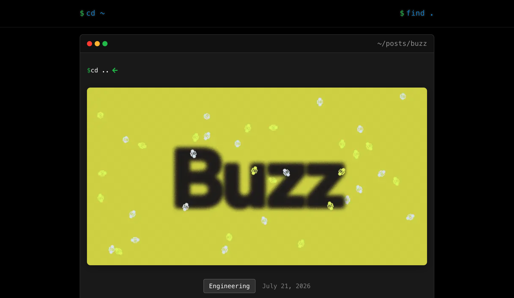

# Block Engineering: Buzz

Tyler Longwell 解释 Buzz 的内部起点：Block 先做过 Slack-integrated agent，但私人 agent session 导致决策和上下文看不见，团队协作反而变慢。Buzz 将 people、agents、repos、decisions、signed events 与 Git hosting 放在一个 channel-driven workspace。

文中给出几项关键实现叙述：agent 可拥有独立 key 和 owner-signed authorization；ACP 连接不同 agent harness；agent 可在本地、云或 edge 运行；Buzz Mesh 允许社区成员共享 GPU；Git 使用 immutable content-addressed packfiles 与可 CAS 更新的 manifest pointer，并以 TLA+ 建模。

Block 明确称内部已使用 Buzz，并声称更容易、更快、更有效，文章和 Buzz 本身都在 Buzz 中协作完成。该说法是强一手内部使用证据，但没有公开用户数、团队覆盖率、对照实验或 ROI，因此不能升级成规模化成效。

文章也直接承认 Buzz 仍很早，存在 rough edges 和“愿景与现状之间的巨大缺口”。

