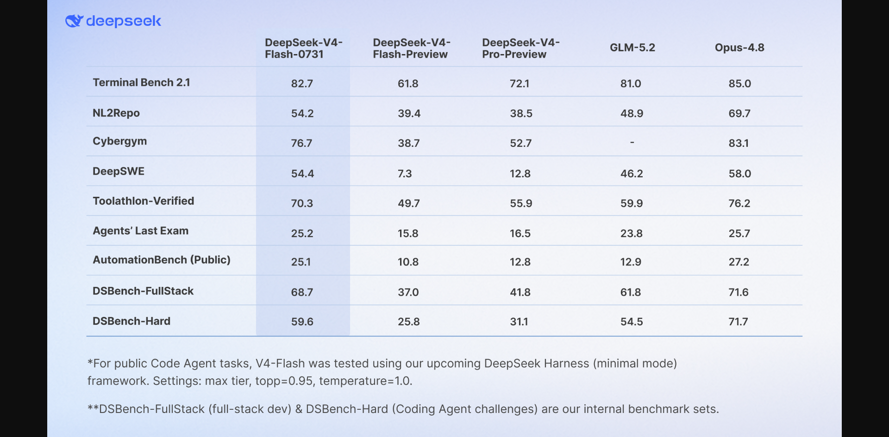

# DeepSeek-V4-Flash-0731 官方发布

DeepSeek 于 2026-07-31 06:56:41 UTC 在 X 宣布 DeepSeek-V4-Flash-0731 Official API，并在官方 changelog 中将其描述为 V4 Flash 正式版的 public beta。

官方披露：

- API 模型名仍为 `deepseek-v4-flash`，会自动使用最新版本；
- 新版沿用 Preview 的架构和规模，只重新做 post-training；
- 支持 Responses API、Codex，以及 thinking / non-thinking；
- 官方公布 9 项 agent benchmark，但 Code Agent 部分使用尚未发布的 DeepSeek Harness、minimal mode、max effort、temperature=1.0、top_p=0.95；
- DSBench-FullStack 与 DSBench-Hard 是内部评测集。

这是一手发布事实，可支持型号、时间、API 状态和官方 benchmark 口径；不能独立支持真实用户质量、生产稳定性或跨模型全面领先。

直接来源：

- https://api-docs.deepseek.com/updates/
- https://x.com/deepseek_ai/status/2083084415157022911

