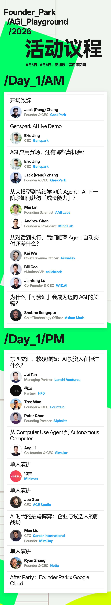
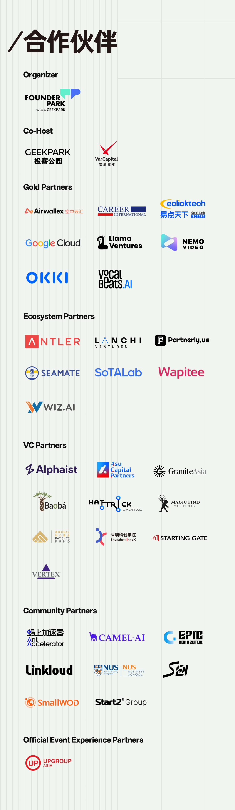

# AGI Playground 2026 公开议程原图

- 转引页：https://hub.baai.ac.cn/view/56237
- 原内容署名：极客公园 / Founder Park
- 核验时间：2026-08-03
- 证据等级：S2（智源社区转引活动方议程原图）

Day 1 议程原图明确列出：

- Eric Jing，CEO，Genspark；
- Kai Wu，Chief Revenue Officer，Airwallex；
- Bill Cao，zMaticoo VP，eclicktech；
- Jianfeng Lu，Co-Founder & CEO，WIZ.AI；
- Ang Li，Co-Founder & CEO，Simular；
- MiniMax 演讲人仍标为“待定”；
- Joe Guo，CEO，ACE Studio；
- Ryan Zhang，Founder & CEO，Notta。

合作伙伴原图另确认 Airwallex、eclicktech 为 Gold Partners，WIZ.AI 为 Ecosystem Partner。合作伙伴身份不能升级为客户、投资或产品合作事实。

