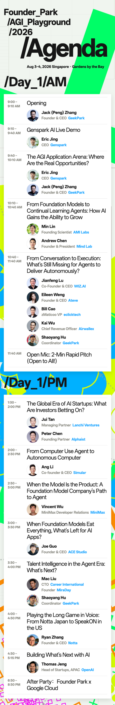

# AGI Playground 2026 官方活动页与 Pocket Kit

- 活动页：https://luma.com/n9r72dc9
- Pocket Kit：https://pocketkit-agi2026.founderpark.net/
- 核验时间：2026-08-03
- 证据等级：S1（活动方公开页面）

活动页确认 AGI Playground 2026 于 2026-08-03 至 08-04 在新加坡 Gardens by the Bay 的 Flower Field Hall 举行，主题为 `Go Action` 与 `Go Physical`，现场形式包括主舞台、Workshop、Founder Show、Booth & Mix 和 side events。

Pocket Kit 只提供 Agenda、实时字幕和照片流入口，没有公开完整 speaker/company roster。活动页显示的参会人数和品牌露出不能证明某个具体人已到场，也不能证明合作、客户或投资关系。

## 2026-08-03 议程素材增量

Luma 活动页当前嵌入的 Founder Park Day 1 官方议程原图明确显示，10:40-11:40 圆桌 `From Conversation to Execution: What's Still Missing for Agents to Deliver Autonomously?` 的嘉宾包括：

- Jianfeng Lu，Co-Founder & CEO，WIZ.AI；
- **Eileen Weng，Founder & CEO，Ateve**；
- Bill Cao，zMaticoo VP，eclicktech；
- Kai Wu，Chief Revenue Officer，Airwallex；
- Shaoyang Hu，Coordinator，GeekPark。

因此，先前基于转引版议程图得出的“Ateve 未出现在公开议程”结论已被当前 Luma 官方素材纠正。议程仍只能证明活动方公开安排，不能证明本人已经签到。

