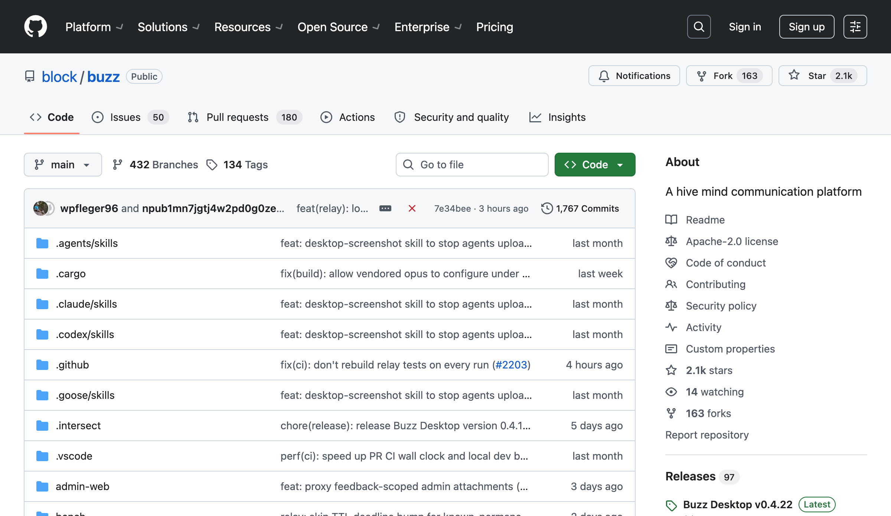

# block/buzz repository snapshot

截至 2026-07-22，公开仓库采用 Apache-2.0，GitHub 页面约显示 2.1k stars、163 forks、14 watching、41 contributors。仓库主分支约 1,767 commits；2026-03 初始提交后，主分支月度提交数约为 3 月 171、4 月 198、5 月 306、6 月 472、7 月截至 22 日 620。

公开主分支 top Git authors 中，Wes 531、Will Pfleger 353、Tyler Longwell 两个可确认 alias 合计 345、Kenny Lopez 109、Renovate 96、Thomas Petersen 66、Taylor Ho 52、Bradley Axen 39。作者 alias、bot 和内部生成身份很多，不能把 raw shortlog 当真实团队人数；GitHub 的 41 contributors 也只代表公开 repo 贡献者，不等于 Block 内部 Buzz 团队规模。

代码横跨 Rust relay/core/auth/db/search/audit/media、Tauri/React desktop、Flutter mobile、web client、buzz-cli、ACP harness、MCP server、workflow、Git/Nostr interop。仓库 README 明确写出 Block 内部构建链和 internal relay/provider。

2026-07-22 当前 desktop release 为 v0.4.22，releases page显示密集版本迭代。媒体发布时曾写“百余 stars”，同日已增至约 2.1k，说明 launch attention 快速变化，不能把单一时点 stars 当稳定采用指标。

