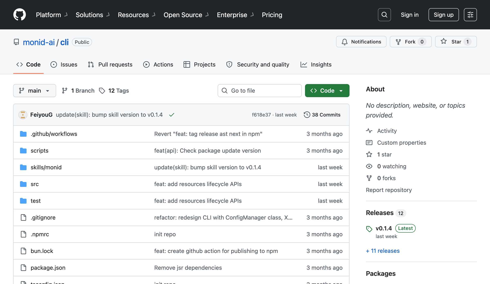

# monid-ai/cli repository snapshot

2026-07-22 GitHub 页面显示：

- public repo `monid-ai/cli`；TypeScript 100%。
- 12 releases；latest `v0.1.4`。
- repo 包含 `src`、`test`、`skills/monid`、GitHub workflows。
- `package.json`：package `@monid-ai/cli`，MIT，Node `>=20`，bin=`monid`，用途为 discover/inspect/run data endpoints。

证据边界：证明公开代码与 release surface 存在；不等于大规模采用、生产稳定或安全审计。GitHub API 本轮因共享 IP rate limit 未能补充精确 stars/forks/commit count，因此不制造这些字段。
