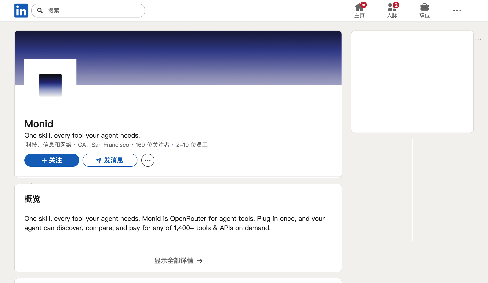

# Monid LinkedIn company profile

2026-07-22 登录态页面显示：

- 名称 Monid；定位 “One skill, every tool your agent needs.”
- 行业：科技、信息和网络。
- 地点：San Francisco, CA。
- 公司规模：2-10 employees。
- 169 followers。
- 简介仍写 1,400+ tools，与官网/API 的 2,143 endpoints 不同；这更像简介未同步，不应混成同一时间点。

证据边界：S1 公司自填 profile。员工数是 LinkedIn range，不是审计 headcount。
