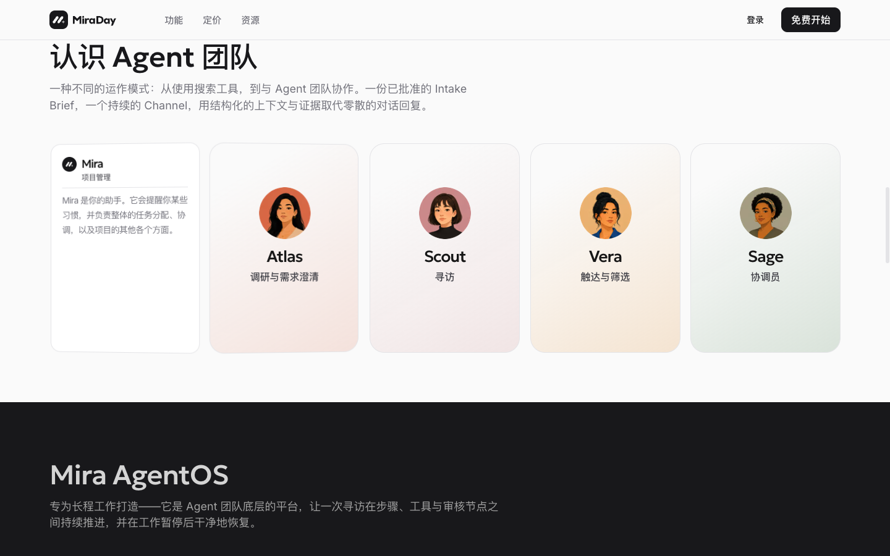
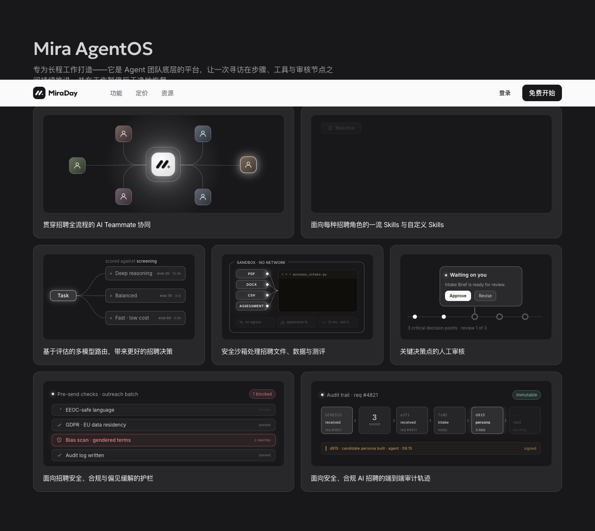
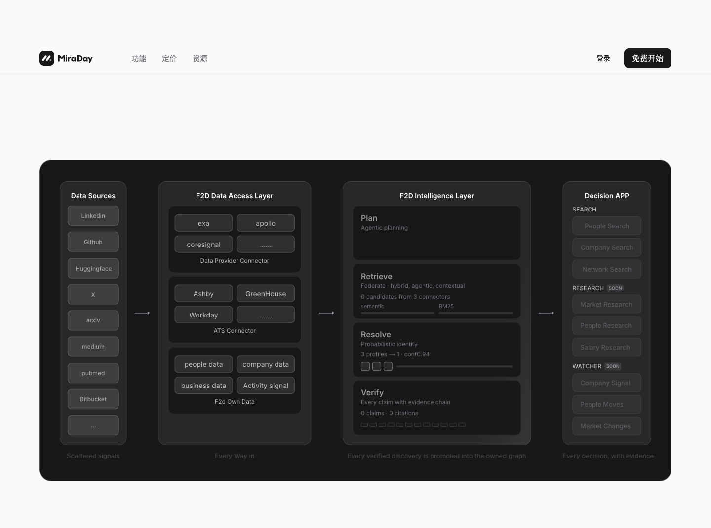

# MiraDay Homepage

采集时间：2026-08-03。

官网将 [[company.miraday]] 定义为面向高管、技术和业务关键岗位的 Agent 招聘团队，第一目标用户是猎头/高管搜寻机构，也适用于企业内部关键岗位招聘团队。主流程为：创建 Channel、生成并人工批准 Intake Brief、Scout 跨源寻访、生成带来源的 Evidence Brief、人工审阅 Talent Pool。

公开角色：Mira（项目管理）、Atlas（调研与需求澄清）、Scout（寻访）、Vera（触达与筛选）、Sage（协调）。官网明确 Sage 尚未上线；ATS、WhatsApp、部分语音能力也写为即将上线或未来支持。

底层公开叙事包括 Mira AgentOS 和 F2D 数据基础设施。AgentOS 强调长程任务、Skills、多模型路由、沙箱、人工审核、护栏和审计；F2D 强调跨公开来源、数据供应商、上传文件和未来 ATS 的检索与身份解析。

法律线索：页脚版权为 `Forward AI Labs, Inc.`，地址为 Sunnyvale。官网同时明确功能、时间线和可用性可能变化，并写明其仍在准备相关审计、推进 EU AI Act 合规，不能表述为已获得合规认证。

截图：

