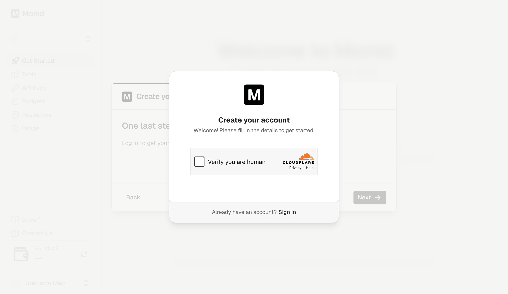
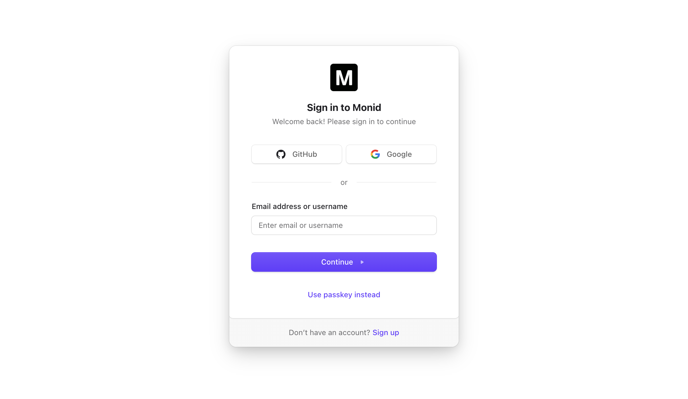

# Monid account onboarding and Cloudflare challenge

2026-07-22 在用户授权的 `pinixc browser` default profile 中：

1. 选择 Codex 作为 agent。
2. 页面要求向 Codex 发送 `set up https://monid.ai/SKILL.md`。
3. 注册入口支持 GitHub、Google 和 email/password。
4. 点击 Google sign-up 后出现 Cloudflare `Verify you are human`。
5. 后续页面明确提示 CAPTCHA failed to load，可能由 unsupported browser 或 browser extension 导致。
6. 按人机验证边界停止；未关闭扩展、换浏览器、脚本绕过或重复创建账号。

证据边界：partial。确认 onboarding 与 auth surface，并确认当前 default profile 的 CAPTCHA 兼容性失败；尚未验证 `$1` credit、API key、budget、真实 run、扣费、失败不扣费或退款。
