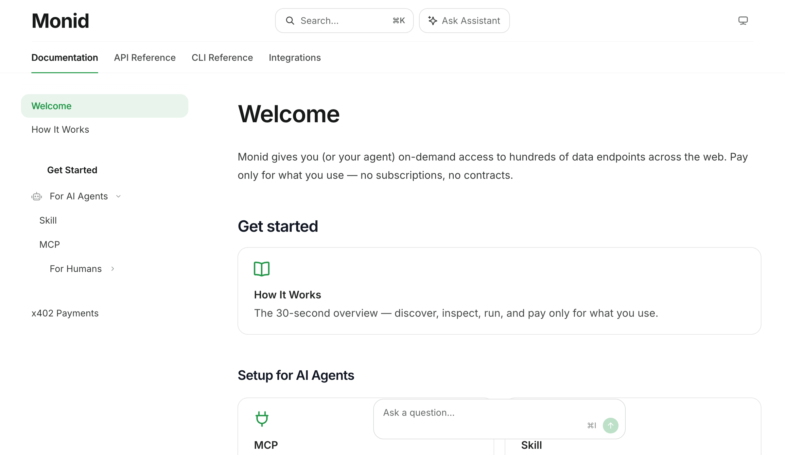

# Monid documentation index and runtime contract

官方 Docs index 和 `llms.txt` 列出：

- API：whoami、workspaces、discover、inspect、run、get/list/stop runs、wallet balance/activities。
- 接入：Skill、remote MCP、CLI、HTTP API。
- 产品集成：OAuth、direct master API key、own proxy。
- x402：可用 USDC 按 run 付款；公开支持 Base mainnet 与 Monad mainnet。discover/inspect 仍需 API key；x402 execution 用 wallet。
- pricing：prepaid wallet，per-call 或 per-result；discover/inspect/run response 显示价格。

证据边界：S1 contract/documentation。未验证所有接口可用、schema 完整、OAuth 审核、volume discount 或链上结算成功率。
