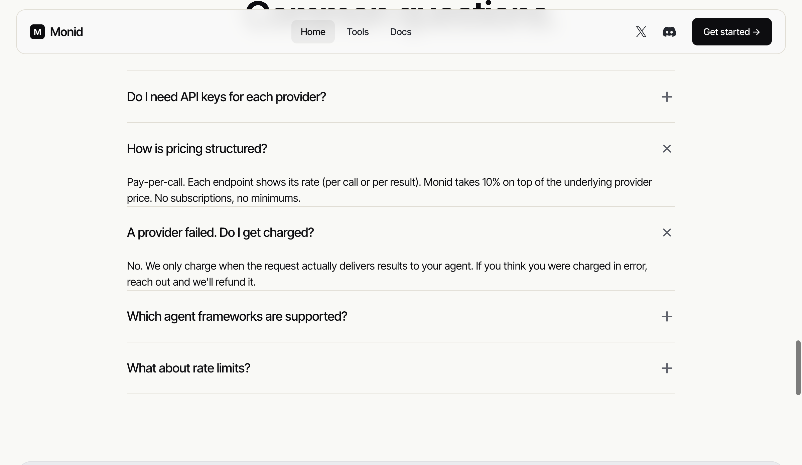

# Monid homepage and FAQ

2026-07-22 通过 `pinixc browser` default profile 读取并截图。

页面主张：

- “Connect your agent to every tool it needs.”
- 2,143 tools / 24+ providers；统一 registry 与 balance。
- Agent 自行 discover、compare、run；支持 Skill、MCP、CLI。
- `$1` free credit。
- 定价是 provider price 上加 10%，无订阅、无最低消费。
- FAQ 声称只有结果实际交付才收费；误扣可联系客服退款。
- 公司页脚为 Monid Inc、Delaware C-Corp、San Francisco、v0.1.0。

证据边界：S1 官方产品主张。不能单独证明 endpoint 质量、采用、退款实际执行或公司注册状态。
