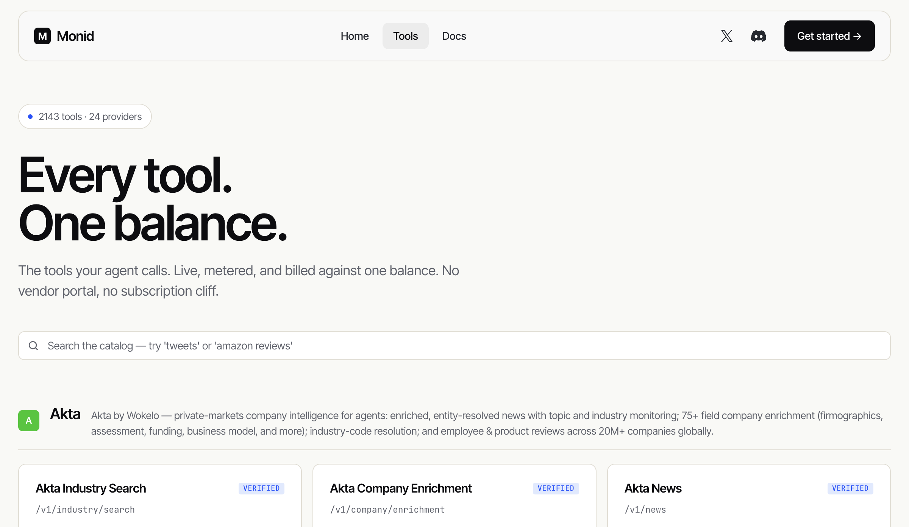

# Monid public API catalog stats and providers

2026-07-22 公开 API：

- `/public/v1/stats` 返回 `endpointCount=2143`、`providerCount=24`。
- `/public/v1/providers?limit=50` 返回全部 24 个 provider 及 endpoint count。

主要 provider：TikHub 1,429；Strale 269；BlockRun 112；Semrush 96；DefiLlama 44；Apify 41；Kadec 36；Heurist Mesh 35；Saperly 17；EMC2 17；Apollo 8；Akta 6；PDL/Suzanne/X402 Atlas 各 4；其余更少。

机械 QA：

- 所有 provider endpoint count 合计 2,143，与 stats 一致。
- TikHub 占 `1429/2143=66.68%`。
- 前四家合计 `1906/2143=88.94%`。

证据边界：这是目录条目数，不是独立 vendors、成功调用数、用户数、收入或可用性。一个 provider 可贡献大量 endpoints。
