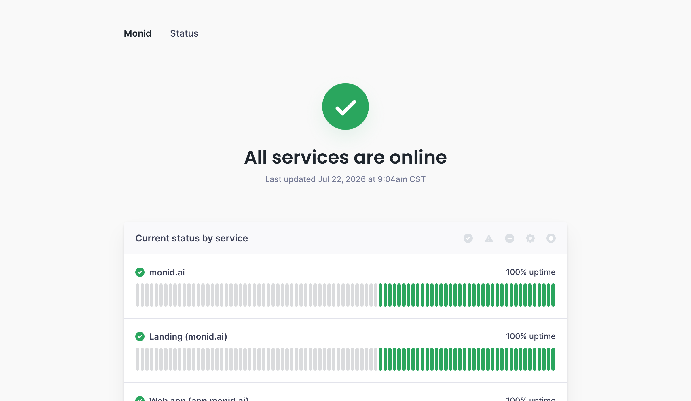

# Monid public status page snapshot

2026-07-22 页面显示 All services are online；Landing/Web app 为 100% uptime，API 为 99.622% uptime。

证据边界：页面未清楚显示统计窗口和完整 incident history，因此 `quality=partial`。不能把当前 green 状态当长期 SLA。
