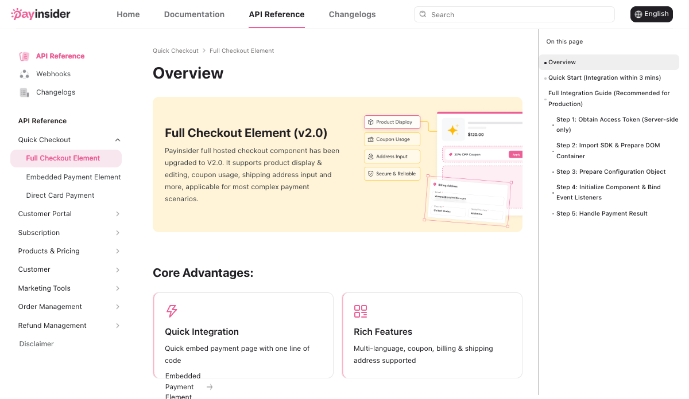

# PayInsider API Reference v2.0

公开文档当前显示 v2.0。Hosted Checkout 页面给出服务端 access token endpoint `POST /router/checkout/accessToken`、前端 SDK 与嵌入式 Checkout 流程。

文档导航覆盖 Full Checkout Element、Embedded Payment Element、Direct Card Payment、Customer Portal、Subscription、Products & Pricing、Customer、Marketing Tools、Order、Refund 与 Webhooks，支持判断真实对象模型。

边界：部分示例将 production 注释与 sandbox URL 混用，个别代码显示疑似缺少引号；Connections 页面仍写 integrations coming soon。公开文档能证明 API 设计和实现面，不能证明所有宣称连接都已标准化可用。

URL：<https://docs.payinsider.com/Checkout/CheckoutIntegration/HostedCheckout>
