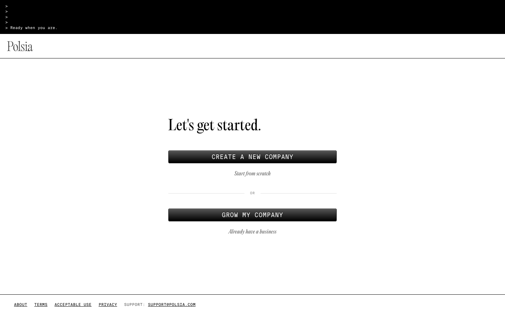
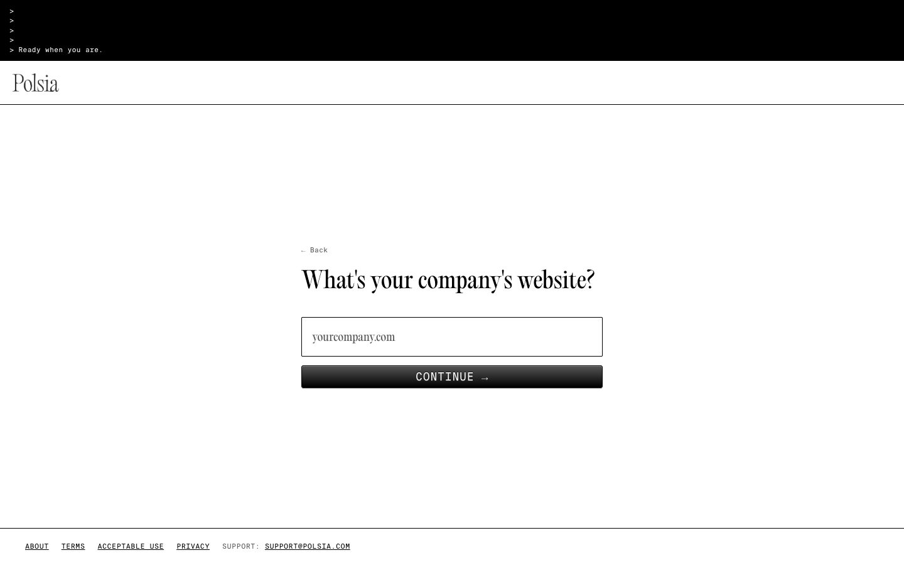

# Polsia onboarding 增量实测

2026-08-02 使用 `pinixc browser` default profile 从官网 `GET STARTED` 进入公开 onboarding，只读走到输入前停止，没有提交 idea、网站、账号或付款信息。

当前入口明确分为两种模式：

1. `CREATE A NEW COMPANY`：继续分为 `SURPRISE ME` 或 `BUILD MY IDEA`；后者首先要求输入创业 idea。
2. `GROW MY COMPANY`：首先要求输入现有公司的 website。

首页同时显示 `NO CREDIT CARD REQUIRED · FREE TO START`。这说明 Polsia 的公开获取路径已经不仅是从零生成公司，也正式接收已有公司；不能由入口本身推断后续迁移深度、免费额度、成功率或最终付费价格。

直接来源：https://polsia.com/new

