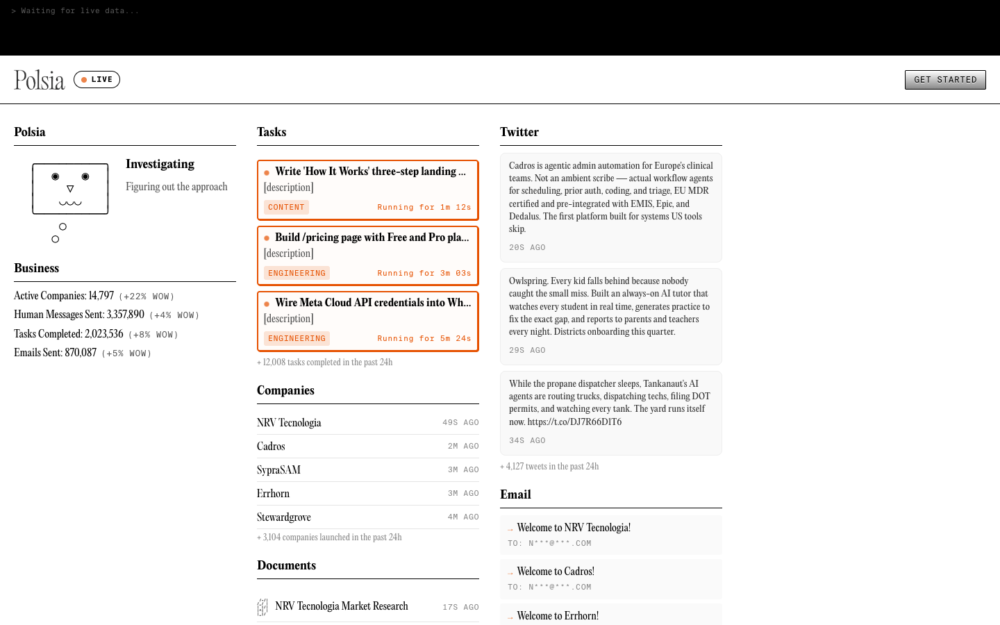

# Polsia public dashboard API 增量快照

2026-08-02T15:02Z–15:05Z 通过公开接口 `https://polsia.com/api/public/live/dashboard` 与 live 页面读取。以下均为 Polsia 官方自报、未审计数据。

## 当前 top-level stats

- headline run rate：`$9,367,764`
- subscription MRR：`$531,610.08`，年化约 `$6,379,321`
- 过去 30 天其他现金流：user company `$19,021.21`、instant packs `$93,235`、ad spend `$82,871.73`、boost `$49,343`、domains `$4,565.94`
- 其他现金流合计 `$249,036.88`，年化约 `$2,988,442.56`
- 两部分相加 `$9,367,763.56`，与 headline 四舍五入一致；订阅年化约占 headline 68.1%
- live top card：active companies `14,796`，total companies `267,540`
- cumulative tasks `2,023,533`、emails `870,080`、messages `3,357,854`

接口自身给出的 7 天前值：headline `$8,624,203`、active companies `12,167`、total companies `247,156`、tasks `1,874,564`、emails `832,076`、messages `3,214,463`。机械计算对应约 +8.62%、+21.61%、+8.25%、+7.95%、+4.57%、+4.46%。

## Daily metrics

`computed_at=2026-08-02T08:05:20.978Z`、`recorded_at=2026-08-01`：

- subscription MRR `$528,976`；字段 `arr=$6,347,713`，机械上等于订阅 MRR × 12，而不是 top-level 混合 headline；
- paying users `13,366`；active companies `14,734`；DAU `8,468`；
- trial-to-paid `10.3%`（`3,983/38,596`）；
- 30-day paid churn `55.3%`（`4,697/8,501`）；
- `daily_ai_cost=0`、`cost_per_task=0`、satisfaction `0/0`。这些零值与旧快照冲突，当前只能视为未填/不可解释，不能写成真实零成本或零满意度。

top-level 与 daily metrics 的 MRR、active companies 有小幅差异，最合理解释是采集时点不同；不挑选一个覆盖另一个。

## 与 2026-07-15 的可比变化

| 指标 | 2026-07-15 | 2026-08-02 | 机械变化 |
| --- | ---: | ---: | ---: |
| headline mixed run rate | $8.53M | $9.37M | +9.8% |
| subscription MRR | $422.9K | $531.6K | +25.7% |
| paying users | 9,449 | 13,366 | +41.5% |
| active companies | 10,783 | 14,734 | +36.6% |
| total companies | 225,241 | 267,540 | +18.8% |
| DAU | 7,615 | 8,468 | +11.2% |
| trial-to-paid | 12.9% | 10.3% | -2.6pp |
| 30-day paid churn | 52.1% | 55.3% | +3.2pp |

active/total 从约 4.79% 增至 5.51%，但 active、paid、DAU 和 churn 的定义仍未公开完整 cohort。增长不能升级为客户公司收入、retention 或 accepted outcomes。

