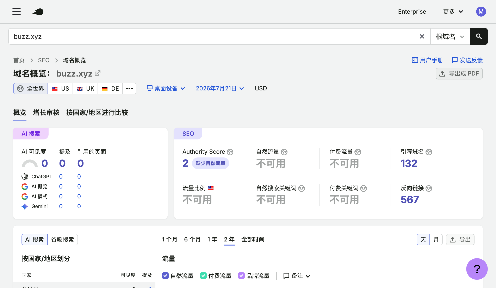
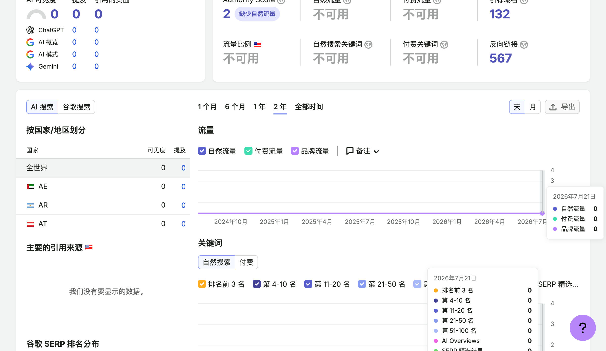

# Buzz Semrush Domain Overview 2026-07-21

Current effective observation collected 2026-07-22T05:08:02Z-05:15:44Z from a valid Semrush SEO > Domain Overview report for root domain buzz.xyz.

Scope: Worldwide, desktop, report date 2026-07-21, USD, Overview selected. Card-local windows are not displayed. The traffic-trend 2Y/daily contract is module-local and is not projected onto summary cards.

## Top summaries

- AI Visibility: 0; Mentions: 0; Cited pages: 0.
- ChatGPT, AI Overview, AI Mode, and Gemini rows each display 0 mentions and 0 cited pages.
- Authority Score: 2, with provider state `缺少自然流量`.
- Organic Traffic, Paid Traffic, Organic Search Keywords, Paid Keywords: unavailable.
- Referring Domains: 132.
- Backlinks: 567.
- US-local Traffic Share: unavailable.

## Traffic trend

The module visibly selects AI Search, 2 years, daily, and checks Organic, Paid, and Branded Traffic. Visible tooltip coverage is 2024-07-23 through 2026-07-21, 729 daily positions. All three rendered paths are flat on the zero axis and latest visible tooltip values are 0.

The allowed visible surface does not expose pre-render source arrays, so source-level null and undefined counts remain unknown. Renderer zeros are not promoted to adoption or usage facts and are not summed into a period total.

## Provider semantic split

Top Organic/Paid cards display `不可用`, while the traffic renderer plots daily zero series. These are separate module observations with unknown semantics. Neither state replaces the other.

The earlier node/subscription STOP is retained separately as [[source.semrush.buzz-access-stop-2026-07-22]].

