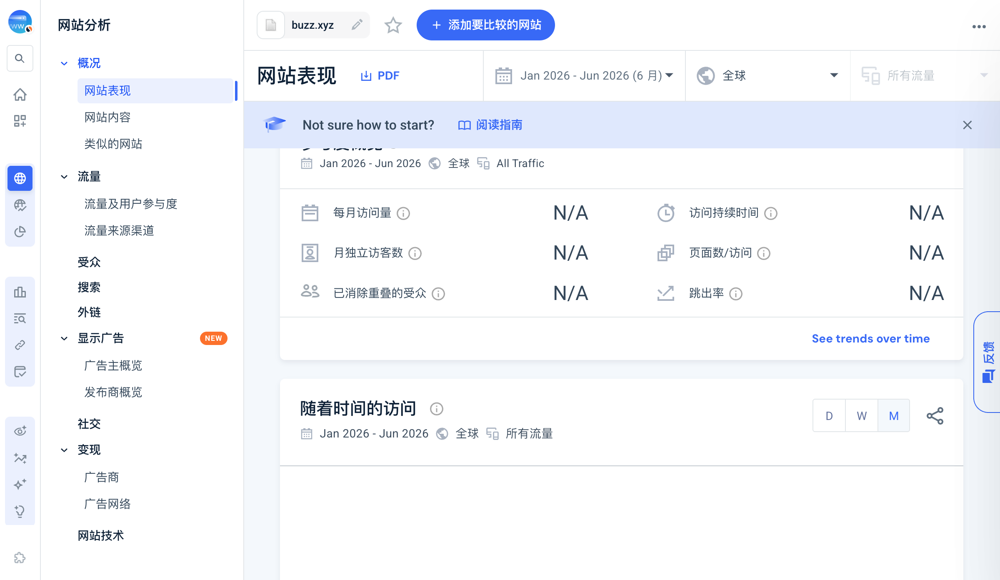

# Similarweb Buzz no-data observation

cici-traffic 在 2026-07-22 对 buzz.xyz root-domain Overview 采集最近闭合六个月：Jan-Jun 2026、Worldwide、All Traffic、include_subdomains=false、monthly granularity。

结果不是 numeric zero，而是 no-data / unavailable：

- total visits 和 device card 未返回 target value；
- global/country/category rank 为 “-”；
- monthly visits、unique visitors、duration、pages/visit、bounce rate 均为 N/A；
- monthly chart “没有结果”，无可绑定 buzz.xyz 的 raw series；
- geography、marketing channels、search、referrals、outgoing、social、display 均无 target rows。

Provider 页面还显示疑似旧的 dan.com 域名售卖描述，记为 stale metadata conflict，不覆盖 Research 对 Buzz/Block 的实体判断。

Semrush 在 2026-07-22T03:12:39Z 因 node/subscription warning 跳回用户中心，按合法 STOP 处理；该事件由 [[source.semrush.buzz-access-stop-2026-07-22]] 单独保留。05:08 后同一授权入口正常加载 report，当前 Semrush evidence 见 [[source.semrush.buzz-domain-overview-2026-07-21]]。两者不改变本 Similarweb no-data observation。

本快照只能支持“第三方 provider 当前无法提供 buzz.xyz 的可用流量证据”，不能支持零流量、低采用或无用户结论。

