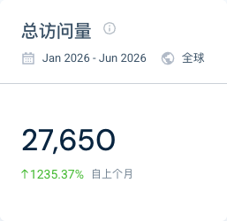
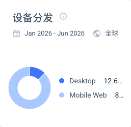

# PayInsider 产品域名 Similarweb 流量快照（2026 H1）

采集 `pay-insider.com` 并包含子域。2026 年 1-6 月估算总访问 27,650；Desktop 12.68%，Mobile Web 87.32%；Global Rank #2,909,953；US Rank #795,487。

营销域 `payinsider.com` 没有可用数据。产品域包含商户后台、Checkout、沙盒、SDK 和资源子域，高移动占比可能来自消费者结账。不能据此推算客户数、GMV、收入或活跃商户。渠道、地域和互动明细因样本不足不可用。

URL：<https://www.similarweb.com/website/pay-insider.com/>
